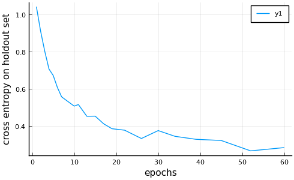
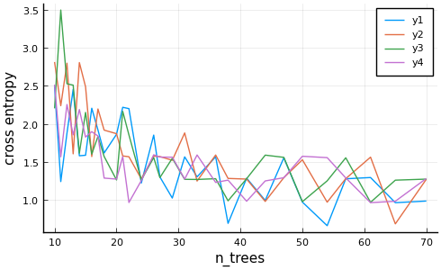
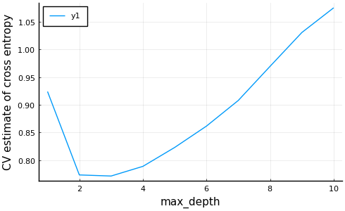
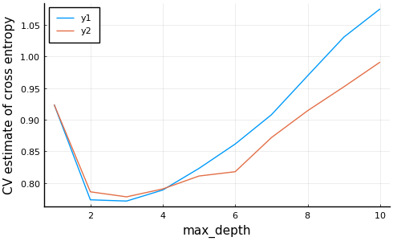

```@meta
EditURL = "<unknown>/tutorials.jl"
```

# Machine Learning in Julia, JuliaCon2020

A workshop introducing the machine learning toolbox
[MLJ](https://alan-turing-institute.github.io/MLJ.jl/stable/)
### Environment instantiation

The following loads a Julia environment and assumes you have the
following files in the same directory as this file:

- Project.toml
- Manifest.toml
- setup.jl

```julia
include(joinpath(@__DIR__, "setup.jl"))
```

```
 Activating environment at `~/Dropbox/Julia7/MLJ/MachineLearningInJulia2020/Project.toml`

```

If this is the notebook version of the tutorial, then it is
recommended that you clear all cell outputs before attempting the
tutorial.

## Contents

- [Part 1 - Data Representation](#part-1-data-representation)
- [Part 2 - Selecting, Training and Evaluating Models](#part-2-selecting-training-and-evaluating-models)

## Part 1 - Data Representation

> **Goals:**
> 1. Learn how MLJ specifies it's data requirements using "scientific" types
> 2. Understand the options for representing tabular data
> 3. Learn how to inspect and fix the representation of data to meet MLJ requirements

### Scientific types

To help you focus on the intended *purpose* or *interpretation* of
data, MLJ models specify data requirements using *scientific types*,
instead of machine types. An example of a scientific type is
`OrderedFactor`. The other basic "scalar" scientific types are
illustrated below:


A scientific type is an ordinary Julia type (so it can be used for
method dispatch, for example) but it usually has no instances. The
`scitype` function is used to articulate MLJ's convention about how
different machine types will be interpreted by MLJ models:

```julia
using MLJ
scitype(3.141)
```

```
Continuous
```

```julia
time = [2.3, 4.5, 4.2, 1.8, 7.1]
scitype(time)
```

```
AbstractArray{Continuous,1}
```

To fix data which MLJ is interpreting incorrectly, we use the
`coerce` method:

```julia
height = [185, 153, 163, 114, 180]
scitype(height)
```

```
AbstractArray{Count,1}
```

```julia
height = coerce(height, Continuous)
```

```
5-element Array{Float64,1}:
 185.0
 153.0
 163.0
 114.0
 180.0
```

Here's an example of data we would want interpreted as
`OrderedFactor` but isn't:

```julia
exam_mark = ["rotten", "great", "bla",  missing, "great"]
scitype(exam_mark)
```

```
AbstractArray{Union{Missing, Textual},1}
```

```julia
exam_mark = coerce(exam_mark, OrderedFactor)
```

```
5-element CategoricalArray{Union{Missing, String},1,UInt32}:
 "rotten"
 "great"
 "bla"
 missing
 "great"
```

```julia
levels(exam_mark)
```

```
3-element Array{String,1}:
 "bla"
 "great"
 "rotten"
```

Use `levels!` to put the classes in the right order:

```julia
levels!(exam_mark, ["rotten", "bla", "great"])
exam_mark[1] < exam_mark[2]
```

```
true
```

When subsampling, no levels are not lost:

```julia
levels(exam_mark[1:2])
```

```
3-element Array{String,1}:
 "rotten"
 "bla"
 "great"
```

**Note on binary data.** There is no separate scientific type for binary
data. Binary data is `OrderedFactor{2}` if it has an intrinsic
"true" class (eg, "pass"/"fail") and `Multiclass{2}` otherwise (eg,
"male"/"female").

### Two-dimensional data

Whenever it makes sense, MLJ Models generally expect two-dimensional
data to be *tabular*. All the tabular formats implementing the
[Tables.jl API](https://juliadata.github.io/Tables.jl/stable/) (see
this
[list](https://github.com/JuliaData/Tables.jl/blob/master/INTEGRATIONS.md))
have a scientific type of `Table` and can be used with such models.

The simplest example of a table is a the julia native *column
table*, which is just a named tuple of equal-length vectors:

```julia
column_table = (h=height, e=exam_mark, t=time)
```

```
(h = [185.0, 153.0, 163.0, 114.0, 180.0],
 e = Union{Missing, CategoricalValue{String,UInt32}}["rotten", "great", "bla", missing, "great"],
 t = [2.3, 4.5, 4.2, 1.8, 7.1],)
```

```julia
scitype(column_table)
```

```
Table{Union{AbstractArray{Union{Missing, OrderedFactor{3}},1}, AbstractArray{Continuous,1}}}
```

Notice the `Table{K}` type parameter `K` encodes the scientific
types of the columns. (This is useful when comparing table scitypes
with `<:`). To inspect the individual column scitypes, we use the
`schema` method instead:

```julia
schema(column_table)
```

```
┌─────────┬─────────────────────────────────────────────────┬──────────────────────────────────┐
│ _.names │ _.types                                         │ _.scitypes                       │
├─────────┼─────────────────────────────────────────────────┼──────────────────────────────────┤
│ h       │ Float64                                         │ Continuous                       │
│ e       │ Union{Missing, CategoricalValue{String,UInt32}} │ Union{Missing, OrderedFactor{3}} │
│ t       │ Float64                                         │ Continuous                       │
└─────────┴─────────────────────────────────────────────────┴──────────────────────────────────┘
_.nrows = 5

```

Here are four other examples of tables:

```julia
row_table = [(a=1, b=3.4),
             (a=2, b=4.5),
             (a=3, b=5.6)]
schema(row_table)
```

```
┌─────────┬─────────┬────────────┐
│ _.names │ _.types │ _.scitypes │
├─────────┼─────────┼────────────┤
│ a       │ Int64   │ Count      │
│ b       │ Float64 │ Continuous │
└─────────┴─────────┴────────────┘
_.nrows = 3

```

```julia
import DataFrames
df = DataFrames.DataFrame(column_table)
```

```
5×3 DataFrame
│ Row │ h       │ e       │ t       │
│     │ Float64 │ Cat…?   │ Float64 │
├─────┼─────────┼─────────┼─────────┤
│ 1   │ 185.0   │ rotten  │ 2.3     │
│ 2   │ 153.0   │ great   │ 4.5     │
│ 3   │ 163.0   │ bla     │ 4.2     │
│ 4   │ 114.0   │ missing │ 1.8     │
│ 5   │ 180.0   │ great   │ 7.1     │
```

```julia
schema(df)
```

```
┌─────────┬─────────────────────────────────────────────────┬──────────────────────────────────┐
│ _.names │ _.types                                         │ _.scitypes                       │
├─────────┼─────────────────────────────────────────────────┼──────────────────────────────────┤
│ h       │ Float64                                         │ Continuous                       │
│ e       │ Union{Missing, CategoricalValue{String,UInt32}} │ Union{Missing, OrderedFactor{3}} │
│ t       │ Float64                                         │ Continuous                       │
└─────────┴─────────────────────────────────────────────────┴──────────────────────────────────┘
_.nrows = 5

```

```julia
using CSV
file = CSV.File(joinpath(DIR, "data", "horse.csv"));
schema(file) # (triggers a file read)
```

```
┌─────────────────────────┬─────────┬────────────┐
│ _.names                 │ _.types │ _.scitypes │
├─────────────────────────┼─────────┼────────────┤
│ surgery                 │ Int64   │ Count      │
│ age                     │ Int64   │ Count      │
│ rectal_temperature      │ Float64 │ Continuous │
│ pulse                   │ Int64   │ Count      │
│ respiratory_rate        │ Int64   │ Count      │
│ temperature_extremities │ Int64   │ Count      │
│ mucous_membranes        │ Int64   │ Count      │
│ capillary_refill_time   │ Int64   │ Count      │
│ pain                    │ Int64   │ Count      │
│ peristalsis             │ Int64   │ Count      │
│ abdominal_distension    │ Int64   │ Count      │
│ packed_cell_volume      │ Float64 │ Continuous │
│ total_protein           │ Float64 │ Continuous │
│ outcome                 │ Int64   │ Count      │
│ surgical_lesion         │ Int64   │ Count      │
│ cp_data                 │ Int64   │ Count      │
└─────────────────────────┴─────────┴────────────┘
_.nrows = 366

```

Most MLJ models do not accept matrix in lieu of a table, but you can
wrap a matrix as a table:

```julia
matrix_table = MLJ.table(rand(2,3))
schema(matrix_table)
```

```
┌─────────┬─────────┬────────────┐
│ _.names │ _.types │ _.scitypes │
├─────────┼─────────┼────────────┤
│ x1      │ Float64 │ Continuous │
│ x2      │ Float64 │ Continuous │
│ x3      │ Float64 │ Continuous │
└─────────┴─────────┴────────────┘
_.nrows = 2

```

Under the hood many algorithms convert tabular data to matrices. If
your table is a wrapped matrix like the above, then the compiler
will generally collapse the conversions to a no-op.

**Manipulating tabular data.** In this workshop we assume
familiarity with some kind of tabular data container (although it is
possible, in principle, to carry out the exercises without this.)
For a quick start introduction to `DataFrames`, see [this
tutorial](https://alan-turing-institute.github.io/DataScienceTutorials.jl/data/dataframe/)

### Fixing scientific types in tabular data

To show how we can correct the scientific types of data in tables,
we introduce a cleaned up version of the UCI Horse Colic Data Set
(the cleaning workflow is described
[here](https://alan-turing-institute.github.io/DataScienceTutorials.jl/end-to-end/horse/#dealing_with_missing_values))

```julia
using CSV
file = CSV.File(joinpath(DIR, "data", "horse.csv"));
horse = DataFrames.DataFrame(file); # convert to data frame without copying columns
first(horse, 4)
```

```
4×16 DataFrame
│ Row │ surgery │ age   │ rectal_temperature │ pulse │ respiratory_rate │ temperature_extremities │ mucous_membranes │ capillary_refill_time │ pain  │ peristalsis │ abdominal_distension │ packed_cell_volume │ total_protein │ outcome │ surgical_lesion │ cp_data │
│     │ Int64   │ Int64 │ Float64            │ Int64 │ Int64            │ Int64                   │ Int64            │ Int64                 │ Int64 │ Int64       │ Int64                │ Float64            │ Float64       │ Int64   │ Int64           │ Int64   │
├─────┼─────────┼───────┼────────────────────┼───────┼──────────────────┼─────────────────────────┼──────────────────┼───────────────────────┼───────┼─────────────┼──────────────────────┼────────────────────┼───────────────┼─────────┼─────────────────┼─────────┤
│ 1   │ 2       │ 1     │ 38.5               │ 66    │ 66               │ 3                       │ 1                │ 2                     │ 5     │ 4           │ 4                    │ 45.0               │ 8.4           │ 2       │ 2               │ 2       │
│ 2   │ 1       │ 1     │ 39.2               │ 88    │ 88               │ 3                       │ 4                │ 1                     │ 3     │ 4           │ 2                    │ 50.0               │ 85.0          │ 3       │ 2               │ 2       │
│ 3   │ 2       │ 1     │ 38.3               │ 40    │ 40               │ 1                       │ 3                │ 1                     │ 3     │ 3           │ 1                    │ 33.0               │ 6.7           │ 1       │ 2               │ 1       │
│ 4   │ 1       │ 9     │ 39.1               │ 164   │ 164              │ 4                       │ 6                │ 2                     │ 2     │ 4           │ 4                    │ 48.0               │ 7.2           │ 2       │ 1               │ 1       │
```

From [the UCI
docs](http://archive.ics.uci.edu/ml/datasets/Horse+Colic) we can
surmise how each variable ought to be interpreted (a step in our
workflow that cannot reliably be left to the computer):

variable                    | scientific type (interpretation)
----------------------------|-----------------------------------
`:surgery`                  | Multiclass
`:age`                      | Multiclass
`:rectal_temperature`       | Continuous
`:pulse`                    | Continuous
`:respiratory_rate`         | Continuous
`:temperature_extremities`  | OrderedFactor
`:mucous_membranes`         | Multiclass
`:capillary_refill_time`    | Multiclass
`:pain`                     | OrderedFactor
`:peristalsis`              | OrderedFactor
`:abdominal_distension`     | OrderedFactor
`:packed_cell_volume`       | Continuous
`:total_protein`            | Continuous
`:outcome`                  | Multiclass
`:surgical_lesion`          | OrderedFactor
`:cp_data`                  | Multiclass

Let's see how MLJ will actually interpret the data, as it is
currently encoded:

```julia
schema(horse)
```

```
┌─────────────────────────┬─────────┬────────────┐
│ _.names                 │ _.types │ _.scitypes │
├─────────────────────────┼─────────┼────────────┤
│ surgery                 │ Int64   │ Count      │
│ age                     │ Int64   │ Count      │
│ rectal_temperature      │ Float64 │ Continuous │
│ pulse                   │ Int64   │ Count      │
│ respiratory_rate        │ Int64   │ Count      │
│ temperature_extremities │ Int64   │ Count      │
│ mucous_membranes        │ Int64   │ Count      │
│ capillary_refill_time   │ Int64   │ Count      │
│ pain                    │ Int64   │ Count      │
│ peristalsis             │ Int64   │ Count      │
│ abdominal_distension    │ Int64   │ Count      │
│ packed_cell_volume      │ Float64 │ Continuous │
│ total_protein           │ Float64 │ Continuous │
│ outcome                 │ Int64   │ Count      │
│ surgical_lesion         │ Int64   │ Count      │
│ cp_data                 │ Int64   │ Count      │
└─────────────────────────┴─────────┴────────────┘
_.nrows = 366

```

As a first correction step, we can get MLJ to "guess" the
appropriate fix, using the `autotype` method:

```julia
autotype(horse)
```

```
Dict{Symbol,Type} with 11 entries:
  :abdominal_distension => OrderedFactor
  :pain => OrderedFactor
  :surgery => OrderedFactor
  :mucous_membranes => OrderedFactor
  :surgical_lesion => OrderedFactor
  :outcome => OrderedFactor
  :capillary_refill_time => OrderedFactor
  :age => OrderedFactor
  :temperature_extremities => OrderedFactor
  :peristalsis => OrderedFactor
  :cp_data => OrderedFactor
```

Okay, this is not perfect, but a step in the right direction, which
we implement like this:

```julia
coerce!(horse, autotype(horse));
schema(horse)
```

```
┌─────────────────────────┬────────────────────────────────┬──────────────────┐
│ _.names                 │ _.types                        │ _.scitypes       │
├─────────────────────────┼────────────────────────────────┼──────────────────┤
│ surgery                 │ CategoricalValue{Int64,UInt32} │ OrderedFactor{2} │
│ age                     │ CategoricalValue{Int64,UInt32} │ OrderedFactor{2} │
│ rectal_temperature      │ Float64                        │ Continuous       │
│ pulse                   │ Int64                          │ Count            │
│ respiratory_rate        │ Int64                          │ Count            │
│ temperature_extremities │ CategoricalValue{Int64,UInt32} │ OrderedFactor{4} │
│ mucous_membranes        │ CategoricalValue{Int64,UInt32} │ OrderedFactor{6} │
│ capillary_refill_time   │ CategoricalValue{Int64,UInt32} │ OrderedFactor{3} │
│ pain                    │ CategoricalValue{Int64,UInt32} │ OrderedFactor{5} │
│ peristalsis             │ CategoricalValue{Int64,UInt32} │ OrderedFactor{4} │
│ abdominal_distension    │ CategoricalValue{Int64,UInt32} │ OrderedFactor{4} │
│ packed_cell_volume      │ Float64                        │ Continuous       │
│ total_protein           │ Float64                        │ Continuous       │
│ outcome                 │ CategoricalValue{Int64,UInt32} │ OrderedFactor{3} │
│ surgical_lesion         │ CategoricalValue{Int64,UInt32} │ OrderedFactor{2} │
│ cp_data                 │ CategoricalValue{Int64,UInt32} │ OrderedFactor{2} │
└─────────────────────────┴────────────────────────────────┴──────────────────┘
_.nrows = 366

```

All remaining `Count` data should be `Continuous`:

```julia
coerce!(horse, Count => Continuous);
schema(horse)
```

```
┌─────────────────────────┬────────────────────────────────┬──────────────────┐
│ _.names                 │ _.types                        │ _.scitypes       │
├─────────────────────────┼────────────────────────────────┼──────────────────┤
│ surgery                 │ CategoricalValue{Int64,UInt32} │ OrderedFactor{2} │
│ age                     │ CategoricalValue{Int64,UInt32} │ OrderedFactor{2} │
│ rectal_temperature      │ Float64                        │ Continuous       │
│ pulse                   │ Float64                        │ Continuous       │
│ respiratory_rate        │ Float64                        │ Continuous       │
│ temperature_extremities │ CategoricalValue{Int64,UInt32} │ OrderedFactor{4} │
│ mucous_membranes        │ CategoricalValue{Int64,UInt32} │ OrderedFactor{6} │
│ capillary_refill_time   │ CategoricalValue{Int64,UInt32} │ OrderedFactor{3} │
│ pain                    │ CategoricalValue{Int64,UInt32} │ OrderedFactor{5} │
│ peristalsis             │ CategoricalValue{Int64,UInt32} │ OrderedFactor{4} │
│ abdominal_distension    │ CategoricalValue{Int64,UInt32} │ OrderedFactor{4} │
│ packed_cell_volume      │ Float64                        │ Continuous       │
│ total_protein           │ Float64                        │ Continuous       │
│ outcome                 │ CategoricalValue{Int64,UInt32} │ OrderedFactor{3} │
│ surgical_lesion         │ CategoricalValue{Int64,UInt32} │ OrderedFactor{2} │
│ cp_data                 │ CategoricalValue{Int64,UInt32} │ OrderedFactor{2} │
└─────────────────────────┴────────────────────────────────┴──────────────────┘
_.nrows = 366

```

We'll correct the remaining truant entries manually:

```julia
coerce!(horse,
        :surgery               => Multiclass,
        :age                   => Multiclass,
        :mucous_membranes      => Multiclass,
        :capillary_refill_time => Multiclass,
        :outcome               => Multiclass,
        :cp_data               => Multiclass);
schema(horse)
```

```
┌─────────────────────────┬────────────────────────────────┬──────────────────┐
│ _.names                 │ _.types                        │ _.scitypes       │
├─────────────────────────┼────────────────────────────────┼──────────────────┤
│ surgery                 │ CategoricalValue{Int64,UInt32} │ Multiclass{2}    │
│ age                     │ CategoricalValue{Int64,UInt32} │ Multiclass{2}    │
│ rectal_temperature      │ Float64                        │ Continuous       │
│ pulse                   │ Float64                        │ Continuous       │
│ respiratory_rate        │ Float64                        │ Continuous       │
│ temperature_extremities │ CategoricalValue{Int64,UInt32} │ OrderedFactor{4} │
│ mucous_membranes        │ CategoricalValue{Int64,UInt32} │ Multiclass{6}    │
│ capillary_refill_time   │ CategoricalValue{Int64,UInt32} │ Multiclass{3}    │
│ pain                    │ CategoricalValue{Int64,UInt32} │ OrderedFactor{5} │
│ peristalsis             │ CategoricalValue{Int64,UInt32} │ OrderedFactor{4} │
│ abdominal_distension    │ CategoricalValue{Int64,UInt32} │ OrderedFactor{4} │
│ packed_cell_volume      │ Float64                        │ Continuous       │
│ total_protein           │ Float64                        │ Continuous       │
│ outcome                 │ CategoricalValue{Int64,UInt32} │ Multiclass{3}    │
│ surgical_lesion         │ CategoricalValue{Int64,UInt32} │ OrderedFactor{2} │
│ cp_data                 │ CategoricalValue{Int64,UInt32} │ Multiclass{2}    │
└─────────────────────────┴────────────────────────────────┴──────────────────┘
_.nrows = 366

```

### Resources for Part 1

- From the MLJ manual:
   - [A preview of data type specification in
  MLJ](https://alan-turing-institute.github.io/MLJ.jl/dev/getting_started/#A-preview-of-data-type-specification-in-MLJ-1)
   - [Data containers and scientific types](https://alan-turing-institute.github.io/MLJ.jl/dev/getting_started/#Data-containers-and-scientific-types-1)
   - [Working with Categorical Data](https://alan-turing-institute.github.io/MLJ.jl/dev/working_with_categorical_data/)
- [Summary](https://alan-turing-institute.github.io/MLJScientificTypes.jl/dev/#Summary-of-the-MLJ-convention-1) of the MLJ convention for representing scientific types
- [MLJScientificTypes.jl](https://alan-turing-institute.github.io/MLJScientificTypes.jl/dev/)
- From Data Science Tutorials:
    - [Data interpretation: Scientific Types](https://alan-turing-institute.github.io/DataScienceTutorials.jl/data/scitype/)
    - [Horse colic data](https://alan-turing-institute.github.io/DataScienceTutorials.jl/end-to-end/horse/)
- [UCI Horse Colic Data Set](http://archive.ics.uci.edu/ml/datasets/Horse+Colic)

### Exercises for Part 1

#### Exercise 1

Try to guess how each code snippet below will evaluate:

```julia
scitype(42)
```

```
Count
```

```julia
questions = ["who", "why", "what", "when"]
scitype(questions)
```

```
AbstractArray{Textual,1}
```

```julia
elscitype(questions)
```

```
Textual
```

```julia
t = (3.141, 42, "how")
scitype(t)
```

```
Tuple{Continuous,Count,Textual}
```

```julia
A = rand(2, 3)
```

```
2×3 Array{Float64,2}:
 0.125186  0.613498  0.043456
 0.275349  0.569883  0.653459
```

-

```julia
scitype(A)
```

```
AbstractArray{Continuous,2}
```

```julia
elscitype(A)
```

```
Continuous
```

```julia
using SparseArrays
Asparse = sparse(A)
```

```
2×3 SparseMatrixCSC{Float64,Int64} with 6 stored entries:
  [1, 1]  =  0.125186
  [2, 1]  =  0.275349
  [1, 2]  =  0.613498
  [2, 2]  =  0.569883
  [1, 3]  =  0.043456
  [2, 3]  =  0.653459
```

```julia
scitype(Asparse)
```

```
AbstractArray{Continuous,2}
```

```julia
using CategoricalArrays
C1 = categorical(A)
```

```
2×3 CategoricalArray{Float64,2,UInt32}:
 0.12518583927344973  0.6134977059280065  0.04345602836867024
 0.27534934198023686  0.5698825589352163  0.6534585348686746
```

```julia
scitype(C1)
```

```
AbstractArray{Multiclass{6},2}
```

```julia
elscitype(C1)
```

```
Multiclass{6}
```

```julia
C2 = categorical(A, ordered=true)
scitype(C2)
```

```
AbstractArray{OrderedFactor{6},2}
```

```julia
v = [1, 2, missing, 4]
scitype(v)
```

```
AbstractArray{Union{Missing, Count},1}
```

```julia
elscitype(v)
```

```
Union{Missing, Count}
```

```julia
scitype(v[1:2])
```

```
AbstractArray{Union{Missing, Count},1}
```

Can you guess at the general behaviour of
`scitype` with respect to tuples, abstract arrays and missing
values? The answers are
[here](https://github.com/alan-turing-institute/ScientificTypes.jl#2-the-scitype-and-scitype-methods)
(ignore "Property 1").

#### Exercise 2

Coerce the following vector to make MLJ recognize it as a vector of
ordered factors (with an appropriate ordering):

```julia
quality = ["good", "poor", "poor", "excellent", missing, "good", "excellent"]
```

```
7-element Array{Union{Missing, String},1}:
 "good"
 "poor"
 "poor"
 "excellent"
 missing
 "good"
 "excellent"
```

#### Exercise 3 (fixing scitypes in a table)

Fix the scitypes for the [House Prices in King
County](https://mlr3gallery.mlr-org.com/posts/2020-01-30-house-prices-in-king-county/)
dataset:

```julia
file = CSV.File(joinpath(DIR, "data", "house.csv"));
house = DataFrames.DataFrame(file); # convert to data frame without copying columns
first(house, 4)
```

```
4×19 DataFrame
│ Row │ price    │ bedrooms │ bathrooms │ sqft_living │ sqft_lot │ floors  │ waterfront │ view  │ condition │ grade │ sqft_above │ sqft_basement │ yr_built │ zipcode │ lat     │ long     │ sqft_living15 │ sqft_lot15 │ is_renovated │
│     │ Float64  │ Int64    │ Float64   │ Int64       │ Int64    │ Float64 │ Int64      │ Int64 │ Int64     │ Int64 │ Int64      │ Int64         │ Int64    │ Int64   │ Float64 │ Float64  │ Int64         │ Int64      │ Bool         │
├─────┼──────────┼──────────┼───────────┼─────────────┼──────────┼─────────┼────────────┼───────┼───────────┼───────┼────────────┼───────────────┼──────────┼─────────┼─────────┼──────────┼───────────────┼────────────┼──────────────┤
│ 1   │ 221900.0 │ 3        │ 1.0       │ 1180        │ 5650     │ 1.0     │ 0          │ 0     │ 3         │ 7     │ 1180       │ 0             │ 1955     │ 98178   │ 47.5112 │ -122.257 │ 1340          │ 5650       │ 1            │
│ 2   │ 538000.0 │ 3        │ 2.25      │ 2570        │ 7242     │ 2.0     │ 0          │ 0     │ 3         │ 7     │ 2170       │ 400           │ 1951     │ 98125   │ 47.721  │ -122.319 │ 1690          │ 7639       │ 0            │
│ 3   │ 180000.0 │ 2        │ 1.0       │ 770         │ 10000    │ 1.0     │ 0          │ 0     │ 3         │ 6     │ 770        │ 0             │ 1933     │ 98028   │ 47.7379 │ -122.233 │ 2720          │ 8062       │ 1            │
│ 4   │ 604000.0 │ 4        │ 3.0       │ 1960        │ 5000     │ 1.0     │ 0          │ 0     │ 5         │ 7     │ 1050       │ 910           │ 1965     │ 98136   │ 47.5208 │ -122.393 │ 1360          │ 5000       │ 1            │
```

(Two features in the original data set have been deemed uninformative
and dropped, namely `:id` and `:date`. The original feature
`:yr_renovated` has been replaced by the `Bool` feature `is_renovated`.)

## Part 2 - Selecting, Training and Evaluating Models

> **Goals:**
> 1. Search MLJ's database of model metadata to identify model candidates for a supervised learning task.
> 2. Evaluate the performance of a model on a holdout set using basic `fit!`/`predict` workflow.
> 3. Evaluate performance using other resampling strategies, such as cross-validation, in one line, using `evaluate!`
> 4. Plot a "learning curve", to inspect performance as a function of some model hyper-parameter, such as an iteration parameter

The "Hello World!" of machine learning is to classify Fisher's
famous iris data set. This time, we'll grab the data from
[OpenML](https://www.openml.org):

```julia
iris = OpenML.load(61); # a row table
iris = DataFrames.DataFrame(iris);
first(iris, 4)
```

```
4×5 DataFrame
│ Row │ sepallength │ sepalwidth │ petallength │ petalwidth │ class       │
│     │ Float64     │ Float64    │ Float64     │ Float64    │ SubString…  │
├─────┼─────────────┼────────────┼─────────────┼────────────┼─────────────┤
│ 1   │ 5.1         │ 3.5        │ 1.4         │ 0.2        │ Iris-setosa │
│ 2   │ 4.9         │ 3.0        │ 1.4         │ 0.2        │ Iris-setosa │
│ 3   │ 4.7         │ 3.2        │ 1.3         │ 0.2        │ Iris-setosa │
│ 4   │ 4.6         │ 3.1        │ 1.5         │ 0.2        │ Iris-setosa │
```

**Goal.** To build and evaluate models for predicting the
`:class` variable, given the four remaining measurement variables.

### Step 1. Inspect and fix scientific types

```julia
schema(iris)
```

```
┌─────────────┬───────────────────┬────────────┐
│ _.names     │ _.types           │ _.scitypes │
├─────────────┼───────────────────┼────────────┤
│ sepallength │ Float64           │ Continuous │
│ sepalwidth  │ Float64           │ Continuous │
│ petallength │ Float64           │ Continuous │
│ petalwidth  │ Float64           │ Continuous │
│ class       │ SubString{String} │ Textual    │
└─────────────┴───────────────────┴────────────┘
_.nrows = 150

```

```julia
coerce!(iris, :class => Multiclass);
schema(iris)
```

```
┌─────────────┬─────────────────────────────────┬───────────────┐
│ _.names     │ _.types                         │ _.scitypes    │
├─────────────┼─────────────────────────────────┼───────────────┤
│ sepallength │ Float64                         │ Continuous    │
│ sepalwidth  │ Float64                         │ Continuous    │
│ petallength │ Float64                         │ Continuous    │
│ petalwidth  │ Float64                         │ Continuous    │
│ class       │ CategoricalValue{String,UInt32} │ Multiclass{3} │
└─────────────┴─────────────────────────────────┴───────────────┘
_.nrows = 150

```

### Step 2. Split data into input and target parts

Here's how we split the data into target and input features, which
is needed for MLJ supervised models. We randomize the data at the
same time:

```julia
y, X = unpack(iris, ==(:class), name->true; rng=123);
scitype(y)
```

```
AbstractArray{Multiclass{3},1}
```

Do `?unpack` to learn more:

```julia
@doc unpack
```

```
  t1, t2, ...., tk = unnpack(table, f1, f2, ... fk; wrap_singles=false)

  Split any Tables.jl compatible table into smaller tables (or vectors) t1, t2, ..., tk by
  making selections without replacement from the column names defined by the filters f1,
  f2, ..., fk. A filter is any object f such that f(name) is true or false for each column
  name::Symbol of table.

  Whenever a returned table contains a single column, it is converted to a vector unless
  wrap_singles=true.

  Scientific type conversions can be optionally specified (note semicolon):

  unpack(table, t...; wrap_singles=false, col1=>scitype1, col2=>scitype2, ... )

  Example
  –––––––––

  julia> table = DataFrame(x=[1,2], y=['a', 'b'], z=[10.0, 20.0], w=[:A, :B])
  julia> Z, XY = unpack(table, ==(:z), !=(:w);
                 :x=>Continuous, :y=>Multiclass)
  julia> XY
  2×2 DataFrame
  │ Row │ x       │ y            │
  │     │ Float64 │ Categorical… │
  ├─────┼─────────┼──────────────┤
  │ 1   │ 1.0     │ 'a'          │
  │ 2   │ 2.0     │ 'b'          │
  
  julia> Z
  2-element Array{Float64,1}:
   10.0
   20.0
```

### On searching for a model

Here's how to see *all* models (not immediately useful):

```julia
kitchen_sink = models()
```

```
142-element Array{NamedTuple{(:name, :package_name, :is_supervised, :docstring, :hyperparameter_ranges, :hyperparameter_types, :hyperparameters, :implemented_methods, :is_pure_julia, :is_wrapper, :load_path, :package_license, :package_url, :package_uuid, :prediction_type, :supports_online, :supports_weights, :input_scitype, :target_scitype, :output_scitype),T} where T<:Tuple,1}:
 (name = ARDRegressor, package_name = ScikitLearn, ... )
 (name = AdaBoostClassifier, package_name = ScikitLearn, ... )
 (name = AdaBoostRegressor, package_name = ScikitLearn, ... )
 (name = AdaBoostStumpClassifier, package_name = DecisionTree, ... )
 (name = AffinityPropagation, package_name = ScikitLearn, ... )
 (name = AgglomerativeClustering, package_name = ScikitLearn, ... )
 (name = BaggingClassifier, package_name = ScikitLearn, ... )
 (name = BaggingRegressor, package_name = ScikitLearn, ... )
 (name = BayesianLDA, package_name = MultivariateStats, ... )
 (name = BayesianLDA, package_name = ScikitLearn, ... )
 (name = BayesianQDA, package_name = ScikitLearn, ... )
 (name = BayesianRidgeRegressor, package_name = ScikitLearn, ... )
 (name = BayesianSubspaceLDA, package_name = MultivariateStats, ... )
 (name = BernoulliNBClassifier, package_name = ScikitLearn, ... )
 (name = Birch, package_name = ScikitLearn, ... )
 (name = ComplementNBClassifier, package_name = ScikitLearn, ... )
 (name = ConstantClassifier, package_name = MLJModels, ... )
 (name = ConstantRegressor, package_name = MLJModels, ... )
 (name = ContinuousEncoder, package_name = MLJModels, ... )
 (name = DBSCAN, package_name = ScikitLearn, ... )
 (name = DecisionTreeClassifier, package_name = DecisionTree, ... )
 (name = DecisionTreeRegressor, package_name = DecisionTree, ... )
 (name = DeterministicConstantClassifier, package_name = MLJModels, ... )
 (name = DeterministicConstantRegressor, package_name = MLJModels, ... )
 (name = DeterministicSurrogate, package_name = MLJBase, ... )
 (name = DummyClassifier, package_name = ScikitLearn, ... )
 (name = DummyRegressor, package_name = ScikitLearn, ... )
 (name = ElasticNetCVRegressor, package_name = ScikitLearn, ... )
 (name = ElasticNetRegressor, package_name = MLJLinearModels, ... )
 (name = ElasticNetRegressor, package_name = ScikitLearn, ... )
 (name = EpsilonSVR, package_name = LIBSVM, ... )
 (name = EvoTreeClassifier, package_name = EvoTrees, ... )
 (name = EvoTreeCount, package_name = EvoTrees, ... )
 (name = EvoTreeGaussian, package_name = EvoTrees, ... )
 (name = EvoTreeRegressor, package_name = EvoTrees, ... )
 (name = ExtraTreesClassifier, package_name = ScikitLearn, ... )
 (name = ExtraTreesRegressor, package_name = ScikitLearn, ... )
 (name = FeatureAgglomeration, package_name = ScikitLearn, ... )
 (name = FeatureSelector, package_name = MLJModels, ... )
 (name = FillImputer, package_name = MLJModels, ... )
 (name = GaussianNBClassifier, package_name = NaiveBayes, ... )
 (name = GaussianNBClassifier, package_name = ScikitLearn, ... )
 (name = GaussianProcessClassifier, package_name = ScikitLearn, ... )
 (name = GaussianProcessRegressor, package_name = ScikitLearn, ... )
 (name = GradientBoostingClassifier, package_name = ScikitLearn, ... )
 (name = GradientBoostingRegressor, package_name = ScikitLearn, ... )
 (name = HuberRegressor, package_name = MLJLinearModels, ... )
 (name = HuberRegressor, package_name = ScikitLearn, ... )
 (name = ICA, package_name = MultivariateStats, ... )
 (name = ImageClassifier, package_name = MLJFlux, ... )
 (name = IntervalSurrogate, package_name = MLJBase, ... )
 (name = KMeans, package_name = Clustering, ... )
 (name = KMeans, package_name = ParallelKMeans, ... )
 (name = KMeans, package_name = ScikitLearn, ... )
 (name = KMedoids, package_name = Clustering, ... )
 (name = KNNClassifier, package_name = NearestNeighbors, ... )
 (name = KNNRegressor, package_name = NearestNeighbors, ... )
 (name = KNeighborsClassifier, package_name = ScikitLearn, ... )
 (name = KNeighborsRegressor, package_name = ScikitLearn, ... )
 (name = KernelPCA, package_name = MultivariateStats, ... )
 (name = LADRegressor, package_name = MLJLinearModels, ... )
 (name = LDA, package_name = MultivariateStats, ... )
 (name = LGBMClassifier, package_name = LightGBM, ... )
 (name = LGBMRegressor, package_name = LightGBM, ... )
 (name = LarsCVRegressor, package_name = ScikitLearn, ... )
 (name = LarsRegressor, package_name = ScikitLearn, ... )
 (name = LassoCVRegressor, package_name = ScikitLearn, ... )
 (name = LassoLarsCVRegressor, package_name = ScikitLearn, ... )
 (name = LassoLarsICRegressor, package_name = ScikitLearn, ... )
 (name = LassoLarsRegressor, package_name = ScikitLearn, ... )
 (name = LassoRegressor, package_name = MLJLinearModels, ... )
 (name = LassoRegressor, package_name = ScikitLearn, ... )
 (name = LinearBinaryClassifier, package_name = GLM, ... )
 (name = LinearCountRegressor, package_name = GLM, ... )
 (name = LinearRegressor, package_name = GLM, ... )
 (name = LinearRegressor, package_name = MLJLinearModels, ... )
 (name = LinearRegressor, package_name = ScikitLearn, ... )
 (name = LinearSVC, package_name = LIBSVM, ... )
 (name = LogisticCVClassifier, package_name = ScikitLearn, ... )
 (name = LogisticClassifier, package_name = MLJLinearModels, ... )
 (name = LogisticClassifier, package_name = ScikitLearn, ... )
 (name = MeanShift, package_name = ScikitLearn, ... )
 (name = MiniBatchKMeans, package_name = ScikitLearn, ... )
 (name = MultiTaskElasticNetCVRegressor, package_name = ScikitLearn, ... )
 (name = MultiTaskElasticNetRegressor, package_name = ScikitLearn, ... )
 (name = MultiTaskLassoCVRegressor, package_name = ScikitLearn, ... )
 (name = MultiTaskLassoRegressor, package_name = ScikitLearn, ... )
 (name = MultinomialClassifier, package_name = MLJLinearModels, ... )
 (name = MultinomialNBClassifier, package_name = NaiveBayes, ... )
 (name = MultinomialNBClassifier, package_name = ScikitLearn, ... )
 (name = MultitargetNeuralNetworkRegressor, package_name = MLJFlux, ... )
 (name = NeuralNetworkClassifier, package_name = MLJFlux, ... )
 (name = NeuralNetworkRegressor, package_name = MLJFlux, ... )
 (name = NuSVC, package_name = LIBSVM, ... )
 (name = NuSVR, package_name = LIBSVM, ... )
 (name = OPTICS, package_name = ScikitLearn, ... )
 (name = OneClassSVM, package_name = LIBSVM, ... )
 (name = OneHotEncoder, package_name = MLJModels, ... )
 (name = OrthogonalMatchingPursuitCVRegressor, package_name = ScikitLearn, ... )
 (name = OrthogonalMatchingPursuitRegressor, package_name = ScikitLearn, ... )
 (name = PCA, package_name = MultivariateStats, ... )
 (name = PassiveAggressiveClassifier, package_name = ScikitLearn, ... )
 (name = PassiveAggressiveRegressor, package_name = ScikitLearn, ... )
 (name = PerceptronClassifier, package_name = ScikitLearn, ... )
 (name = ProbabilisticSGDClassifier, package_name = ScikitLearn, ... )
 (name = ProbabilisticSurrogate, package_name = MLJBase, ... )
 (name = QuantileRegressor, package_name = MLJLinearModels, ... )
 (name = RANSACRegressor, package_name = ScikitLearn, ... )
 (name = RandomForestClassifier, package_name = DecisionTree, ... )
 (name = RandomForestClassifier, package_name = ScikitLearn, ... )
 (name = RandomForestRegressor, package_name = DecisionTree, ... )
 (name = RandomForestRegressor, package_name = ScikitLearn, ... )
 (name = Resampler, package_name = MLJBase, ... )
 (name = RidgeCVClassifier, package_name = ScikitLearn, ... )
 (name = RidgeCVRegressor, package_name = ScikitLearn, ... )
 (name = RidgeClassifier, package_name = ScikitLearn, ... )
 (name = RidgeRegressor, package_name = MLJLinearModels, ... )
 (name = RidgeRegressor, package_name = MultivariateStats, ... )
 (name = RidgeRegressor, package_name = ScikitLearn, ... )
 (name = RobustRegressor, package_name = MLJLinearModels, ... )
 (name = SGDClassifier, package_name = ScikitLearn, ... )
 (name = SGDRegressor, package_name = ScikitLearn, ... )
 (name = SVC, package_name = LIBSVM, ... )
 (name = SVMClassifier, package_name = ScikitLearn, ... )
 (name = SVMLinearClassifier, package_name = ScikitLearn, ... )
 (name = SVMLinearRegressor, package_name = ScikitLearn, ... )
 (name = SVMNuClassifier, package_name = ScikitLearn, ... )
 (name = SVMNuRegressor, package_name = ScikitLearn, ... )
 (name = SVMRegressor, package_name = ScikitLearn, ... )
 (name = SpectralClustering, package_name = ScikitLearn, ... )
 (name = Standardizer, package_name = MLJModels, ... )
 (name = StaticSurrogate, package_name = MLJBase, ... )
 (name = SubspaceLDA, package_name = MultivariateStats, ... )
 (name = TheilSenRegressor, package_name = ScikitLearn, ... )
 (name = UnivariateBoxCoxTransformer, package_name = MLJModels, ... )
 (name = UnivariateDiscretizer, package_name = MLJModels, ... )
 (name = UnivariateStandardizer, package_name = MLJModels, ... )
 (name = UnsupervisedSurrogate, package_name = MLJBase, ... )
 (name = WrappedFunction, package_name = MLJBase, ... )
 (name = XGBoostClassifier, package_name = XGBoost, ... )
 (name = XGBoostCount, package_name = XGBoost, ... )
 (name = XGBoostRegressor, package_name = XGBoost, ... )
```

Each entry contains metadata for a model whose defining code is not yet loaded:

```julia
meta = kitchen_sink[3]
```

```
AdaBoost ensemble regression.
→ based on [ScikitLearn](https://github.com/cstjean/ScikitLearn.jl).
→ do `@load AdaBoostRegressor pkg="ScikitLearn"` to use the model.
→ do `?AdaBoostRegressor` for documentation.
(name = "AdaBoostRegressor",
 package_name = "ScikitLearn",
 is_supervised = true,
 docstring = "AdaBoost ensemble regression.\n→ based on [ScikitLearn](https://github.com/cstjean/ScikitLearn.jl).\n→ do `@load AdaBoostRegressor pkg=\"ScikitLearn\"` to use the model.\n→ do `?AdaBoostRegressor` for documentation.",
 hyperparameter_ranges = (nothing, nothing, nothing, nothing, nothing),
 hyperparameter_types = ("Any", "Int64", "Float64", "String", "Any"),
 hyperparameters = (:base_estimator, :n_estimators, :learning_rate, :loss, :random_state),
 implemented_methods = [:clean!, :fit, :fitted_params, :predict],
 is_pure_julia = false,
 is_wrapper = true,
 load_path = "MLJScikitLearnInterface.AdaBoostRegressor",
 package_license = "BSD",
 package_url = "https://github.com/cstjean/ScikitLearn.jl",
 package_uuid = "3646fa90-6ef7-5e7e-9f22-8aca16db6324",
 prediction_type = :deterministic,
 supports_online = false,
 supports_weights = false,
 input_scitype = Table{_s23} where _s23<:(AbstractArray{_s25,1} where _s25<:Continuous),
 target_scitype = AbstractArray{Continuous,1},
 output_scitype = Unknown,)
```

```julia
targetscitype = meta.target_scitype
```

```
AbstractArray{Continuous,1}
```

```julia
scitype(y) <: targetscitype
```

```
false
```

So this model won't do. Let's  find all pure julia classifiers:

```julia
filt(meta) = AbstractVector{Finite} <: meta.target_scitype &&
        meta.is_pure_julia
models(filt)
```

```
16-element Array{NamedTuple{(:name, :package_name, :is_supervised, :docstring, :hyperparameter_ranges, :hyperparameter_types, :hyperparameters, :implemented_methods, :is_pure_julia, :is_wrapper, :load_path, :package_license, :package_url, :package_uuid, :prediction_type, :supports_online, :supports_weights, :input_scitype, :target_scitype, :output_scitype),T} where T<:Tuple,1}:
 (name = AdaBoostStumpClassifier, package_name = DecisionTree, ... )
 (name = BayesianLDA, package_name = MultivariateStats, ... )
 (name = BayesianSubspaceLDA, package_name = MultivariateStats, ... )
 (name = ConstantClassifier, package_name = MLJModels, ... )
 (name = DecisionTreeClassifier, package_name = DecisionTree, ... )
 (name = DeterministicConstantClassifier, package_name = MLJModels, ... )
 (name = EvoTreeClassifier, package_name = EvoTrees, ... )
 (name = GaussianNBClassifier, package_name = NaiveBayes, ... )
 (name = KNNClassifier, package_name = NearestNeighbors, ... )
 (name = LDA, package_name = MultivariateStats, ... )
 (name = LogisticClassifier, package_name = MLJLinearModels, ... )
 (name = MultinomialClassifier, package_name = MLJLinearModels, ... )
 (name = MultinomialNBClassifier, package_name = NaiveBayes, ... )
 (name = NeuralNetworkClassifier, package_name = MLJFlux, ... )
 (name = RandomForestClassifier, package_name = DecisionTree, ... )
 (name = SubspaceLDA, package_name = MultivariateStats, ... )
```

Find all models with "Classifier" in `name` (or `docstring`):

```julia
models("Classifier")
```

```
39-element Array{NamedTuple{(:name, :package_name, :is_supervised, :docstring, :hyperparameter_ranges, :hyperparameter_types, :hyperparameters, :implemented_methods, :is_pure_julia, :is_wrapper, :load_path, :package_license, :package_url, :package_uuid, :prediction_type, :supports_online, :supports_weights, :input_scitype, :target_scitype, :output_scitype),T} where T<:Tuple,1}:
 (name = AdaBoostClassifier, package_name = ScikitLearn, ... )
 (name = AdaBoostStumpClassifier, package_name = DecisionTree, ... )
 (name = BaggingClassifier, package_name = ScikitLearn, ... )
 (name = BernoulliNBClassifier, package_name = ScikitLearn, ... )
 (name = ComplementNBClassifier, package_name = ScikitLearn, ... )
 (name = ConstantClassifier, package_name = MLJModels, ... )
 (name = DecisionTreeClassifier, package_name = DecisionTree, ... )
 (name = DeterministicConstantClassifier, package_name = MLJModels, ... )
 (name = DummyClassifier, package_name = ScikitLearn, ... )
 (name = EvoTreeClassifier, package_name = EvoTrees, ... )
 (name = ExtraTreesClassifier, package_name = ScikitLearn, ... )
 (name = GaussianNBClassifier, package_name = NaiveBayes, ... )
 (name = GaussianNBClassifier, package_name = ScikitLearn, ... )
 (name = GaussianProcessClassifier, package_name = ScikitLearn, ... )
 (name = GradientBoostingClassifier, package_name = ScikitLearn, ... )
 (name = ImageClassifier, package_name = MLJFlux, ... )
 (name = KNNClassifier, package_name = NearestNeighbors, ... )
 (name = KNeighborsClassifier, package_name = ScikitLearn, ... )
 (name = LGBMClassifier, package_name = LightGBM, ... )
 (name = LinearBinaryClassifier, package_name = GLM, ... )
 (name = LogisticCVClassifier, package_name = ScikitLearn, ... )
 (name = LogisticClassifier, package_name = MLJLinearModels, ... )
 (name = LogisticClassifier, package_name = ScikitLearn, ... )
 (name = MultinomialClassifier, package_name = MLJLinearModels, ... )
 (name = MultinomialNBClassifier, package_name = NaiveBayes, ... )
 (name = MultinomialNBClassifier, package_name = ScikitLearn, ... )
 (name = NeuralNetworkClassifier, package_name = MLJFlux, ... )
 (name = PassiveAggressiveClassifier, package_name = ScikitLearn, ... )
 (name = PerceptronClassifier, package_name = ScikitLearn, ... )
 (name = ProbabilisticSGDClassifier, package_name = ScikitLearn, ... )
 (name = RandomForestClassifier, package_name = DecisionTree, ... )
 (name = RandomForestClassifier, package_name = ScikitLearn, ... )
 (name = RidgeCVClassifier, package_name = ScikitLearn, ... )
 (name = RidgeClassifier, package_name = ScikitLearn, ... )
 (name = SGDClassifier, package_name = ScikitLearn, ... )
 (name = SVMClassifier, package_name = ScikitLearn, ... )
 (name = SVMLinearClassifier, package_name = ScikitLearn, ... )
 (name = SVMNuClassifier, package_name = ScikitLearn, ... )
 (name = XGBoostClassifier, package_name = XGBoost, ... )
```

Find all (supervised) models that match my data!

```julia
models(matching(X, y))
```

```
42-element Array{NamedTuple{(:name, :package_name, :is_supervised, :docstring, :hyperparameter_ranges, :hyperparameter_types, :hyperparameters, :implemented_methods, :is_pure_julia, :is_wrapper, :load_path, :package_license, :package_url, :package_uuid, :prediction_type, :supports_online, :supports_weights, :input_scitype, :target_scitype, :output_scitype),T} where T<:Tuple,1}:
 (name = AdaBoostClassifier, package_name = ScikitLearn, ... )
 (name = AdaBoostStumpClassifier, package_name = DecisionTree, ... )
 (name = BaggingClassifier, package_name = ScikitLearn, ... )
 (name = BayesianLDA, package_name = MultivariateStats, ... )
 (name = BayesianLDA, package_name = ScikitLearn, ... )
 (name = BayesianQDA, package_name = ScikitLearn, ... )
 (name = BayesianSubspaceLDA, package_name = MultivariateStats, ... )
 (name = ConstantClassifier, package_name = MLJModels, ... )
 (name = DecisionTreeClassifier, package_name = DecisionTree, ... )
 (name = DeterministicConstantClassifier, package_name = MLJModels, ... )
 (name = DummyClassifier, package_name = ScikitLearn, ... )
 (name = EvoTreeClassifier, package_name = EvoTrees, ... )
 (name = ExtraTreesClassifier, package_name = ScikitLearn, ... )
 (name = GaussianNBClassifier, package_name = NaiveBayes, ... )
 (name = GaussianNBClassifier, package_name = ScikitLearn, ... )
 (name = GaussianProcessClassifier, package_name = ScikitLearn, ... )
 (name = GradientBoostingClassifier, package_name = ScikitLearn, ... )
 (name = KNNClassifier, package_name = NearestNeighbors, ... )
 (name = KNeighborsClassifier, package_name = ScikitLearn, ... )
 (name = LDA, package_name = MultivariateStats, ... )
 (name = LGBMClassifier, package_name = LightGBM, ... )
 (name = LinearSVC, package_name = LIBSVM, ... )
 (name = LogisticCVClassifier, package_name = ScikitLearn, ... )
 (name = LogisticClassifier, package_name = MLJLinearModels, ... )
 (name = LogisticClassifier, package_name = ScikitLearn, ... )
 (name = MultinomialClassifier, package_name = MLJLinearModels, ... )
 (name = NeuralNetworkClassifier, package_name = MLJFlux, ... )
 (name = NuSVC, package_name = LIBSVM, ... )
 (name = PassiveAggressiveClassifier, package_name = ScikitLearn, ... )
 (name = PerceptronClassifier, package_name = ScikitLearn, ... )
 (name = ProbabilisticSGDClassifier, package_name = ScikitLearn, ... )
 (name = RandomForestClassifier, package_name = DecisionTree, ... )
 (name = RandomForestClassifier, package_name = ScikitLearn, ... )
 (name = RidgeCVClassifier, package_name = ScikitLearn, ... )
 (name = RidgeClassifier, package_name = ScikitLearn, ... )
 (name = SGDClassifier, package_name = ScikitLearn, ... )
 (name = SVC, package_name = LIBSVM, ... )
 (name = SVMClassifier, package_name = ScikitLearn, ... )
 (name = SVMLinearClassifier, package_name = ScikitLearn, ... )
 (name = SVMNuClassifier, package_name = ScikitLearn, ... )
 (name = SubspaceLDA, package_name = MultivariateStats, ... )
 (name = XGBoostClassifier, package_name = XGBoost, ... )
```

### Step 3. Select and instantiate a model

```julia
model = @load NeuralNetworkClassifier
```

```
NeuralNetworkClassifier(
    builder = Short(
            n_hidden = 0,
            dropout = 0.5,
            σ = NNlib.σ),
    finaliser = NNlib.softmax,
    optimiser = Flux.Optimise.ADAM(0.001, (0.9, 0.999), IdDict{Any,Any}()),
    loss = Flux.crossentropy,
    epochs = 10,
    batch_size = 1,
    lambda = 0.0,
    alpha = 0.0,
    optimiser_changes_trigger_retraining = false) @061
```

```julia
info(model)
```

```
A neural network model for making probabilistic predictions of a `Mutliclass` or `OrderedFactor` target, given a table of `Continuous` features. 
→ based on [MLJFlux](https://github.com/alan-turing-institute/MLJFlux.jl).
→ do `@load NeuralNetworkClassifier pkg="MLJFlux"` to use the model.
→ do `?NeuralNetworkClassifier` for documentation.
(name = "NeuralNetworkClassifier",
 package_name = "MLJFlux",
 is_supervised = true,
 docstring = "A neural network model for making probabilistic predictions of a `Mutliclass` or `OrderedFactor` target, given a table of `Continuous` features. \n→ based on [MLJFlux](https://github.com/alan-turing-institute/MLJFlux.jl).\n→ do `@load NeuralNetworkClassifier pkg=\"MLJFlux\"` to use the model.\n→ do `?NeuralNetworkClassifier` for documentation.",
 hyperparameter_ranges = (nothing, nothing, nothing, nothing, nothing, nothing, nothing, nothing, nothing),
 hyperparameter_types = ("MLJFlux.Short", "typeof(NNlib.softmax)", "Flux.Optimise.ADAM", "typeof(Flux.crossentropy)", "Int64", "Int64", "Float64", "Float64", "Bool"),
 hyperparameters = (:builder, :finaliser, :optimiser, :loss, :epochs, :batch_size, :lambda, :alpha, :optimiser_changes_trigger_retraining),
 implemented_methods = Any[],
 is_pure_julia = true,
 is_wrapper = false,
 load_path = "MLJFlux.NeuralNetworkClassifier",
 package_license = "MIT",
 package_url = "https://github.com/alan-turing-institute/MLJFlux.jl",
 package_uuid = "094fc8d1-fd35-5302-93ea-dabda2abf845",
 prediction_type = :probabilistic,
 supports_online = false,
 supports_weights = false,
 input_scitype = Table{#s23} where #s23<:(AbstractArray{#s25,1} where #s25<:Continuous),
 target_scitype = AbstractArray{#s38,1} where #s38<:Finite,
 output_scitype = Unknown,)
```

In MLJ a *model* is just a struct containing hyper-parameters, and
that's all. A model does not store *learned* parameters. Models are
mutable:

```julia
model.epochs = 12
```

```
12
```

And all models have a key-word constructor that works once `@load`
has been performed:

```julia
NeuralNetworkClassifier(epochs=12) == model
```

```
true
```

### On fitting, predicting, and inspecting models

In MLJ a model and training/validation data are typically bound
together in a machine:

```julia
mach = machine(model, X, y)
```

```
Machine{NeuralNetworkClassifier{Short,…}} @139 trained 0 times.
  args: 
    1:	Source @611 ⏎ `Table{AbstractArray{Continuous,1}}`
    2:	Source @618 ⏎ `AbstractArray{Multiclass{3},1}`

```

A machine stores *learned* parameters, among other things. We'll
train this machine on 70% of the data and evaluate on a 30% holdout
set. Let's start by dividing all row indices into `train` and `test`
subsets:

```julia
train, test = partition(eachindex(y), 0.7)
```

```
([1, 2, 3, 4, 5, 6, 7, 8, 9, 10, 11, 12, 13, 14, 15, 16, 17, 18, 19, 20, 21, 22, 23, 24, 25, 26, 27, 28, 29, 30, 31, 32, 33, 34, 35, 36, 37, 38, 39, 40, 41, 42, 43, 44, 45, 46, 47, 48, 49, 50, 51, 52, 53, 54, 55, 56, 57, 58, 59, 60, 61, 62, 63, 64, 65, 66, 67, 68, 69, 70, 71, 72, 73, 74, 75, 76, 77, 78, 79, 80, 81, 82, 83, 84, 85, 86, 87, 88, 89, 90, 91, 92, 93, 94, 95, 96, 97, 98, 99, 100, 101, 102, 103, 104, 105], [106, 107, 108, 109, 110, 111, 112, 113, 114, 115, 116, 117, 118, 119, 120, 121, 122, 123, 124, 125, 126, 127, 128, 129, 130, 131, 132, 133, 134, 135, 136, 137, 138, 139, 140, 141, 142, 143, 144, 145, 146, 147, 148, 149, 150])
```

```julia
fit!(mach, rows=train, verbosity=2)
```

```
Machine{NeuralNetworkClassifier{Short,…}} @139 trained 1 time.
  args: 
    1:	Source @611 ⏎ `Table{AbstractArray{Continuous,1}}`
    2:	Source @618 ⏎ `AbstractArray{Multiclass{3},1}`

```

After training, one can inspect the learned parameters:

```julia
fitted_params(mach)
```

```
(chain = Chain(Chain(Dense(4, 3, σ), Dropout(0.5), Dense(3, 3)), softmax),)
```

Everything else the user might be interested in is accessed from the
training *report*:

```julia
report(mach)
```

```
(training_losses = Any[1.09897f0, 1.0888609f0, 1.0816175f0, 1.0714965f0, 1.0621121f0, 1.0507153f0, 1.0427363f0, 1.0319378f0, 1.0205578f0, 1.0105981f0, 0.9939035f0, 0.9837377f0],)
```

Machines remember the last set of hyper-parameters used during fit,
which, in the case of iterative models, allows for a warm restart of
computations in the case that only the iteration parameter is
increased:

```julia
model.epochs = model.epochs + 4
fit!(mach, rows=train, verbosity=2)
```

```
Machine{NeuralNetworkClassifier{Short,…}} @139 trained 2 times.
  args: 
    1:	Source @611 ⏎ `Table{AbstractArray{Continuous,1}}`
    2:	Source @618 ⏎ `AbstractArray{Multiclass{3},1}`

```

By default (for this particular model) we can also increase
`:learning_rate` without triggering a cold restart:

```julia
model.epochs = model.epochs + 4
model.optimiser.eta = 10*model.optimiser.eta
fit!(mach, rows=train, verbosity=2)
```

```
Machine{NeuralNetworkClassifier{Short,…}} @139 trained 3 times.
  args: 
    1:	Source @611 ⏎ `Table{AbstractArray{Continuous,1}}`
    2:	Source @618 ⏎ `AbstractArray{Multiclass{3},1}`

```

However, change any other parameter and training will restart from
scratch:

```julia
model.lambda = 0.001
fit!(mach, rows=train, verbosity=2)
```

```
Machine{NeuralNetworkClassifier{Short,…}} @139 trained 4 times.
  args: 
    1:	Source @611 ⏎ `Table{AbstractArray{Continuous,1}}`
    2:	Source @618 ⏎ `AbstractArray{Multiclass{3},1}`

```

Let's train silently for a total of 50 epochs, and look at a prediction:

```julia
model.epochs = 50
fit!(mach, rows=train)
yhat = predict(mach, X[test,:]); # or predict(mach, rows=test)
yhat[1]
```

```
UnivariateFinite{Multiclass{3}}(Iris-setosa=>0.128, Iris-versicolor=>0.667, Iris-virginica=>0.204)
```

What's going on here?

```julia
info(model).prediction_type
```

```
:probabilistic
```

**Important**:
- In MLJ, a model that can predict probabilities (and not just point values) will do so by default. (These models have supertype `Proababilistic`, while point-estimate predictors have supertype `Deterministic`.)
- For most probabilistic predictors, the predicted object is a `Distributions.Distribution` object, supporting the `Distributions.jl` [API](https://juliastats.org/Distributions.jl/latest/extends/#Create-a-Distribution-1) for such objects. In particular, the methods `rand`,  `pdf`, `mode`, `median` and `mean` will apply, where appropriate.

So, to obtain the probability of "Iris-virginica" in the first test
prediction, we do

```julia
pdf(yhat[1], "Iris-virginica")
```

```
0.20434602f0
```

To get the most likely observation, we do

```julia
mode(yhat[1])
```

```
CategoricalValue{String,UInt32} "Iris-versicolor"
```

These can be broadcast over multiple predictions in the usual way:

```julia
broadcast(pdf, yhat[1:4], "Iris-versicolor")
```

```
4-element Array{Float32,1}:
 0.6672967
 0.5366527
 0.037599422
 0.38899064
```

```julia
mode.(yhat[1:4])
```

```
4-element CategoricalArray{String,1,UInt32}:
 "Iris-versicolor"
 "Iris-versicolor"
 "Iris-setosa"
 "Iris-virginica"
```

Or, alternatively, you can use the `predict_mode` operation instead
of `predict`:

```julia
predict_mode(mach, X[test,:])[1:4] # or predict_mode(mach, rows=test)[1:4]
```

```
4-element CategoricalArray{String,1,UInt32}:
 "Iris-versicolor"
 "Iris-versicolor"
 "Iris-setosa"
 "Iris-virginica"
```

For a more conventional matrix of probabilities you can do this:

```julia
L = levels(y)
pdf(yhat, L)[1:4, :]
```

```
4×3 Array{Float32,2}:
 0.128357     0.667297   0.204346
 0.0271739    0.536653   0.436173
 0.962401     0.0375994  1.58964f-10
 0.000447471  0.388991   0.610562
```

However, in a typical MLJ workflow, this is not as useful as you
might imagine. In particular, all probablistic performance measures
in MLJ expect distribution objects in their first slot:

```julia
cross_entropy(yhat, y[test]) |> mean
```

```
0.32660282f0
```

To apply a deterministic measure, we first need to obtain point-estimates:

```julia
misclassification_rate(mode.(yhat), y[test])
```

```
0.022222222222222223
```

We note in passing that there is also a search tool for measures
analogous to `models`:

```julia
measures(matching(y))
```

```
6-element Array{NamedTuple{(:name, :target_scitype, :supports_weights, :prediction_type, :orientation, :reports_each_observation, :aggregation, :is_feature_dependent, :docstring, :distribution_type),T} where T<:Tuple,1}:
 (name = accuracy, ...)
 (name = balanced_accuracy, ...)
 (name = cross_entropy, ...)
 (name = misclassification_rate, ...)
 (name = BrierScore{UnivariateFinite}, ...)
 (name = confusion_matrix, ...)
```

### Step 4. Evaluate the model performance

Naturally, MLJ provides boilerplate code for carrying out a model
evaluation with a lot less fuss. Let's repeat the performance
evaluation above and add an extra measure, `brier_score`:

```julia
evaluate!(mach, resampling=Holdout(fraction_train=0.7),
          measures=[cross_entropy, brier_score])
```

```
┌──────────────────────────────┬───────────────┬─────────────────┐
│ _.measure                    │ _.measurement │ _.per_fold      │
├──────────────────────────────┼───────────────┼─────────────────┤
│ cross_entropy                │ 0.327         │ Float32[0.327]  │
│ BrierScore{UnivariateFinite} │ -0.179        │ Float32[-0.179] │
└──────────────────────────────┴───────────────┴─────────────────┘
_.per_observation = [[[0.405, 0.622, ..., 0.0365]], [[-0.169, -0.406, ..., -0.00256]]]

```

Or applying cross-validation instead:

```julia
evaluate!(mach, resampling=CV(nfolds=6),
          measures=[cross_entropy, brier_score])
```

```
┌──────────────────────────────┬───────────────┬──────────────────────────────────────────────────────────┐
│ _.measure                    │ _.measurement │ _.per_fold                                               │
├──────────────────────────────┼───────────────┼──────────────────────────────────────────────────────────┤
│ cross_entropy                │ 0.334         │ Float32[0.364, 0.185, 0.35, 0.337, 0.481, 0.288]         │
│ BrierScore{UnivariateFinite} │ -0.179        │ Float32[-0.176, -0.0903, -0.183, -0.189, -0.282, -0.156] │
└──────────────────────────────┴───────────────┴──────────────────────────────────────────────────────────┘
_.per_observation = [[[0.24, 0.452, ..., 0.314], [0.000874, 0.436, ..., 0.000738], [0.235, 0.561, ..., 0.00945], [0.00825, 0.471, ..., 0.00898], [0.569, 0.474, ..., 0.752], [0.00326, 0.431, ..., 0.00265]], [[-0.0912, -0.225, ..., -0.121], [-1.55e-6, -0.214, ..., -1.07e-6], [-0.0877, -0.318, ..., -0.000177], [-0.000135, -0.258, ..., -0.00016], [-0.294, -0.215, ..., -0.469], [-2.11e-5, -0.196, ..., -1.41e-5]]]

```

Or, Monte-Carlo cross-validation (cross-validation repeated
randomizied folds)

```julia
e = evaluate!(mach, resampling=CV(nfolds=6, rng=123),
                repeats=3,
              measures=[cross_entropy, brier_score])
```

```
┌──────────────────────────────┬───────────────┬────────────────────────────────────────────────────────────────────────────────────────────────────────────────────────────────────────────────────────┐
│ _.measure                    │ _.measurement │ _.per_fold                                                                                                                                             │
├──────────────────────────────┼───────────────┼────────────────────────────────────────────────────────────────────────────────────────────────────────────────────────────────────────────────────────┤
│ cross_entropy                │ 0.297         │ Float32[0.252, 0.354, 0.219, 0.293, 0.341, 0.32, 0.344, 0.278, 0.329, 0.267, 0.276, 0.295, 0.334, 0.268, 0.355, 0.226, 0.264, 0.325]                   │
│ BrierScore{UnivariateFinite} │ -0.15         │ Float32[-0.147, -0.161, -0.0801, -0.138, -0.189, -0.172, -0.2, -0.133, -0.179, -0.129, -0.144, -0.124, -0.182, -0.139, -0.182, -0.108, -0.128, -0.176] │
└──────────────────────────────┴───────────────┴────────────────────────────────────────────────────────────────────────────────────────────────────────────────────────────────────────────────────────┘
_.per_observation = [[[0.552, 0.0535, ..., 0.0188], [0.271, 0.431, ..., 0.233], [0.233, 0.226, ..., 0.153], [0.233, 0.424, ..., 0.226], [0.439, 0.00157, ..., 0.00147], [0.00678, 0.249, ..., 0.379], [0.268, 0.0283, ..., 0.224], [0.273, 0.508, ..., 0.146], [0.627, 0.00194, ..., 0.691], [0.072, 0.284, ..., 0.15], [0.404, 0.0179, ..., 0.0255], [0.347, 0.314, ..., 0.119], [0.514, 0.243, ..., 0.548], [0.563, 0.544, ..., 0.642], [0.32, 0.451, ..., 0.467], [0.188, 0.00459, ..., 0.256], [0.0374, 0.0367, ..., 0.0364], [0.0543, 0.051, ..., 0.277]], [[-0.296, -0.00524, ..., -0.000678], [-0.113, -0.24, ..., -0.0861], [-0.0862, -0.0816, ..., -0.0403], [-0.0804, -0.236, ..., -0.0816], [-0.206, -4.89e-6, ..., -4.29e-6], [-9.13e-5, -0.097, ..., -0.149], [-0.11, -0.00136, ..., -0.0806], [-0.0912, -0.314, ..., -0.0367], [-0.337, -7.51e-6, ..., -0.432], [-0.00767, -0.123, ..., -0.0388], [-0.186, -0.000571, ..., -0.00114], [-0.172, -0.126, ..., -0.025], [-0.244, -0.0928, ..., -0.268], [-0.279, -0.329, ..., -0.34], [-0.145, -0.247, ..., -0.209], [-0.0588, -4.2e-5, ..., -0.102], [-0.0027, -0.00259, ..., -0.00256], [-0.00452, -0.00401, ..., -0.117]]]

```

One can access the following properties of the output `e` of an
evaluation: `measure`, `measurement`, `per_fold` (measurement for
each fold) and `per_observation` (measurement per observation, if
reported).

We finally note that you can restrict the rows of observations from
which train and test folds are drawn, by specifying `rows=...`. For
example, imagining the last 30% of target observations are `missing`
you might have a workflow like this:

```julia
train, test = partition(eachindex(y), 0.7)
mach = machine(model, X, y)
evaluate!(mach, resampling=CV(nfolds=6),
          measures=[cross_entropy, brier_score],
          rows=train)     # cv estimate, resampling from `train`
fit!(mach, rows=train)    # re-train using all of `train` observations
predict(mach, rows=test); # and predict missing targets
nothing #hide
```

```
┌ Info: Creating subsamples from a subset of all rows. 
└ @ MLJBase /Users/anthony/.julia/packages/MLJBase/r3heT/src/resampling.jl:336

Evaluating over 6 folds:  17%[====>                    ]  ETA: 0:00:03
Evaluating over 6 folds:  33%[========>                ]  ETA: 0:00:02
Evaluating over 6 folds:  50%[============>            ]  ETA: 0:00:01
Evaluating over 6 folds:  67%[================>        ]  ETA: 0:00:01
Evaluating over 6 folds:  83%[====================>    ]  ETA: 0:00:01
Evaluating over 6 folds: 100%[=========================] Time: 0:00:03
┌ Info: Training Machine{NeuralNetworkClassifier{Short,…}} @177.
└ @ MLJBase /Users/anthony/.julia/packages/MLJBase/r3heT/src/machines.jl:317

Optimising neural net:  2%[>                        ]  ETA: 0:00:00
Optimising neural net:  4%[>                        ]  ETA: 0:00:00
Optimising neural net:  6%[=>                       ]  ETA: 0:00:00
Optimising neural net:  8%[=>                       ]  ETA: 0:00:00
Optimising neural net: 10%[==>                      ]  ETA: 0:00:00
Optimising neural net: 12%[==>                      ]  ETA: 0:00:00
Optimising neural net: 14%[===>                     ]  ETA: 0:00:00
Optimising neural net: 16%[===>                     ]  ETA: 0:00:00
Optimising neural net: 18%[====>                    ]  ETA: 0:00:00
Optimising neural net: 20%[====>                    ]  ETA: 0:00:00
Optimising neural net: 22%[=====>                   ]  ETA: 0:00:00
Optimising neural net: 24%[=====>                   ]  ETA: 0:00:00
Optimising neural net: 25%[======>                  ]  ETA: 0:00:00
Optimising neural net: 27%[======>                  ]  ETA: 0:00:00
Optimising neural net: 29%[=======>                 ]  ETA: 0:00:00
Optimising neural net: 31%[=======>                 ]  ETA: 0:00:00
Optimising neural net: 33%[========>                ]  ETA: 0:00:00
Optimising neural net: 35%[========>                ]  ETA: 0:00:00
Optimising neural net: 37%[=========>               ]  ETA: 0:00:00
Optimising neural net: 39%[=========>               ]  ETA: 0:00:00
Optimising neural net: 41%[==========>              ]  ETA: 0:00:00
Optimising neural net: 43%[==========>              ]  ETA: 0:00:00
Optimising neural net: 45%[===========>             ]  ETA: 0:00:00
Optimising neural net: 47%[===========>             ]  ETA: 0:00:00
Optimising neural net: 49%[============>            ]  ETA: 0:00:00
Optimising neural net: 51%[============>            ]  ETA: 0:00:00
Optimising neural net: 53%[=============>           ]  ETA: 0:00:00
Optimising neural net: 55%[=============>           ]  ETA: 0:00:00
Optimising neural net: 57%[==============>          ]  ETA: 0:00:00
Optimising neural net: 59%[==============>          ]  ETA: 0:00:00
Optimising neural net: 61%[===============>         ]  ETA: 0:00:00
Optimising neural net: 63%[===============>         ]  ETA: 0:00:00
Optimising neural net: 65%[================>        ]  ETA: 0:00:00
Optimising neural net: 67%[================>        ]  ETA: 0:00:00
Optimising neural net: 69%[=================>       ]  ETA: 0:00:00
Optimising neural net: 71%[=================>       ]  ETA: 0:00:00
Optimising neural net: 73%[==================>      ]  ETA: 0:00:00
Optimising neural net: 75%[==================>      ]  ETA: 0:00:00
Optimising neural net: 76%[===================>     ]  ETA: 0:00:00
Optimising neural net: 78%[===================>     ]  ETA: 0:00:00
Optimising neural net: 80%[====================>    ]  ETA: 0:00:00
Optimising neural net: 82%[====================>    ]  ETA: 0:00:00
Optimising neural net: 84%[=====================>   ]  ETA: 0:00:00
Optimising neural net: 86%[=====================>   ]  ETA: 0:00:00
Optimising neural net: 88%[======================>  ]  ETA: 0:00:00
Optimising neural net: 90%[======================>  ]  ETA: 0:00:00
Optimising neural net: 92%[=======================> ]  ETA: 0:00:00
Optimising neural net: 94%[=======================> ]  ETA: 0:00:00
Optimising neural net: 96%[========================>]  ETA: 0:00:00
Optimising neural net: 98%[========================>]  ETA: 0:00:00
Optimising neural net:100%[=========================] Time: 0:00:00

```

### On learning curves

Since our model is an iterative one, we might want to inspect the
out-of-sample performance as a function of the iteration
parameter. For this we can use the `learning_curve` function (which,
incidentally can be applied to any model hyper-parameter). This
starts by defining a one-dimensional range object for the parameter
(more on this when we discuss tuning in Part 4):

```julia
r = range(model, :epochs, lower=1, upper=60, scale=:log)
curve = learning_curve(mach,
                       range=r,
                       resampling=Holdout(fraction_train=0.7), # (default)
                       measure=cross_entropy)

using Plots
pyplot(size=(490,300))
plt=plot(curve.parameter_values, curve.measurements)
xlabel!(plt, "epochs")
ylabel!(plt, "cross entropy on holdout set")
plt
```


We will return to learning curves when we look at tuning in Part 4.

### Resources for Part 2

- From the MLJ manual:
    - [Getting Started](https://alan-turing-institute.github.io/MLJ.jl/dev/getting_started/)
    - [Model Search](https://alan-turing-institute.github.io/MLJ.jl/dev/model_search/)
    - [Evaluating Performance](https://alan-turing-institute.github.io/MLJ.jl/dev/evaluating_model_performance/) (using `evaluate!`)
    - [Learning Curves](https://alan-turing-institute.github.io/MLJ.jl/dev/learning_curves/)
    - [Performance Measures](https://alan-turing-institute.github.io/MLJ.jl/dev/performance_measures/) (loss functions, scores, etc)
- From Data Science Tutorials:
    - [Choosing and evaluating a model](https://alan-turing-institute.github.io/DataScienceTutorials.jl/getting-started/choosing-a-model/)
    - [Fit, predict, transform](https://alan-turing-institute.github.io/DataScienceTutorials.jl/getting-started/fit-and-predict/)

### Exercises for Part 2

#### Exercise 4

(a) Identify all supervised MLJ models that can be applied (without
type coercion or one-hot encoding) to a supervised learning problem
with input features `X4` and target `y4` defined below:

```julia
import Distributions
poisson = Distributions.Poisson

age = 18 .+ 60*rand(10);
salary = coerce(rand([:small, :big, :huge], 10), OrderedFactor);
levels!(salary, [:small, :big, :huge]);
X4 = DataFrames.DataFrame(age=age, salary=salary)

n_devices(salary) = salary > :small ? rand(poisson(1.3)) : rand(poisson(2.9))
y4 = [n_devices(row.salary) for row in eachrow(X4)]
```

```
10-element Array{Int64,1}:
 1
 1
 1
 4
 2
 2
 1
 2
 3
 2
```

(b) What models can be applied if you coerce the salary to a
`Continuous` scitype?

#### Exercise 5 (unpack)

After evaluating the following ...

```julia
data = (a = [1, 2, 3, 4],
     b = rand(4),
     c = rand(4),
     d = coerce(["male", "female", "female", "male"], OrderedFactor));
pretty(data)

using Tables
y, X, w = unpack(data, ==(:a),
                 name -> elscitype(Tables.getcolumn(data, name)) == Continuous,
                 name -> true);
nothing #hide
```

```
┌───────┬─────────────────────┬─────────────────────┬─────────────────────────────────┐
│ a     │ b                   │ c                   │ d                               │
│ Int64 │ Float64             │ Float64             │ CategoricalValue{String,UInt32} │
│ Count │ Continuous          │ Continuous          │ OrderedFactor{2}                │
├───────┼─────────────────────┼─────────────────────┼─────────────────────────────────┤
│ 1     │ 0.7354021475319545  │ 0.86327040296363    │ male                            │
│ 2     │ 0.13367974944799244 │ 0.6698917601894889  │ female                          │
│ 3     │ 0.3639303943326999  │ 0.11145117304266128 │ female                          │
│ 4     │ 0.42740093125154455 │ 0.9587935331326221  │ male                            │
└───────┴─────────────────────┴─────────────────────┴─────────────────────────────────┘

```

...attempt to guess the evaluations of the following:

```julia
y
```

```
4-element Array{Int64,1}:
 1
 2
 3
 4
```

```julia
pretty(X)
```

```
┌─────────────────────┬─────────────────────┐
│ b                   │ c                   │
│ Float64             │ Float64             │
│ Continuous          │ Continuous          │
├─────────────────────┼─────────────────────┤
│ 0.7354021475319545  │ 0.86327040296363    │
│ 0.13367974944799244 │ 0.6698917601894889  │
│ 0.3639303943326999  │ 0.11145117304266128 │
│ 0.42740093125154455 │ 0.9587935331326221  │
└─────────────────────┴─────────────────────┘

```

```julia
w
```

```
4-element CategoricalArray{String,1,UInt32}:
 "male"
 "female"
 "female"
 "male"
```

#### Exercise 6 (first steps in modelling Horse Colic)

(a) Suppose we want to use predict the `:outcome` variable in the
Horse Colic study introduced in Part 1, based on the remaining
variables that are `Continuous` (one-hot encoding categorical
variables is discussed later in Part 3) *while ignoring the others*.
Extract from the `horse` data set (defined in Part 1) appropriate
input features `X` and target variable `y`. (Do not, however,
randomize the observations.)

(b) Create a 70:30 `train`/`test` split of the data and train a
`LogisticClassifier` model, from the `MLJLinearModels` package, on
the `train` rows. Use `lambda=100` and default values for the
other hyper-parameters. (Although one would normally standardize
(whiten) the continuous features for this model, do not do so here.)
After training:

- (i) Recalling that a logistic classifier (aka logistic regressor) is
  a linear-based model learning a *vector* of coefficients for each
  feature (one coefficient for each target class), use the
  `fitted_params` method to find this vector of coefficients in the
  case of the `:pulse` feature. (To convert a vector of pairs `v =
  [x1 => y1, x2 => y2, ...]` into a dictionary, do `Dict(v)`.)

- (ii) Evaluate the `cross_entropy` performance on the `test`
  observations.

- &star;(iii) In how many `test` observations does the predicted
  probablility of the observed class exceed 50%?

- (iv) Find the `misclassification_rate` in the `test`
  set. (*Hint.* As this measure is deterministic, you will either
  need to broadcast `mode` or use `predict_mode` instead of
  `predict`.)

(c) Instead use a `RandomForestClassifier` model from the
    `DecisionTree` package and:

- (i) Generate an appropriate learning curve to convince yourself
  that out-of-sample estimates of the `cross_entropy` loss do not
  substatially improve for `n_trees > 50`. Use default values for
  all other hyper-parameters, and feel free to use all available
  data to generate the curve.

- (ii) Fix `n_trees=90` and use `evaluate!` to obtain a 9-fold
  cross-validation estimate of the `cross_entropy`, restricting
  sub-sampling to the `train` observations.

- (iii) Now use *all* available data but set
  `resampling=Holdout(fraction_train=0.7)` to obtain a score you can
  compare with the `KNNClassifier` in part (b)(iii). Which model is
  better?

## Part 3 - Transformers and Pipelines

### Transformers

Unsupervised models, which receive no target `y` during training,
always have a `transform` operation. They sometimes also support an
`inverse_transform` operation, with obvious meaning, and sometimes
support a `predict` operation (see the clustering example discussed
[here](https://alan-turing-institute.github.io/MLJ.jl/dev/transformers/#Transformers-that-also-predict-1)).
Otherwise, they are handled much like supervised models.

Here's a simple standardization example:

```julia
x = rand(100);
@show mean(x) std(x);
nothing #hide
```

```
mean(x) = 0.5177717298508921
std(x) = 0.2897537182920515

```

```julia
model = UnivariateStandardizer() # a built-in model
mach = machine(model, x)
fit!(mach)
x̂ = transform(mach, x);
@show mean(x̂) std(x̂);
nothing #hide
```

```
┌ Info: Training Machine{UnivariateStandardizer} @294.
└ @ MLJBase /Users/anthony/.julia/packages/MLJBase/r3heT/src/machines.jl:317
mean(x̂) = 1.298960938811433e-16
std(x̂) = 0.9999999999999999

```

This particular model has an `inverse_transform`:

```julia
inverse_transform(mach, x̂) ≈ x
```

```
true
```

### Re-encoding the King County House data as continuous

For further illustrations of tranformers, let's re-encode *all* of the
King County House input features (see [Ex
3](#ex-3-fixing-scitypes-in-a-table)) into a set of `Continuous`
features. We do this with the `ContinousEncoder` model, which, by
default, will:

- one-hot encode all `Multiclass` features
- coerce all `OrderedFactor` features to `Continuous` ones
- coerce all `Count` features to `Continuous` ones (there aren't any)
- drop any remaining non-Continuous features (none of these either)

First, we reload the data and fix the scitypes (Exercise 3):

```julia
file = CSV.File(joinpath(DIR, "data", "house.csv"));
house = DataFrames.DataFrame(file)
coerce!(house, autotype(file))
coerce!(house, Count => Continuous, :zipcode => Multiclass);
schema(house)
```

```
┌───────────────┬──────────────────────────────────┬───────────────────┐
│ _.names       │ _.types                          │ _.scitypes        │
├───────────────┼──────────────────────────────────┼───────────────────┤
│ price         │ Float64                          │ Continuous        │
│ bedrooms      │ CategoricalValue{Int64,UInt32}   │ OrderedFactor{13} │
│ bathrooms     │ CategoricalValue{Float64,UInt32} │ OrderedFactor{30} │
│ sqft_living   │ Float64                          │ Continuous        │
│ sqft_lot      │ Float64                          │ Continuous        │
│ floors        │ CategoricalValue{Float64,UInt32} │ OrderedFactor{6}  │
│ waterfront    │ CategoricalValue{Int64,UInt32}   │ OrderedFactor{2}  │
│ view          │ CategoricalValue{Int64,UInt32}   │ OrderedFactor{5}  │
│ condition     │ CategoricalValue{Int64,UInt32}   │ OrderedFactor{5}  │
│ grade         │ CategoricalValue{Int64,UInt32}   │ OrderedFactor{12} │
│ sqft_above    │ Float64                          │ Continuous        │
│ sqft_basement │ Float64                          │ Continuous        │
│ yr_built      │ Float64                          │ Continuous        │
│ zipcode       │ CategoricalValue{Int64,UInt32}   │ Multiclass{70}    │
│ lat           │ Float64                          │ Continuous        │
│ long          │ Float64                          │ Continuous        │
│ sqft_living15 │ Float64                          │ Continuous        │
│ sqft_lot15    │ Float64                          │ Continuous        │
│ is_renovated  │ CategoricalValue{Bool,UInt32}    │ OrderedFactor{2}  │
└───────────────┴──────────────────────────────────┴───────────────────┘
_.nrows = 21613

```

```julia
y, X = unpack(house, ==(:price), name -> true, rng=123);
nothing #hide
```

Instantiate the unsupervised model (transformer):

```julia
encoder = ContinuousEncoder() # a built-in model; no need to @load it
```

```
ContinuousEncoder(
    drop_last = false,
    one_hot_ordered_factors = false) @709
```

Bind the model to the data and fit!

```julia
mach = machine(encoder, X) |> fit!;
nothing #hide
```

```
┌ Info: Training Machine{ContinuousEncoder} @121.
└ @ MLJBase /Users/anthony/.julia/packages/MLJBase/r3heT/src/machines.jl:317

```

Transform and inspect the result:

```julia
Xcont = transform(mach, X);
schema(Xcont)
```

```
┌────────────────┬─────────┬────────────┐
│ _.names        │ _.types │ _.scitypes │
├────────────────┼─────────┼────────────┤
│ bedrooms       │ Float64 │ Continuous │
│ bathrooms      │ Float64 │ Continuous │
│ sqft_living    │ Float64 │ Continuous │
│ sqft_lot       │ Float64 │ Continuous │
│ floors         │ Float64 │ Continuous │
│ waterfront     │ Float64 │ Continuous │
│ view           │ Float64 │ Continuous │
│ condition      │ Float64 │ Continuous │
│ grade          │ Float64 │ Continuous │
│ sqft_above     │ Float64 │ Continuous │
│ sqft_basement  │ Float64 │ Continuous │
│ yr_built       │ Float64 │ Continuous │
│ zipcode__98001 │ Float64 │ Continuous │
│ zipcode__98002 │ Float64 │ Continuous │
│ zipcode__98003 │ Float64 │ Continuous │
│ zipcode__98004 │ Float64 │ Continuous │
│ zipcode__98005 │ Float64 │ Continuous │
│ zipcode__98006 │ Float64 │ Continuous │
│ zipcode__98007 │ Float64 │ Continuous │
│ zipcode__98008 │ Float64 │ Continuous │
│ zipcode__98010 │ Float64 │ Continuous │
│ zipcode__98011 │ Float64 │ Continuous │
│ zipcode__98014 │ Float64 │ Continuous │
│ zipcode__98019 │ Float64 │ Continuous │
│ zipcode__98022 │ Float64 │ Continuous │
│ zipcode__98023 │ Float64 │ Continuous │
│ zipcode__98024 │ Float64 │ Continuous │
│ zipcode__98027 │ Float64 │ Continuous │
│ zipcode__98028 │ Float64 │ Continuous │
│ zipcode__98029 │ Float64 │ Continuous │
│ zipcode__98030 │ Float64 │ Continuous │
│ zipcode__98031 │ Float64 │ Continuous │
│ zipcode__98032 │ Float64 │ Continuous │
│ zipcode__98033 │ Float64 │ Continuous │
│ zipcode__98034 │ Float64 │ Continuous │
│ zipcode__98038 │ Float64 │ Continuous │
│ zipcode__98039 │ Float64 │ Continuous │
│ zipcode__98040 │ Float64 │ Continuous │
│ zipcode__98042 │ Float64 │ Continuous │
│ zipcode__98045 │ Float64 │ Continuous │
│ zipcode__98052 │ Float64 │ Continuous │
│ zipcode__98053 │ Float64 │ Continuous │
│ zipcode__98055 │ Float64 │ Continuous │
│ zipcode__98056 │ Float64 │ Continuous │
│ zipcode__98058 │ Float64 │ Continuous │
│ zipcode__98059 │ Float64 │ Continuous │
│ zipcode__98065 │ Float64 │ Continuous │
│ zipcode__98070 │ Float64 │ Continuous │
│ zipcode__98072 │ Float64 │ Continuous │
│ zipcode__98074 │ Float64 │ Continuous │
│ zipcode__98075 │ Float64 │ Continuous │
│ zipcode__98077 │ Float64 │ Continuous │
│ zipcode__98092 │ Float64 │ Continuous │
│ zipcode__98102 │ Float64 │ Continuous │
│ zipcode__98103 │ Float64 │ Continuous │
│ zipcode__98105 │ Float64 │ Continuous │
│ zipcode__98106 │ Float64 │ Continuous │
│ zipcode__98107 │ Float64 │ Continuous │
│ zipcode__98108 │ Float64 │ Continuous │
│ zipcode__98109 │ Float64 │ Continuous │
│ zipcode__98112 │ Float64 │ Continuous │
│ zipcode__98115 │ Float64 │ Continuous │
│ zipcode__98116 │ Float64 │ Continuous │
│ zipcode__98117 │ Float64 │ Continuous │
│ zipcode__98118 │ Float64 │ Continuous │
│ zipcode__98119 │ Float64 │ Continuous │
│ zipcode__98122 │ Float64 │ Continuous │
│ zipcode__98125 │ Float64 │ Continuous │
│ zipcode__98126 │ Float64 │ Continuous │
│ zipcode__98133 │ Float64 │ Continuous │
│ zipcode__98136 │ Float64 │ Continuous │
│ zipcode__98144 │ Float64 │ Continuous │
│ zipcode__98146 │ Float64 │ Continuous │
│ zipcode__98148 │ Float64 │ Continuous │
│ zipcode__98155 │ Float64 │ Continuous │
│ zipcode__98166 │ Float64 │ Continuous │
│ zipcode__98168 │ Float64 │ Continuous │
│ zipcode__98177 │ Float64 │ Continuous │
│ zipcode__98178 │ Float64 │ Continuous │
│ zipcode__98188 │ Float64 │ Continuous │
│ zipcode__98198 │ Float64 │ Continuous │
│ zipcode__98199 │ Float64 │ Continuous │
│ lat            │ Float64 │ Continuous │
│ long           │ Float64 │ Continuous │
│ sqft_living15  │ Float64 │ Continuous │
│ sqft_lot15     │ Float64 │ Continuous │
│ is_renovated   │ Float64 │ Continuous │
└────────────────┴─────────┴────────────┘
_.nrows = 21613

```

### More transformers

Here's how to list all of MLJ's unsupervised models:

```julia
models(m->!m.is_supervised)
```

```
28-element Array{NamedTuple{(:name, :package_name, :is_supervised, :docstring, :hyperparameter_ranges, :hyperparameter_types, :hyperparameters, :implemented_methods, :is_pure_julia, :is_wrapper, :load_path, :package_license, :package_url, :package_uuid, :prediction_type, :supports_online, :supports_weights, :input_scitype, :target_scitype, :output_scitype),T} where T<:Tuple,1}:
 (name = AffinityPropagation, package_name = ScikitLearn, ... )
 (name = AgglomerativeClustering, package_name = ScikitLearn, ... )
 (name = Birch, package_name = ScikitLearn, ... )
 (name = ContinuousEncoder, package_name = MLJModels, ... )
 (name = DBSCAN, package_name = ScikitLearn, ... )
 (name = FeatureAgglomeration, package_name = ScikitLearn, ... )
 (name = FeatureSelector, package_name = MLJModels, ... )
 (name = FillImputer, package_name = MLJModels, ... )
 (name = ICA, package_name = MultivariateStats, ... )
 (name = KMeans, package_name = Clustering, ... )
 (name = KMeans, package_name = ParallelKMeans, ... )
 (name = KMeans, package_name = ScikitLearn, ... )
 (name = KMedoids, package_name = Clustering, ... )
 (name = KernelPCA, package_name = MultivariateStats, ... )
 (name = MeanShift, package_name = ScikitLearn, ... )
 (name = MiniBatchKMeans, package_name = ScikitLearn, ... )
 (name = OPTICS, package_name = ScikitLearn, ... )
 (name = OneClassSVM, package_name = LIBSVM, ... )
 (name = OneHotEncoder, package_name = MLJModels, ... )
 (name = PCA, package_name = MultivariateStats, ... )
 (name = SpectralClustering, package_name = ScikitLearn, ... )
 (name = Standardizer, package_name = MLJModels, ... )
 (name = StaticSurrogate, package_name = MLJBase, ... )
 (name = UnivariateBoxCoxTransformer, package_name = MLJModels, ... )
 (name = UnivariateDiscretizer, package_name = MLJModels, ... )
 (name = UnivariateStandardizer, package_name = MLJModels, ... )
 (name = UnsupervisedSurrogate, package_name = MLJBase, ... )
 (name = WrappedFunction, package_name = MLJBase, ... )
```

Some commonly used ones are built-in (do not require `@load`ing):

model type                  | does what?
----------------------------|----------------------------------------------
ContinuousEncoder | transform input to a table of `Continuous` features (see above)
FeatureSelector | retain or dump selected features
FillImputer | impute missing values
OneHotEncoder | one-hot encoder `Multiclass` (and optionally `OrderedFactor`) features
Standardizer | standardize (whiten) the `Continuous` features in a table
UnivariateBoxCoxTransformer | apply a learned Box-Cox transformation to a vector
UnivariateDiscretizer | discretize a `Continuous` vector, and hence render its elscityp `OrderedFactor`
UnivariateStandardizer| standardize (whiten) a `Continuous` vector

In addition to "dynamic" transformers (ones that learn something
from the data and must be `fit!`) users can wrap ordinary functions
as transformers, and such *static* transformers can depend on
parameters, like the dynamic ones. See
[here](https://alan-turing-institute.github.io/MLJ.jl/dev/transformers/#Static-transformers-1)
for how to define your own static transformers.

### Pipelines

```julia
length(schema(Xcont).names)
```

```
87
```

Let's suppose that additionally we'd like to reduce the dimension of
our data.  A model that will do this is `PCA` from
`MultivariateStats`:

```julia
reducer = @load PCA
```

```
PCA(
    maxoutdim = nothing,
    method = :auto,
    pratio = 0.99,
    mean = nothing) @190
```

Now, rather simply repeating the workflow above, applying the new
transformation to `Xcont`, we can combine both the encoding and the
dimension-reducing models into a single model, known as a
*pipeline*. While MLJ offers a powerful interface for composing
models in a variety of ways, we'll stick to these simplest class of
composite models for now. The easiest way to construct them is using
the `@pipeline` macro:

```julia
pipe = @pipeline encoder reducer
```

```
Pipeline1478(
    continuous_encoder = ContinuousEncoder(
            drop_last = false,
            one_hot_ordered_factors = false),
    pca = PCA(
            maxoutdim = nothing,
            method = :auto,
            pratio = 0.99,
            mean = nothing)) @064
```

Notice that `pipe` is an *instance* of an automatically generated
type (called `Pipeline<some digits>`).

The new model behaves like any other transformer:

```julia
mach = machine(pipe, X) |> fit!;
Xsmall = transform(mach, X)
schema(Xsmall)
```

```
┌─────────┬─────────┬────────────┐
│ _.names │ _.types │ _.scitypes │
├─────────┼─────────┼────────────┤
│ x1      │ Float64 │ Continuous │
│ x2      │ Float64 │ Continuous │
└─────────┴─────────┴────────────┘
_.nrows = 21613

```

Want to combine this pre-processing with ridge regression?

```julia
rgs = @load RidgeRegressor pkg=MLJLinearModels
pipe2 = @pipeline encoder reducer rgs
```

```
Pipeline1486(
    continuous_encoder = ContinuousEncoder(
            drop_last = false,
            one_hot_ordered_factors = false),
    pca = PCA(
            maxoutdim = nothing,
            method = :auto,
            pratio = 0.99,
            mean = nothing),
    ridge_regressor = RidgeRegressor(
            lambda = 1.0,
            fit_intercept = true,
            penalize_intercept = false,
            solver = nothing)) @219
```

Now our pipeline is a supervised model, instead of a transformer,
whose performance we can evaluate:

```julia
mach = machine(pipe2, X, y) |> fit!
evaluate!(mach, measure=mae, resampling=Holdout()) # CV(nfolds=6) is default
```

```
┌───────────┬───────────────┬────────────┐
│ _.measure │ _.measurement │ _.per_fold │
├───────────┼───────────────┼────────────┤
│ mae       │ 234000.0      │ [234000.0] │
└───────────┴───────────────┴────────────┘
_.per_observation = [missing]

```

### Training of composite models is "smart"

Now notice what happens if we train on all the data, then change a
regressor hyper-parameter and retrain:

```julia
fit!(mach)
```

```
Machine{Pipeline1486} @863 trained 3 times.
  args: 
    1:	Source @976 ⏎ `Table{Union{AbstractArray{Continuous,1}, AbstractArray{Multiclass{70},1}, AbstractArray{OrderedFactor{6},1}, AbstractArray{OrderedFactor{13},1}, AbstractArray{OrderedFactor{30},1}, AbstractArray{OrderedFactor{5},1}, AbstractArray{OrderedFactor{12},1}, AbstractArray{OrderedFactor{2},1}}}`
    2:	Source @778 ⏎ `AbstractArray{Continuous,1}`

```

```julia
pipe2.ridge_regressor.lambda = 0.1
fit!(mach)
```

```
Machine{Pipeline1486} @863 trained 4 times.
  args: 
    1:	Source @976 ⏎ `Table{Union{AbstractArray{Continuous,1}, AbstractArray{Multiclass{70},1}, AbstractArray{OrderedFactor{6},1}, AbstractArray{OrderedFactor{13},1}, AbstractArray{OrderedFactor{30},1}, AbstractArray{OrderedFactor{5},1}, AbstractArray{OrderedFactor{12},1}, AbstractArray{OrderedFactor{2},1}}}`
    2:	Source @778 ⏎ `AbstractArray{Continuous,1}`

```

Second time only the ridge regressor is retrained!

Mutate a hyper-parameter of the `PCA` model and every model except
the `ContinuousEncoder` (which comes before it will be retrained):

```julia
pipe2.pca.pratio = 0.9999
fit!(mach)
```

```
Machine{Pipeline1486} @863 trained 5 times.
  args: 
    1:	Source @976 ⏎ `Table{Union{AbstractArray{Continuous,1}, AbstractArray{Multiclass{70},1}, AbstractArray{OrderedFactor{6},1}, AbstractArray{OrderedFactor{13},1}, AbstractArray{OrderedFactor{30},1}, AbstractArray{OrderedFactor{5},1}, AbstractArray{OrderedFactor{12},1}, AbstractArray{OrderedFactor{2},1}}}`
    2:	Source @778 ⏎ `AbstractArray{Continuous,1}`

```

### Inspecting composite models

The dot syntax used above to change the values of *nested*
hyper-parameters is also useful when inspecting the learned
parameters and report generated when training a composite model:

```julia
fitted_params(mach).ridge_regressor
```

```
(coefs = [:x1 => -0.7328956348956883, :x2 => -0.16590563202915296, :x3 => 194.59515890822158, :x4 => 102.7130175613619],
 intercept = 540085.6428739978,)
```

```julia
report(mach).pca
```

```
(indim = 87,
 outdim = 4,
 mean = [4.369869985656781, 8.459121824827651, 2079.899736269838, 15106.96756581687, 1.988617961412113, 1.0075417572757137, 1.2343034284921113, 3.4094295100171195, 6.6569194466293435, 1788.3906907879518, 291.50904548188595, 1971.0051357978996, 0.01674917873502059, 0.009207421459306898, 0.012955165872391617, 0.01466709850552908, 0.00777309952343497, 0.023041687873039375, 0.006523851385740065, 0.013093971221024384, 0.004626844954425577, 0.009022347661129877, 0.0057372877434877165, 0.008791005413408597, 0.010826817193355851, 0.023087956322583633, 0.003747744413084718, 0.01906260121223338, 0.013093971221024384, 0.014852172303706104, 0.011844723083329478, 0.012677555175126082, 0.005783556193031972, 0.019987970203118495, 0.025216305001619397, 0.027298385231110906, 0.0023134224772127887, 0.01304770277148013, 0.025355110350252164, 0.010225327349280526, 0.026558090038402815, 0.01873872206542359, 0.012399944477860548, 0.018784990514967844, 0.02105214454263638, 0.021653634386711702, 0.01434321935871929, 0.005459677046222181, 0.012631286725581826, 0.020404386249016797, 0.016610373386387822, 0.009161153009762644, 0.01624022579003378, 0.0048581872021468565, 0.027853606625641975, 0.010595474945634573, 0.015499930597325684, 0.012307407578772037, 0.008605931615231575, 0.005043261000323879, 0.012446212927404804, 0.026974506084301117, 0.015268588349604406, 0.025586452597973444, 0.023504372368481935, 0.008513394716143062, 0.013417850367834175, 0.01897006431314487, 0.016379031138666546, 0.022856614074862353, 0.01216860223013927, 0.01587007819367973, 0.013325313468745664, 0.002637301624022579, 0.020635728496738077, 0.011752186184240968, 0.012446212927404804, 0.011798454633785222, 0.012122333780595013, 0.006292509138018786, 0.012955165872391617, 0.01466709850552908, 47.56005251931713, -122.21389640494186, 1986.5524915560081, 12768.455651691113, 1.9577106371165505],
 principalvars = [2.177071551045085e9, 2.841813972643024e8, 1.6850160830643424e6, 277281.83841321553],
 tprincipalvar = 2.463215246230865e9,
 tresidualvar = 157533.26199674606,
 tvar = 2.4633727794928617e9,)
```

### Incorporating target transformations

Next, suppose that instead of using the raw `:price` as the
training target, we want to use the log-price (a common practice in
dealing with house price data). However, suppose that we still want
to report final *predictions* on the original linear scale (and use
these for evaluation purposes). Then we supply appropriate functions
to key-word arguments `target` and `inverse`.

First we'll overload `log` and `exp` for broadcasting:

```julia
Base.log(v::AbstractArray) = log.(v)
Base.exp(v::AbstractArray) = exp.(v)
```

Now for the new pipeline:

```julia
pipe3 = @pipeline encoder reducer rgs target=log inverse=exp
mach = machine(pipe3, X, y)
evaluate!(mach, measure=mae)
```

```
┌───────────┬───────────────┬──────────────────────────────────────────────────────────────┐
│ _.measure │ _.measurement │ _.per_fold                                                   │
├───────────┼───────────────┼──────────────────────────────────────────────────────────────┤
│ mae       │ 162000.0      │ [160000.0, 161000.0, 164000.0, 159000.0, 173000.0, 157000.0] │
└───────────┴───────────────┴──────────────────────────────────────────────────────────────┘
_.per_observation = [missing]

```

MLJ will also allow you to insert *learned* target
transformations. For example, we might want to apply
`UnivariateStandardizer()` to the target, to standarize it, or
`UnivariateBoxCoxTransformer()` to make it look Gaussian. Then
instead of specifying a *function* for `target`, we specify a
unsupervised *model* (or model type). One does not specify `inverse`
because only models implementing `inverse_transform` are
allowed.

Let's see which of these two options results in a better outcome:

```julia
box = UnivariateBoxCoxTransformer(n=20)
stand = UnivariateStandardizer()

pipe4 = @pipeline encoder reducer rgs target=box
mach = machine(pipe4, X, y)
evaluate!(mach, measure=mae)
```

```
┌───────────┬───────────────┬────────────────────────────────────────────────────────────┐
│ _.measure │ _.measurement │ _.per_fold                                                 │
├───────────┼───────────────┼────────────────────────────────────────────────────────────┤
│ mae       │ 479000.0      │ [168000.0, 172000.0, 170000.0, 276000.0, 1.92e6, 167000.0] │
└───────────┴───────────────┴────────────────────────────────────────────────────────────┘
_.per_observation = [missing]

```

```julia
pipe4.target = stand
evaluate!(mach, measure=mae)
```

```
┌───────────┬───────────────┬──────────────────────────────────────────────────────────────┐
│ _.measure │ _.measurement │ _.per_fold                                                   │
├───────────┼───────────────┼──────────────────────────────────────────────────────────────┤
│ mae       │ 172000.0      │ [173000.0, 171000.0, 172000.0, 172000.0, 176000.0, 166000.0] │
└───────────┴───────────────┴──────────────────────────────────────────────────────────────┘
_.per_observation = [missing]

```

### Resources for Part 3

- From the MLJ manual:
    - [Transformers and other unsupervised models](https://alan-turing-institute.github.io/MLJ.jl/dev/transformers/)
    - [Linear pipelines](https://alan-turing-institute.github.io/MLJ.jl/dev/composing_models/#Linear-pipelines-1)
- From Data Science Tutorials:
    - [Composing models](https://alan-turing-institute.github.io/DataScienceTutorials.jl/getting-started/composing-models/)

### Exercises for Part 3

#### Exercise 7

Consider again the Horse Colic classification problem considered in
Exercise 6, but with all features, `Finite` and `Infinite`:

```julia
y, X = unpack(horse, ==(:outcome), name -> true);
schema(X)
```

```
┌─────────────────────────┬────────────────────────────────┬──────────────────┐
│ _.names                 │ _.types                        │ _.scitypes       │
├─────────────────────────┼────────────────────────────────┼──────────────────┤
│ surgery                 │ CategoricalValue{Int64,UInt32} │ Multiclass{2}    │
│ age                     │ CategoricalValue{Int64,UInt32} │ Multiclass{2}    │
│ rectal_temperature      │ Float64                        │ Continuous       │
│ pulse                   │ Float64                        │ Continuous       │
│ respiratory_rate        │ Float64                        │ Continuous       │
│ temperature_extremities │ CategoricalValue{Int64,UInt32} │ OrderedFactor{4} │
│ mucous_membranes        │ CategoricalValue{Int64,UInt32} │ Multiclass{6}    │
│ capillary_refill_time   │ CategoricalValue{Int64,UInt32} │ Multiclass{3}    │
│ pain                    │ CategoricalValue{Int64,UInt32} │ OrderedFactor{5} │
│ peristalsis             │ CategoricalValue{Int64,UInt32} │ OrderedFactor{4} │
│ abdominal_distension    │ CategoricalValue{Int64,UInt32} │ OrderedFactor{4} │
│ packed_cell_volume      │ Float64                        │ Continuous       │
│ total_protein           │ Float64                        │ Continuous       │
│ surgical_lesion         │ CategoricalValue{Int64,UInt32} │ OrderedFactor{2} │
│ cp_data                 │ CategoricalValue{Int64,UInt32} │ Multiclass{2}    │
└─────────────────────────┴────────────────────────────────┴──────────────────┘
_.nrows = 366

```

(a) Define a pipeline that:
- uses `Standardizer` to ensure that features that are already
  continuous are centred at zero and have unit variance
- re-encodes the full set of features as `Continuous`, using
  `ContinuousEncoder`
- uses the `KMeans` clustering model from `Clustering.jl`
  to reduce the dimension of the feature space to `k=10`.
- trains a `EvoTreeClassifier` (a gradient tree boosting
  algorithm in `EvoTrees.jl`) on the reduced data, using
  `nrounds=50` and default values for the other
   hyper-parameters

(b) Evaluate the pipeline on all data, using 6-fold cross-validation
and `cross_entropy` loss.

&star;(c) Plot a learning curve which examines the effect on this loss
as the tree booster parameter `max_depth` varies from 2 to 10.

## Part 4 - Tuning hyper-parameters

```julia
r = range(pipe3, :(ridge_regressor.lambda), lower = 1e-6, upper=10, scale=:log)
```

```
MLJBase.NumericRange(Float64, :(ridge_regressor.lambda), ... )
```

If you're curious, you can see what `lambda` values this range will
generate for a given resolution:

```julia
iterator(r, 10)
```

```
10-element Array{Float64,1}:
  1.0000000000000004e-6
  5.994842503189412e-6
  3.593813663804628e-5
  0.0002154434690031884
  0.0012915496650148838
  0.007742636826811276
  0.046415888336127795
  0.27825594022071254
  1.668100537200059
 10.000000000000002
```

## Solutions to exercises

#### Exercise 2 solution

```julia
quality = coerce(quality, OrderedFactor);
levels!(quality, ["poor", "good", "excellent"]);
elscitype(quality)
```

```
Union{Missing, OrderedFactor{3}}
```

#### Exercise 3 solution

First pass:

```julia
coerce!(house, autotype(house));
schema(house)
```

```
┌───────────────┬──────────────────────────────────┬───────────────────┐
│ _.names       │ _.types                          │ _.scitypes        │
├───────────────┼──────────────────────────────────┼───────────────────┤
│ price         │ Float64                          │ Continuous        │
│ bedrooms      │ CategoricalValue{Int64,UInt32}   │ OrderedFactor{13} │
│ bathrooms     │ CategoricalValue{Float64,UInt32} │ OrderedFactor{30} │
│ sqft_living   │ Float64                          │ Continuous        │
│ sqft_lot      │ Float64                          │ Continuous        │
│ floors        │ CategoricalValue{Float64,UInt32} │ OrderedFactor{6}  │
│ waterfront    │ CategoricalValue{Int64,UInt32}   │ OrderedFactor{2}  │
│ view          │ CategoricalValue{Int64,UInt32}   │ OrderedFactor{5}  │
│ condition     │ CategoricalValue{Int64,UInt32}   │ OrderedFactor{5}  │
│ grade         │ CategoricalValue{Int64,UInt32}   │ OrderedFactor{12} │
│ sqft_above    │ Float64                          │ Continuous        │
│ sqft_basement │ Float64                          │ Continuous        │
│ yr_built      │ Float64                          │ Continuous        │
│ zipcode       │ CategoricalValue{Int64,UInt32}   │ Multiclass{70}    │
│ lat           │ Float64                          │ Continuous        │
│ long          │ Float64                          │ Continuous        │
│ sqft_living15 │ Float64                          │ Continuous        │
│ sqft_lot15    │ Float64                          │ Continuous        │
│ is_renovated  │ CategoricalValue{Bool,UInt32}    │ OrderedFactor{2}  │
└───────────────┴──────────────────────────────────┴───────────────────┘
_.nrows = 21613

```

All the "sqft" fields refer to "square feet" so are
really `Continuous`. We'll regard `:yr_built` (the other `Count`
variable above) as `Continuous` as well. So:

```julia
coerce!(house, Count => Continuous);
nothing #hide
```

And `:zipcode` should not be ordered:

```julia
coerce!(house, :zipcode => Multiclass);
schema(house)
```

```
┌───────────────┬──────────────────────────────────┬───────────────────┐
│ _.names       │ _.types                          │ _.scitypes        │
├───────────────┼──────────────────────────────────┼───────────────────┤
│ price         │ Float64                          │ Continuous        │
│ bedrooms      │ CategoricalValue{Int64,UInt32}   │ OrderedFactor{13} │
│ bathrooms     │ CategoricalValue{Float64,UInt32} │ OrderedFactor{30} │
│ sqft_living   │ Float64                          │ Continuous        │
│ sqft_lot      │ Float64                          │ Continuous        │
│ floors        │ CategoricalValue{Float64,UInt32} │ OrderedFactor{6}  │
│ waterfront    │ CategoricalValue{Int64,UInt32}   │ OrderedFactor{2}  │
│ view          │ CategoricalValue{Int64,UInt32}   │ OrderedFactor{5}  │
│ condition     │ CategoricalValue{Int64,UInt32}   │ OrderedFactor{5}  │
│ grade         │ CategoricalValue{Int64,UInt32}   │ OrderedFactor{12} │
│ sqft_above    │ Float64                          │ Continuous        │
│ sqft_basement │ Float64                          │ Continuous        │
│ yr_built      │ Float64                          │ Continuous        │
│ zipcode       │ CategoricalValue{Int64,UInt32}   │ Multiclass{70}    │
│ lat           │ Float64                          │ Continuous        │
│ long          │ Float64                          │ Continuous        │
│ sqft_living15 │ Float64                          │ Continuous        │
│ sqft_lot15    │ Float64                          │ Continuous        │
│ is_renovated  │ CategoricalValue{Bool,UInt32}    │ OrderedFactor{2}  │
└───────────────┴──────────────────────────────────┴───────────────────┘
_.nrows = 21613

```

`:bathrooms` looks like it has a lot of levels, but on further
inspection we see why, and `OrderedFactor` remains appropriate:

```julia
import StatsBase.countmap
countmap(house.bathrooms)
```

```
Dict{CategoricalValue{Float64,UInt32},Int64} with 30 entries:
  CategoricalValue{Float64,UInt32} 5.5 (22/30) => 10
  CategoricalValue{Float64,UInt32} 6.5 (26/30) => 2
  CategoricalValue{Float64,UInt32} 2.0 (8/30) => 1930
  CategoricalValue{Float64,UInt32} 1.5 (6/30) => 1446
  CategoricalValue{Float64,UInt32} 3.25 (13/30) => 589
  CategoricalValue{Float64,UInt32} 4.75 (19/30) => 23
  CategoricalValue{Float64,UInt32} 4.5 (18/30) => 100
  CategoricalValue{Float64,UInt32} 6.75 (27/30) => 2
  CategoricalValue{Float64,UInt32} 0.0 (1/30) => 10
  CategoricalValue{Float64,UInt32} 2.75 (11/30) => 1185
  CategoricalValue{Float64,UInt32} 3.5 (14/30) => 731
  CategoricalValue{Float64,UInt32} 1.25 (5/30) => 9
  CategoricalValue{Float64,UInt32} 6.25 (25/30) => 2
  CategoricalValue{Float64,UInt32} 8.0 (30/30) => 2
  CategoricalValue{Float64,UInt32} 6.0 (24/30) => 6
  CategoricalValue{Float64,UInt32} 5.25 (21/30) => 13
  CategoricalValue{Float64,UInt32} 4.0 (16/30) => 136
  CategoricalValue{Float64,UInt32} 2.25 (9/30) => 2047
  CategoricalValue{Float64,UInt32} 1.75 (7/30) => 3048
  CategoricalValue{Float64,UInt32} 0.5 (2/30) => 4
  CategoricalValue{Float64,UInt32} 3.0 (12/30) => 753
  CategoricalValue{Float64,UInt32} 4.25 (17/30) => 79
  CategoricalValue{Float64,UInt32} 7.75 (29/30) => 1
  CategoricalValue{Float64,UInt32} 5.0 (20/30) => 21
  CategoricalValue{Float64,UInt32} 3.75 (15/30) => 155
  CategoricalValue{Float64,UInt32} 5.75 (23/30) => 4
  CategoricalValue{Float64,UInt32} 7.5 (28/30) => 1
  CategoricalValue{Float64,UInt32} 2.5 (10/30) => 5380
  CategoricalValue{Float64,UInt32} 0.75 (3/30) => 72
  CategoricalValue{Float64,UInt32} 1.0 (4/30) => 3852
```

#### Exercise 4 solution

4(a)

There are *no* models that apply immediately:

```julia
models(matching(X4, y4))
```

```
0-element Array{NamedTuple{(:name, :package_name, :is_supervised, :docstring, :hyperparameter_ranges, :hyperparameter_types, :hyperparameters, :implemented_methods, :is_pure_julia, :is_wrapper, :load_path, :package_license, :package_url, :package_uuid, :prediction_type, :supports_online, :supports_weights, :input_scitype, :target_scitype, :output_scitype),T} where T<:Tuple,1}
```

4(b)

```julia
y4 = coerce(y4, Continuous);
models(matching(X4, y4))
```

```
4-element Array{NamedTuple{(:name, :package_name, :is_supervised, :docstring, :hyperparameter_ranges, :hyperparameter_types, :hyperparameters, :implemented_methods, :is_pure_julia, :is_wrapper, :load_path, :package_license, :package_url, :package_uuid, :prediction_type, :supports_online, :supports_weights, :input_scitype, :target_scitype, :output_scitype),T} where T<:Tuple,1}:
 (name = ConstantRegressor, package_name = MLJModels, ... )
 (name = DecisionTreeRegressor, package_name = DecisionTree, ... )
 (name = DeterministicConstantRegressor, package_name = MLJModels, ... )
 (name = RandomForestRegressor, package_name = DecisionTree, ... )
```

#### Exercise 6 solution

6(a)

```julia
y, X = unpack(horse,
              ==(:outcome),
              name -> elscitype(Tables.getcolumn(horse, name)) == Continuous);
nothing #hide
```

6(b)(i)

```julia
model = @load LogisticClassifier pkg=MLJLinearModels;
model.lambda = 100
mach = machine(model, X, y)
fit!(mach, rows=train)
fitted_params(mach)
```

```
(classes = CategoricalValue{Int64,UInt32}[1, 2, 3],
 coefs = Pair{Symbol,SubArray{Float64,1,Array{Float64,2},Tuple{Int64,Base.Slice{Base.OneTo{Int64}}},true}}[:rectal_temperature => [0.061700165020208884, -0.06507181615992094, 0.003371651139712025], :pulse => [-0.009584825599058816, 0.004022558646948241, 0.005562266952111324], :respiratory_rate => [-0.009584825599058816, 0.004022558646948241, 0.005562266952111324], :packed_cell_volume => [-0.0430937217634404, 0.020859863954344793, 0.02223385780909599], :total_protein => [0.02750875236570991, -0.06317268044006659, 0.03566392807435661]],
 intercept = [0.0008917387282688827, -0.0008917385123632456, -4.972412452088422],)
```

```julia
coefs_given_feature = Dict(fitted_params(mach).coefs)
coefs_given_feature[:pulse]

#6(b)(ii)

yhat = predict(mach, rows=test); # or predict(mach, X[test,:])
err = cross_entropy(yhat, y[test]) |> mean
```

```
0.7187276476280999
```

6(b)(iii)

The predicted probabilities of the actual observations in the test
are given by

```julia
p = broadcast(pdf, yhat, y[test]);
nothing #hide
```

The number of times this probability exceeds 50% is:

```julia
n50 = filter(x -> x > 0.5, p) |> length
```

```
30
```

Or, as a proportion:

```julia
n50/length(test)
```

```
0.6666666666666666
```

6(b)(iv)

```julia
misclassification_rate(mode.(yhat), y[test])
```

```
0.28888888888888886
```

6(c)(i)

```julia
model = @load RandomForestClassifier pkg=DecisionTree
mach = machine(model, X, y)
evaluate!(mach, resampling=CV(nfolds=6), measure=cross_entropy)

r = range(model, :n_trees, lower=10, upper=70, scale=:log)
```

```
MLJBase.NumericRange(Int64, :n_trees, ... )
```

Since random forests are inherently randomized, we generate multiple
curves:

```julia
plt = plot()
for i in 1:4
    curve = learning_curve(mach,
                           range=r,
                           resampling=Holdout(),
                           measure=cross_entropy)
    plt=plot!(curve.parameter_values, curve.measurements)
end
xlabel!(plt, "n_trees")
ylabel!(plt, "cross entropy")
plt
```


6(c)(ii)

```julia
evaluate!(mach, resampling=CV(nfolds=9),
                measure=cross_entropy,
                rows=train).measurement[1]

model.n_trees = 90
```

```
90
```

6(c)(iii)

```julia
err_forest = evaluate!(mach, resampling=Holdout(),
                       measure=cross_entropy).measurement[1]
```

```
0.6939493305989599
```

#### Exercise 7

(a)

```julia
@load KMeans pkg=Clustering
@load EvoTreeClassifier
pipe = @pipeline(Standardizer,
                 ContinuousEncoder,
                 KMeans(k=10),
                 EvoTreeClassifier(nrounds=50))
```

```
Pipeline1518(
    standardizer = Standardizer(
            features = Symbol[],
            ignore = false,
            ordered_factor = false,
            count = false),
    continuous_encoder = ContinuousEncoder(
            drop_last = false,
            one_hot_ordered_factors = false),
    k_means = KMeans(
            k = 10,
            metric = Distances.SqEuclidean(0.0)),
    evo_tree_classifier = EvoTreeClassifier(
            loss = EvoTrees.Softmax(),
            nrounds = 50,
            λ = 0.0f0,
            γ = 0.0f0,
            η = 0.1f0,
            max_depth = 5,
            min_weight = 1.0f0,
            rowsample = 1.0f0,
            colsample = 1.0f0,
            nbins = 64,
            α = 0.5f0,
            metric = :mlogloss,
            seed = 444)) @728
```

(b)

```julia
mach = machine(pipe, X, y)
evaluate!(mach, resampling=CV(nfolds=6), measure=cross_entropy)
```

```
┌───────────────┬───────────────┬─────────────────────────────────────────────────┐
│ _.measure     │ _.measurement │ _.per_fold                                      │
├───────────────┼───────────────┼─────────────────────────────────────────────────┤
│ cross_entropy │ 0.827         │ Float32[0.82, 1.06, 0.723, 0.739, 0.899, 0.722] │
└───────────────┴───────────────┴─────────────────────────────────────────────────┘
_.per_observation = [[[3.54, 1.13, ..., 0.128], [0.0627, 0.091, ..., 2.68], [0.0585, 1.39, ..., 0.149], [0.22, 1.09, ..., 1.38], [0.113, 0.831, ..., 0.141], [1.92, 0.114, ..., 0.236]]]

```

(c)

```julia
r = range(pipe, :(evo_tree_classifier.max_depth), lower=1, upper=10)

curve = learning_curve(mach,
                       range=r,
                       resampling=CV(nfolds=6),
                       measure=cross_entropy)

plt = plot(curve.parameter_values, curve.measurements)
xlabel!(plt, "max_depth")
ylabel!(plt, "CV estimate of cross entropy")
plt
```


Here's a second curve using a different random seed for the booster:

```julia
pipe.evo_tree_classifier.seed = 123
curve = learning_curve(mach,
                       range=r,
                       resampling=CV(nfolds=6),
                       measure=cross_entropy)
plot!(curve.parameter_values, curve.measurements)
```


---

*This page was generated using [Literate.jl](https://github.com/fredrikekre/Literate.jl).*

