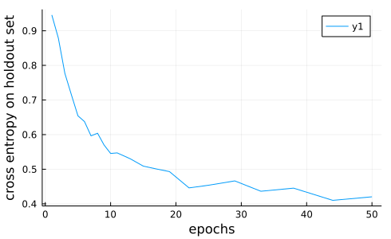
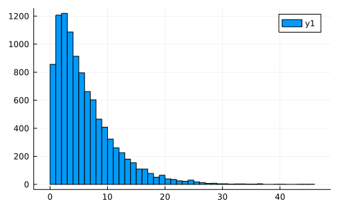
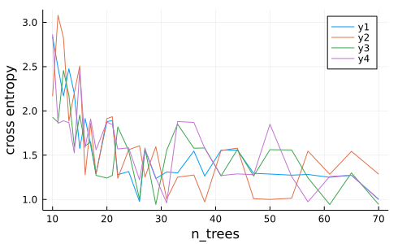
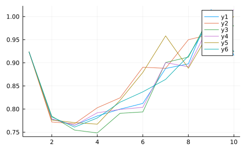

```@meta
EditURL = "<unknown>/tutorials.jl"
```

# Machine Learning in Julia, JuliaCon2020

A workshop introducing the machine learning toolbox
[MLJ](https://alan-turing-institute.github.io/MLJ.jl/stable/).

### Set-up

The following instantiates a package environment and pre-loads some
packages, to avoid delays later on.

The package environment has been created using **Julia 1.6** and may not
instantiate properly for other Julia versions.

````julia
VERSION
````

````
v"1.6.3"
````

````julia
DIR = @__DIR__
include(joinpath(DIR, "setup.jl"))
color_off()
````

````
false
````

## General resources

- [List of methods introduced in this tutorial](methods.md)
- [MLJ Cheatsheet](https://alan-turing-institute.github.io/MLJ.jl/dev/mlj_cheatsheet/)
- [Common MLJ Workflows](https://alan-turing-institute.github.io/MLJ.jl/dev/common_mlj_workflows/)
- [MLJ manual](https://alan-turing-institute.github.io/MLJ.jl/dev/)
- [Data Science Tutorials in Julia](https://juliaai.github.io/DataScienceTutorials.jl/)

## Contents

### Basic

- [Part 1 - Data Representation](#part-1-data-representation)
- [Part 2 - Selecting, Training and Evaluating Models](#part-2-selecting-training-and-evaluating-models)
- [Part 3 - Transformers and Pipelines](#part-3-transformers-and-pipelines)
- [Part 4 - Tuning Hyper-parameters](#part-4-tuning-hyper-parameters)
- [Part 5 - Advanced model composition](#part-5-advanced-model-composition)
- [Solutions to Exercises](#solutions-to-exercises)

<a id='part-1-data-representation'></a>

## Part 1 - Data Representation

> **Goals:**
> 1. Learn how MLJ specifies it's data requirements using "scientific" types
> 2. Understand the options for representing tabular data
> 3. Learn how to inspect and fix the representation of data to meet MLJ requirements

### Scientific types

To help you focus on the intended *purpose* or *interpretation* of
data, MLJ models specify data requirements using *scientific types*,
instead of machine types. An example of a scientific type is
`OrderedFactor`. The other basic "scalar" scientific types are
illustrated below:


A scientific type is an ordinary Julia type (so it can be used for
method dispatch, for example) but it usually has no instances. The
`scitype` function is used to articulate MLJ's convention about how
different machine types will be interpreted by MLJ models:

````julia
using MLJ
scitype(3.141)
````

````
Continuous
````

````julia
time = [2.3, 4.5, 4.2, 1.8, 7.1]
scitype(time)
````

````
AbstractVector{Continuous} (alias for AbstractArray{Continuous, 1})
````

To fix data which MLJ is interpreting incorrectly, we use the
`coerce` method:

````julia
height = [185, 153, 163, 114, 180]
scitype(height)
````

````
AbstractVector{Count} (alias for AbstractArray{Count, 1})
````

````julia
height = coerce(height, Continuous)
````

````
5-element Vector{Float64}:
 185.0
 153.0
 163.0
 114.0
 180.0
````

Here's an example of data we would want interpreted as
`OrderedFactor` but isn't:

````julia
exam_mark = ["rotten", "great", "bla",  missing, "great"]
scitype(exam_mark)
````

````
AbstractVector{Union{Missing, Textual}} (alias for AbstractArray{Union{Missing, Textual}, 1})
````

````julia
exam_mark = coerce(exam_mark, OrderedFactor)
````

````
5-element CategoricalArray{Union{Missing, String},1,UInt32}:
 "rotten"
 "great"
 "bla"
 missing
 "great"
````

````julia
levels(exam_mark)
````

````
3-element Vector{String}:
 "bla"
 "great"
 "rotten"
````

Use `levels!` to put the classes in the right order:

````julia
levels!(exam_mark, ["rotten", "bla", "great"])
exam_mark[1] < exam_mark[2]
````

````
true
````

When sub-sampling, no levels are lost:

````julia
levels(exam_mark[1:2])
````

````
3-element Vector{String}:
 "rotten"
 "bla"
 "great"
````

**Note on binary data.** There is no separate scientific type for
binary data. Binary data is `OrderedFactor{2}` or
`Multiclass{2}`. If a binary measure like `truepositive` is a
applied to `OrderedFactor{2}` then the "positive" class is assumed
to appear *second* in the ordering. If such a measure is applied to
`Multiclass{2}` data, a warning is issued. A single `OrderedFactor`
can be coerced to a single `Continuous` variable, for models that
require this, while a `Multiclass` variable can only be one-hot
encoded.

### Two-dimensional data

Whenever it makes sense, MLJ Models generally expect two-dimensional
data to be *tabular*. All the tabular formats implementing the
[Tables.jl API](https://juliadata.github.io/Tables.jl/stable/) (see
this
[list](https://github.com/JuliaData/Tables.jl/blob/master/INTEGRATIONS.md))
have a scientific type of `Table` and can be used with such models.

Probably the simplest example of a table is the julia native *column
table*, which is just a named tuple of equal-length vectors:

````julia
column_table = (h=height, e=exam_mark, t=time)
````

````
(h = [185.0, 153.0, 163.0, 114.0, 180.0],
 e = Union{Missing, CategoricalValue{String, UInt32}}["rotten", "great", "bla", missing, "great"],
 t = [2.3, 4.5, 4.2, 1.8, 7.1],)
````

````julia
scitype(column_table)
````

````
Table{Union{AbstractVector{Union{Missing, OrderedFactor{3}}}, AbstractVector{Continuous}}}
````

Notice the `Table{K}` type parameter `K` encodes the scientific
types of the columns. (This is useful when comparing table scitypes
with `<:`). To inspect the individual column scitypes, we use the
`schema` method instead:

````julia
schema(column_table)
````

````
┌─────────┬──────────────────────────────────────────────────┬──────────────────────────────────┐
│ _.names │ _.types                                          │ _.scitypes                       │
├─────────┼──────────────────────────────────────────────────┼──────────────────────────────────┤
│ h       │ Float64                                          │ Continuous                       │
│ e       │ Union{Missing, CategoricalValue{String, UInt32}} │ Union{Missing, OrderedFactor{3}} │
│ t       │ Float64                                          │ Continuous                       │
└─────────┴──────────────────────────────────────────────────┴──────────────────────────────────┘
_.nrows = 5

````

Here are five other examples of tables:

````julia
dict_table = Dict(:h => height, :e => exam_mark, :t => time)
schema(dict_table)
````

````
┌─────────┬──────────────────────────────────────────────────┬──────────────────────────────────┐
│ _.names │ _.types                                          │ _.scitypes                       │
├─────────┼──────────────────────────────────────────────────┼──────────────────────────────────┤
│ e       │ Union{Missing, CategoricalValue{String, UInt32}} │ Union{Missing, OrderedFactor{3}} │
│ h       │ Float64                                          │ Continuous                       │
│ t       │ Float64                                          │ Continuous                       │
└─────────┴──────────────────────────────────────────────────┴──────────────────────────────────┘
_.nrows = 5

````

(To control column order here, instead use `LittleDict` from
OrderedCollections.jl.)

````julia
row_table = [(a=1, b=3.4),
             (a=2, b=4.5),
             (a=3, b=5.6)]
schema(row_table)
````

````
┌─────────┬─────────┬────────────┐
│ _.names │ _.types │ _.scitypes │
├─────────┼─────────┼────────────┤
│ a       │ Int64   │ Count      │
│ b       │ Float64 │ Continuous │
└─────────┴─────────┴────────────┘
_.nrows = 3

````

````julia
import DataFrames
df = DataFrames.DataFrame(column_table)
````

```@raw html
<div class="data-frame"><p>5 rows × 3 columns</p><table class="data-frame"><thead><tr><th></th><th>h</th><th>e</th><th>t</th></tr><tr><th></th><th title="Float64">Float64</th><th title="Union{Missing, CategoricalValue{String, UInt32}}">Cat…?</th><th title="Float64">Float64</th></tr></thead><tbody><tr><th>1</th><td>185.0</td><td>rotten</td><td>2.3</td></tr><tr><th>2</th><td>153.0</td><td>great</td><td>4.5</td></tr><tr><th>3</th><td>163.0</td><td>bla</td><td>4.2</td></tr><tr><th>4</th><td>114.0</td><td><em>missing</em></td><td>1.8</td></tr><tr><th>5</th><td>180.0</td><td>great</td><td>7.1</td></tr></tbody></table></div>
```

````julia
schema(df) == schema(column_table)
````

````
true
````

````julia
using CSV
file = CSV.File(joinpath(DIR, "data", "horse.csv"));
schema(file) # (triggers a file read)
````

````
┌─────────────────────────┬─────────┬────────────┐
│ _.names                 │ _.types │ _.scitypes │
├─────────────────────────┼─────────┼────────────┤
│ surgery                 │ Int64   │ Count      │
│ age                     │ Int64   │ Count      │
│ rectal_temperature      │ Float64 │ Continuous │
│ pulse                   │ Int64   │ Count      │
│ respiratory_rate        │ Int64   │ Count      │
│ temperature_extremities │ Int64   │ Count      │
│ mucous_membranes        │ Int64   │ Count      │
│ capillary_refill_time   │ Int64   │ Count      │
│ pain                    │ Int64   │ Count      │
│ peristalsis             │ Int64   │ Count      │
│ abdominal_distension    │ Int64   │ Count      │
│ packed_cell_volume      │ Float64 │ Continuous │
│ total_protein           │ Float64 │ Continuous │
│ outcome                 │ Int64   │ Count      │
│ surgical_lesion         │ Int64   │ Count      │
│ cp_data                 │ Int64   │ Count      │
└─────────────────────────┴─────────┴────────────┘
_.nrows = 366

````

Most MLJ models do not accept matrix in lieu of a table, but you can
wrap a matrix as a table:

````julia
matrix_table = MLJ.table(rand(2,3))
schema(matrix_table)
````

````
┌─────────┬─────────┬────────────┐
│ _.names │ _.types │ _.scitypes │
├─────────┼─────────┼────────────┤
│ x1      │ Float64 │ Continuous │
│ x2      │ Float64 │ Continuous │
│ x3      │ Float64 │ Continuous │
└─────────┴─────────┴────────────┘
_.nrows = 2

````

The matrix is *not* copied, only wrapped. Some models may perform
better if one wraps the adjoint of the transpose - see
[here](https://alan-turing-institute.github.io/MLJ.jl/dev/getting_started/#Observations-correspond-to-rows,-not-columns).

**Manipulating tabular data.** In this workshop we assume
familiarity with some kind of tabular data container (although it is
possible, in principle, to carry out the exercises without this.)
For a quick start introduction to `DataFrames`, see [this
tutorial](https://juliaai.github.io/DataScienceTutorials.jl/data/dataframe/).

### Fixing scientific types in tabular data

To show how we can correct the scientific types of data in tables,
we introduce a cleaned up version of the UCI Horse Colic Data Set
(the cleaning work-flow is described
[here](https://juliaai.github.io/DataScienceTutorials.jl/end-to-end/horse/#dealing_with_missing_values)).

````julia
using CSV
file = CSV.File(joinpath(DIR, "data", "horse.csv"));
horse = DataFrames.DataFrame(file); # convert to data frame without copying columns
first(horse, 4)
````

```@raw html
<div class="data-frame"><p>4 rows × 16 columns</p><table class="data-frame"><thead><tr><th></th><th>surgery</th><th>age</th><th>rectal_temperature</th><th>pulse</th><th>respiratory_rate</th><th>temperature_extremities</th><th>mucous_membranes</th><th>capillary_refill_time</th><th>pain</th><th>peristalsis</th><th>abdominal_distension</th><th>packed_cell_volume</th><th>total_protein</th><th>outcome</th><th>surgical_lesion</th><th>cp_data</th></tr><tr><th></th><th title="Int64">Int64</th><th title="Int64">Int64</th><th title="Float64">Float64</th><th title="Int64">Int64</th><th title="Int64">Int64</th><th title="Int64">Int64</th><th title="Int64">Int64</th><th title="Int64">Int64</th><th title="Int64">Int64</th><th title="Int64">Int64</th><th title="Int64">Int64</th><th title="Float64">Float64</th><th title="Float64">Float64</th><th title="Int64">Int64</th><th title="Int64">Int64</th><th title="Int64">Int64</th></tr></thead><tbody><tr><th>1</th><td>2</td><td>1</td><td>38.5</td><td>66</td><td>66</td><td>3</td><td>1</td><td>2</td><td>5</td><td>4</td><td>4</td><td>45.0</td><td>8.4</td><td>2</td><td>2</td><td>2</td></tr><tr><th>2</th><td>1</td><td>1</td><td>39.2</td><td>88</td><td>88</td><td>3</td><td>4</td><td>1</td><td>3</td><td>4</td><td>2</td><td>50.0</td><td>85.0</td><td>3</td><td>2</td><td>2</td></tr><tr><th>3</th><td>2</td><td>1</td><td>38.3</td><td>40</td><td>40</td><td>1</td><td>3</td><td>1</td><td>3</td><td>3</td><td>1</td><td>33.0</td><td>6.7</td><td>1</td><td>2</td><td>1</td></tr><tr><th>4</th><td>1</td><td>9</td><td>39.1</td><td>164</td><td>164</td><td>4</td><td>6</td><td>2</td><td>2</td><td>4</td><td>4</td><td>48.0</td><td>7.2</td><td>2</td><td>1</td><td>1</td></tr></tbody></table></div>
```

From [the UCI
docs](http://archive.ics.uci.edu/ml/datasets/Horse+Colic) we can
surmise how each variable ought to be interpreted (a step in our
work-flow that cannot reliably be left to the computer):

variable                    | scientific type (interpretation)
----------------------------|-----------------------------------
`:surgery`                  | Multiclass
`:age`                      | Multiclass
`:rectal_temperature`       | Continuous
`:pulse`                    | Continuous
`:respiratory_rate`         | Continuous
`:temperature_extremities`  | OrderedFactor
`:mucous_membranes`         | Multiclass
`:capillary_refill_time`    | Multiclass
`:pain`                     | OrderedFactor
`:peristalsis`              | OrderedFactor
`:abdominal_distension`     | OrderedFactor
`:packed_cell_volume`       | Continuous
`:total_protein`            | Continuous
`:outcome`                  | Multiclass
`:surgical_lesion`          | OrderedFactor
`:cp_data`                  | Multiclass

Let's see how MLJ will actually interpret the data, as it is
currently encoded:

````julia
schema(horse)
````

````
┌─────────────────────────┬─────────┬────────────┐
│ _.names                 │ _.types │ _.scitypes │
├─────────────────────────┼─────────┼────────────┤
│ surgery                 │ Int64   │ Count      │
│ age                     │ Int64   │ Count      │
│ rectal_temperature      │ Float64 │ Continuous │
│ pulse                   │ Int64   │ Count      │
│ respiratory_rate        │ Int64   │ Count      │
│ temperature_extremities │ Int64   │ Count      │
│ mucous_membranes        │ Int64   │ Count      │
│ capillary_refill_time   │ Int64   │ Count      │
│ pain                    │ Int64   │ Count      │
│ peristalsis             │ Int64   │ Count      │
│ abdominal_distension    │ Int64   │ Count      │
│ packed_cell_volume      │ Float64 │ Continuous │
│ total_protein           │ Float64 │ Continuous │
│ outcome                 │ Int64   │ Count      │
│ surgical_lesion         │ Int64   │ Count      │
│ cp_data                 │ Int64   │ Count      │
└─────────────────────────┴─────────┴────────────┘
_.nrows = 366

````

As a first correction step, we can get MLJ to "guess" the
appropriate fix, using the `autotype` method:

````julia
autotype(horse)
````

````
Dict{Symbol, Type} with 11 entries:
  :abdominal_distension => OrderedFactor
  :pain => OrderedFactor
  :surgery => OrderedFactor
  :mucous_membranes => OrderedFactor
  :surgical_lesion => OrderedFactor
  :outcome => OrderedFactor
  :capillary_refill_time => OrderedFactor
  :age => OrderedFactor
  :temperature_extremities => OrderedFactor
  :peristalsis => OrderedFactor
  :cp_data => OrderedFactor
````

Okay, this is not perfect, but a step in the right direction, which
we implement like this:

````julia
coerce!(horse, autotype(horse));
schema(horse)
````

````
┌─────────────────────────┬─────────────────────────────────┬──────────────────┐
│ _.names                 │ _.types                         │ _.scitypes       │
├─────────────────────────┼─────────────────────────────────┼──────────────────┤
│ surgery                 │ CategoricalValue{Int64, UInt32} │ OrderedFactor{2} │
│ age                     │ CategoricalValue{Int64, UInt32} │ OrderedFactor{2} │
│ rectal_temperature      │ Float64                         │ Continuous       │
│ pulse                   │ Int64                           │ Count            │
│ respiratory_rate        │ Int64                           │ Count            │
│ temperature_extremities │ CategoricalValue{Int64, UInt32} │ OrderedFactor{4} │
│ mucous_membranes        │ CategoricalValue{Int64, UInt32} │ OrderedFactor{6} │
│ capillary_refill_time   │ CategoricalValue{Int64, UInt32} │ OrderedFactor{3} │
│ pain                    │ CategoricalValue{Int64, UInt32} │ OrderedFactor{5} │
│ peristalsis             │ CategoricalValue{Int64, UInt32} │ OrderedFactor{4} │
│ abdominal_distension    │ CategoricalValue{Int64, UInt32} │ OrderedFactor{4} │
│ packed_cell_volume      │ Float64                         │ Continuous       │
│ total_protein           │ Float64                         │ Continuous       │
│ outcome                 │ CategoricalValue{Int64, UInt32} │ OrderedFactor{3} │
│ surgical_lesion         │ CategoricalValue{Int64, UInt32} │ OrderedFactor{2} │
│ cp_data                 │ CategoricalValue{Int64, UInt32} │ OrderedFactor{2} │
└─────────────────────────┴─────────────────────────────────┴──────────────────┘
_.nrows = 366

````

All remaining `Count` data should be `Continuous`:

````julia
coerce!(horse, Count => Continuous);
schema(horse)
````

````
┌─────────────────────────┬─────────────────────────────────┬──────────────────┐
│ _.names                 │ _.types                         │ _.scitypes       │
├─────────────────────────┼─────────────────────────────────┼──────────────────┤
│ surgery                 │ CategoricalValue{Int64, UInt32} │ OrderedFactor{2} │
│ age                     │ CategoricalValue{Int64, UInt32} │ OrderedFactor{2} │
│ rectal_temperature      │ Float64                         │ Continuous       │
│ pulse                   │ Float64                         │ Continuous       │
│ respiratory_rate        │ Float64                         │ Continuous       │
│ temperature_extremities │ CategoricalValue{Int64, UInt32} │ OrderedFactor{4} │
│ mucous_membranes        │ CategoricalValue{Int64, UInt32} │ OrderedFactor{6} │
│ capillary_refill_time   │ CategoricalValue{Int64, UInt32} │ OrderedFactor{3} │
│ pain                    │ CategoricalValue{Int64, UInt32} │ OrderedFactor{5} │
│ peristalsis             │ CategoricalValue{Int64, UInt32} │ OrderedFactor{4} │
│ abdominal_distension    │ CategoricalValue{Int64, UInt32} │ OrderedFactor{4} │
│ packed_cell_volume      │ Float64                         │ Continuous       │
│ total_protein           │ Float64                         │ Continuous       │
│ outcome                 │ CategoricalValue{Int64, UInt32} │ OrderedFactor{3} │
│ surgical_lesion         │ CategoricalValue{Int64, UInt32} │ OrderedFactor{2} │
│ cp_data                 │ CategoricalValue{Int64, UInt32} │ OrderedFactor{2} │
└─────────────────────────┴─────────────────────────────────┴──────────────────┘
_.nrows = 366

````

We'll correct the remaining truant entries manually:

````julia
coerce!(horse,
        :surgery               => Multiclass,
        :age                   => Multiclass,
        :mucous_membranes      => Multiclass,
        :capillary_refill_time => Multiclass,
        :outcome               => Multiclass,
        :cp_data               => Multiclass);
schema(horse)
````

````
┌─────────────────────────┬─────────────────────────────────┬──────────────────┐
│ _.names                 │ _.types                         │ _.scitypes       │
├─────────────────────────┼─────────────────────────────────┼──────────────────┤
│ surgery                 │ CategoricalValue{Int64, UInt32} │ Multiclass{2}    │
│ age                     │ CategoricalValue{Int64, UInt32} │ Multiclass{2}    │
│ rectal_temperature      │ Float64                         │ Continuous       │
│ pulse                   │ Float64                         │ Continuous       │
│ respiratory_rate        │ Float64                         │ Continuous       │
│ temperature_extremities │ CategoricalValue{Int64, UInt32} │ OrderedFactor{4} │
│ mucous_membranes        │ CategoricalValue{Int64, UInt32} │ Multiclass{6}    │
│ capillary_refill_time   │ CategoricalValue{Int64, UInt32} │ Multiclass{3}    │
│ pain                    │ CategoricalValue{Int64, UInt32} │ OrderedFactor{5} │
│ peristalsis             │ CategoricalValue{Int64, UInt32} │ OrderedFactor{4} │
│ abdominal_distension    │ CategoricalValue{Int64, UInt32} │ OrderedFactor{4} │
│ packed_cell_volume      │ Float64                         │ Continuous       │
│ total_protein           │ Float64                         │ Continuous       │
│ outcome                 │ CategoricalValue{Int64, UInt32} │ Multiclass{3}    │
│ surgical_lesion         │ CategoricalValue{Int64, UInt32} │ OrderedFactor{2} │
│ cp_data                 │ CategoricalValue{Int64, UInt32} │ Multiclass{2}    │
└─────────────────────────┴─────────────────────────────────┴──────────────────┘
_.nrows = 366

````

### Resources for Part 1

- From the MLJ manual:
   - [A preview of data type specification in
  MLJ](https://alan-turing-institute.github.io/MLJ.jl/dev/getting_started/#A-preview-of-data-type-specification-in-MLJ-1)
   - [Data containers and scientific types](https://alan-turing-institute.github.io/MLJ.jl/dev/getting_started/#Data-containers-and-scientific-types-1)
   - [Working with Categorical Data](https://alan-turing-institute.github.io/MLJ.jl/dev/working_with_categorical_data/)
- [Summary](https://juliaai.github.io/ScientificTypes.jl/dev/#Summary-of-the-default-convention) of the MLJ convention for representing scientific types
- [ScientificTypes.jl](https://juliaai.github.io/ScientificTypes.jl/dev/)
- From Data Science Tutorials:
    - [Data interpretation: Scientific Types](https://juliaai.github.io/DataScienceTutorials.jl/data/scitype/)
    - [Horse colic data](https://juliaai.github.io/DataScienceTutorials.jl/end-to-end/horse/)
- [UCI Horse Colic Data Set](http://archive.ics.uci.edu/ml/datasets/Horse+Colic)

### Exercises for Part 1

#### Exercise 1

Try to guess how each code snippet below will evaluate:

````julia
scitype(42)
````

````
Count
````

````julia
questions = ["who", "why", "what", "when"]
scitype(questions)
````

````
AbstractVector{Textual} (alias for AbstractArray{Textual, 1})
````

````julia
elscitype(questions)
````

````
Textual
````

````julia
t = (3.141, 42, "how")
scitype(t)
````

````
Tuple{Continuous, Count, Textual}
````

````julia
A = rand(2, 3)
````

````
2×3 Matrix{Float64}:
 0.586902  0.635427  0.433316
 0.583547  0.473668  0.61271
````

-

````julia
scitype(A)
````

````
AbstractMatrix{Continuous} (alias for AbstractArray{Continuous, 2})
````

````julia
elscitype(A)
````

````
Continuous
````

````julia
using SparseArrays
Asparse = sparse(A)
````

````
2×3 SparseMatrixCSC{Float64, Int64} with 6 stored entries:
 0.586902  0.635427  0.433316
 0.583547  0.473668  0.61271
````

````julia
scitype(Asparse)
````

````
AbstractMatrix{Continuous} (alias for AbstractArray{Continuous, 2})
````

````julia
using CategoricalArrays
C1 = categorical(A)
````

````
2×3 CategoricalArray{Float64,2,UInt32}:
 0.586902  0.635427  0.433316
 0.583547  0.473668  0.61271
````

````julia
scitype(C1)
````

````
AbstractMatrix{Multiclass{6}} (alias for AbstractArray{Multiclass{6}, 2})
````

````julia
elscitype(C1)
````

````
Multiclass{6}
````

````julia
C2 = categorical(A, ordered=true)
scitype(C2)
````

````
AbstractMatrix{OrderedFactor{6}} (alias for AbstractArray{OrderedFactor{6}, 2})
````

````julia
v = [1, 2, missing, 4]
scitype(v)
````

````
AbstractVector{Union{Missing, Count}} (alias for AbstractArray{Union{Missing, Count}, 1})
````

````julia
elscitype(v)
````

````
Union{Missing, Count}
````

````julia
scitype(v[1:2])
````

````
AbstractVector{Union{Missing, Count}} (alias for AbstractArray{Union{Missing, Count}, 1})
````

Can you guess at the general behavior of
`scitype` with respect to tuples, abstract arrays and missing
values? The answers are
[here](https://github.com/juliaai/ScientificTypesBase.jl#2-the-scitype-and-scitype-methods)
(ignore "Property 1").

#### Exercise 2

Coerce the following vector to make MLJ recognize it as a vector of
ordered factors (with an appropriate ordering):

````julia
quality = ["good", "poor", "poor", "excellent", missing, "good", "excellent"]
````

````
7-element Vector{Union{Missing, String}}:
 "good"
 "poor"
 "poor"
 "excellent"
 missing
 "good"
 "excellent"
````

#### Exercise 3 (fixing scitypes in a table)

Fix the scitypes for the [House Prices in King
County](https://mlr3gallery.mlr-org.com/posts/2020-01-30-house-prices-in-king-county/)
dataset:

````julia
file = CSV.File(joinpath(DIR, "data", "house.csv"));
house = DataFrames.DataFrame(file); # convert to data frame without copying columns
first(house, 4)
````

```@raw html
<div class="data-frame"><p>4 rows × 19 columns</p><table class="data-frame"><thead><tr><th></th><th>price</th><th>bedrooms</th><th>bathrooms</th><th>sqft_living</th><th>sqft_lot</th><th>floors</th><th>waterfront</th><th>view</th><th>condition</th><th>grade</th><th>sqft_above</th><th>sqft_basement</th><th>yr_built</th><th>zipcode</th><th>lat</th><th>long</th><th>sqft_living15</th><th>sqft_lot15</th><th>is_renovated</th></tr><tr><th></th><th title="Float64">Float64</th><th title="Int64">Int64</th><th title="Float64">Float64</th><th title="Int64">Int64</th><th title="Int64">Int64</th><th title="Float64">Float64</th><th title="Int64">Int64</th><th title="Int64">Int64</th><th title="Int64">Int64</th><th title="Int64">Int64</th><th title="Int64">Int64</th><th title="Int64">Int64</th><th title="Int64">Int64</th><th title="Int64">Int64</th><th title="Float64">Float64</th><th title="Float64">Float64</th><th title="Int64">Int64</th><th title="Int64">Int64</th><th title="Bool">Bool</th></tr></thead><tbody><tr><th>1</th><td>221900.0</td><td>3</td><td>1.0</td><td>1180</td><td>5650</td><td>1.0</td><td>0</td><td>0</td><td>3</td><td>7</td><td>1180</td><td>0</td><td>1955</td><td>98178</td><td>47.5112</td><td>-122.257</td><td>1340</td><td>5650</td><td>1</td></tr><tr><th>2</th><td>538000.0</td><td>3</td><td>2.25</td><td>2570</td><td>7242</td><td>2.0</td><td>0</td><td>0</td><td>3</td><td>7</td><td>2170</td><td>400</td><td>1951</td><td>98125</td><td>47.721</td><td>-122.319</td><td>1690</td><td>7639</td><td>0</td></tr><tr><th>3</th><td>180000.0</td><td>2</td><td>1.0</td><td>770</td><td>10000</td><td>1.0</td><td>0</td><td>0</td><td>3</td><td>6</td><td>770</td><td>0</td><td>1933</td><td>98028</td><td>47.7379</td><td>-122.233</td><td>2720</td><td>8062</td><td>1</td></tr><tr><th>4</th><td>604000.0</td><td>4</td><td>3.0</td><td>1960</td><td>5000</td><td>1.0</td><td>0</td><td>0</td><td>5</td><td>7</td><td>1050</td><td>910</td><td>1965</td><td>98136</td><td>47.5208</td><td>-122.393</td><td>1360</td><td>5000</td><td>1</td></tr></tbody></table></div>
```

(Two features in the original data set have been deemed uninformative
and dropped, namely `:id` and `:date`. The original feature
`:yr_renovated` has been replaced by the `Bool` feature `is_renovated`.)

<a id='part-2-selecting-training-and-evaluating-models'></a>

## Part 2 - Selecting, Training and Evaluating Models

> **Goals:**
> 1. Search MLJ's database of model metadata to identify model candidates for a supervised learning task.
> 2. Evaluate the performance of a model on a holdout set using basic `fit!`/`predict` work-flow.
> 3. Inspect the outcomes of training and save these to a file.
> 3. Evaluate performance using other resampling strategies, such as cross-validation, in one line, using `evaluate!`
> 4. Plot a "learning curve", to inspect performance as a function of some model hyper-parameter, such as an iteration parameter

The "Hello World!" of machine learning is to classify Fisher's
famous iris data set. This time, we'll grab the data from
[OpenML](https://www.openml.org):

````julia
OpenML.describe_dataset(61)
````

```@raw html
<div class="markdown"><p><strong>Author</strong>: R.A. Fisher   <strong>Source</strong>: <a href="https://archive.ics.uci.edu/ml/datasets/Iris">UCI</a> - 1936 - Donated by Michael Marshall   <strong>Please cite</strong>:   </p>
<p><strong>Iris Plants Database</strong>   This is perhaps the best known database to be found in the pattern recognition literature.  Fisher&#39;s paper is a classic in the field and is referenced frequently to this day.  &#40;See Duda &amp; Hart, for example.&#41;  The data set contains 3 classes of 50 instances each, where each class refers to a type of iris plant.  One class is     linearly separable from the other 2; the latter are NOT linearly separable from each other.</p>
<p>Predicted attribute: class of iris plant.   This is an exceedingly simple domain.  </p>
<h3>Attribute Information:</h3>
<pre><code>1. sepal length in cm
2. sepal width in cm
3. petal length in cm
4. petal width in cm
5. class: 
   -- Iris Setosa
   -- Iris Versicolour
   -- Iris Virginica</code></pre>
</div>
```

````julia
iris = OpenML.load(61); # a row table
iris = DataFrames.DataFrame(iris);
first(iris, 4)
````

```@raw html
<div class="data-frame"><p>4 rows × 5 columns</p><table class="data-frame"><thead><tr><th></th><th>sepallength</th><th>sepalwidth</th><th>petallength</th><th>petalwidth</th><th>class</th></tr><tr><th></th><th title="Union{Missing, Float64}">Float64?</th><th title="Union{Missing, Float64}">Float64?</th><th title="Union{Missing, Float64}">Float64?</th><th title="Union{Missing, Float64}">Float64?</th><th title="Union{Missing, CategoricalValue{String, UInt32}}">Cat…?</th></tr></thead><tbody><tr><th>1</th><td>5.1</td><td>3.5</td><td>1.4</td><td>0.2</td><td>Iris-setosa</td></tr><tr><th>2</th><td>4.9</td><td>3.0</td><td>1.4</td><td>0.2</td><td>Iris-setosa</td></tr><tr><th>3</th><td>4.7</td><td>3.2</td><td>1.3</td><td>0.2</td><td>Iris-setosa</td></tr><tr><th>4</th><td>4.6</td><td>3.1</td><td>1.5</td><td>0.2</td><td>Iris-setosa</td></tr></tbody></table></div>
```

**Main goal.** To build and evaluate models for predicting the
`:class` variable, given the four remaining measurement variables.

### Step 1. Inspect and fix scientific types

````julia
schema(iris)
````

````
┌─────────────┬──────────────────────────────────────────────────┬───────────────────────────────┐
│ _.names     │ _.types                                          │ _.scitypes                    │
├─────────────┼──────────────────────────────────────────────────┼───────────────────────────────┤
│ sepallength │ Union{Missing, Float64}                          │ Union{Missing, Continuous}    │
│ sepalwidth  │ Union{Missing, Float64}                          │ Union{Missing, Continuous}    │
│ petallength │ Union{Missing, Float64}                          │ Union{Missing, Continuous}    │
│ petalwidth  │ Union{Missing, Float64}                          │ Union{Missing, Continuous}    │
│ class       │ Union{Missing, CategoricalValue{String, UInt32}} │ Union{Missing, Multiclass{3}} │
└─────────────┴──────────────────────────────────────────────────┴───────────────────────────────┘
_.nrows = 150

````

Unfortunately, `Missing` is appearing in the element type, despite
the fact there are no missing values (see this
[issue](https://github.com/JuliaAI/OpenML.jl/issues/10)). To do this
we have to explicilty tighten the types:

````julia
coerce!(iris,
        Union{Missing,Continuous}=>Continuous,
        Union{Missing,Multiclass}=>Multiclass,
        tight=true)
schema(iris)
````

````
┌─────────────┬──────────────────────────────────┬───────────────┐
│ _.names     │ _.types                          │ _.scitypes    │
├─────────────┼──────────────────────────────────┼───────────────┤
│ sepallength │ Float64                          │ Continuous    │
│ sepalwidth  │ Float64                          │ Continuous    │
│ petallength │ Float64                          │ Continuous    │
│ petalwidth  │ Float64                          │ Continuous    │
│ class       │ CategoricalValue{String, UInt32} │ Multiclass{3} │
└─────────────┴──────────────────────────────────┴───────────────┘
_.nrows = 150

````

### Step 2. Split data into input and target parts

Here's how we split the data into target and input features, which
is needed for MLJ supervised models. We randomize the data at the
same time:

````julia
y, X = unpack(iris, ==(:class), name->true; rng=123);
scitype(y)
````

````
AbstractVector{Multiclass{3}} (alias for AbstractArray{Multiclass{3}, 1})
````

Here's one way to access the documentation (at the REPL, `?unpack`
also works):

````julia
@doc unpack
````

```@raw html
<div class="markdown"><pre><code>t1, t2, ...., tk &#61; unpack&#40;table, f1, f2, ... fk;
                         wrap_singles&#61;false,
                         shuffle&#61;false,
                         rng::Union&#123;AbstractRNG,Int,Nothing&#125;&#61;nothing&#41;</code></pre>
<p>Horizontally split any Tables.jl compatible <code>table</code> into smaller tables &#40;or vectors&#41; <code>t1, t2, ..., tk</code> by making column selections <strong>without replacement</strong> by successively applying the columnn name filters <code>f1</code>, <code>f2</code>, ..., <code>fk</code>. A <em>filter</em> is any object <code>f</code> such that <code>f&#40;name&#41;</code> is <code>true</code> or <code>false</code> for each column <code>name::Symbol</code> of <code>table</code>. For example, use the filter <code>_ -&gt; true</code> to pick up all remaining columns of the table.</p>
<p>Whenever a returned table contains a single column, it is converted to a vector unless <code>wrap_singles&#61;true</code>.</p>
<p>Scientific type conversions can be optionally specified &#40;note semicolon&#41;:</p>
<pre><code>unpack&#40;table, t...; col1&#61;&gt;scitype1, col2&#61;&gt;scitype2, ... &#41;</code></pre>
<p>If <code>shuffle&#61;true</code> then the rows of <code>table</code> are first shuffled, using the global RNG, unless <code>rng</code> is specified; if <code>rng</code> is an integer, it specifies the seed of an automatically generated Mersenne twister. If <code>rng</code> is specified then <code>shuffle&#61;true</code> is implicit.</p>
<h3>Example</h3>
<pre><code>julia&gt; table &#61; DataFrame&#40;x&#61;&#91;1,2&#93;, y&#61;&#91;&#39;a&#39;, &#39;b&#39;&#93;, z&#61;&#91;10.0, 20.0&#93;, w&#61;&#91;&quot;A&quot;, &quot;B&quot;&#93;&#41;
julia&gt; Z, XY &#61; unpack&#40;table, &#61;&#61;&#40;:z&#41;, &#33;&#61;&#40;:w&#41;;
               :x&#61;&gt;Continuous, :y&#61;&gt;Multiclass&#41;
julia&gt; XY
2×2 DataFrame
│ Row │ x       │ y            │
│     │ Float64 │ Categorical… │
├─────┼─────────┼──────────────┤
│ 1   │ 1.0     │ &#39;a&#39;          │
│ 2   │ 2.0     │ &#39;b&#39;          │

julia&gt; Z
2-element Array&#123;Float64,1&#125;:
 10.0
 20.0</code></pre>


</div>
```

### On searching for a model

Here's how to see *all* models (not immediately useful):

````julia
all_models = models()
````

````
183-element Vector{NamedTuple{(:name, :package_name, :is_supervised, :abstract_type, :deep_properties, :docstring, :fit_data_scitype, :hyperparameter_ranges, :hyperparameter_types, :hyperparameters, :implemented_methods, :inverse_transform_scitype, :is_pure_julia, :is_wrapper, :iteration_parameter, :load_path, :package_license, :package_url, :package_uuid, :predict_scitype, :prediction_type, :supports_class_weights, :supports_online, :supports_training_losses, :supports_weights, :transform_scitype, :input_scitype, :target_scitype, :output_scitype), T} where T<:Tuple}:
 (name = ABODDetector, package_name = OutlierDetectionNeighbors, ... )
 (name = ABODDetector, package_name = OutlierDetectionPython, ... )
 (name = AEDetector, package_name = OutlierDetectionNetworks, ... )
 (name = ARDRegressor, package_name = ScikitLearn, ... )
 (name = AdaBoostClassifier, package_name = ScikitLearn, ... )
 (name = AdaBoostRegressor, package_name = ScikitLearn, ... )
 (name = AdaBoostStumpClassifier, package_name = DecisionTree, ... )
 (name = AffinityPropagation, package_name = ScikitLearn, ... )
 (name = AgglomerativeClustering, package_name = ScikitLearn, ... )
 (name = BaggingClassifier, package_name = ScikitLearn, ... )
 (name = BaggingRegressor, package_name = ScikitLearn, ... )
 (name = BayesianLDA, package_name = MultivariateStats, ... )
 (name = BayesianLDA, package_name = ScikitLearn, ... )
 (name = BayesianQDA, package_name = ScikitLearn, ... )
 (name = BayesianRidgeRegressor, package_name = ScikitLearn, ... )
 (name = BayesianSubspaceLDA, package_name = MultivariateStats, ... )
 (name = BernoulliNBClassifier, package_name = ScikitLearn, ... )
 (name = Birch, package_name = ScikitLearn, ... )
 (name = CBLOFDetector, package_name = OutlierDetectionPython, ... )
 (name = COFDetector, package_name = OutlierDetectionNeighbors, ... )
 (name = COFDetector, package_name = OutlierDetectionPython, ... )
 (name = COPODDetector, package_name = OutlierDetectionPython, ... )
 (name = ComplementNBClassifier, package_name = ScikitLearn, ... )
 (name = ConstantClassifier, package_name = MLJModels, ... )
 (name = ConstantRegressor, package_name = MLJModels, ... )
 (name = ContinuousEncoder, package_name = MLJModels, ... )
 (name = DBSCAN, package_name = ScikitLearn, ... )
 (name = DNNDetector, package_name = OutlierDetectionNeighbors, ... )
 (name = DSADDetector, package_name = OutlierDetectionNetworks, ... )
 (name = DecisionTreeClassifier, package_name = BetaML, ... )
 (name = DecisionTreeClassifier, package_name = DecisionTree, ... )
 (name = DecisionTreeRegressor, package_name = BetaML, ... )
 (name = DecisionTreeRegressor, package_name = DecisionTree, ... )
 (name = DeterministicConstantClassifier, package_name = MLJModels, ... )
 (name = DeterministicConstantRegressor, package_name = MLJModels, ... )
 (name = DummyClassifier, package_name = ScikitLearn, ... )
 (name = DummyRegressor, package_name = ScikitLearn, ... )
 (name = ESADDetector, package_name = OutlierDetectionNetworks, ... )
 (name = ElasticNetCVRegressor, package_name = ScikitLearn, ... )
 (name = ElasticNetRegressor, package_name = MLJLinearModels, ... )
 (name = ElasticNetRegressor, package_name = ScikitLearn, ... )
 (name = EpsilonSVR, package_name = LIBSVM, ... )
 (name = EvoTreeClassifier, package_name = EvoTrees, ... )
 (name = EvoTreeCount, package_name = EvoTrees, ... )
 (name = EvoTreeGaussian, package_name = EvoTrees, ... )
 (name = EvoTreeRegressor, package_name = EvoTrees, ... )
 (name = ExtraTreesClassifier, package_name = ScikitLearn, ... )
 (name = ExtraTreesRegressor, package_name = ScikitLearn, ... )
 (name = FactorAnalysis, package_name = MultivariateStats, ... )
 (name = FeatureAgglomeration, package_name = ScikitLearn, ... )
 (name = FeatureSelector, package_name = MLJModels, ... )
 (name = FillImputer, package_name = MLJModels, ... )
 (name = GMMClusterer, package_name = BetaML, ... )
 (name = GaussianNBClassifier, package_name = NaiveBayes, ... )
 (name = GaussianNBClassifier, package_name = ScikitLearn, ... )
 (name = GaussianProcessClassifier, package_name = ScikitLearn, ... )
 (name = GaussianProcessRegressor, package_name = ScikitLearn, ... )
 (name = GradientBoostingClassifier, package_name = ScikitLearn, ... )
 (name = GradientBoostingRegressor, package_name = ScikitLearn, ... )
 (name = HBOSDetector, package_name = OutlierDetectionPython, ... )
 (name = HuberRegressor, package_name = MLJLinearModels, ... )
 (name = HuberRegressor, package_name = ScikitLearn, ... )
 (name = ICA, package_name = MultivariateStats, ... )
 (name = IForestDetector, package_name = OutlierDetectionPython, ... )
 (name = ImageClassifier, package_name = MLJFlux, ... )
 (name = KMeans, package_name = BetaML, ... )
 (name = KMeans, package_name = Clustering, ... )
 (name = KMeans, package_name = ParallelKMeans, ... )
 (name = KMeans, package_name = ScikitLearn, ... )
 (name = KMedoids, package_name = BetaML, ... )
 (name = KMedoids, package_name = Clustering, ... )
 (name = KNNClassifier, package_name = NearestNeighborModels, ... )
 (name = KNNDetector, package_name = OutlierDetectionNeighbors, ... )
 (name = KNNDetector, package_name = OutlierDetectionPython, ... )
 (name = KNNRegressor, package_name = NearestNeighborModels, ... )
 (name = KNeighborsClassifier, package_name = ScikitLearn, ... )
 (name = KNeighborsRegressor, package_name = ScikitLearn, ... )
 (name = KPLSRegressor, package_name = PartialLeastSquaresRegressor, ... )
 (name = KernelPCA, package_name = MultivariateStats, ... )
 (name = KernelPerceptronClassifier, package_name = BetaML, ... )
 (name = LADRegressor, package_name = MLJLinearModels, ... )
 (name = LDA, package_name = MultivariateStats, ... )
 (name = LGBMClassifier, package_name = LightGBM, ... )
 (name = LGBMRegressor, package_name = LightGBM, ... )
 (name = LMDDDetector, package_name = OutlierDetectionPython, ... )
 (name = LOCIDetector, package_name = OutlierDetectionPython, ... )
 (name = LODADetector, package_name = OutlierDetectionPython, ... )
 (name = LOFDetector, package_name = OutlierDetectionNeighbors, ... )
 (name = LOFDetector, package_name = OutlierDetectionPython, ... )
 (name = LarsCVRegressor, package_name = ScikitLearn, ... )
 (name = LarsRegressor, package_name = ScikitLearn, ... )
 (name = LassoCVRegressor, package_name = ScikitLearn, ... )
 (name = LassoLarsCVRegressor, package_name = ScikitLearn, ... )
 (name = LassoLarsICRegressor, package_name = ScikitLearn, ... )
 (name = LassoLarsRegressor, package_name = ScikitLearn, ... )
 (name = LassoRegressor, package_name = MLJLinearModels, ... )
 (name = LassoRegressor, package_name = ScikitLearn, ... )
 (name = LinearBinaryClassifier, package_name = GLM, ... )
 (name = LinearCountRegressor, package_name = GLM, ... )
 (name = LinearRegressor, package_name = GLM, ... )
 (name = LinearRegressor, package_name = MLJLinearModels, ... )
 (name = LinearRegressor, package_name = MultivariateStats, ... )
 (name = LinearRegressor, package_name = ScikitLearn, ... )
 (name = LinearSVC, package_name = LIBSVM, ... )
 (name = LogisticCVClassifier, package_name = ScikitLearn, ... )
 (name = LogisticClassifier, package_name = MLJLinearModels, ... )
 (name = LogisticClassifier, package_name = ScikitLearn, ... )
 (name = MCDDetector, package_name = OutlierDetectionPython, ... )
 (name = MeanShift, package_name = ScikitLearn, ... )
 (name = MiniBatchKMeans, package_name = ScikitLearn, ... )
 (name = MissingImputator, package_name = BetaML, ... )
 (name = MultiTaskElasticNetCVRegressor, package_name = ScikitLearn, ... )
 (name = MultiTaskElasticNetRegressor, package_name = ScikitLearn, ... )
 (name = MultiTaskLassoCVRegressor, package_name = ScikitLearn, ... )
 (name = MultiTaskLassoRegressor, package_name = ScikitLearn, ... )
 (name = MultinomialClassifier, package_name = MLJLinearModels, ... )
 (name = MultinomialNBClassifier, package_name = NaiveBayes, ... )
 (name = MultinomialNBClassifier, package_name = ScikitLearn, ... )
 (name = MultitargetKNNClassifier, package_name = NearestNeighborModels, ... )
 (name = MultitargetKNNRegressor, package_name = NearestNeighborModels, ... )
 (name = MultitargetLinearRegressor, package_name = MultivariateStats, ... )
 (name = MultitargetNeuralNetworkRegressor, package_name = MLJFlux, ... )
 (name = MultitargetRidgeRegressor, package_name = MultivariateStats, ... )
 (name = NeuralNetworkClassifier, package_name = MLJFlux, ... )
 (name = NeuralNetworkRegressor, package_name = MLJFlux, ... )
 (name = NuSVC, package_name = LIBSVM, ... )
 (name = NuSVR, package_name = LIBSVM, ... )
 (name = OCSVMDetector, package_name = OutlierDetectionPython, ... )
 (name = OPTICS, package_name = ScikitLearn, ... )
 (name = OneClassSVM, package_name = LIBSVM, ... )
 (name = OneHotEncoder, package_name = MLJModels, ... )
 (name = OrthogonalMatchingPursuitCVRegressor, package_name = ScikitLearn, ... )
 (name = OrthogonalMatchingPursuitRegressor, package_name = ScikitLearn, ... )
 (name = PCA, package_name = MultivariateStats, ... )
 (name = PCADetector, package_name = OutlierDetectionPython, ... )
 (name = PLSRegressor, package_name = PartialLeastSquaresRegressor, ... )
 (name = PPCA, package_name = MultivariateStats, ... )
 (name = PassiveAggressiveClassifier, package_name = ScikitLearn, ... )
 (name = PassiveAggressiveRegressor, package_name = ScikitLearn, ... )
 (name = PegasosClassifier, package_name = BetaML, ... )
 (name = PerceptronClassifier, package_name = BetaML, ... )
 (name = PerceptronClassifier, package_name = ScikitLearn, ... )
 (name = ProbabilisticSGDClassifier, package_name = ScikitLearn, ... )
 (name = QuantileRegressor, package_name = MLJLinearModels, ... )
 (name = RANSACRegressor, package_name = ScikitLearn, ... )
 (name = RODDetector, package_name = OutlierDetectionPython, ... )
 (name = RandomForestClassifier, package_name = BetaML, ... )
 (name = RandomForestClassifier, package_name = DecisionTree, ... )
 (name = RandomForestClassifier, package_name = ScikitLearn, ... )
 (name = RandomForestRegressor, package_name = BetaML, ... )
 (name = RandomForestRegressor, package_name = DecisionTree, ... )
 (name = RandomForestRegressor, package_name = ScikitLearn, ... )
 (name = RidgeCVClassifier, package_name = ScikitLearn, ... )
 (name = RidgeCVRegressor, package_name = ScikitLearn, ... )
 (name = RidgeClassifier, package_name = ScikitLearn, ... )
 (name = RidgeRegressor, package_name = MLJLinearModels, ... )
 (name = RidgeRegressor, package_name = MultivariateStats, ... )
 (name = RidgeRegressor, package_name = ScikitLearn, ... )
 (name = RobustRegressor, package_name = MLJLinearModels, ... )
 (name = SGDClassifier, package_name = ScikitLearn, ... )
 (name = SGDRegressor, package_name = ScikitLearn, ... )
 (name = SODDetector, package_name = OutlierDetectionPython, ... )
 (name = SOSDetector, package_name = OutlierDetectionPython, ... )
 (name = SVC, package_name = LIBSVM, ... )
 (name = SVMClassifier, package_name = ScikitLearn, ... )
 (name = SVMLinearClassifier, package_name = ScikitLearn, ... )
 (name = SVMLinearRegressor, package_name = ScikitLearn, ... )
 (name = SVMNuClassifier, package_name = ScikitLearn, ... )
 (name = SVMNuRegressor, package_name = ScikitLearn, ... )
 (name = SVMRegressor, package_name = ScikitLearn, ... )
 (name = SpectralClustering, package_name = ScikitLearn, ... )
 (name = Standardizer, package_name = MLJModels, ... )
 (name = SubspaceLDA, package_name = MultivariateStats, ... )
 (name = TSVDTransformer, package_name = TSVD, ... )
 (name = TheilSenRegressor, package_name = ScikitLearn, ... )
 (name = UnivariateBoxCoxTransformer, package_name = MLJModels, ... )
 (name = UnivariateDiscretizer, package_name = MLJModels, ... )
 (name = UnivariateFillImputer, package_name = MLJModels, ... )
 (name = UnivariateStandardizer, package_name = MLJModels, ... )
 (name = UnivariateTimeTypeToContinuous, package_name = MLJModels, ... )
 (name = XGBoostClassifier, package_name = XGBoost, ... )
 (name = XGBoostCount, package_name = XGBoost, ... )
 (name = XGBoostRegressor, package_name = XGBoost, ... )
````

Each entry contains metadata for a model whose defining code is not yet loaded:

````julia
meta = all_models[3]
````

````
AEDetector from OutlierDetectionNetworks.jl.
[Documentation](https://github.com/OutlierDetectionJL/OutlierDetectionNetworks.jl).
(name = "AEDetector",
 package_name = "OutlierDetectionNetworks",
 is_supervised = false,
 abstract_type = MLJModelInterface.UnsupervisedDetector,
 deep_properties = (),
 docstring = "AEDetector from OutlierDetectionNetworks.jl.\n[Documentation](https://github.com/OutlierDetectionJL/OutlierDetectionNetworks.jl).",
 fit_data_scitype = Tuple{Union{Table{_s52} where _s52<:(AbstractVector{_s51} where _s51<:Continuous), AbstractMatrix{_s689} where _s689<:Continuous}},
 hyperparameter_ranges = (nothing, nothing, nothing, nothing, nothing, nothing, nothing, nothing),
 hyperparameter_types = ("Flux.Chain", "Flux.Chain", "Integer", "Integer", "Bool", "Bool", "Any", "Function"),
 hyperparameters = (:encoder, :decoder, :batchsize, :epochs, :shuffle, :partial, :opt, :loss),
 implemented_methods = [:clean!, :fit, :transform],
 inverse_transform_scitype = Unknown,
 is_pure_julia = true,
 is_wrapper = false,
 iteration_parameter = nothing,
 load_path = "OutlierDetectionNetworks.AEDetector",
 package_license = "MIT",
 package_url = "https://github.com/OutlierDetectionJL/OutlierDetectionNetworks.jl",
 package_uuid = "c7f57e37-4fcb-4a0b-a36c-c2204bc839a7",
 predict_scitype = Unknown,
 prediction_type = :unknown,
 supports_class_weights = false,
 supports_online = false,
 supports_training_losses = false,
 supports_weights = false,
 transform_scitype = AbstractVector{_s689} where _s689<:Continuous,
 input_scitype = Union{Table{_s52} where _s52<:(AbstractVector{_s51} where _s51<:Continuous), AbstractMatrix{_s689} where _s689<:Continuous},
 target_scitype = AbstractVector{_s689} where _s689<:Union{Missing, OrderedFactor{2}},
 output_scitype = AbstractVector{_s689} where _s689<:Continuous,)
````

````julia
targetscitype = meta.target_scitype
````

````
AbstractVector{_s689} where _s689<:Union{Missing, OrderedFactor{2}} (alias for AbstractArray{_s689, 1} where _s689<:Union{Missing, OrderedFactor{2}})
````

````julia
scitype(y) <: targetscitype
````

````
false
````

So this model won't do. Let's  find all pure julia classifiers:

````julia
filter_julia_classifiers(meta) =
    AbstractVector{Finite} <: meta.target_scitype &&
    meta.is_pure_julia

models(filter_julia_classifiers)
````

````
21-element Vector{NamedTuple{(:name, :package_name, :is_supervised, :abstract_type, :deep_properties, :docstring, :fit_data_scitype, :hyperparameter_ranges, :hyperparameter_types, :hyperparameters, :implemented_methods, :inverse_transform_scitype, :is_pure_julia, :is_wrapper, :iteration_parameter, :load_path, :package_license, :package_url, :package_uuid, :predict_scitype, :prediction_type, :supports_class_weights, :supports_online, :supports_training_losses, :supports_weights, :transform_scitype, :input_scitype, :target_scitype, :output_scitype), T} where T<:Tuple}:
 (name = AdaBoostStumpClassifier, package_name = DecisionTree, ... )
 (name = BayesianLDA, package_name = MultivariateStats, ... )
 (name = BayesianSubspaceLDA, package_name = MultivariateStats, ... )
 (name = ConstantClassifier, package_name = MLJModels, ... )
 (name = DecisionTreeClassifier, package_name = BetaML, ... )
 (name = DecisionTreeClassifier, package_name = DecisionTree, ... )
 (name = DeterministicConstantClassifier, package_name = MLJModels, ... )
 (name = EvoTreeClassifier, package_name = EvoTrees, ... )
 (name = GaussianNBClassifier, package_name = NaiveBayes, ... )
 (name = KNNClassifier, package_name = NearestNeighborModels, ... )
 (name = KernelPerceptronClassifier, package_name = BetaML, ... )
 (name = LDA, package_name = MultivariateStats, ... )
 (name = LogisticClassifier, package_name = MLJLinearModels, ... )
 (name = MultinomialClassifier, package_name = MLJLinearModels, ... )
 (name = MultinomialNBClassifier, package_name = NaiveBayes, ... )
 (name = NeuralNetworkClassifier, package_name = MLJFlux, ... )
 (name = PegasosClassifier, package_name = BetaML, ... )
 (name = PerceptronClassifier, package_name = BetaML, ... )
 (name = RandomForestClassifier, package_name = BetaML, ... )
 (name = RandomForestClassifier, package_name = DecisionTree, ... )
 (name = SubspaceLDA, package_name = MultivariateStats, ... )
````

Find all models with "Classifier" in `name` (or `docstring`):

````julia
models("Classifier")
````

````
45-element Vector{NamedTuple{(:name, :package_name, :is_supervised, :abstract_type, :deep_properties, :docstring, :fit_data_scitype, :hyperparameter_ranges, :hyperparameter_types, :hyperparameters, :implemented_methods, :inverse_transform_scitype, :is_pure_julia, :is_wrapper, :iteration_parameter, :load_path, :package_license, :package_url, :package_uuid, :predict_scitype, :prediction_type, :supports_class_weights, :supports_online, :supports_training_losses, :supports_weights, :transform_scitype, :input_scitype, :target_scitype, :output_scitype), T} where T<:Tuple}:
 (name = AdaBoostClassifier, package_name = ScikitLearn, ... )
 (name = AdaBoostStumpClassifier, package_name = DecisionTree, ... )
 (name = BaggingClassifier, package_name = ScikitLearn, ... )
 (name = BernoulliNBClassifier, package_name = ScikitLearn, ... )
 (name = ComplementNBClassifier, package_name = ScikitLearn, ... )
 (name = ConstantClassifier, package_name = MLJModels, ... )
 (name = DecisionTreeClassifier, package_name = BetaML, ... )
 (name = DecisionTreeClassifier, package_name = DecisionTree, ... )
 (name = DeterministicConstantClassifier, package_name = MLJModels, ... )
 (name = DummyClassifier, package_name = ScikitLearn, ... )
 (name = EvoTreeClassifier, package_name = EvoTrees, ... )
 (name = ExtraTreesClassifier, package_name = ScikitLearn, ... )
 (name = GaussianNBClassifier, package_name = NaiveBayes, ... )
 (name = GaussianNBClassifier, package_name = ScikitLearn, ... )
 (name = GaussianProcessClassifier, package_name = ScikitLearn, ... )
 (name = GradientBoostingClassifier, package_name = ScikitLearn, ... )
 (name = ImageClassifier, package_name = MLJFlux, ... )
 (name = KNNClassifier, package_name = NearestNeighborModels, ... )
 (name = KNeighborsClassifier, package_name = ScikitLearn, ... )
 (name = KernelPerceptronClassifier, package_name = BetaML, ... )
 (name = LGBMClassifier, package_name = LightGBM, ... )
 (name = LinearBinaryClassifier, package_name = GLM, ... )
 (name = LogisticCVClassifier, package_name = ScikitLearn, ... )
 (name = LogisticClassifier, package_name = MLJLinearModels, ... )
 (name = LogisticClassifier, package_name = ScikitLearn, ... )
 (name = MultinomialClassifier, package_name = MLJLinearModels, ... )
 (name = MultinomialNBClassifier, package_name = NaiveBayes, ... )
 (name = MultinomialNBClassifier, package_name = ScikitLearn, ... )
 (name = MultitargetKNNClassifier, package_name = NearestNeighborModels, ... )
 (name = NeuralNetworkClassifier, package_name = MLJFlux, ... )
 (name = PassiveAggressiveClassifier, package_name = ScikitLearn, ... )
 (name = PegasosClassifier, package_name = BetaML, ... )
 (name = PerceptronClassifier, package_name = BetaML, ... )
 (name = PerceptronClassifier, package_name = ScikitLearn, ... )
 (name = ProbabilisticSGDClassifier, package_name = ScikitLearn, ... )
 (name = RandomForestClassifier, package_name = BetaML, ... )
 (name = RandomForestClassifier, package_name = DecisionTree, ... )
 (name = RandomForestClassifier, package_name = ScikitLearn, ... )
 (name = RidgeCVClassifier, package_name = ScikitLearn, ... )
 (name = RidgeClassifier, package_name = ScikitLearn, ... )
 (name = SGDClassifier, package_name = ScikitLearn, ... )
 (name = SVMClassifier, package_name = ScikitLearn, ... )
 (name = SVMLinearClassifier, package_name = ScikitLearn, ... )
 (name = SVMNuClassifier, package_name = ScikitLearn, ... )
 (name = XGBoostClassifier, package_name = XGBoost, ... )
````

Find all (supervised) models that match my data!

````julia
models(matching(X, y))
````

````
47-element Vector{NamedTuple{(:name, :package_name, :is_supervised, :abstract_type, :deep_properties, :docstring, :fit_data_scitype, :hyperparameter_ranges, :hyperparameter_types, :hyperparameters, :implemented_methods, :inverse_transform_scitype, :is_pure_julia, :is_wrapper, :iteration_parameter, :load_path, :package_license, :package_url, :package_uuid, :predict_scitype, :prediction_type, :supports_class_weights, :supports_online, :supports_training_losses, :supports_weights, :transform_scitype, :input_scitype, :target_scitype, :output_scitype), T} where T<:Tuple}:
 (name = AdaBoostClassifier, package_name = ScikitLearn, ... )
 (name = AdaBoostStumpClassifier, package_name = DecisionTree, ... )
 (name = BaggingClassifier, package_name = ScikitLearn, ... )
 (name = BayesianLDA, package_name = MultivariateStats, ... )
 (name = BayesianLDA, package_name = ScikitLearn, ... )
 (name = BayesianQDA, package_name = ScikitLearn, ... )
 (name = BayesianSubspaceLDA, package_name = MultivariateStats, ... )
 (name = ConstantClassifier, package_name = MLJModels, ... )
 (name = DecisionTreeClassifier, package_name = BetaML, ... )
 (name = DecisionTreeClassifier, package_name = DecisionTree, ... )
 (name = DeterministicConstantClassifier, package_name = MLJModels, ... )
 (name = DummyClassifier, package_name = ScikitLearn, ... )
 (name = EvoTreeClassifier, package_name = EvoTrees, ... )
 (name = ExtraTreesClassifier, package_name = ScikitLearn, ... )
 (name = GaussianNBClassifier, package_name = NaiveBayes, ... )
 (name = GaussianNBClassifier, package_name = ScikitLearn, ... )
 (name = GaussianProcessClassifier, package_name = ScikitLearn, ... )
 (name = GradientBoostingClassifier, package_name = ScikitLearn, ... )
 (name = KNNClassifier, package_name = NearestNeighborModels, ... )
 (name = KNeighborsClassifier, package_name = ScikitLearn, ... )
 (name = KernelPerceptronClassifier, package_name = BetaML, ... )
 (name = LDA, package_name = MultivariateStats, ... )
 (name = LGBMClassifier, package_name = LightGBM, ... )
 (name = LinearSVC, package_name = LIBSVM, ... )
 (name = LogisticCVClassifier, package_name = ScikitLearn, ... )
 (name = LogisticClassifier, package_name = MLJLinearModels, ... )
 (name = LogisticClassifier, package_name = ScikitLearn, ... )
 (name = MultinomialClassifier, package_name = MLJLinearModels, ... )
 (name = NeuralNetworkClassifier, package_name = MLJFlux, ... )
 (name = NuSVC, package_name = LIBSVM, ... )
 (name = PassiveAggressiveClassifier, package_name = ScikitLearn, ... )
 (name = PegasosClassifier, package_name = BetaML, ... )
 (name = PerceptronClassifier, package_name = BetaML, ... )
 (name = PerceptronClassifier, package_name = ScikitLearn, ... )
 (name = ProbabilisticSGDClassifier, package_name = ScikitLearn, ... )
 (name = RandomForestClassifier, package_name = BetaML, ... )
 (name = RandomForestClassifier, package_name = DecisionTree, ... )
 (name = RandomForestClassifier, package_name = ScikitLearn, ... )
 (name = RidgeCVClassifier, package_name = ScikitLearn, ... )
 (name = RidgeClassifier, package_name = ScikitLearn, ... )
 (name = SGDClassifier, package_name = ScikitLearn, ... )
 (name = SVC, package_name = LIBSVM, ... )
 (name = SVMClassifier, package_name = ScikitLearn, ... )
 (name = SVMLinearClassifier, package_name = ScikitLearn, ... )
 (name = SVMNuClassifier, package_name = ScikitLearn, ... )
 (name = SubspaceLDA, package_name = MultivariateStats, ... )
 (name = XGBoostClassifier, package_name = XGBoost, ... )
````

### Step 3. Select and instantiate a model

To load the code defining a new model type we use the `@load` macro:

````julia
NeuralNetworkClassifier = @load NeuralNetworkClassifier
````

````
MLJFlux.NeuralNetworkClassifier
````

Other ways to load model code are described
[here](https://alan-turing-institute.github.io/MLJ.jl/dev/loading_model_code/#Loading-Model-Code).

We'll instantiate this type with default values for the
hyperparameters:

````julia
model = NeuralNetworkClassifier()
````

````
NeuralNetworkClassifier(
    builder = Short(
            n_hidden = 0,
            dropout = 0.5,
            σ = NNlib.σ),
    finaliser = NNlib.softmax,
    optimiser = Flux.Optimise.ADAM(0.001, (0.9, 0.999), IdDict{Any, Any}()),
    loss = Flux.Losses.crossentropy,
    epochs = 10,
    batch_size = 1,
    lambda = 0.0,
    alpha = 0.0,
    rng = Random._GLOBAL_RNG(),
    optimiser_changes_trigger_retraining = false,
    acceleration = CPU1{Nothing}(nothing))
````

````julia
info(model)
````

````
A neural network model for making probabilistic predictions of a `Multiclass` or `OrderedFactor` target, given a table of `Continuous` features. 
→ based on [MLJFlux](https://github.com/alan-turing-institute/MLJFlux.jl).
→ do `@load NeuralNetworkClassifier pkg="MLJFlux"` to use the model.
→ do `?NeuralNetworkClassifier` for documentation.
(name = "NeuralNetworkClassifier",
 package_name = "MLJFlux",
 is_supervised = true,
 abstract_type = Probabilistic,
 deep_properties = (:optimiser, :builder),
 docstring = "A neural network model for making probabilistic predictions of a `Multiclass` or `OrderedFactor` target, given a table of `Continuous` features. \n→ based on [MLJFlux](https://github.com/alan-turing-institute/MLJFlux.jl).\n→ do `@load NeuralNetworkClassifier pkg=\"MLJFlux\"` to use the model.\n→ do `?NeuralNetworkClassifier` for documentation.",
 fit_data_scitype = Tuple{Table{var"#s53"} where var"#s53"<:(AbstractVector{var"#s52"} where var"#s52"<:Continuous), AbstractVector{var"#s76"} where var"#s76"<:Finite},
 hyperparameter_ranges = (nothing, nothing, nothing, nothing, nothing, nothing, nothing, nothing, nothing, nothing, nothing),
 hyperparameter_types = ("MLJFlux.Short", "typeof(NNlib.softmax)", "Flux.Optimise.ADAM", "typeof(Flux.Losses.crossentropy)", "Int64", "Int64", "Float64", "Float64", "Union{Int64, AbstractRNG}", "Bool", "ComputationalResources.AbstractResource"),
 hyperparameters = (:builder, :finaliser, :optimiser, :loss, :epochs, :batch_size, :lambda, :alpha, :rng, :optimiser_changes_trigger_retraining, :acceleration),
 implemented_methods = Any[],
 inverse_transform_scitype = Unknown,
 is_pure_julia = true,
 is_wrapper = false,
 iteration_parameter = :epochs,
 load_path = "MLJFlux.NeuralNetworkClassifier",
 package_license = "MIT",
 package_url = "https://github.com/alan-turing-institute/MLJFlux.jl",
 package_uuid = "094fc8d1-fd35-5302-93ea-dabda2abf845",
 predict_scitype = AbstractVector{ScientificTypesBase.Density{_s25} where _s25<:Finite},
 prediction_type = :probabilistic,
 supports_class_weights = false,
 supports_online = false,
 supports_training_losses = true,
 supports_weights = false,
 transform_scitype = Unknown,
 input_scitype = Table{var"#s53"} where var"#s53"<:(AbstractVector{var"#s52"} where var"#s52"<:Continuous),
 target_scitype = AbstractVector{var"#s76"} where var"#s76"<:Finite,
 output_scitype = Unknown,)
````

In MLJ a *model* is just a struct containing hyper-parameters, and
that's all. A model does not store *learned* parameters. Models are
mutable:

````julia
model.epochs = 12
````

````
12
````

And all models have a key-word constructor that works once `@load`
has been performed:

````julia
NeuralNetworkClassifier(epochs=12) == model
````

````
true
````

### On fitting, predicting, and inspecting models

In MLJ a model and training/validation data are typically bound
together in a machine:

````julia
mach = machine(model, X, y)
````

````
Machine{NeuralNetworkClassifier{Short,…},…} trained 0 times; caches data
  args: 
    1:	Source @286 ⏎ `Table{AbstractVector{Continuous}}`
    2:	Source @234 ⏎ `AbstractVector{Multiclass{3}}`

````

A machine stores *learned* parameters, among other things. We'll
train this machine on 70% of the data and evaluate on a 30% holdout
set. Let's start by dividing all row indices into `train` and `test`
subsets:

````julia
train, test = partition(eachindex(y), 0.7)
````

````
([1, 2, 3, 4, 5, 6, 7, 8, 9, 10, 11, 12, 13, 14, 15, 16, 17, 18, 19, 20, 21, 22, 23, 24, 25, 26, 27, 28, 29, 30, 31, 32, 33, 34, 35, 36, 37, 38, 39, 40, 41, 42, 43, 44, 45, 46, 47, 48, 49, 50, 51, 52, 53, 54, 55, 56, 57, 58, 59, 60, 61, 62, 63, 64, 65, 66, 67, 68, 69, 70, 71, 72, 73, 74, 75, 76, 77, 78, 79, 80, 81, 82, 83, 84, 85, 86, 87, 88, 89, 90, 91, 92, 93, 94, 95, 96, 97, 98, 99, 100, 101, 102, 103, 104, 105], [106, 107, 108, 109, 110, 111, 112, 113, 114, 115, 116, 117, 118, 119, 120, 121, 122, 123, 124, 125, 126, 127, 128, 129, 130, 131, 132, 133, 134, 135, 136, 137, 138, 139, 140, 141, 142, 143, 144, 145, 146, 147, 148, 149, 150])
````

Now we can `fit!`...

````julia
fit!(mach, rows=train, verbosity=2)
````

````
Machine{NeuralNetworkClassifier{Short,…},…} trained 1 time; caches data
  args: 
    1:	Source @286 ⏎ `Table{AbstractVector{Continuous}}`
    2:	Source @234 ⏎ `AbstractVector{Multiclass{3}}`

````

... and `predict`:

````julia
yhat = predict(mach, rows=test);  # or `predict(mach, Xnew)`
yhat[1:3]
````

````
3-element MLJBase.UnivariateFiniteVector{Multiclass{3}, String, UInt32, Float64}:
 UnivariateFinite{Multiclass{3}}(Iris-setosa=>0.247, Iris-versicolor=>0.394, Iris-virginica=>0.359)
 UnivariateFinite{Multiclass{3}}(Iris-setosa=>0.207, Iris-versicolor=>0.393, Iris-virginica=>0.401)
 UnivariateFinite{Multiclass{3}}(Iris-setosa=>0.483, Iris-versicolor=>0.333, Iris-virginica=>0.185)
````

We'll have more to say on the form of this prediction shortly.

After training, one can inspect the learned parameters:

````julia
fitted_params(mach)
````

````
(chain = Chain(Chain(Dense(4, 3, σ), Dropout(0.5), Dense(3, 3)), softmax),)
````

Everything else the user might be interested in is accessed from the
training *report*:

````julia
report(mach)
````

````
(training_losses = [1.5156192707126666, 1.6780407939092195, 1.5478420559388637, 1.4199297061792355, 1.3360638062270704, 1.1756546101084517, 1.037690913759279, 0.9965093701804687, 0.9474401185836681, 0.9775993501790641, 0.9158615923796721, 0.9730838334665759, 0.9010222126994627],)
````

You save a machine like this:

````julia
MLJ.save("neural_net.jlso", mach)
````

And retrieve it like this:

````julia
mach2 = machine("neural_net.jlso")
yhat = predict(mach2, X);
yhat[1:3]
````

````
3-element MLJBase.UnivariateFiniteVector{Multiclass{3}, String, UInt32, Float64}:
 UnivariateFinite{Multiclass{3}}(Iris-setosa=>0.195, Iris-versicolor=>0.397, Iris-virginica=>0.409)
 UnivariateFinite{Multiclass{3}}(Iris-setosa=>0.246, Iris-versicolor=>0.393, Iris-virginica=>0.361)
 UnivariateFinite{Multiclass{3}}(Iris-setosa=>0.18, Iris-versicolor=>0.394, Iris-virginica=>0.426)
````

If you want to fit a retrieved model, you will need to bind some data to it:

````julia
mach3 = machine("neural_net.jlso", X, y)
fit!(mach3)
````

````
Machine{NeuralNetworkClassifier{Short,…},…} trained 2 times; caches data
  args: 
    1:	Source @019 ⏎ `Table{AbstractVector{Continuous}}`
    2:	Source @680 ⏎ `AbstractVector{Multiclass{3}}`

````

Machines remember the last set of hyper-parameters used during fit,
which, in the case of iterative models, allows for a warm restart of
computations in the case that only the iteration parameter is
increased:

````julia
model.epochs = model.epochs + 4
fit!(mach, rows=train, verbosity=2)
````

````
Machine{NeuralNetworkClassifier{Short,…},…} trained 2 times; caches data
  args: 
    1:	Source @286 ⏎ `Table{AbstractVector{Continuous}}`
    2:	Source @234 ⏎ `AbstractVector{Multiclass{3}}`

````

For this particular model we can also increase `:learning_rate`
without triggering a cold restart:

````julia
model.epochs = model.epochs + 4
model.optimiser.eta = 10*model.optimiser.eta
fit!(mach, rows=train, verbosity=2)
````

````
Machine{NeuralNetworkClassifier{Short,…},…} trained 3 times; caches data
  args: 
    1:	Source @286 ⏎ `Table{AbstractVector{Continuous}}`
    2:	Source @234 ⏎ `AbstractVector{Multiclass{3}}`

````

However, change any other parameter and training will restart from
scratch:

````julia
model.lambda = 0.001
fit!(mach, rows=train, verbosity=2)
````

````
Machine{NeuralNetworkClassifier{Short,…},…} trained 4 times; caches data
  args: 
    1:	Source @286 ⏎ `Table{AbstractVector{Continuous}}`
    2:	Source @234 ⏎ `AbstractVector{Multiclass{3}}`

````

Iterative models that implement warm-restart for training can be
controlled externally (eg, using an out-of-sample stopping
criterion). See
[here](https://alan-turing-institute.github.io/MLJ.jl/dev/controlling_iterative_models/)
for details.

Let's train silently for a total of 50 epochs, and look at a
prediction:

````julia
model.epochs = 50
fit!(mach, rows=train)
yhat = predict(mach, X[test,:]); # or predict(mach, rows=test)
yhat[1]
````

````
UnivariateFinite{Multiclass{3}}(Iris-setosa=>0.108, Iris-versicolor=>0.553, Iris-virginica=>0.339)
````

What's going on here?

````julia
info(model).prediction_type
````

````
:probabilistic
````

**Important**:
- In MLJ, a model that can predict probabilities (and not just point values) will do so by default.
- For most probabilistic predictors, the predicted object is a `Distributions.Distribution` object, supporting the `Distributions.jl` [API](https://juliastats.org/Distributions.jl/latest/extends/#Create-a-Distribution-1) for such objects. In particular, the methods `rand`,  `pdf`, `logpdf`, `mode`, `median` and `mean` will apply, where appropriate.

So, to obtain the probability of "Iris-virginica" in the first test
prediction, we do

````julia
pdf(yhat[1], "Iris-virginica")
````

````
0.33900670784011633
````

To get the most likely observation, we do

````julia
mode(yhat[1])
````

````
CategoricalValue{String, UInt32} "Iris-versicolor"
````

These can be broadcast over multiple predictions in the usual way:

````julia
broadcast(pdf, yhat[1:4], "Iris-versicolor")
````

````
4-element Vector{Float64}:
 0.5533409672785429
 0.5180722923338932
 0.07102889246903585
 0.3696441445728432
````

````julia
mode.(yhat[1:4])
````

````
4-element CategoricalArray{String,1,UInt32}:
 "Iris-versicolor"
 "Iris-versicolor"
 "Iris-setosa"
 "Iris-virginica"
````

Or, alternatively, you can use the `predict_mode` operation instead
of `predict`:

````julia
predict_mode(mach, X[test,:])[1:4] # or predict_mode(mach, rows=test)[1:4]
````

````
4-element CategoricalArray{String,1,UInt32}:
 "Iris-versicolor"
 "Iris-versicolor"
 "Iris-setosa"
 "Iris-virginica"
````

For a more conventional matrix of probabilities you can do this:

````julia
L = levels(y)
pdf(yhat, L)[1:4, :]
````

````
4×3 Matrix{Float64}:
 0.107652   0.553341   0.339007
 0.074373   0.518072   0.407555
 0.925246   0.0710289  0.00372534
 0.0215614  0.369644   0.608794
````

However, in a typical MLJ work-flow, this is not as useful as you
might imagine. In particular, all probabilistic performance measures
in MLJ expect distribution objects in their first slot:

````julia
cross_entropy(yhat, y[test]) |> mean
````

````
0.38633478435313934
````

To apply a deterministic measure, we first need to obtain point-estimates:

````julia
misclassification_rate(mode.(yhat), y[test])
````

````
0.0
````

We note in passing that there is also a search tool for measures
analogous to `models`:

````julia
measures()
````

````
61-element Vector{NamedTuple{(:name, :instances, :human_name, :target_scitype, :supports_weights, :supports_class_weights, :prediction_type, :orientation, :reports_each_observation, :aggregation, :is_feature_dependent, :docstring, :distribution_type), T} where T<:Tuple}:
 (name = BrierLoss, instances = [brier_loss], ...)
 (name = BrierScore, instances = [brier_score], ...)
 (name = LPLoss, instances = [l1, l2], ...)
 (name = LogCoshLoss, instances = [log_cosh, log_cosh_loss], ...)
 (name = LogLoss, instances = [log_loss, cross_entropy], ...)
 (name = LogScore, instances = [log_score], ...)
 (name = SphericalScore, instances = [spherical_score], ...)
 (name = Accuracy, instances = [accuracy], ...)
 (name = AreaUnderCurve, instances = [area_under_curve, auc], ...)
 (name = BalancedAccuracy, instances = [balanced_accuracy, bacc, bac], ...)
 (name = ConfusionMatrix, instances = [confusion_matrix, confmat], ...)
 (name = FScore, instances = [f1score], ...)
 (name = FalseDiscoveryRate, instances = [false_discovery_rate, falsediscovery_rate, fdr], ...)
 (name = FalseNegative, instances = [false_negative, falsenegative], ...)
 (name = FalseNegativeRate, instances = [false_negative_rate, falsenegative_rate, fnr, miss_rate], ...)
 (name = FalsePositive, instances = [false_positive, falsepositive], ...)
 (name = FalsePositiveRate, instances = [false_positive_rate, falsepositive_rate, fpr, fallout], ...)
 (name = MatthewsCorrelation, instances = [matthews_correlation, mcc], ...)
 (name = MeanAbsoluteError, instances = [mae, mav, mean_absolute_error, mean_absolute_value], ...)
 (name = MeanAbsoluteProportionalError, instances = [mape], ...)
 (name = MisclassificationRate, instances = [misclassification_rate, mcr], ...)
 (name = MulticlassFScore, instances = [macro_f1score, micro_f1score, multiclass_f1score], ...)
 (name = MulticlassFalseDiscoveryRate, instances = [multiclass_falsediscovery_rate, multiclass_fdr], ...)
 (name = MulticlassFalseNegative, instances = [multiclass_false_negative, multiclass_falsenegative], ...)
 (name = MulticlassFalseNegativeRate, instances = [multiclass_false_negative_rate, multiclass_fnr, multiclass_miss_rate, multiclass_falsenegative_rate], ...)
 (name = MulticlassFalsePositive, instances = [multiclass_false_positive, multiclass_falsepositive], ...)
 (name = MulticlassFalsePositiveRate, instances = [multiclass_false_positive_rate, multiclass_fpr, multiclass_fallout, multiclass_falsepositive_rate], ...)
 (name = MulticlassNegativePredictiveValue, instances = [multiclass_negative_predictive_value, multiclass_negativepredictive_value, multiclass_npv], ...)
 (name = MulticlassPrecision, instances = [multiclass_positive_predictive_value, multiclass_ppv, multiclass_positivepredictive_value, multiclass_recall], ...)
 (name = MulticlassTrueNegative, instances = [multiclass_true_negative, multiclass_truenegative], ...)
 (name = MulticlassTrueNegativeRate, instances = [multiclass_true_negative_rate, multiclass_tnr, multiclass_specificity, multiclass_selectivity, multiclass_truenegative_rate], ...)
 (name = MulticlassTruePositive, instances = [multiclass_true_positive, multiclass_truepositive], ...)
 (name = MulticlassTruePositiveRate, instances = [multiclass_true_positive_rate, multiclass_tpr, multiclass_sensitivity, multiclass_recall, multiclass_hit_rate, multiclass_truepositive_rate], ...)
 (name = NegativePredictiveValue, instances = [negative_predictive_value, negativepredictive_value, npv], ...)
 (name = Precision, instances = [positive_predictive_value, ppv, positivepredictive_value, precision], ...)
 (name = RootMeanSquaredError, instances = [rms, rmse, root_mean_squared_error], ...)
 (name = RootMeanSquaredLogError, instances = [rmsl, rmsle, root_mean_squared_log_error], ...)
 (name = RootMeanSquaredLogProportionalError, instances = [rmslp1], ...)
 (name = RootMeanSquaredProportionalError, instances = [rmsp], ...)
 (name = TrueNegative, instances = [true_negative, truenegative], ...)
 (name = TrueNegativeRate, instances = [true_negative_rate, truenegative_rate, tnr, specificity, selectivity], ...)
 (name = TruePositive, instances = [true_positive, truepositive], ...)
 (name = TruePositiveRate, instances = [true_positive_rate, truepositive_rate, tpr, sensitivity, recall, hit_rate], ...)
 (name = DWDMarginLoss, instances = [dwd_margin_loss], ...)
 (name = ExpLoss, instances = [exp_loss], ...)
 (name = L1HingeLoss, instances = [l1_hinge_loss], ...)
 (name = L2HingeLoss, instances = [l2_hinge_loss], ...)
 (name = L2MarginLoss, instances = [l2_margin_loss], ...)
 (name = LogitMarginLoss, instances = [logit_margin_loss], ...)
 (name = ModifiedHuberLoss, instances = [modified_huber_loss], ...)
 (name = PerceptronLoss, instances = [perceptron_loss], ...)
 (name = SigmoidLoss, instances = [sigmoid_loss], ...)
 (name = SmoothedL1HingeLoss, instances = [smoothed_l1_hinge_loss], ...)
 (name = ZeroOneLoss, instances = [zero_one_loss], ...)
 (name = HuberLoss, instances = [huber_loss], ...)
 (name = L1EpsilonInsLoss, instances = [l1_epsilon_ins_loss], ...)
 (name = L2EpsilonInsLoss, instances = [l2_epsilon_ins_loss], ...)
 (name = LPDistLoss, instances = [lp_dist_loss], ...)
 (name = LogitDistLoss, instances = [logit_dist_loss], ...)
 (name = PeriodicLoss, instances = [periodic_loss], ...)
 (name = QuantileLoss, instances = [quantile_loss], ...)
````

### Step 4. Evaluate the model performance

Naturally, MLJ provides boilerplate code for carrying out a model
evaluation with a lot less fuss. Let's repeat the performance
evaluation above and add an extra measure, `brier_score`:

````julia
evaluate!(mach, resampling=Holdout(fraction_train=0.7),
          measures=[cross_entropy, brier_score])
````

````
PerformanceEvaluation object with these fields:
  measure, measurement, operation, per_fold,
  per_observation, fitted_params_per_fold,
  report_per_fold, train_test_pairs
Extract:
┌────────────────────────────┬─────────────┬───────────┬──────────┐
│ measure                    │ measurement │ operation │ per_fold │
├────────────────────────────┼─────────────┼───────────┼──────────┤
│ LogLoss(tol = 2.22045e-16) │ 0.386       │ predict   │ [0.386]  │
│ BrierScore()               │ -0.214      │ predict   │ [-0.214] │
└────────────────────────────┴─────────────┴───────────┴──────────┘

````

Or applying cross-validation instead:

````julia
evaluate!(mach, resampling=CV(nfolds=6),
          measures=[cross_entropy, brier_score])
````

````
PerformanceEvaluation object with these fields:
  measure, measurement, operation, per_fold,
  per_observation, fitted_params_per_fold,
  report_per_fold, train_test_pairs
Extract:
┌────────────────────────────┬─────────────┬───────────┬──────────────────────────────────────────────────┐
│ measure                    │ measurement │ operation │ per_fold                                         │
├────────────────────────────┼─────────────┼───────────┼──────────────────────────────────────────────────┤
│ LogLoss(tol = 2.22045e-16) │ 0.406       │ predict   │ [0.431, 0.325, 0.436, 0.438, 0.424, 0.38]        │
│ BrierScore()               │ -0.227      │ predict   │ [-0.248, -0.169, -0.241, -0.236, -0.239, -0.232] │
└────────────────────────────┴─────────────┴───────────┴──────────────────────────────────────────────────┘

````

Or, Monte Carlo cross-validation (cross-validation repeated
randomized folds)

````julia
e = evaluate!(mach, resampling=CV(nfolds=6, rng=123),
              repeats=3,
              measures=[cross_entropy, brier_score])
````

````
PerformanceEvaluation object with these fields:
  measure, measurement, operation, per_fold,
  per_observation, fitted_params_per_fold,
  report_per_fold, train_test_pairs
Extract:
┌────────────────────────────┬─────────────┬───────────┬────────────────────────────────────────────────────────────────────────────────────────────────────────────────────────────────────────────────┐
│ measure                    │ measurement │ operation │ per_fold                                                                                                                                       │
├────────────────────────────┼─────────────┼───────────┼────────────────────────────────────────────────────────────────────────────────────────────────────────────────────────────────────────────────┤
│ LogLoss(tol = 2.22045e-16) │ 0.404       │ predict   │ [0.308, 0.387, 0.392, 0.482, 0.473, 0.384, 0.444, 0.409, 0.416, 0.379, 0.411, 0.429, 0.425, 0.337, 0.397, 0.376, 0.412, 0.408]                 │
│ BrierScore()               │ -0.224      │ predict   │ [-0.166, -0.221, -0.226, -0.267, -0.271, -0.2, -0.253, -0.213, -0.238, -0.196, -0.231, -0.246, -0.228, -0.195, -0.216, -0.187, -0.238, -0.232] │
└────────────────────────────┴─────────────┴───────────┴────────────────────────────────────────────────────────────────────────────────────────────────────────────────────────────────────────────────┘

````

One can access the following properties of the output `e` of an
evaluation: `measure`, `measurement`, `per_fold` (measurement for
each fold) and `per_observation` (measurement per observation, if
reported).

We finally note that you can restrict the rows of observations from
which train and test folds are drawn, by specifying `rows=...`. For
example, imagining the last 30% of target observations are `missing`
you might have a work-flow like this:

````julia
train, test = partition(eachindex(y), 0.7)
mach = machine(model, X, y)
evaluate!(mach, resampling=CV(nfolds=6),
          measures=[cross_entropy, brier_score],
          rows=train)     # cv estimate, resampling from `train`
fit!(mach, rows=train)    # re-train using all of `train` observations
predict(mach, rows=test); # and predict missing targets
nothing #hide
````

````
[ Info: Creating subsamples from a subset of all rows. 

Evaluating over 6 folds:  33%[========>                ]  ETA: 0:00:11
Evaluating over 6 folds:  50%[============>            ]  ETA: 0:00:08
Evaluating over 6 folds:  67%[================>        ]  ETA: 0:00:05
Evaluating over 6 folds:  83%[====================>    ]  ETA: 0:00:03
Evaluating over 6 folds: 100%[=========================] Time: 0:00:16
[ Info: Training Machine{NeuralNetworkClassifier{Short,…},…}.

Optimising neural net:  4%[>                        ]  ETA: 0:00:01
Optimising neural net:  6%[=>                       ]  ETA: 0:00:02
Optimising neural net:  8%[=>                       ]  ETA: 0:00:02
Optimising neural net: 10%[==>                      ]  ETA: 0:00:02
Optimising neural net: 12%[==>                      ]  ETA: 0:00:02
Optimising neural net: 14%[===>                     ]  ETA: 0:00:02
Optimising neural net: 16%[===>                     ]  ETA: 0:00:02
Optimising neural net: 18%[====>                    ]  ETA: 0:00:02
Optimising neural net: 20%[====>                    ]  ETA: 0:00:02
Optimising neural net: 22%[=====>                   ]  ETA: 0:00:02
Optimising neural net: 24%[=====>                   ]  ETA: 0:00:02
Optimising neural net: 25%[======>                  ]  ETA: 0:00:02
Optimising neural net: 27%[======>                  ]  ETA: 0:00:02
Optimising neural net: 29%[=======>                 ]  ETA: 0:00:02
Optimising neural net: 31%[=======>                 ]  ETA: 0:00:02
Optimising neural net: 33%[========>                ]  ETA: 0:00:02
Optimising neural net: 35%[========>                ]  ETA: 0:00:02
Optimising neural net: 37%[=========>               ]  ETA: 0:00:02
Optimising neural net: 39%[=========>               ]  ETA: 0:00:02
Optimising neural net: 41%[==========>              ]  ETA: 0:00:02
Optimising neural net: 43%[==========>              ]  ETA: 0:00:02
Optimising neural net: 45%[===========>             ]  ETA: 0:00:02
Optimising neural net: 47%[===========>             ]  ETA: 0:00:02
Optimising neural net: 49%[============>            ]  ETA: 0:00:02
Optimising neural net: 51%[============>            ]  ETA: 0:00:02
Optimising neural net: 53%[=============>           ]  ETA: 0:00:01
Optimising neural net: 55%[=============>           ]  ETA: 0:00:01
Optimising neural net: 57%[==============>          ]  ETA: 0:00:01
Optimising neural net: 59%[==============>          ]  ETA: 0:00:01
Optimising neural net: 61%[===============>         ]  ETA: 0:00:01
Optimising neural net: 63%[===============>         ]  ETA: 0:00:01
Optimising neural net: 65%[================>        ]  ETA: 0:00:01
Optimising neural net: 67%[================>        ]  ETA: 0:00:01
Optimising neural net: 69%[=================>       ]  ETA: 0:00:01
Optimising neural net: 71%[=================>       ]  ETA: 0:00:01
Optimising neural net: 73%[==================>      ]  ETA: 0:00:01
Optimising neural net: 75%[==================>      ]  ETA: 0:00:01
Optimising neural net: 76%[===================>     ]  ETA: 0:00:01
Optimising neural net: 78%[===================>     ]  ETA: 0:00:01
Optimising neural net: 80%[====================>    ]  ETA: 0:00:01
Optimising neural net: 82%[====================>    ]  ETA: 0:00:01
Optimising neural net: 84%[=====================>   ]  ETA: 0:00:01
Optimising neural net: 86%[=====================>   ]  ETA: 0:00:00
Optimising neural net: 88%[======================>  ]  ETA: 0:00:00
Optimising neural net: 90%[======================>  ]  ETA: 0:00:00
Optimising neural net: 92%[=======================> ]  ETA: 0:00:00
Optimising neural net: 94%[=======================> ]  ETA: 0:00:00
Optimising neural net: 96%[========================>]  ETA: 0:00:00
Optimising neural net: 98%[========================>]  ETA: 0:00:00
Optimising neural net:100%[=========================] Time: 0:00:03

````

### On learning curves

Since our model is an iterative one, we might want to inspect the
out-of-sample performance as a function of the iteration
parameter. For this we can use the `learning_curve` function (which,
incidentally can be applied to any model hyper-parameter). This
starts by defining a one-dimensional range object for the parameter
(more on this when we discuss tuning in Part 4):

````julia
r = range(model, :epochs, lower=1, upper=50, scale=:log)
````

````
NumericRange(1 ≤ epochs ≤ 50; origin=25.5, unit=24.5) on log scale
````

````julia
curve = learning_curve(mach,
                       range=r,
                       resampling=Holdout(fraction_train=0.7), # (default)
                       measure=cross_entropy)

using Plots
gr(size=(490,300))
plt=plot(curve.parameter_values, curve.measurements)
xlabel!(plt, "epochs")
ylabel!(plt, "cross entropy on holdout set")
savefig("learning_curve.png")
````

````
[ Info: Training Machine{ProbabilisticTunedModel{Grid,…},…}.
[ Info: Attempting to evaluate 22 models.

Evaluating over 22 metamodels:   0%[>                        ]  ETA: N/A
Evaluating over 22 metamodels:   5%[=>                       ]  ETA: 0:00:01
Evaluating over 22 metamodels:   9%[==>                      ]  ETA: 0:00:01
Evaluating over 22 metamodels:  14%[===>                     ]  ETA: 0:00:01
Evaluating over 22 metamodels:  18%[====>                    ]  ETA: 0:00:01
Evaluating over 22 metamodels:  23%[=====>                   ]  ETA: 0:00:01
Evaluating over 22 metamodels:  27%[======>                  ]  ETA: 0:00:01
Evaluating over 22 metamodels:  32%[=======>                 ]  ETA: 0:00:01
Evaluating over 22 metamodels:  36%[=========>               ]  ETA: 0:00:01
Evaluating over 22 metamodels:  41%[==========>              ]  ETA: 0:00:01
Evaluating over 22 metamodels:  45%[===========>             ]  ETA: 0:00:01
Evaluating over 22 metamodels:  50%[============>            ]  ETA: 0:00:01
Evaluating over 22 metamodels:  55%[=============>           ]  ETA: 0:00:01
Evaluating over 22 metamodels:  59%[==============>          ]  ETA: 0:00:01
Evaluating over 22 metamodels:  64%[===============>         ]  ETA: 0:00:01
Evaluating over 22 metamodels:  68%[=================>       ]  ETA: 0:00:01
Evaluating over 22 metamodels:  73%[==================>      ]  ETA: 0:00:01
Evaluating over 22 metamodels:  77%[===================>     ]  ETA: 0:00:00
Evaluating over 22 metamodels:  82%[====================>    ]  ETA: 0:00:00
Evaluating over 22 metamodels:  86%[=====================>   ]  ETA: 0:00:00
Evaluating over 22 metamodels:  91%[======================>  ]  ETA: 0:00:00
Evaluating over 22 metamodels:  95%[=======================> ]  ETA: 0:00:00
Evaluating over 22 metamodels: 100%[=========================] Time: 0:00:03

````



We will return to learning curves when we look at tuning in Part 4.

### Resources for Part 2

- From the MLJ manual:
    - [Getting Started](https://alan-turing-institute.github.io/MLJ.jl/dev/getting_started/)
    - [Model Search](https://alan-turing-institute.github.io/MLJ.jl/dev/model_search/)
    - [Evaluating Performance](https://alan-turing-institute.github.io/MLJ.jl/dev/evaluating_model_performance/) (using `evaluate!`)
    - [Learning Curves](https://alan-turing-institute.github.io/MLJ.jl/dev/learning_curves/)
    - [Performance Measures](https://alan-turing-institute.github.io/MLJ.jl/dev/performance_measures/) (loss functions, scores, etc)
- From Data Science Tutorials:
    - [Choosing and evaluating a model](https://juliaai.github.io/DataScienceTutorials.jl/getting-started/choosing-a-model/)
    - [Fit, predict, transform](https://juliaai.github.io/DataScienceTutorials.jl/getting-started/fit-and-predict/)

### Exercises for Part 2

#### Exercise 4

(a) Identify all supervised MLJ models that can be applied (without
type coercion or one-hot encoding) to a supervised learning problem
with input features `X4` and target `y4` defined below:

````julia
import Distributions
poisson = Distributions.Poisson

age = 18 .+ 60*rand(10);
salary = coerce(rand(["small", "big", "huge"], 10), OrderedFactor);
levels!(salary, ["small", "big", "huge"]);
small = CategoricalValue("small", salary)
````

````
CategoricalValue{String, UInt32} "small" (1/3)
````

````julia
X4 = DataFrames.DataFrame(age=age, salary=salary)

n_devices(salary) = salary > small ? rand(poisson(1.3)) : rand(poisson(2.9))
y4 = [n_devices(row.salary) for row in eachrow(X4)]
````

````
10-element Vector{Int64}:
 4
 4
 1
 4
 3
 6
 1
 2
 5
 3
````

(b) What models can be applied if you coerce the salary to a
`Continuous` scitype?

#### Exercise 5 (unpack)

After evaluating the following ...

````julia
data = (a = [1, 2, 3, 4],
        b = rand(4),
        c = rand(4),
        d = coerce(["male", "female", "female", "male"], OrderedFactor));
pretty(data)
````

````
┌───────┬────────────┬────────────┬──────────────────────────────────┐
│ a     │ b          │ c          │ d                                │
│ Int64 │ Float64    │ Float64    │ CategoricalValue{String, UInt32} │
│ Count │ Continuous │ Continuous │ OrderedFactor{2}                 │
├───────┼────────────┼────────────┼──────────────────────────────────┤
│ 1     │ 0.243236   │ 0.0290742  │ male                             │
│ 2     │ 0.480514   │ 0.575621   │ female                           │
│ 3     │ 0.944733   │ 0.21603    │ female                           │
│ 4     │ 0.230733   │ 0.129638   │ male                             │
└───────┴────────────┴────────────┴──────────────────────────────────┘

````

````julia
using Tables
y, X, w = unpack(data,
                 ==(:a),
                 name -> elscitype(Tables.getcolumn(data, name)) == Continuous,
                 name -> true);
nothing #hide
````

...attempt to guess the evaluations of the following:

````julia
y
````

````
4-element Vector{Int64}:
 1
 2
 3
 4
````

````julia
pretty(X)
````

````
┌────────────┬────────────┐
│ b          │ c          │
│ Float64    │ Float64    │
│ Continuous │ Continuous │
├────────────┼────────────┤
│ 0.243236   │ 0.0290742  │
│ 0.480514   │ 0.575621   │
│ 0.944733   │ 0.21603    │
│ 0.230733   │ 0.129638   │
└────────────┴────────────┘

````

````julia
w
````

````
4-element CategoricalArray{String,1,UInt32}:
 "male"
 "female"
 "female"
 "male"
````

#### Exercise 6 (first steps in modeling Horse Colic)

(a) Suppose we want to use predict the `:outcome` variable in the
Horse Colic study introduced in Part 1, based on the remaining
variables that are `Continuous` (one-hot encoding categorical
variables is discussed later in Part 3) *while ignoring the others*.
Extract from the `horse` data set (defined in Part 1) appropriate
input features `X` and target variable `y`. (Do not, however,
randomize the observations.)

(b) Create a 70:30 `train`/`test` split of the data and train a
`LogisticClassifier` model, from the `MLJLinearModels` package, on
the `train` rows. Use `lambda=100` and default values for the
other hyper-parameters. (Although one would normally standardize
(whiten) the continuous features for this model, do not do so here.)
After training:

- (i) Recalling that a logistic classifier (aka logistic regressor) is
  a linear-based model learning a *vector* of coefficients for each
  feature (one coefficient for each target class), use the
  `fitted_params` method to find this vector of coefficients in the
  case of the `:pulse` feature. (You can convert a vector of pairs `v =
  [x1 => y1, x2 => y2, ...]` into a dictionary with `Dict(v)`.)

- (ii) Evaluate the `cross_entropy` performance on the `test`
  observations.

- &star;(iii) In how many `test` observations does the predicted
  probability of the observed class exceed 50%?

- (iv) Find the `misclassification_rate` in the `test`
  set. (*Hint.* As this measure is deterministic, you will either
  need to broadcast `mode` or use `predict_mode` instead of
  `predict`.)

(c) Instead use a `RandomForestClassifier` model from the
    `DecisionTree` package and:

- (i) Generate an appropriate learning curve to convince yourself
  that out-of-sample estimates of the `cross_entropy` loss do not
  substantially improve for `n_trees > 50`. Use default values for
  all other hyper-parameters, and feel free to use all available
  data to generate the curve.

- (ii) Fix `n_trees=90` and use `evaluate!` to obtain a 9-fold
  cross-validation estimate of the `cross_entropy`, restricting
  sub-sampling to the `train` observations.

- (iii) Now use *all* available data but set
  `resampling=Holdout(fraction_train=0.7)` to obtain a score you can
  compare with the `KNNClassifier` in part (b)(iii). Which model is
  better?

<a id='part-3-transformers-and-pipelines'></a>

## Part 3 - Transformers and Pipelines

### Transformers

Unsupervised models, which receive no target `y` during training,
always have a `transform` operation. They sometimes also support an
`inverse_transform` operation, with obvious meaning, and sometimes
support a `predict` operation (see the clustering example discussed
[here](https://alan-turing-institute.github.io/MLJ.jl/dev/transformers/#Transformers-that-also-predict-1)).
Otherwise, they are handled much like supervised models.

Here's a simple standardization example:

````julia
x = rand(100);
@show mean(x) std(x);
nothing #hide
````

````
mean(x) = 0.5000214909621086
std(x) = 0.26384039583977714

````

````julia
model = Standardizer() # a built-in model
mach = machine(model, x)
fit!(mach)
xhat = transform(mach, x);
@show mean(xhat) std(xhat);
nothing #hide
````

````
[ Info: Training Machine{Standardizer,…}.
mean(xhat) = 1.7819079545233762e-16
std(xhat) = 1.0

````

This particular model has an `inverse_transform`:

````julia
inverse_transform(mach, xhat) ≈ x
````

````
true
````

### Re-encoding the King County House data as continuous

For further illustrations of transformers, let's re-encode *all* of the
King County House input features (see [Ex
3](#exercise-3-fixing-scitypes-in-a-table)) into a set of `Continuous`
features. We do this with the `ContinuousEncoder` model, which, by
default, will:

- one-hot encode all `Multiclass` features
- coerce all `OrderedFactor` features to `Continuous` ones
- coerce all `Count` features to `Continuous` ones (there aren't any)
- drop any remaining non-Continuous features (none of these either)

First, we reload the data and fix the scitypes (Exercise 3):

````julia
file = CSV.File(joinpath(DIR, "data", "house.csv"));
house = DataFrames.DataFrame(file);
coerce!(house, autotype(file));
coerce!(house, Count => Continuous, :zipcode => Multiclass);
schema(house)
````

````
┌───────────────┬───────────────────────────────────┬───────────────────┐
│ _.names       │ _.types                           │ _.scitypes        │
├───────────────┼───────────────────────────────────┼───────────────────┤
│ price         │ Float64                           │ Continuous        │
│ bedrooms      │ CategoricalValue{Int64, UInt32}   │ OrderedFactor{13} │
│ bathrooms     │ CategoricalValue{Float64, UInt32} │ OrderedFactor{30} │
│ sqft_living   │ Float64                           │ Continuous        │
│ sqft_lot      │ Float64                           │ Continuous        │
│ floors        │ CategoricalValue{Float64, UInt32} │ OrderedFactor{6}  │
│ waterfront    │ CategoricalValue{Int64, UInt32}   │ OrderedFactor{2}  │
│ view          │ CategoricalValue{Int64, UInt32}   │ OrderedFactor{5}  │
│ condition     │ CategoricalValue{Int64, UInt32}   │ OrderedFactor{5}  │
│ grade         │ CategoricalValue{Int64, UInt32}   │ OrderedFactor{12} │
│ sqft_above    │ Float64                           │ Continuous        │
│ sqft_basement │ Float64                           │ Continuous        │
│ yr_built      │ Float64                           │ Continuous        │
│ zipcode       │ CategoricalValue{Int64, UInt32}   │ Multiclass{70}    │
│ lat           │ Float64                           │ Continuous        │
│ long          │ Float64                           │ Continuous        │
│ sqft_living15 │ Float64                           │ Continuous        │
│ sqft_lot15    │ Float64                           │ Continuous        │
│ is_renovated  │ CategoricalValue{Bool, UInt32}    │ OrderedFactor{2}  │
└───────────────┴───────────────────────────────────┴───────────────────┘
_.nrows = 21613

````

````julia
y, X = unpack(house, ==(:price), name -> true, rng=123);
nothing #hide
````

Instantiate the unsupervised model (transformer):

````julia
encoder = ContinuousEncoder() # a built-in model; no need to @load it
````

````
ContinuousEncoder(
    drop_last = false,
    one_hot_ordered_factors = false)
````

Bind the model to the data and fit!

````julia
mach = machine(encoder, X) |> fit!;
nothing #hide
````

````
[ Info: Training Machine{ContinuousEncoder,…}.

````

Transform and inspect the result:

````julia
Xcont = transform(mach, X);
schema(Xcont)
````

````
┌────────────────┬─────────┬────────────┐
│ _.names        │ _.types │ _.scitypes │
├────────────────┼─────────┼────────────┤
│ bedrooms       │ Float64 │ Continuous │
│ bathrooms      │ Float64 │ Continuous │
│ sqft_living    │ Float64 │ Continuous │
│ sqft_lot       │ Float64 │ Continuous │
│ floors         │ Float64 │ Continuous │
│ waterfront     │ Float64 │ Continuous │
│ view           │ Float64 │ Continuous │
│ condition      │ Float64 │ Continuous │
│ grade          │ Float64 │ Continuous │
│ sqft_above     │ Float64 │ Continuous │
│ sqft_basement  │ Float64 │ Continuous │
│ yr_built       │ Float64 │ Continuous │
│ zipcode__98001 │ Float64 │ Continuous │
│ zipcode__98002 │ Float64 │ Continuous │
│ zipcode__98003 │ Float64 │ Continuous │
│ zipcode__98004 │ Float64 │ Continuous │
│ zipcode__98005 │ Float64 │ Continuous │
│ zipcode__98006 │ Float64 │ Continuous │
│ zipcode__98007 │ Float64 │ Continuous │
│ zipcode__98008 │ Float64 │ Continuous │
│ zipcode__98010 │ Float64 │ Continuous │
│ zipcode__98011 │ Float64 │ Continuous │
│ zipcode__98014 │ Float64 │ Continuous │
│ zipcode__98019 │ Float64 │ Continuous │
│ zipcode__98022 │ Float64 │ Continuous │
│ zipcode__98023 │ Float64 │ Continuous │
│ zipcode__98024 │ Float64 │ Continuous │
│ zipcode__98027 │ Float64 │ Continuous │
│ zipcode__98028 │ Float64 │ Continuous │
│ zipcode__98029 │ Float64 │ Continuous │
│ zipcode__98030 │ Float64 │ Continuous │
│ zipcode__98031 │ Float64 │ Continuous │
│ zipcode__98032 │ Float64 │ Continuous │
│ zipcode__98033 │ Float64 │ Continuous │
│ zipcode__98034 │ Float64 │ Continuous │
│ zipcode__98038 │ Float64 │ Continuous │
│ zipcode__98039 │ Float64 │ Continuous │
│ zipcode__98040 │ Float64 │ Continuous │
│ zipcode__98042 │ Float64 │ Continuous │
│ zipcode__98045 │ Float64 │ Continuous │
│ zipcode__98052 │ Float64 │ Continuous │
│ zipcode__98053 │ Float64 │ Continuous │
│ zipcode__98055 │ Float64 │ Continuous │
│ zipcode__98056 │ Float64 │ Continuous │
│ zipcode__98058 │ Float64 │ Continuous │
│ zipcode__98059 │ Float64 │ Continuous │
│ zipcode__98065 │ Float64 │ Continuous │
│ zipcode__98070 │ Float64 │ Continuous │
│ zipcode__98072 │ Float64 │ Continuous │
│ zipcode__98074 │ Float64 │ Continuous │
│ zipcode__98075 │ Float64 │ Continuous │
│ zipcode__98077 │ Float64 │ Continuous │
│ zipcode__98092 │ Float64 │ Continuous │
│ zipcode__98102 │ Float64 │ Continuous │
│ zipcode__98103 │ Float64 │ Continuous │
│ zipcode__98105 │ Float64 │ Continuous │
│ zipcode__98106 │ Float64 │ Continuous │
│ zipcode__98107 │ Float64 │ Continuous │
│ zipcode__98108 │ Float64 │ Continuous │
│ zipcode__98109 │ Float64 │ Continuous │
│ zipcode__98112 │ Float64 │ Continuous │
│ zipcode__98115 │ Float64 │ Continuous │
│ zipcode__98116 │ Float64 │ Continuous │
│ zipcode__98117 │ Float64 │ Continuous │
│ zipcode__98118 │ Float64 │ Continuous │
│ zipcode__98119 │ Float64 │ Continuous │
│ zipcode__98122 │ Float64 │ Continuous │
│ zipcode__98125 │ Float64 │ Continuous │
│ zipcode__98126 │ Float64 │ Continuous │
│ zipcode__98133 │ Float64 │ Continuous │
│ zipcode__98136 │ Float64 │ Continuous │
│ zipcode__98144 │ Float64 │ Continuous │
│ zipcode__98146 │ Float64 │ Continuous │
│ zipcode__98148 │ Float64 │ Continuous │
│ zipcode__98155 │ Float64 │ Continuous │
│ zipcode__98166 │ Float64 │ Continuous │
│ zipcode__98168 │ Float64 │ Continuous │
│ zipcode__98177 │ Float64 │ Continuous │
│ zipcode__98178 │ Float64 │ Continuous │
│ zipcode__98188 │ Float64 │ Continuous │
│ zipcode__98198 │ Float64 │ Continuous │
│ zipcode__98199 │ Float64 │ Continuous │
│ lat            │ Float64 │ Continuous │
│ long           │ Float64 │ Continuous │
│ sqft_living15  │ Float64 │ Continuous │
│ sqft_lot15     │ Float64 │ Continuous │
│ is_renovated   │ Float64 │ Continuous │
└────────────────┴─────────┴────────────┘
_.nrows = 21613

````

### More transformers

Here's how to list all of MLJ's unsupervised models:

````julia
models(m->!m.is_supervised)
````

````
57-element Vector{NamedTuple{(:name, :package_name, :is_supervised, :abstract_type, :deep_properties, :docstring, :fit_data_scitype, :hyperparameter_ranges, :hyperparameter_types, :hyperparameters, :implemented_methods, :inverse_transform_scitype, :is_pure_julia, :is_wrapper, :iteration_parameter, :load_path, :package_license, :package_url, :package_uuid, :predict_scitype, :prediction_type, :supports_class_weights, :supports_online, :supports_training_losses, :supports_weights, :transform_scitype, :input_scitype, :target_scitype, :output_scitype), T} where T<:Tuple}:
 (name = ABODDetector, package_name = OutlierDetectionNeighbors, ... )
 (name = ABODDetector, package_name = OutlierDetectionPython, ... )
 (name = AEDetector, package_name = OutlierDetectionNetworks, ... )
 (name = AffinityPropagation, package_name = ScikitLearn, ... )
 (name = AgglomerativeClustering, package_name = ScikitLearn, ... )
 (name = Birch, package_name = ScikitLearn, ... )
 (name = CBLOFDetector, package_name = OutlierDetectionPython, ... )
 (name = COFDetector, package_name = OutlierDetectionNeighbors, ... )
 (name = COFDetector, package_name = OutlierDetectionPython, ... )
 (name = COPODDetector, package_name = OutlierDetectionPython, ... )
 (name = ContinuousEncoder, package_name = MLJModels, ... )
 (name = DBSCAN, package_name = ScikitLearn, ... )
 (name = DNNDetector, package_name = OutlierDetectionNeighbors, ... )
 (name = FactorAnalysis, package_name = MultivariateStats, ... )
 (name = FeatureAgglomeration, package_name = ScikitLearn, ... )
 (name = FeatureSelector, package_name = MLJModels, ... )
 (name = FillImputer, package_name = MLJModels, ... )
 (name = GMMClusterer, package_name = BetaML, ... )
 (name = HBOSDetector, package_name = OutlierDetectionPython, ... )
 (name = ICA, package_name = MultivariateStats, ... )
 (name = IForestDetector, package_name = OutlierDetectionPython, ... )
 (name = KMeans, package_name = BetaML, ... )
 (name = KMeans, package_name = Clustering, ... )
 (name = KMeans, package_name = ParallelKMeans, ... )
 (name = KMeans, package_name = ScikitLearn, ... )
 (name = KMedoids, package_name = BetaML, ... )
 (name = KMedoids, package_name = Clustering, ... )
 (name = KNNDetector, package_name = OutlierDetectionNeighbors, ... )
 (name = KNNDetector, package_name = OutlierDetectionPython, ... )
 (name = KernelPCA, package_name = MultivariateStats, ... )
 (name = LMDDDetector, package_name = OutlierDetectionPython, ... )
 (name = LOCIDetector, package_name = OutlierDetectionPython, ... )
 (name = LODADetector, package_name = OutlierDetectionPython, ... )
 (name = LOFDetector, package_name = OutlierDetectionNeighbors, ... )
 (name = LOFDetector, package_name = OutlierDetectionPython, ... )
 (name = MCDDetector, package_name = OutlierDetectionPython, ... )
 (name = MeanShift, package_name = ScikitLearn, ... )
 (name = MiniBatchKMeans, package_name = ScikitLearn, ... )
 (name = MissingImputator, package_name = BetaML, ... )
 (name = OCSVMDetector, package_name = OutlierDetectionPython, ... )
 (name = OPTICS, package_name = ScikitLearn, ... )
 (name = OneClassSVM, package_name = LIBSVM, ... )
 (name = OneHotEncoder, package_name = MLJModels, ... )
 (name = PCA, package_name = MultivariateStats, ... )
 (name = PCADetector, package_name = OutlierDetectionPython, ... )
 (name = PPCA, package_name = MultivariateStats, ... )
 (name = RODDetector, package_name = OutlierDetectionPython, ... )
 (name = SODDetector, package_name = OutlierDetectionPython, ... )
 (name = SOSDetector, package_name = OutlierDetectionPython, ... )
 (name = SpectralClustering, package_name = ScikitLearn, ... )
 (name = Standardizer, package_name = MLJModels, ... )
 (name = TSVDTransformer, package_name = TSVD, ... )
 (name = UnivariateBoxCoxTransformer, package_name = MLJModels, ... )
 (name = UnivariateDiscretizer, package_name = MLJModels, ... )
 (name = UnivariateFillImputer, package_name = MLJModels, ... )
 (name = UnivariateStandardizer, package_name = MLJModels, ... )
 (name = UnivariateTimeTypeToContinuous, package_name = MLJModels, ... )
````

Some commonly used ones are built-in (do not require `@load`ing):

model type                  | does what?
----------------------------|----------------------------------------------
ContinuousEncoder | transform input table to a table of `Continuous` features (see above)
FeatureSelector | retain or dump selected features
FillImputer | impute missing values
OneHotEncoder | one-hot encoder `Multiclass` (and optionally `OrderedFactor`) features
Standardizer | standardize (whiten) a vector or all `Continuous` features of a table
UnivariateBoxCoxTransformer | apply a learned Box-Cox transformation to a vector
UnivariateDiscretizer | discretize a `Continuous` vector, and hence render its elscitypw `OrderedFactor`

In addition to "dynamic" transformers (ones that learn something
from the data and must be `fit!`) users can wrap ordinary functions
as transformers, and such *static* transformers can depend on
parameters, like the dynamic ones. See
[here](https://alan-turing-institute.github.io/MLJ.jl/dev/transformers/#Static-transformers-1)
for how to define your own static transformers.

### Pipelines

````julia
length(schema(Xcont).names)
````

````
87
````

Let's suppose that additionally we'd like to reduce the dimension of
our data.  A model that will do this is `PCA` from
`MultivariateStats`:

````julia
PCA = @load PCA
reducer = PCA()
````

````
PCA(
    maxoutdim = 0,
    method = :auto,
    pratio = 0.99,
    mean = nothing)
````

Now, rather simply repeating the work-flow above, applying the new
transformation to `Xcont`, we can combine both the encoding and the
dimension-reducing models into a single model, known as a
*pipeline*. While MLJ offers a powerful interface for composing
models in a variety of ways, we'll stick to these simplest class of
composite models for now. The easiest way to construct them is using
the `@pipeline` macro:

````julia
pipe = @pipeline encoder reducer
````

````
Pipeline499(
    continuous_encoder = ContinuousEncoder(
            drop_last = false,
            one_hot_ordered_factors = false),
    pca = PCA(
            maxoutdim = 0,
            method = :auto,
            pratio = 0.99,
            mean = nothing))
````

Notice that `pipe` is an *instance* of an automatically generated
type (called `Pipeline<some digits>`).

The new model behaves like any other transformer:

````julia
mach = machine(pipe, X)
fit!(mach)
Xsmall = transform(mach, X)
schema(Xsmall)
````

````
┌─────────┬─────────┬────────────┐
│ _.names │ _.types │ _.scitypes │
├─────────┼─────────┼────────────┤
│ x1      │ Float64 │ Continuous │
│ x2      │ Float64 │ Continuous │
└─────────┴─────────┴────────────┘
_.nrows = 21613

````

Want to combine this pre-processing with ridge regression?

````julia
RidgeRegressor = @load RidgeRegressor pkg=MLJLinearModels
rgs = RidgeRegressor()
pipe2 = @pipeline encoder reducer rgs
````

````
Pipeline507(
    continuous_encoder = ContinuousEncoder(
            drop_last = false,
            one_hot_ordered_factors = false),
    pca = PCA(
            maxoutdim = 0,
            method = :auto,
            pratio = 0.99,
            mean = nothing),
    ridge_regressor = RidgeRegressor(
            lambda = 1.0,
            fit_intercept = true,
            penalize_intercept = false,
            solver = nothing))
````

Now our pipeline is a supervised model, instead of a transformer,
whose performance we can evaluate:

````julia
mach = machine(pipe2, X, y)
evaluate!(mach, measure=mae, resampling=Holdout()) # CV(nfolds=6) is default
````

````
PerformanceEvaluation object with these fields:
  measure, measurement, operation, per_fold,
  per_observation, fitted_params_per_fold,
  report_per_fold, train_test_pairs
Extract:
┌─────────────────────┬─────────────┬───────────┬────────────┐
│ measure             │ measurement │ operation │ per_fold   │
├─────────────────────┼─────────────┼───────────┼────────────┤
│ MeanAbsoluteError() │ 234000.0    │ predict   │ [234000.0] │
└─────────────────────┴─────────────┴───────────┴────────────┘

````

### Training of composite models is "smart"

Now notice what happens if we train on all the data, then change a
regressor hyper-parameter and retrain:

````julia
fit!(mach)
````

````
Machine{Pipeline507,…} trained 2 times; caches data
  args: 
    1:	Source @665 ⏎ `Table{Union{AbstractVector{Continuous}, AbstractVector{Multiclass{70}}, AbstractVector{OrderedFactor{6}}, AbstractVector{OrderedFactor{13}}, AbstractVector{OrderedFactor{30}}, AbstractVector{OrderedFactor{5}}, AbstractVector{OrderedFactor{12}}, AbstractVector{OrderedFactor{2}}}}`
    2:	Source @995 ⏎ `AbstractVector{Continuous}`

````

````julia
pipe2.ridge_regressor.lambda = 0.1
fit!(mach)
````

````
Machine{Pipeline507,…} trained 3 times; caches data
  args: 
    1:	Source @665 ⏎ `Table{Union{AbstractVector{Continuous}, AbstractVector{Multiclass{70}}, AbstractVector{OrderedFactor{6}}, AbstractVector{OrderedFactor{13}}, AbstractVector{OrderedFactor{30}}, AbstractVector{OrderedFactor{5}}, AbstractVector{OrderedFactor{12}}, AbstractVector{OrderedFactor{2}}}}`
    2:	Source @995 ⏎ `AbstractVector{Continuous}`

````

Second time only the ridge regressor is retrained!

Mutate a hyper-parameter of the `PCA` model and every model except
the `ContinuousEncoder` (which comes before it will be retrained):

````julia
pipe2.pca.pratio = 0.9999
fit!(mach)
````

````
Machine{Pipeline507,…} trained 4 times; caches data
  args: 
    1:	Source @665 ⏎ `Table{Union{AbstractVector{Continuous}, AbstractVector{Multiclass{70}}, AbstractVector{OrderedFactor{6}}, AbstractVector{OrderedFactor{13}}, AbstractVector{OrderedFactor{30}}, AbstractVector{OrderedFactor{5}}, AbstractVector{OrderedFactor{12}}, AbstractVector{OrderedFactor{2}}}}`
    2:	Source @995 ⏎ `AbstractVector{Continuous}`

````

### Inspecting composite models

The dot syntax used above to change the values of *nested*
hyper-parameters is also useful when inspecting the learned
parameters and report generated when training a composite model:

````julia
fitted_params(mach).ridge_regressor
````

````
(coefs = [:x1 => -0.7328956348956878, :x2 => -0.1659056320291739, :x3 => 194.5951589082211, :x4 => 102.71301756136427],
 intercept = 540085.6428739978,)
````

````julia
report(mach).pca
````

````
(indim = 87,
 outdim = 4,
 tprincipalvar = 2.463215246230865e9,
 tresidualvar = 157533.26199626923,
 tvar = 2.4633727794928613e9,
 mean = [4.369869985656781, 8.45912182482765, 2079.8997362698374, 15106.967565816869, 1.988617961412113, 1.0075417572757137, 1.2343034284921113, 3.4094295100171195, 6.6569194466293435, 1788.3906907879516, 291.5090454818859, 1971.0051357978994, 0.01674917873502059, 0.009207421459306898, 0.012955165872391617, 0.01466709850552908, 0.007773099523434969, 0.023041687873039375, 0.006523851385740064, 0.013093971221024384, 0.004626844954425577, 0.009022347661129875, 0.005737287743487716, 0.008791005413408597, 0.010826817193355851, 0.02308795632258363, 0.0037477444130847174, 0.01906260121223338, 0.013093971221024384, 0.014852172303706102, 0.011844723083329478, 0.012677555175126082, 0.005783556193031971, 0.019987970203118495, 0.025216305001619397, 0.027298385231110906, 0.0023134224772127887, 0.013047702771480128, 0.025355110350252164, 0.010225327349280526, 0.02655809003840281, 0.018738722065423586, 0.012399944477860548, 0.018784990514967844, 0.021052144542636375, 0.021653634386711702, 0.01434321935871929, 0.005459677046222181, 0.012631286725581826, 0.020404386249016797, 0.016610373386387822, 0.009161153009762642, 0.016240225790033775, 0.0048581872021468565, 0.027853606625641975, 0.010595474945634571, 0.015499930597325684, 0.012307407578772035, 0.008605931615231573, 0.005043261000323879, 0.012446212927404802, 0.026974506084301113, 0.015268588349604404, 0.02558645259797344, 0.02350437236848193, 0.008513394716143062, 0.013417850367834173, 0.018970064313144866, 0.016379031138666542, 0.02285661407486235, 0.012168602230139268, 0.01587007819367973, 0.013325313468745662, 0.002637301624022579, 0.020635728496738073, 0.011752186184240966, 0.012446212927404802, 0.011798454633785222, 0.012122333780595013, 0.006292509138018785, 0.012955165872391617, 0.01466709850552908, 47.56005251931713, -122.21389640494186, 1986.552491556008, 12768.455651691113, 1.9577106371165502],
 principalvars = [2.1770715510450845e9, 2.8418139726430273e8, 1.6850160830643363e6, 277281.8384131831],)
````

### Incorporating target transformations

Next, suppose that instead of using the raw `:price` as the
training target, we want to use the log-price (a common practice in
dealing with house price data). However, suppose that we still want
to report final *predictions* on the original linear scale (and use
these for evaluation purposes). Then we supply appropriate functions
to key-word arguments `target` and `inverse`.

First we'll overload `log` and `exp` for broadcasting:

````julia
Base.log(v::AbstractArray) = log.(v)
Base.exp(v::AbstractArray) = exp.(v)
````

Now for the new pipeline:

````julia
pipe3 = @pipeline encoder reducer rgs target=log inverse=exp
mach = machine(pipe3, X, y)
evaluate!(mach, measure=mae)
````

````
PerformanceEvaluation object with these fields:
  measure, measurement, operation, per_fold,
  per_observation, fitted_params_per_fold,
  report_per_fold, train_test_pairs
Extract:
┌─────────────────────┬─────────────┬───────────┬──────────────────────────────────────────────────────────────┐
│ measure             │ measurement │ operation │ per_fold                                                     │
├─────────────────────┼─────────────┼───────────┼──────────────────────────────────────────────────────────────┤
│ MeanAbsoluteError() │ 162000.0    │ predict   │ [160000.0, 161000.0, 164000.0, 159000.0, 173000.0, 157000.0] │
└─────────────────────┴─────────────┴───────────┴──────────────────────────────────────────────────────────────┘

````

MLJ will also allow you to insert *learned* target
transformations. For example, we might want to apply
`Standardizer()` to the target, to standardize it, or
`UnivariateBoxCoxTransformer()` to make it look Gaussian. Then
instead of specifying a *function* for `target`, we specify a
unsupervised *model* (or model type). One does not specify `inverse`
because only models implementing `inverse_transform` are
allowed.

Let's see which of these two options results in a better outcome:

````julia
box = UnivariateBoxCoxTransformer(n=20)
stand = Standardizer()

pipe4 = @pipeline encoder reducer rgs target=box
mach = machine(pipe4, X, y)
evaluate!(mach, measure=mae)
````

````
PerformanceEvaluation object with these fields:
  measure, measurement, operation, per_fold,
  per_observation, fitted_params_per_fold,
  report_per_fold, train_test_pairs
Extract:
┌─────────────────────┬─────────────┬───────────┬────────────────────────────────────────────────────────────┐
│ measure             │ measurement │ operation │ per_fold                                                   │
├─────────────────────┼─────────────┼───────────┼────────────────────────────────────────────────────────────┤
│ MeanAbsoluteError() │ 479000.0    │ predict   │ [168000.0, 172000.0, 170000.0, 276000.0, 1.92e6, 167000.0] │
└─────────────────────┴─────────────┴───────────┴────────────────────────────────────────────────────────────┘

````

````julia
pipe4.target = stand
evaluate!(mach, measure=mae)
````

````
PerformanceEvaluation object with these fields:
  measure, measurement, operation, per_fold,
  per_observation, fitted_params_per_fold,
  report_per_fold, train_test_pairs
Extract:
┌─────────────────────┬─────────────┬───────────┬──────────────────────────────────────────────────────────────┐
│ measure             │ measurement │ operation │ per_fold                                                     │
├─────────────────────┼─────────────┼───────────┼──────────────────────────────────────────────────────────────┤
│ MeanAbsoluteError() │ 172000.0    │ predict   │ [173000.0, 171000.0, 172000.0, 172000.0, 176000.0, 166000.0] │
└─────────────────────┴─────────────┴───────────┴──────────────────────────────────────────────────────────────┘

````

### Resources for Part 3

- From the MLJ manual:
    - [Transformers and other unsupervised models](https://alan-turing-institute.github.io/MLJ.jl/dev/transformers/)
    - [Linear pipelines](https://alan-turing-institute.github.io/MLJ.jl/dev/linear_pipelines/#Linear-Pipelines)
- From Data Science Tutorials:
    - [Composing models](https://juliaai.github.io/DataScienceTutorials.jl/getting-started/composing-models/)

### Exercises for Part 3

#### Exercise 7

Consider again the Horse Colic classification problem considered in
Exercise 6, but with all features, `Finite` and `Infinite`:

````julia
y, X = unpack(horse, ==(:outcome), name -> true);
schema(X)
````

````
┌─────────────────────────┬─────────────────────────────────┬──────────────────┐
│ _.names                 │ _.types                         │ _.scitypes       │
├─────────────────────────┼─────────────────────────────────┼──────────────────┤
│ surgery                 │ CategoricalValue{Int64, UInt32} │ Multiclass{2}    │
│ age                     │ CategoricalValue{Int64, UInt32} │ Multiclass{2}    │
│ rectal_temperature      │ Float64                         │ Continuous       │
│ pulse                   │ Float64                         │ Continuous       │
│ respiratory_rate        │ Float64                         │ Continuous       │
│ temperature_extremities │ CategoricalValue{Int64, UInt32} │ OrderedFactor{4} │
│ mucous_membranes        │ CategoricalValue{Int64, UInt32} │ Multiclass{6}    │
│ capillary_refill_time   │ CategoricalValue{Int64, UInt32} │ Multiclass{3}    │
│ pain                    │ CategoricalValue{Int64, UInt32} │ OrderedFactor{5} │
│ peristalsis             │ CategoricalValue{Int64, UInt32} │ OrderedFactor{4} │
│ abdominal_distension    │ CategoricalValue{Int64, UInt32} │ OrderedFactor{4} │
│ packed_cell_volume      │ Float64                         │ Continuous       │
│ total_protein           │ Float64                         │ Continuous       │
│ surgical_lesion         │ CategoricalValue{Int64, UInt32} │ OrderedFactor{2} │
│ cp_data                 │ CategoricalValue{Int64, UInt32} │ Multiclass{2}    │
└─────────────────────────┴─────────────────────────────────┴──────────────────┘
_.nrows = 366

````

(a) Define a pipeline that:
- uses `Standardizer` to ensure that features that are already
  continuous are centered at zero and have unit variance
- re-encodes the full set of features as `Continuous`, using
  `ContinuousEncoder`
- uses the `KMeans` clustering model from `Clustering.jl`
  to reduce the dimension of the feature space to `k=10`.
- trains a `EvoTreeClassifier` (a gradient tree boosting
  algorithm in `EvoTrees.jl`) on the reduced data, using
  `nrounds=50` and default values for the other
   hyper-parameters

(b) Evaluate the pipeline on all data, using 6-fold cross-validation
and `cross_entropy` loss.

&star;(c) Plot a learning curve which examines the effect on this loss
as the tree booster parameter `max_depth` varies from 2 to 10.

<a id='part-4-tuning-hyper-parameters'></a>

## Part 4 - Tuning Hyper-parameters

### Naive tuning of a single parameter

The most naive way to tune a single hyper-parameter is to use
`learning_curve`, which we already saw in Part 2. Let's see this in
the Horse Colic classification problem, in a case where the parameter
to be tuned is *nested* (because the model is a pipeline):

````julia
y, X = unpack(horse, ==(:outcome), name -> true);

LogisticClassifier = @load LogisticClassifier pkg=MLJLinearModels
model = @pipeline Standardizer ContinuousEncoder LogisticClassifier
mach = machine(model, X, y)
````

````
Machine{Pipeline536,…} trained 0 times; caches data
  args: 
    1:	Source @042 ⏎ `Table{Union{AbstractVector{Continuous}, AbstractVector{Multiclass{2}}, AbstractVector{Multiclass{6}}, AbstractVector{Multiclass{3}}, AbstractVector{OrderedFactor{2}}, AbstractVector{OrderedFactor{4}}, AbstractVector{OrderedFactor{5}}}}`
    2:	Source @768 ⏎ `AbstractVector{Multiclass{3}}`

````

````julia
r = range(model, :(logistic_classifier.lambda), lower = 1e-2, upper=100, scale=:log10)
````

````
NumericRange(0.01 ≤ logistic_classifier.lambda ≤ 100.0; origin=50.005, unit=49.995) on log10 scale
````

If you're curious, you can see what `lambda` values this range will
generate for a given resolution:

````julia
iterator(r, 5)
````

````
5-element Vector{Float64}:
   0.01
   0.1
   1.0
  10.0
 100.0
````

````julia
_, _, lambdas, losses = learning_curve(mach,
                                       range=r,
                                       resampling=CV(nfolds=6),
                                       resolution=30, # default
                                       measure=cross_entropy)
plt=plot(lambdas, losses, xscale=:log10)
xlabel!(plt, "lambda")
ylabel!(plt, "cross entropy using 6-fold CV")
savefig("learning_curve2.png")
````

````
[ Info: Training Machine{ProbabilisticTunedModel{Grid,…},…}.
[ Info: Attempting to evaluate 30 models.

Evaluating over 30 metamodels:   0%[>                        ]  ETA: N/A
Evaluating over 30 metamodels:   3%[>                        ]  ETA: 0:01:59
Evaluating over 30 metamodels:   7%[=>                       ]  ETA: 0:01:09
Evaluating over 30 metamodels:  10%[==>                      ]  ETA: 0:00:51
Evaluating over 30 metamodels:  13%[===>                     ]  ETA: 0:00:41
Evaluating over 30 metamodels:  17%[====>                    ]  ETA: 0:00:34
Evaluating over 30 metamodels:  20%[=====>                   ]  ETA: 0:00:30
Evaluating over 30 metamodels:  23%[=====>                   ]  ETA: 0:00:26
Evaluating over 30 metamodels:  27%[======>                  ]  ETA: 0:00:24
Evaluating over 30 metamodels:  30%[=======>                 ]  ETA: 0:00:21
Evaluating over 30 metamodels:  33%[========>                ]  ETA: 0:00:19
Evaluating over 30 metamodels:  37%[=========>               ]  ETA: 0:00:17
Evaluating over 30 metamodels:  40%[==========>              ]  ETA: 0:00:15
Evaluating over 30 metamodels:  43%[==========>              ]  ETA: 0:00:14
Evaluating over 30 metamodels:  47%[===========>             ]  ETA: 0:00:12
Evaluating over 30 metamodels:  50%[============>            ]  ETA: 0:00:11
Evaluating over 30 metamodels:  53%[=============>           ]  ETA: 0:00:10
Evaluating over 30 metamodels:  57%[==============>          ]  ETA: 0:00:09
Evaluating over 30 metamodels:  60%[===============>         ]  ETA: 0:00:08
Evaluating over 30 metamodels:  63%[===============>         ]  ETA: 0:00:07
Evaluating over 30 metamodels:  67%[================>        ]  ETA: 0:00:06
Evaluating over 30 metamodels:  70%[=================>       ]  ETA: 0:00:05
Evaluating over 30 metamodels:  73%[==================>      ]  ETA: 0:00:04
Evaluating over 30 metamodels:  77%[===================>     ]  ETA: 0:00:04
Evaluating over 30 metamodels:  80%[====================>    ]  ETA: 0:00:03
Evaluating over 30 metamodels:  83%[====================>    ]  ETA: 0:00:03
Evaluating over 30 metamodels:  87%[=====================>   ]  ETA: 0:00:02
Evaluating over 30 metamodels:  90%[======================>  ]  ETA: 0:00:01
Evaluating over 30 metamodels:  93%[=======================> ]  ETA: 0:00:01
Evaluating over 30 metamodels:  97%[========================>]  ETA: 0:00:00
Evaluating over 30 metamodels: 100%[=========================] Time: 0:00:12

````


````julia
best_lambda = lambdas[argmin(losses)]
````

````
5.736152510448679
````

### Self tuning models

A more sophisticated way to view hyper-parameter tuning (inspired by
MLR) is as a model *wrapper*. The wrapped model is a new model in
its own right and when you fit it, it tunes specified
hyper-parameters of the model being wrapped, before training on all
supplied data. Calling `predict` on the wrapped model is like
calling `predict` on the original model, but with the
hyper-parameters already optimized.

In other words, we can think of the wrapped model as a "self-tuning"
version of the original.

We now create a self-tuning version of the pipeline above, adding a
parameter from the `ContinuousEncoder` to the parameters we want
optimized.

First, let's choose a tuning strategy (from [these
options](https://github.com/juliaai/MLJTuning.jl#what-is-provided-here)). MLJ
supports ordinary `Grid` search (query `?Grid` for
details). However, as the utility of `Grid` search is limited to a
small number of parameters, and as `Grid` searches are demonstrated
elsewhere (see the [resources below](#resources-for-part-4)) we'll
demonstrate `RandomSearch` here:

````julia
tuning = RandomSearch(rng=123)
````

````
RandomSearch(
    bounded = Distributions.Uniform,
    positive_unbounded = Distributions.Gamma,
    other = Distributions.Normal,
    rng = MersenneTwister(123))
````

In this strategy each parameter is sampled according to a
pre-specified prior distribution that is fit to the one-dimensional
range object constructed using `range` as before. While one has a
lot of control over the specification of the priors (run
`?RandomSearch` for details) we'll let the algorithm generate these
priors automatically.

#### Unbounded ranges and sampling

In MLJ a range does not have to be bounded. In a `RandomSearch` a
positive unbounded range is sampled using a `Gamma` distribution, by
default:

````julia
r = range(model,
          :(logistic_classifier.lambda),
          lower=0,
          origin=6,
          unit=5,
          scale=:log10)
````

````
NumericRange(0.0 ≤ logistic_classifier.lambda ≤ Inf; origin=6.0, unit=5.0) on log10 scale
````

The `scale` in a range makes no in a `RandomSearch` (unless it is a
function) but this will effect later plots but it does effect the
later plots.

Let's see what sampling using a Gamma distribution is going to mean
for this range:

````julia
import Distributions
sampler_r = sampler(r, Distributions.Gamma)
plt = histogram(rand(sampler_r, 10000), nbins=50)
savefig("gamma_sampler.png")
plt
````

```@raw html
<?xml version="1.0" encoding="utf-8"?>
<svg xmlns="http://www.w3.org/2000/svg" xmlns:xlink="http://www.w3.org/1999/xlink" width="490" height="300" viewBox="0 0 1960 1200">
<defs>
  <clipPath id="clip250">
    <rect x="0" y="0" width="1960" height="1200"/>
  </clipPath>
</defs>
<path clip-path="url(#clip250)" d="
M0 1200 L1960 1200 L1960 0 L0 0  Z
  " fill="#ffffff" fill-rule="evenodd" fill-opacity="1"/>
<defs>
  <clipPath id="clip251">
    <rect x="392" y="0" width="1373" height="1200"/>
  </clipPath>
</defs>
<path clip-path="url(#clip250)" d="
M194.883 1093.27 L1912.76 1093.27 L1912.76 47.2441 L194.883 47.2441  Z
  " fill="#ffffff" fill-rule="evenodd" fill-opacity="1"/>
<defs>
  <clipPath id="clip252">
    <rect x="194" y="47" width="1719" height="1047"/>
  </clipPath>
</defs>
<polyline clip-path="url(#clip252)" style="stroke:#000000; stroke-linecap:butt; stroke-linejoin:round; stroke-width:2; stroke-opacity:0.1; fill:none" points="
  289.369,1093.27 289.369,47.2441 
  "/>
<polyline clip-path="url(#clip252)" style="stroke:#000000; stroke-linecap:butt; stroke-linejoin:round; stroke-width:2; stroke-opacity:0.1; fill:none" points="
  589.154,1093.27 589.154,47.2441 
  "/>
<polyline clip-path="url(#clip252)" style="stroke:#000000; stroke-linecap:butt; stroke-linejoin:round; stroke-width:2; stroke-opacity:0.1; fill:none" points="
  888.938,1093.27 888.938,47.2441 
  "/>
<polyline clip-path="url(#clip252)" style="stroke:#000000; stroke-linecap:butt; stroke-linejoin:round; stroke-width:2; stroke-opacity:0.1; fill:none" points="
  1188.72,1093.27 1188.72,47.2441 
  "/>
<polyline clip-path="url(#clip252)" style="stroke:#000000; stroke-linecap:butt; stroke-linejoin:round; stroke-width:2; stroke-opacity:0.1; fill:none" points="
  1488.51,1093.27 1488.51,47.2441 
  "/>
<polyline clip-path="url(#clip252)" style="stroke:#000000; stroke-linecap:butt; stroke-linejoin:round; stroke-width:2; stroke-opacity:0.1; fill:none" points="
  1788.29,1093.27 1788.29,47.2441 
  "/>
<polyline clip-path="url(#clip250)" style="stroke:#000000; stroke-linecap:butt; stroke-linejoin:round; stroke-width:4; stroke-opacity:1; fill:none" points="
  194.883,1093.27 1912.76,1093.27 
  "/>
<polyline clip-path="url(#clip250)" style="stroke:#000000; stroke-linecap:butt; stroke-linejoin:round; stroke-width:4; stroke-opacity:1; fill:none" points="
  289.369,1093.27 289.369,1074.37 
  "/>
<polyline clip-path="url(#clip250)" style="stroke:#000000; stroke-linecap:butt; stroke-linejoin:round; stroke-width:4; stroke-opacity:1; fill:none" points="
  589.154,1093.27 589.154,1074.37 
  "/>
<polyline clip-path="url(#clip250)" style="stroke:#000000; stroke-linecap:butt; stroke-linejoin:round; stroke-width:4; stroke-opacity:1; fill:none" points="
  888.938,1093.27 888.938,1074.37 
  "/>
<polyline clip-path="url(#clip250)" style="stroke:#000000; stroke-linecap:butt; stroke-linejoin:round; stroke-width:4; stroke-opacity:1; fill:none" points="
  1188.72,1093.27 1188.72,1074.37 
  "/>
<polyline clip-path="url(#clip250)" style="stroke:#000000; stroke-linecap:butt; stroke-linejoin:round; stroke-width:4; stroke-opacity:1; fill:none" points="
  1488.51,1093.27 1488.51,1074.37 
  "/>
<polyline clip-path="url(#clip250)" style="stroke:#000000; stroke-linecap:butt; stroke-linejoin:round; stroke-width:4; stroke-opacity:1; fill:none" points="
  1788.29,1093.27 1788.29,1074.37 
  "/>
<path clip-path="url(#clip250)" d="M289.369 1120.67 Q285.758 1120.67 283.929 1124.23 Q282.124 1127.77 282.124 1134.9 Q282.124 1142.01 283.929 1145.58 Q285.758 1149.12 289.369 1149.12 Q293.003 1149.12 294.809 1145.58 Q296.638 1142.01 296.638 1134.9 Q296.638 1127.77 294.809 1124.23 Q293.003 1120.67 289.369 1120.67 M289.369 1116.96 Q295.179 1116.96 298.235 1121.57 Q301.314 1126.15 301.314 1134.9 Q301.314 1143.63 298.235 1148.24 Q295.179 1152.82 289.369 1152.82 Q283.559 1152.82 280.48 1148.24 Q277.425 1143.63 277.425 1134.9 Q277.425 1126.15 280.48 1121.57 Q283.559 1116.96 289.369 1116.96 Z" fill="#000000" fill-rule="evenodd" fill-opacity="1" /><path clip-path="url(#clip250)" d="M563.841 1148.21 L571.48 1148.21 L571.48 1121.85 L563.17 1123.51 L563.17 1119.26 L571.434 1117.59 L576.11 1117.59 L576.11 1148.21 L583.749 1148.21 L583.749 1152.15 L563.841 1152.15 L563.841 1148.21 Z" fill="#000000" fill-rule="evenodd" fill-opacity="1" /><path clip-path="url(#clip250)" d="M603.193 1120.67 Q599.582 1120.67 597.753 1124.23 Q595.948 1127.77 595.948 1134.9 Q595.948 1142.01 597.753 1145.58 Q599.582 1149.12 603.193 1149.12 Q606.827 1149.12 608.633 1145.58 Q610.461 1142.01 610.461 1134.9 Q610.461 1127.77 608.633 1124.23 Q606.827 1120.67 603.193 1120.67 M603.193 1116.96 Q609.003 1116.96 612.059 1121.57 Q615.137 1126.15 615.137 1134.9 Q615.137 1143.63 612.059 1148.24 Q609.003 1152.82 603.193 1152.82 Q597.383 1152.82 594.304 1148.24 Q591.249 1143.63 591.249 1134.9 Q591.249 1126.15 594.304 1121.57 Q597.383 1116.96 603.193 1116.96 Z" fill="#000000" fill-rule="evenodd" fill-opacity="1" /><path clip-path="url(#clip250)" d="M867.711 1148.21 L884.031 1148.21 L884.031 1152.15 L862.086 1152.15 L862.086 1148.21 Q864.748 1145.46 869.332 1140.83 Q873.938 1136.18 875.119 1134.83 Q877.364 1132.31 878.244 1130.58 Q879.146 1128.82 879.146 1127.13 Q879.146 1124.37 877.202 1122.64 Q875.281 1120.9 872.179 1120.9 Q869.98 1120.9 867.526 1121.66 Q865.096 1122.43 862.318 1123.98 L862.318 1119.26 Q865.142 1118.12 867.596 1117.54 Q870.049 1116.96 872.086 1116.96 Q877.457 1116.96 880.651 1119.65 Q883.846 1122.33 883.846 1126.83 Q883.846 1128.95 883.035 1130.88 Q882.248 1132.77 880.142 1135.37 Q879.563 1136.04 876.461 1139.26 Q873.359 1142.45 867.711 1148.21 Z" fill="#000000" fill-rule="evenodd" fill-opacity="1" /><path clip-path="url(#clip250)" d="M903.845 1120.67 Q900.234 1120.67 898.406 1124.23 Q896.6 1127.77 896.6 1134.9 Q896.6 1142.01 898.406 1145.58 Q900.234 1149.12 903.845 1149.12 Q907.48 1149.12 909.285 1145.58 Q911.114 1142.01 911.114 1134.9 Q911.114 1127.77 909.285 1124.23 Q907.48 1120.67 903.845 1120.67 M903.845 1116.96 Q909.656 1116.96 912.711 1121.57 Q915.79 1126.15 915.79 1134.9 Q915.79 1143.63 912.711 1148.24 Q909.656 1152.82 903.845 1152.82 Q898.035 1152.82 894.957 1148.24 Q891.901 1143.63 891.901 1134.9 Q891.901 1126.15 894.957 1121.57 Q898.035 1116.96 903.845 1116.96 Z" fill="#000000" fill-rule="evenodd" fill-opacity="1" /><path clip-path="url(#clip250)" d="M1177.57 1133.51 Q1180.92 1134.23 1182.8 1136.5 Q1184.69 1138.77 1184.69 1142.1 Q1184.69 1147.22 1181.18 1150.02 Q1177.66 1152.82 1171.18 1152.82 Q1169 1152.82 1166.69 1152.38 Q1164.39 1151.96 1161.94 1151.11 L1161.94 1146.59 Q1163.88 1147.73 1166.2 1148.31 Q1168.51 1148.89 1171.04 1148.89 Q1175.44 1148.89 1177.73 1147.15 Q1180.04 1145.41 1180.04 1142.1 Q1180.04 1139.05 1177.89 1137.33 Q1175.76 1135.6 1171.94 1135.6 L1167.91 1135.6 L1167.91 1131.76 L1172.13 1131.76 Q1175.57 1131.76 1177.4 1130.39 Q1179.23 1129 1179.23 1126.41 Q1179.23 1123.75 1177.33 1122.33 Q1175.46 1120.9 1171.94 1120.9 Q1170.02 1120.9 1167.82 1121.32 Q1165.62 1121.73 1162.98 1122.61 L1162.98 1118.45 Q1165.64 1117.7 1167.96 1117.33 Q1170.3 1116.96 1172.36 1116.96 Q1177.68 1116.96 1180.78 1119.39 Q1183.88 1121.8 1183.88 1125.92 Q1183.88 1128.79 1182.24 1130.78 Q1180.6 1132.75 1177.57 1133.51 Z" fill="#000000" fill-rule="evenodd" fill-opacity="1" /><path clip-path="url(#clip250)" d="M1203.56 1120.67 Q1199.95 1120.67 1198.12 1124.23 Q1196.32 1127.77 1196.32 1134.9 Q1196.32 1142.01 1198.12 1145.58 Q1199.95 1149.12 1203.56 1149.12 Q1207.19 1149.12 1209 1145.58 Q1210.83 1142.01 1210.83 1134.9 Q1210.83 1127.77 1209 1124.23 Q1207.19 1120.67 1203.56 1120.67 M1203.56 1116.96 Q1209.37 1116.96 1212.43 1121.57 Q1215.5 1126.15 1215.5 1134.9 Q1215.5 1143.63 1212.43 1148.24 Q1209.37 1152.82 1203.56 1152.82 Q1197.75 1152.82 1194.67 1148.24 Q1191.62 1143.63 1191.62 1134.9 Q1191.62 1126.15 1194.67 1121.57 Q1197.75 1116.96 1203.56 1116.96 Z" fill="#000000" fill-rule="evenodd" fill-opacity="1" /><path clip-path="url(#clip250)" d="M1476.68 1121.66 L1464.87 1140.11 L1476.68 1140.11 L1476.68 1121.66 M1475.45 1117.59 L1481.33 1117.59 L1481.33 1140.11 L1486.26 1140.11 L1486.26 1144 L1481.33 1144 L1481.33 1152.15 L1476.68 1152.15 L1476.68 1144 L1461.08 1144 L1461.08 1139.49 L1475.45 1117.59 Z" fill="#000000" fill-rule="evenodd" fill-opacity="1" /><path clip-path="url(#clip250)" d="M1503.99 1120.67 Q1500.38 1120.67 1498.55 1124.23 Q1496.75 1127.77 1496.75 1134.9 Q1496.75 1142.01 1498.55 1145.58 Q1500.38 1149.12 1503.99 1149.12 Q1507.63 1149.12 1509.43 1145.58 Q1511.26 1142.01 1511.26 1134.9 Q1511.26 1127.77 1509.43 1124.23 Q1507.63 1120.67 1503.99 1120.67 M1503.99 1116.96 Q1509.8 1116.96 1512.86 1121.57 Q1515.94 1126.15 1515.94 1134.9 Q1515.94 1143.63 1512.86 1148.24 Q1509.8 1152.82 1503.99 1152.82 Q1498.18 1152.82 1495.1 1148.24 Q1492.05 1143.63 1492.05 1134.9 Q1492.05 1126.15 1495.1 1121.57 Q1498.18 1116.96 1503.99 1116.96 Z" fill="#000000" fill-rule="evenodd" fill-opacity="1" /><path clip-path="url(#clip250)" d="M1762.99 1117.59 L1781.35 1117.59 L1781.35 1121.52 L1767.27 1121.52 L1767.27 1130 Q1768.29 1129.65 1769.31 1129.49 Q1770.33 1129.3 1771.35 1129.3 Q1777.13 1129.3 1780.51 1132.47 Q1783.89 1135.64 1783.89 1141.06 Q1783.89 1146.64 1780.42 1149.74 Q1776.95 1152.82 1770.63 1152.82 Q1768.45 1152.82 1766.19 1152.45 Q1763.94 1152.08 1761.53 1151.34 L1761.53 1146.64 Q1763.62 1147.77 1765.84 1148.33 Q1768.06 1148.89 1770.54 1148.89 Q1774.54 1148.89 1776.88 1146.78 Q1779.22 1144.67 1779.22 1141.06 Q1779.22 1137.45 1776.88 1135.34 Q1774.54 1133.24 1770.54 1133.24 Q1768.66 1133.24 1766.79 1133.65 Q1764.94 1134.07 1762.99 1134.95 L1762.99 1117.59 Z" fill="#000000" fill-rule="evenodd" fill-opacity="1" /><path clip-path="url(#clip250)" d="M1803.11 1120.67 Q1799.5 1120.67 1797.67 1124.23 Q1795.86 1127.77 1795.86 1134.9 Q1795.86 1142.01 1797.67 1145.58 Q1799.5 1149.12 1803.11 1149.12 Q1806.74 1149.12 1808.55 1145.58 Q1810.37 1142.01 1810.37 1134.9 Q1810.37 1127.77 1808.55 1124.23 Q1806.74 1120.67 1803.11 1120.67 M1803.11 1116.96 Q1808.92 1116.96 1811.97 1121.57 Q1815.05 1126.15 1815.05 1134.9 Q1815.05 1143.63 1811.97 1148.24 Q1808.92 1152.82 1803.11 1152.82 Q1797.3 1152.82 1794.22 1148.24 Q1791.16 1143.63 1791.16 1134.9 Q1791.16 1126.15 1794.22 1121.57 Q1797.3 1116.96 1803.11 1116.96 Z" fill="#000000" fill-rule="evenodd" fill-opacity="1" /><polyline clip-path="url(#clip252)" style="stroke:#000000; stroke-linecap:butt; stroke-linejoin:round; stroke-width:2; stroke-opacity:0.1; fill:none" points="
  194.883,1063.66 1912.76,1063.66 
  "/>
<polyline clip-path="url(#clip252)" style="stroke:#000000; stroke-linecap:butt; stroke-linejoin:round; stroke-width:2; stroke-opacity:0.1; fill:none" points="
  194.883,905.521 1912.76,905.521 
  "/>
<polyline clip-path="url(#clip252)" style="stroke:#000000; stroke-linecap:butt; stroke-linejoin:round; stroke-width:2; stroke-opacity:0.1; fill:none" points="
  194.883,747.377 1912.76,747.377 
  "/>
<polyline clip-path="url(#clip252)" style="stroke:#000000; stroke-linecap:butt; stroke-linejoin:round; stroke-width:2; stroke-opacity:0.1; fill:none" points="
  194.883,589.234 1912.76,589.234 
  "/>
<polyline clip-path="url(#clip252)" style="stroke:#000000; stroke-linecap:butt; stroke-linejoin:round; stroke-width:2; stroke-opacity:0.1; fill:none" points="
  194.883,431.09 1912.76,431.09 
  "/>
<polyline clip-path="url(#clip252)" style="stroke:#000000; stroke-linecap:butt; stroke-linejoin:round; stroke-width:2; stroke-opacity:0.1; fill:none" points="
  194.883,272.947 1912.76,272.947 
  "/>
<polyline clip-path="url(#clip252)" style="stroke:#000000; stroke-linecap:butt; stroke-linejoin:round; stroke-width:2; stroke-opacity:0.1; fill:none" points="
  194.883,114.803 1912.76,114.803 
  "/>
<polyline clip-path="url(#clip250)" style="stroke:#000000; stroke-linecap:butt; stroke-linejoin:round; stroke-width:4; stroke-opacity:1; fill:none" points="
  194.883,1093.27 194.883,47.2441 
  "/>
<polyline clip-path="url(#clip250)" style="stroke:#000000; stroke-linecap:butt; stroke-linejoin:round; stroke-width:4; stroke-opacity:1; fill:none" points="
  194.883,1063.66 213.781,1063.66 
  "/>
<polyline clip-path="url(#clip250)" style="stroke:#000000; stroke-linecap:butt; stroke-linejoin:round; stroke-width:4; stroke-opacity:1; fill:none" points="
  194.883,905.521 213.781,905.521 
  "/>
<polyline clip-path="url(#clip250)" style="stroke:#000000; stroke-linecap:butt; stroke-linejoin:round; stroke-width:4; stroke-opacity:1; fill:none" points="
  194.883,747.377 213.781,747.377 
  "/>
<polyline clip-path="url(#clip250)" style="stroke:#000000; stroke-linecap:butt; stroke-linejoin:round; stroke-width:4; stroke-opacity:1; fill:none" points="
  194.883,589.234 213.781,589.234 
  "/>
<polyline clip-path="url(#clip250)" style="stroke:#000000; stroke-linecap:butt; stroke-linejoin:round; stroke-width:4; stroke-opacity:1; fill:none" points="
  194.883,431.09 213.781,431.09 
  "/>
<polyline clip-path="url(#clip250)" style="stroke:#000000; stroke-linecap:butt; stroke-linejoin:round; stroke-width:4; stroke-opacity:1; fill:none" points="
  194.883,272.947 213.781,272.947 
  "/>
<polyline clip-path="url(#clip250)" style="stroke:#000000; stroke-linecap:butt; stroke-linejoin:round; stroke-width:4; stroke-opacity:1; fill:none" points="
  194.883,114.803 213.781,114.803 
  "/>
<path clip-path="url(#clip250)" d="M153.539 1049.46 Q149.928 1049.46 148.099 1053.03 Q146.293 1056.57 146.293 1063.7 Q146.293 1070.81 148.099 1074.37 Q149.928 1077.91 153.539 1077.91 Q157.173 1077.91 158.979 1074.37 Q160.807 1070.81 160.807 1063.7 Q160.807 1056.57 158.979 1053.03 Q157.173 1049.46 153.539 1049.46 M153.539 1045.76 Q159.349 1045.76 162.405 1050.37 Q165.483 1054.95 165.483 1063.7 Q165.483 1072.43 162.405 1077.03 Q159.349 1081.62 153.539 1081.62 Q147.729 1081.62 144.65 1077.03 Q141.594 1072.43 141.594 1063.7 Q141.594 1054.95 144.65 1050.37 Q147.729 1045.76 153.539 1045.76 Z" fill="#000000" fill-rule="evenodd" fill-opacity="1" /><path clip-path="url(#clip250)" d="M87.2429 918.866 L103.562 918.866 L103.562 922.801 L81.6179 922.801 L81.6179 918.866 Q84.2799 916.111 88.8632 911.482 Q93.4697 906.829 94.6502 905.486 Q96.8956 902.963 97.7752 901.227 Q98.678 899.468 98.678 897.778 Q98.678 895.023 96.7336 893.287 Q94.8123 891.551 91.7104 891.551 Q89.5114 891.551 87.0577 892.315 Q84.6271 893.079 81.8494 894.63 L81.8494 889.908 Q84.6734 888.773 87.1271 888.195 Q89.5808 887.616 91.6178 887.616 Q96.9882 887.616 100.183 890.301 Q103.377 892.986 103.377 897.477 Q103.377 899.607 102.567 901.528 Q101.78 903.426 99.6734 906.019 Q99.0947 906.69 95.9928 909.908 Q92.891 913.102 87.2429 918.866 Z" fill="#000000" fill-rule="evenodd" fill-opacity="1" /><path clip-path="url(#clip250)" d="M123.377 891.32 Q119.766 891.32 117.937 894.885 Q116.132 898.426 116.132 905.556 Q116.132 912.662 117.937 916.227 Q119.766 919.769 123.377 919.769 Q127.011 919.769 128.817 916.227 Q130.645 912.662 130.645 905.556 Q130.645 898.426 128.817 894.885 Q127.011 891.32 123.377 891.32 M123.377 887.616 Q129.187 887.616 132.243 892.222 Q135.321 896.806 135.321 905.556 Q135.321 914.283 132.243 918.889 Q129.187 923.472 123.377 923.472 Q117.567 923.472 114.488 918.889 Q111.433 914.283 111.433 905.556 Q111.433 896.806 114.488 892.222 Q117.567 887.616 123.377 887.616 Z" fill="#000000" fill-rule="evenodd" fill-opacity="1" /><path clip-path="url(#clip250)" d="M153.539 891.32 Q149.928 891.32 148.099 894.885 Q146.293 898.426 146.293 905.556 Q146.293 912.662 148.099 916.227 Q149.928 919.769 153.539 919.769 Q157.173 919.769 158.979 916.227 Q160.807 912.662 160.807 905.556 Q160.807 898.426 158.979 894.885 Q157.173 891.32 153.539 891.32 M153.539 887.616 Q159.349 887.616 162.405 892.222 Q165.483 896.806 165.483 905.556 Q165.483 914.283 162.405 918.889 Q159.349 923.472 153.539 923.472 Q147.729 923.472 144.65 918.889 Q141.594 914.283 141.594 905.556 Q141.594 896.806 144.65 892.222 Q147.729 887.616 153.539 887.616 Z" fill="#000000" fill-rule="evenodd" fill-opacity="1" /><path clip-path="url(#clip250)" d="M96.0623 734.171 L84.2568 752.62 L96.0623 752.62 L96.0623 734.171 M94.8354 730.097 L100.715 730.097 L100.715 752.62 L105.646 752.62 L105.646 756.509 L100.715 756.509 L100.715 764.657 L96.0623 764.657 L96.0623 756.509 L80.4605 756.509 L80.4605 751.995 L94.8354 730.097 Z" fill="#000000" fill-rule="evenodd" fill-opacity="1" /><path clip-path="url(#clip250)" d="M123.377 733.176 Q119.766 733.176 117.937 736.741 Q116.132 740.283 116.132 747.412 Q116.132 754.519 117.937 758.083 Q119.766 761.625 123.377 761.625 Q127.011 761.625 128.817 758.083 Q130.645 754.519 130.645 747.412 Q130.645 740.283 128.817 736.741 Q127.011 733.176 123.377 733.176 M123.377 729.472 Q129.187 729.472 132.243 734.079 Q135.321 738.662 135.321 747.412 Q135.321 756.139 132.243 760.745 Q129.187 765.329 123.377 765.329 Q117.567 765.329 114.488 760.745 Q111.433 756.139 111.433 747.412 Q111.433 738.662 114.488 734.079 Q117.567 729.472 123.377 729.472 Z" fill="#000000" fill-rule="evenodd" fill-opacity="1" /><path clip-path="url(#clip250)" d="M153.539 733.176 Q149.928 733.176 148.099 736.741 Q146.293 740.283 146.293 747.412 Q146.293 754.519 148.099 758.083 Q149.928 761.625 153.539 761.625 Q157.173 761.625 158.979 758.083 Q160.807 754.519 160.807 747.412 Q160.807 740.283 158.979 736.741 Q157.173 733.176 153.539 733.176 M153.539 729.472 Q159.349 729.472 162.405 734.079 Q165.483 738.662 165.483 747.412 Q165.483 756.139 162.405 760.745 Q159.349 765.329 153.539 765.329 Q147.729 765.329 144.65 760.745 Q141.594 756.139 141.594 747.412 Q141.594 738.662 144.65 734.079 Q147.729 729.472 153.539 729.472 Z" fill="#000000" fill-rule="evenodd" fill-opacity="1" /><path clip-path="url(#clip250)" d="M93.7938 587.37 Q90.6456 587.37 88.7938 589.523 Q86.9651 591.676 86.9651 595.426 Q86.9651 599.153 88.7938 601.329 Q90.6456 603.481 93.7938 603.481 Q96.9419 603.481 98.7706 601.329 Q100.622 599.153 100.622 595.426 Q100.622 591.676 98.7706 589.523 Q96.9419 587.37 93.7938 587.37 M103.076 572.718 L103.076 576.977 Q101.317 576.144 99.5113 575.704 Q97.7289 575.264 95.9697 575.264 Q91.3401 575.264 88.8864 578.389 Q86.4558 581.514 86.1086 587.833 Q87.4743 585.819 89.5345 584.755 Q91.5947 583.667 94.0715 583.667 Q99.2798 583.667 102.289 586.838 Q105.321 589.986 105.321 595.426 Q105.321 600.75 102.173 603.968 Q99.0252 607.185 93.7938 607.185 Q87.7984 607.185 84.6271 602.602 Q81.4559 597.995 81.4559 589.269 Q81.4559 581.074 85.3447 576.213 Q89.2336 571.329 95.7845 571.329 Q97.5437 571.329 99.3261 571.676 Q101.132 572.023 103.076 572.718 Z" fill="#000000" fill-rule="evenodd" fill-opacity="1" /><path clip-path="url(#clip250)" d="M123.377 575.033 Q119.766 575.033 117.937 578.597 Q116.132 582.139 116.132 589.269 Q116.132 596.375 117.937 599.94 Q119.766 603.481 123.377 603.481 Q127.011 603.481 128.817 599.94 Q130.645 596.375 130.645 589.269 Q130.645 582.139 128.817 578.597 Q127.011 575.033 123.377 575.033 M123.377 571.329 Q129.187 571.329 132.243 575.935 Q135.321 580.519 135.321 589.269 Q135.321 597.995 132.243 602.602 Q129.187 607.185 123.377 607.185 Q117.567 607.185 114.488 602.602 Q111.433 597.995 111.433 589.269 Q111.433 580.519 114.488 575.935 Q117.567 571.329 123.377 571.329 Z" fill="#000000" fill-rule="evenodd" fill-opacity="1" /><path clip-path="url(#clip250)" d="M153.539 575.033 Q149.928 575.033 148.099 578.597 Q146.293 582.139 146.293 589.269 Q146.293 596.375 148.099 599.94 Q149.928 603.481 153.539 603.481 Q157.173 603.481 158.979 599.94 Q160.807 596.375 160.807 589.269 Q160.807 582.139 158.979 578.597 Q157.173 575.033 153.539 575.033 M153.539 571.329 Q159.349 571.329 162.405 575.935 Q165.483 580.519 165.483 589.269 Q165.483 597.995 162.405 602.602 Q159.349 607.185 153.539 607.185 Q147.729 607.185 144.65 602.602 Q141.594 597.995 141.594 589.269 Q141.594 580.519 144.65 575.935 Q147.729 571.329 153.539 571.329 Z" fill="#000000" fill-rule="evenodd" fill-opacity="1" /><path clip-path="url(#clip250)" d="M93.2151 431.958 Q89.8817 431.958 87.9605 433.741 Q86.0623 435.523 86.0623 438.648 Q86.0623 441.773 87.9605 443.555 Q89.8817 445.338 93.2151 445.338 Q96.5484 445.338 98.4697 443.555 Q100.391 441.75 100.391 438.648 Q100.391 435.523 98.4697 433.741 Q96.5715 431.958 93.2151 431.958 M88.5392 429.968 Q85.5299 429.227 83.8401 427.167 Q82.1735 425.106 82.1735 422.144 Q82.1735 418 85.1133 415.593 Q88.0762 413.185 93.2151 413.185 Q98.3771 413.185 101.317 415.593 Q104.257 418 104.257 422.144 Q104.257 425.106 102.567 427.167 Q100.9 429.227 97.9141 429.968 Q101.294 430.755 103.169 433.046 Q105.067 435.338 105.067 438.648 Q105.067 443.671 101.988 446.356 Q98.9326 449.042 93.2151 449.042 Q87.4975 449.042 84.4188 446.356 Q81.3633 443.671 81.3633 438.648 Q81.3633 435.338 83.2614 433.046 Q85.1595 430.755 88.5392 429.968 M86.8262 422.583 Q86.8262 425.269 88.4929 426.773 Q90.1827 428.278 93.2151 428.278 Q96.2243 428.278 97.9141 426.773 Q99.6271 425.269 99.6271 422.583 Q99.6271 419.898 97.9141 418.394 Q96.2243 416.889 93.2151 416.889 Q90.1827 416.889 88.4929 418.394 Q86.8262 419.898 86.8262 422.583 Z" fill="#000000" fill-rule="evenodd" fill-opacity="1" /><path clip-path="url(#clip250)" d="M123.377 416.889 Q119.766 416.889 117.937 420.454 Q116.132 423.995 116.132 431.125 Q116.132 438.231 117.937 441.796 Q119.766 445.338 123.377 445.338 Q127.011 445.338 128.817 441.796 Q130.645 438.231 130.645 431.125 Q130.645 423.995 128.817 420.454 Q127.011 416.889 123.377 416.889 M123.377 413.185 Q129.187 413.185 132.243 417.792 Q135.321 422.375 135.321 431.125 Q135.321 439.852 132.243 444.458 Q129.187 449.042 123.377 449.042 Q117.567 449.042 114.488 444.458 Q111.433 439.852 111.433 431.125 Q111.433 422.375 114.488 417.792 Q117.567 413.185 123.377 413.185 Z" fill="#000000" fill-rule="evenodd" fill-opacity="1" /><path clip-path="url(#clip250)" d="M153.539 416.889 Q149.928 416.889 148.099 420.454 Q146.293 423.995 146.293 431.125 Q146.293 438.231 148.099 441.796 Q149.928 445.338 153.539 445.338 Q157.173 445.338 158.979 441.796 Q160.807 438.231 160.807 431.125 Q160.807 423.995 158.979 420.454 Q157.173 416.889 153.539 416.889 M153.539 413.185 Q159.349 413.185 162.405 417.792 Q165.483 422.375 165.483 431.125 Q165.483 439.852 162.405 444.458 Q159.349 449.042 153.539 449.042 Q147.729 449.042 144.65 444.458 Q141.594 439.852 141.594 431.125 Q141.594 422.375 144.65 417.792 Q147.729 413.185 153.539 413.185 Z" fill="#000000" fill-rule="evenodd" fill-opacity="1" /><path clip-path="url(#clip250)" d="M53.8634 286.291 L61.5023 286.291 L61.5023 259.926 L53.1921 261.593 L53.1921 257.333 L61.456 255.667 L66.1319 255.667 L66.1319 286.291 L73.7707 286.291 L73.7707 290.227 L53.8634 290.227 L53.8634 286.291 Z" fill="#000000" fill-rule="evenodd" fill-opacity="1" /><path clip-path="url(#clip250)" d="M93.2151 258.745 Q89.604 258.745 87.7753 262.31 Q85.9697 265.852 85.9697 272.981 Q85.9697 280.088 87.7753 283.653 Q89.604 287.194 93.2151 287.194 Q96.8493 287.194 98.6548 283.653 Q100.484 280.088 100.484 272.981 Q100.484 265.852 98.6548 262.31 Q96.8493 258.745 93.2151 258.745 M93.2151 255.042 Q99.0252 255.042 102.081 259.648 Q105.159 264.231 105.159 272.981 Q105.159 281.708 102.081 286.315 Q99.0252 290.898 93.2151 290.898 Q87.4049 290.898 84.3262 286.315 Q81.2707 281.708 81.2707 272.981 Q81.2707 264.231 84.3262 259.648 Q87.4049 255.042 93.2151 255.042 Z" fill="#000000" fill-rule="evenodd" fill-opacity="1" /><path clip-path="url(#clip250)" d="M123.377 258.745 Q119.766 258.745 117.937 262.31 Q116.132 265.852 116.132 272.981 Q116.132 280.088 117.937 283.653 Q119.766 287.194 123.377 287.194 Q127.011 287.194 128.817 283.653 Q130.645 280.088 130.645 272.981 Q130.645 265.852 128.817 262.31 Q127.011 258.745 123.377 258.745 M123.377 255.042 Q129.187 255.042 132.243 259.648 Q135.321 264.231 135.321 272.981 Q135.321 281.708 132.243 286.315 Q129.187 290.898 123.377 290.898 Q117.567 290.898 114.488 286.315 Q111.433 281.708 111.433 272.981 Q111.433 264.231 114.488 259.648 Q117.567 255.042 123.377 255.042 Z" fill="#000000" fill-rule="evenodd" fill-opacity="1" /><path clip-path="url(#clip250)" d="M153.539 258.745 Q149.928 258.745 148.099 262.31 Q146.293 265.852 146.293 272.981 Q146.293 280.088 148.099 283.653 Q149.928 287.194 153.539 287.194 Q157.173 287.194 158.979 283.653 Q160.807 280.088 160.807 272.981 Q160.807 265.852 158.979 262.31 Q157.173 258.745 153.539 258.745 M153.539 255.042 Q159.349 255.042 162.405 259.648 Q165.483 264.231 165.483 272.981 Q165.483 281.708 162.405 286.315 Q159.349 290.898 153.539 290.898 Q147.729 290.898 144.65 286.315 Q141.594 281.708 141.594 272.981 Q141.594 264.231 144.65 259.648 Q147.729 255.042 153.539 255.042 Z" fill="#000000" fill-rule="evenodd" fill-opacity="1" /><path clip-path="url(#clip250)" d="M53.8634 128.148 L61.5023 128.148 L61.5023 101.782 L53.1921 103.449 L53.1921 99.1897 L61.456 97.523 L66.1319 97.523 L66.1319 128.148 L73.7707 128.148 L73.7707 132.083 L53.8634 132.083 L53.8634 128.148 Z" fill="#000000" fill-rule="evenodd" fill-opacity="1" /><path clip-path="url(#clip250)" d="M87.2429 128.148 L103.562 128.148 L103.562 132.083 L81.6179 132.083 L81.6179 128.148 Q84.2799 125.393 88.8632 120.764 Q93.4697 116.111 94.6502 114.768 Q96.8956 112.245 97.7752 110.509 Q98.678 108.75 98.678 107.06 Q98.678 104.305 96.7336 102.569 Q94.8123 100.833 91.7104 100.833 Q89.5114 100.833 87.0577 101.597 Q84.6271 102.361 81.8494 103.912 L81.8494 99.1897 Q84.6734 98.0554 87.1271 97.4767 Q89.5808 96.898 91.6178 96.898 Q96.9882 96.898 100.183 99.5832 Q103.377 102.268 103.377 106.759 Q103.377 108.889 102.567 110.81 Q101.78 112.708 99.6734 115.301 Q99.0947 115.972 95.9928 119.19 Q92.891 122.384 87.2429 128.148 Z" fill="#000000" fill-rule="evenodd" fill-opacity="1" /><path clip-path="url(#clip250)" d="M123.377 100.602 Q119.766 100.602 117.937 104.167 Q116.132 107.708 116.132 114.838 Q116.132 121.944 117.937 125.509 Q119.766 129.051 123.377 129.051 Q127.011 129.051 128.817 125.509 Q130.645 121.944 130.645 114.838 Q130.645 107.708 128.817 104.167 Q127.011 100.602 123.377 100.602 M123.377 96.898 Q129.187 96.898 132.243 101.504 Q135.321 106.088 135.321 114.838 Q135.321 123.565 132.243 128.171 Q129.187 132.754 123.377 132.754 Q117.567 132.754 114.488 128.171 Q111.433 123.565 111.433 114.838 Q111.433 106.088 114.488 101.504 Q117.567 96.898 123.377 96.898 Z" fill="#000000" fill-rule="evenodd" fill-opacity="1" /><path clip-path="url(#clip250)" d="M153.539 100.602 Q149.928 100.602 148.099 104.167 Q146.293 107.708 146.293 114.838 Q146.293 121.944 148.099 125.509 Q149.928 129.051 153.539 129.051 Q157.173 129.051 158.979 125.509 Q160.807 121.944 160.807 114.838 Q160.807 107.708 158.979 104.167 Q157.173 100.602 153.539 100.602 M153.539 96.898 Q159.349 96.898 162.405 101.504 Q165.483 106.088 165.483 114.838 Q165.483 123.565 162.405 128.171 Q159.349 132.754 153.539 132.754 Q147.729 132.754 144.65 128.171 Q141.594 123.565 141.594 114.838 Q141.594 106.088 144.65 101.504 Q147.729 96.898 153.539 96.898 Z" fill="#000000" fill-rule="evenodd" fill-opacity="1" /><path clip-path="url(#clip252)" d="
M289.369 376.531 L289.369 1063.66 L319.348 1063.66 L319.348 376.531 L289.369 376.531 L289.369 376.531  Z
  " fill="#009af9" fill-rule="evenodd" fill-opacity="1"/>
<polyline clip-path="url(#clip252)" style="stroke:#000000; stroke-linecap:butt; stroke-linejoin:round; stroke-width:4; stroke-opacity:1; fill:none" points="
  289.369,376.531 289.369,1063.66 319.348,1063.66 319.348,376.531 289.369,376.531 
  "/>
<path clip-path="url(#clip252)" d="
M319.348 76.8486 L319.348 1063.66 L349.326 1063.66 L349.326 76.8486 L319.348 76.8486 L319.348 76.8486  Z
  " fill="#009af9" fill-rule="evenodd" fill-opacity="1"/>
<polyline clip-path="url(#clip252)" style="stroke:#000000; stroke-linecap:butt; stroke-linejoin:round; stroke-width:4; stroke-opacity:1; fill:none" points="
  319.348,76.8486 319.348,1063.66 349.326,1063.66 349.326,76.8486 319.348,76.8486 
  "/>
<path clip-path="url(#clip252)" d="
M349.326 112.431 L349.326 1063.66 L379.305 1063.66 L379.305 112.431 L349.326 112.431 L349.326 112.431  Z
  " fill="#009af9" fill-rule="evenodd" fill-opacity="1"/>
<polyline clip-path="url(#clip252)" style="stroke:#000000; stroke-linecap:butt; stroke-linejoin:round; stroke-width:4; stroke-opacity:1; fill:none" points="
  349.326,112.431 349.326,1063.66 379.305,1063.66 379.305,112.431 349.326,112.431 
  "/>
<path clip-path="url(#clip252)" d="
M379.305 185.968 L379.305 1063.66 L409.283 1063.66 L409.283 185.968 L379.305 185.968 L379.305 185.968  Z
  " fill="#009af9" fill-rule="evenodd" fill-opacity="1"/>
<polyline clip-path="url(#clip252)" style="stroke:#000000; stroke-linecap:butt; stroke-linejoin:round; stroke-width:4; stroke-opacity:1; fill:none" points="
  379.305,185.968 379.305,1063.66 409.283,1063.66 409.283,185.968 379.305,185.968 
  "/>
<path clip-path="url(#clip252)" d="
M409.283 294.296 L409.283 1063.66 L439.261 1063.66 L439.261 294.296 L409.283 294.296 L409.283 294.296  Z
  " fill="#009af9" fill-rule="evenodd" fill-opacity="1"/>
<polyline clip-path="url(#clip252)" style="stroke:#000000; stroke-linecap:butt; stroke-linejoin:round; stroke-width:4; stroke-opacity:1; fill:none" points="
  409.283,294.296 409.283,1063.66 439.261,1063.66 439.261,294.296 409.283,294.296 
  "/>
<path clip-path="url(#clip252)" d="
M439.261 455.602 L439.261 1063.66 L469.24 1063.66 L469.24 455.602 L439.261 455.602 L439.261 455.602  Z
  " fill="#009af9" fill-rule="evenodd" fill-opacity="1"/>
<polyline clip-path="url(#clip252)" style="stroke:#000000; stroke-linecap:butt; stroke-linejoin:round; stroke-width:4; stroke-opacity:1; fill:none" points="
  439.261,455.602 439.261,1063.66 469.24,1063.66 469.24,455.602 439.261,455.602 
  "/>
<path clip-path="url(#clip252)" d="
M469.24 550.489 L469.24 1063.66 L499.218 1063.66 L499.218 550.489 L469.24 550.489 L469.24 550.489  Z
  " fill="#009af9" fill-rule="evenodd" fill-opacity="1"/>
<polyline clip-path="url(#clip252)" style="stroke:#000000; stroke-linecap:butt; stroke-linejoin:round; stroke-width:4; stroke-opacity:1; fill:none" points="
  469.24,550.489 469.24,1063.66 499.218,1063.66 499.218,550.489 469.24,550.489 
  "/>
<path clip-path="url(#clip252)" d="
M499.218 599.513 L499.218 1063.66 L529.197 1063.66 L529.197 599.513 L499.218 599.513 L499.218 599.513  Z
  " fill="#009af9" fill-rule="evenodd" fill-opacity="1"/>
<polyline clip-path="url(#clip252)" style="stroke:#000000; stroke-linecap:butt; stroke-linejoin:round; stroke-width:4; stroke-opacity:1; fill:none" points="
  499.218,599.513 499.218,1063.66 529.197,1063.66 529.197,599.513 499.218,599.513 
  "/>
<path clip-path="url(#clip252)" d="
M529.197 675.422 L529.197 1063.66 L559.175 1063.66 L559.175 675.422 L529.197 675.422 L529.197 675.422  Z
  " fill="#009af9" fill-rule="evenodd" fill-opacity="1"/>
<polyline clip-path="url(#clip252)" style="stroke:#000000; stroke-linecap:butt; stroke-linejoin:round; stroke-width:4; stroke-opacity:1; fill:none" points="
  529.197,675.422 529.197,1063.66 559.175,1063.66 559.175,675.422 529.197,675.422 
  "/>
<path clip-path="url(#clip252)" d="
M559.175 748.168 L559.175 1063.66 L589.154 1063.66 L589.154 748.168 L559.175 748.168 L559.175 748.168  Z
  " fill="#009af9" fill-rule="evenodd" fill-opacity="1"/>
<polyline clip-path="url(#clip252)" style="stroke:#000000; stroke-linecap:butt; stroke-linejoin:round; stroke-width:4; stroke-opacity:1; fill:none" points="
  559.175,748.168 559.175,1063.66 589.154,1063.66 589.154,748.168 559.175,748.168 
  "/>
<path clip-path="url(#clip252)" d="
M589.154 812.216 L589.154 1063.66 L619.132 1063.66 L619.132 812.216 L589.154 812.216 L589.154 812.216  Z
  " fill="#009af9" fill-rule="evenodd" fill-opacity="1"/>
<polyline clip-path="url(#clip252)" style="stroke:#000000; stroke-linecap:butt; stroke-linejoin:round; stroke-width:4; stroke-opacity:1; fill:none" points="
  589.154,812.216 589.154,1063.66 619.132,1063.66 619.132,812.216 589.154,812.216 
  "/>
<path clip-path="url(#clip252)" d="
M619.132 854.124 L619.132 1063.66 L649.111 1063.66 L649.111 854.124 L619.132 854.124 L619.132 854.124  Z
  " fill="#009af9" fill-rule="evenodd" fill-opacity="1"/>
<polyline clip-path="url(#clip252)" style="stroke:#000000; stroke-linecap:butt; stroke-linejoin:round; stroke-width:4; stroke-opacity:1; fill:none" points="
  619.132,854.124 619.132,1063.66 649.111,1063.66 649.111,854.124 619.132,854.124 
  "/>
<path clip-path="url(#clip252)" d="
M649.111 885.753 L649.111 1063.66 L679.089 1063.66 L679.089 885.753 L649.111 885.753 L649.111 885.753  Z
  " fill="#009af9" fill-rule="evenodd" fill-opacity="1"/>
<polyline clip-path="url(#clip252)" style="stroke:#000000; stroke-linecap:butt; stroke-linejoin:round; stroke-width:4; stroke-opacity:1; fill:none" points="
  649.111,885.753 649.111,1063.66 679.089,1063.66 679.089,885.753 649.111,885.753 
  "/>
<path clip-path="url(#clip252)" d="
M679.089 934.778 L679.089 1063.66 L709.067 1063.66 L709.067 934.778 L679.089 934.778 L679.089 934.778  Z
  " fill="#009af9" fill-rule="evenodd" fill-opacity="1"/>
<polyline clip-path="url(#clip252)" style="stroke:#000000; stroke-linecap:butt; stroke-linejoin:round; stroke-width:4; stroke-opacity:1; fill:none" points="
  679.089,934.778 679.089,1063.66 709.067,1063.66 709.067,934.778 679.089,934.778 
  "/>
<path clip-path="url(#clip252)" d="
M709.067 955.336 L709.067 1063.66 L739.046 1063.66 L739.046 955.336 L709.067 955.336 L709.067 955.336  Z
  " fill="#009af9" fill-rule="evenodd" fill-opacity="1"/>
<polyline clip-path="url(#clip252)" style="stroke:#000000; stroke-linecap:butt; stroke-linejoin:round; stroke-width:4; stroke-opacity:1; fill:none" points="
  709.067,955.336 709.067,1063.66 739.046,1063.66 739.046,955.336 709.067,955.336 
  "/>
<path clip-path="url(#clip252)" d="
M739.046 967.988 L739.046 1063.66 L769.024 1063.66 L769.024 967.988 L739.046 967.988 L739.046 967.988  Z
  " fill="#009af9" fill-rule="evenodd" fill-opacity="1"/>
<polyline clip-path="url(#clip252)" style="stroke:#000000; stroke-linecap:butt; stroke-linejoin:round; stroke-width:4; stroke-opacity:1; fill:none" points="
  739.046,967.988 739.046,1063.66 769.024,1063.66 769.024,967.988 739.046,967.988 
  "/>
<path clip-path="url(#clip252)" d="
M769.024 980.639 L769.024 1063.66 L799.003 1063.66 L799.003 980.639 L769.024 980.639 L769.024 980.639  Z
  " fill="#009af9" fill-rule="evenodd" fill-opacity="1"/>
<polyline clip-path="url(#clip252)" style="stroke:#000000; stroke-linecap:butt; stroke-linejoin:round; stroke-width:4; stroke-opacity:1; fill:none" points="
  769.024,980.639 769.024,1063.66 799.003,1063.66 799.003,980.639 769.024,980.639 
  "/>
<path clip-path="url(#clip252)" d="
M799.003 1013.06 L799.003 1063.66 L828.981 1063.66 L828.981 1013.06 L799.003 1013.06 L799.003 1013.06  Z
  " fill="#009af9" fill-rule="evenodd" fill-opacity="1"/>
<polyline clip-path="url(#clip252)" style="stroke:#000000; stroke-linecap:butt; stroke-linejoin:round; stroke-width:4; stroke-opacity:1; fill:none" points="
  799.003,1013.06 799.003,1063.66 828.981,1063.66 828.981,1013.06 799.003,1013.06 
  "/>
<path clip-path="url(#clip252)" d="
M828.981 1019.38 L828.981 1063.66 L858.96 1063.66 L858.96 1019.38 L828.981 1019.38 L828.981 1019.38  Z
  " fill="#009af9" fill-rule="evenodd" fill-opacity="1"/>
<polyline clip-path="url(#clip252)" style="stroke:#000000; stroke-linecap:butt; stroke-linejoin:round; stroke-width:4; stroke-opacity:1; fill:none" points="
  828.981,1019.38 828.981,1063.66 858.96,1063.66 858.96,1019.38 828.981,1019.38 
  "/>
<path clip-path="url(#clip252)" d="
M858.96 1024.13 L858.96 1063.66 L888.938 1063.66 L888.938 1024.13 L858.96 1024.13 L858.96 1024.13  Z
  " fill="#009af9" fill-rule="evenodd" fill-opacity="1"/>
<polyline clip-path="url(#clip252)" style="stroke:#000000; stroke-linecap:butt; stroke-linejoin:round; stroke-width:4; stroke-opacity:1; fill:none" points="
  858.96,1024.13 858.96,1063.66 888.938,1063.66 888.938,1024.13 858.96,1024.13 
  "/>
<path clip-path="url(#clip252)" d="
M888.938 1032.04 L888.938 1063.66 L918.917 1063.66 L918.917 1032.04 L888.938 1032.04 L888.938 1032.04  Z
  " fill="#009af9" fill-rule="evenodd" fill-opacity="1"/>
<polyline clip-path="url(#clip252)" style="stroke:#000000; stroke-linecap:butt; stroke-linejoin:round; stroke-width:4; stroke-opacity:1; fill:none" points="
  888.938,1032.04 888.938,1063.66 918.917,1063.66 918.917,1032.04 888.938,1032.04 
  "/>
<path clip-path="url(#clip252)" d="
M918.917 1047.06 L918.917 1063.66 L948.895 1063.66 L948.895 1047.06 L918.917 1047.06 L918.917 1047.06  Z
  " fill="#009af9" fill-rule="evenodd" fill-opacity="1"/>
<polyline clip-path="url(#clip252)" style="stroke:#000000; stroke-linecap:butt; stroke-linejoin:round; stroke-width:4; stroke-opacity:1; fill:none" points="
  918.917,1047.06 918.917,1063.66 948.895,1063.66 948.895,1047.06 918.917,1047.06 
  "/>
<path clip-path="url(#clip252)" d="
M948.895 1049.43 L948.895 1063.66 L978.873 1063.66 L978.873 1049.43 L948.895 1049.43 L948.895 1049.43  Z
  " fill="#009af9" fill-rule="evenodd" fill-opacity="1"/>
<polyline clip-path="url(#clip252)" style="stroke:#000000; stroke-linecap:butt; stroke-linejoin:round; stroke-width:4; stroke-opacity:1; fill:none" points="
  948.895,1049.43 948.895,1063.66 978.873,1063.66 978.873,1049.43 948.895,1049.43 
  "/>
<path clip-path="url(#clip252)" d="
M978.873 1044.69 L978.873 1063.66 L1008.85 1063.66 L1008.85 1044.69 L978.873 1044.69 L978.873 1044.69  Z
  " fill="#009af9" fill-rule="evenodd" fill-opacity="1"/>
<polyline clip-path="url(#clip252)" style="stroke:#000000; stroke-linecap:butt; stroke-linejoin:round; stroke-width:4; stroke-opacity:1; fill:none" points="
  978.873,1044.69 978.873,1063.66 1008.85,1063.66 1008.85,1044.69 978.873,1044.69 
  "/>
<path clip-path="url(#clip252)" d="
M1008.85 1047.85 L1008.85 1063.66 L1038.83 1063.66 L1038.83 1047.85 L1008.85 1047.85 L1008.85 1047.85  Z
  " fill="#009af9" fill-rule="evenodd" fill-opacity="1"/>
<polyline clip-path="url(#clip252)" style="stroke:#000000; stroke-linecap:butt; stroke-linejoin:round; stroke-width:4; stroke-opacity:1; fill:none" points="
  1008.85,1047.85 1008.85,1063.66 1038.83,1063.66 1038.83,1047.85 1008.85,1047.85 
  "/>
<path clip-path="url(#clip252)" d="
M1038.83 1051.8 L1038.83 1063.66 L1068.81 1063.66 L1068.81 1051.8 L1038.83 1051.8 L1038.83 1051.8  Z
  " fill="#009af9" fill-rule="evenodd" fill-opacity="1"/>
<polyline clip-path="url(#clip252)" style="stroke:#000000; stroke-linecap:butt; stroke-linejoin:round; stroke-width:4; stroke-opacity:1; fill:none" points="
  1038.83,1051.8 1038.83,1063.66 1068.81,1063.66 1068.81,1051.8 1038.83,1051.8 
  "/>
<path clip-path="url(#clip252)" d="
M1068.81 1053.39 L1068.81 1063.66 L1098.79 1063.66 L1098.79 1053.39 L1068.81 1053.39 L1068.81 1053.39  Z
  " fill="#009af9" fill-rule="evenodd" fill-opacity="1"/>
<polyline clip-path="url(#clip252)" style="stroke:#000000; stroke-linecap:butt; stroke-linejoin:round; stroke-width:4; stroke-opacity:1; fill:none" points="
  1068.81,1053.39 1068.81,1063.66 1098.79,1063.66 1098.79,1053.39 1068.81,1053.39 
  "/>
<path clip-path="url(#clip252)" d="
M1098.79 1057.34 L1098.79 1063.66 L1128.77 1063.66 L1128.77 1057.34 L1098.79 1057.34 L1098.79 1057.34  Z
  " fill="#009af9" fill-rule="evenodd" fill-opacity="1"/>
<polyline clip-path="url(#clip252)" style="stroke:#000000; stroke-linecap:butt; stroke-linejoin:round; stroke-width:4; stroke-opacity:1; fill:none" points="
  1098.79,1057.34 1098.79,1063.66 1128.77,1063.66 1128.77,1057.34 1098.79,1057.34 
  "/>
<path clip-path="url(#clip252)" d="
M1128.77 1057.34 L1128.77 1063.66 L1158.74 1063.66 L1158.74 1057.34 L1128.77 1057.34 L1128.77 1057.34  Z
  " fill="#009af9" fill-rule="evenodd" fill-opacity="1"/>
<polyline clip-path="url(#clip252)" style="stroke:#000000; stroke-linecap:butt; stroke-linejoin:round; stroke-width:4; stroke-opacity:1; fill:none" points="
  1128.77,1057.34 1128.77,1063.66 1158.74,1063.66 1158.74,1057.34 1128.77,1057.34 
  "/>
<path clip-path="url(#clip252)" d="
M1158.74 1058.13 L1158.74 1063.66 L1188.72 1063.66 L1188.72 1058.13 L1158.74 1058.13 L1158.74 1058.13  Z
  " fill="#009af9" fill-rule="evenodd" fill-opacity="1"/>
<polyline clip-path="url(#clip252)" style="stroke:#000000; stroke-linecap:butt; stroke-linejoin:round; stroke-width:4; stroke-opacity:1; fill:none" points="
  1158.74,1058.13 1158.74,1063.66 1188.72,1063.66 1188.72,1058.13 1158.74,1058.13 
  "/>
<path clip-path="url(#clip252)" d="
M1188.72 1061.29 L1188.72 1063.66 L1218.7 1063.66 L1218.7 1061.29 L1188.72 1061.29 L1188.72 1061.29  Z
  " fill="#009af9" fill-rule="evenodd" fill-opacity="1"/>
<polyline clip-path="url(#clip252)" style="stroke:#000000; stroke-linecap:butt; stroke-linejoin:round; stroke-width:4; stroke-opacity:1; fill:none" points="
  1188.72,1061.29 1188.72,1063.66 1218.7,1063.66 1218.7,1061.29 1188.72,1061.29 
  "/>
<path clip-path="url(#clip252)" d="
M1218.7 1061.29 L1218.7 1063.66 L1248.68 1063.66 L1248.68 1061.29 L1218.7 1061.29 L1218.7 1061.29  Z
  " fill="#009af9" fill-rule="evenodd" fill-opacity="1"/>
<polyline clip-path="url(#clip252)" style="stroke:#000000; stroke-linecap:butt; stroke-linejoin:round; stroke-width:4; stroke-opacity:1; fill:none" points="
  1218.7,1061.29 1218.7,1063.66 1248.68,1063.66 1248.68,1061.29 1218.7,1061.29 
  "/>
<path clip-path="url(#clip252)" d="
M1248.68 1061.29 L1248.68 1063.66 L1278.66 1063.66 L1278.66 1061.29 L1248.68 1061.29 L1248.68 1061.29  Z
  " fill="#009af9" fill-rule="evenodd" fill-opacity="1"/>
<polyline clip-path="url(#clip252)" style="stroke:#000000; stroke-linecap:butt; stroke-linejoin:round; stroke-width:4; stroke-opacity:1; fill:none" points="
  1248.68,1061.29 1248.68,1063.66 1278.66,1063.66 1278.66,1061.29 1248.68,1061.29 
  "/>
<path clip-path="url(#clip252)" d="
M1278.66 1062.08 L1278.66 1063.66 L1308.64 1063.66 L1308.64 1062.08 L1278.66 1062.08 L1278.66 1062.08  Z
  " fill="#009af9" fill-rule="evenodd" fill-opacity="1"/>
<polyline clip-path="url(#clip252)" style="stroke:#000000; stroke-linecap:butt; stroke-linejoin:round; stroke-width:4; stroke-opacity:1; fill:none" points="
  1278.66,1062.08 1278.66,1063.66 1308.64,1063.66 1308.64,1062.08 1278.66,1062.08 
  "/>
<path clip-path="url(#clip252)" d="
M1308.64 1063.66 L1308.64 1063.66 L1338.61 1063.66 L1338.61 1063.66 L1308.64 1063.66 L1308.64 1063.66  Z
  " fill="#009af9" fill-rule="evenodd" fill-opacity="1"/>
<polyline clip-path="url(#clip252)" style="stroke:#000000; stroke-linecap:butt; stroke-linejoin:round; stroke-width:4; stroke-opacity:1; fill:none" points="
  1308.64,1063.66 1308.64,1063.66 1338.61,1063.66 1308.64,1063.66 
  "/>
<path clip-path="url(#clip252)" d="
M1338.61 1062.87 L1338.61 1063.66 L1368.59 1063.66 L1368.59 1062.87 L1338.61 1062.87 L1338.61 1062.87  Z
  " fill="#009af9" fill-rule="evenodd" fill-opacity="1"/>
<polyline clip-path="url(#clip252)" style="stroke:#000000; stroke-linecap:butt; stroke-linejoin:round; stroke-width:4; stroke-opacity:1; fill:none" points="
  1338.61,1062.87 1338.61,1063.66 1368.59,1063.66 1368.59,1062.87 1338.61,1062.87 
  "/>
<path clip-path="url(#clip252)" d="
M1368.59 1063.66 L1368.59 1063.66 L1398.57 1063.66 L1398.57 1063.66 L1368.59 1063.66 L1368.59 1063.66  Z
  " fill="#009af9" fill-rule="evenodd" fill-opacity="1"/>
<polyline clip-path="url(#clip252)" style="stroke:#000000; stroke-linecap:butt; stroke-linejoin:round; stroke-width:4; stroke-opacity:1; fill:none" points="
  1368.59,1063.66 1368.59,1063.66 1398.57,1063.66 1368.59,1063.66 
  "/>
<path clip-path="url(#clip252)" d="
M1398.57 1060.5 L1398.57 1063.66 L1428.55 1063.66 L1428.55 1060.5 L1398.57 1060.5 L1398.57 1060.5  Z
  " fill="#009af9" fill-rule="evenodd" fill-opacity="1"/>
<polyline clip-path="url(#clip252)" style="stroke:#000000; stroke-linecap:butt; stroke-linejoin:round; stroke-width:4; stroke-opacity:1; fill:none" points="
  1398.57,1060.5 1398.57,1063.66 1428.55,1063.66 1428.55,1060.5 1398.57,1060.5 
  "/>
<path clip-path="url(#clip252)" d="
M1428.55 1061.29 L1428.55 1063.66 L1458.53 1063.66 L1458.53 1061.29 L1428.55 1061.29 L1428.55 1061.29  Z
  " fill="#009af9" fill-rule="evenodd" fill-opacity="1"/>
<polyline clip-path="url(#clip252)" style="stroke:#000000; stroke-linecap:butt; stroke-linejoin:round; stroke-width:4; stroke-opacity:1; fill:none" points="
  1428.55,1061.29 1428.55,1063.66 1458.53,1063.66 1458.53,1061.29 1428.55,1061.29 
  "/>
<path clip-path="url(#clip252)" d="
M1458.53 1063.66 L1458.53 1063.66 L1488.51 1063.66 L1488.51 1063.66 L1458.53 1063.66 L1458.53 1063.66  Z
  " fill="#009af9" fill-rule="evenodd" fill-opacity="1"/>
<polyline clip-path="url(#clip252)" style="stroke:#000000; stroke-linecap:butt; stroke-linejoin:round; stroke-width:4; stroke-opacity:1; fill:none" points="
  1458.53,1063.66 1458.53,1063.66 1488.51,1063.66 1458.53,1063.66 
  "/>
<path clip-path="url(#clip252)" d="
M1488.51 1062.08 L1488.51 1063.66 L1518.49 1063.66 L1518.49 1062.08 L1488.51 1062.08 L1488.51 1062.08  Z
  " fill="#009af9" fill-rule="evenodd" fill-opacity="1"/>
<polyline clip-path="url(#clip252)" style="stroke:#000000; stroke-linecap:butt; stroke-linejoin:round; stroke-width:4; stroke-opacity:1; fill:none" points="
  1488.51,1062.08 1488.51,1063.66 1518.49,1063.66 1518.49,1062.08 1488.51,1062.08 
  "/>
<path clip-path="url(#clip252)" d="
M1518.49 1063.66 L1518.49 1063.66 L1548.46 1063.66 L1548.46 1063.66 L1518.49 1063.66 L1518.49 1063.66  Z
  " fill="#009af9" fill-rule="evenodd" fill-opacity="1"/>
<polyline clip-path="url(#clip252)" style="stroke:#000000; stroke-linecap:butt; stroke-linejoin:round; stroke-width:4; stroke-opacity:1; fill:none" points="
  1518.49,1063.66 1518.49,1063.66 1548.46,1063.66 1518.49,1063.66 
  "/>
<path clip-path="url(#clip252)" d="
M1548.46 1063.66 L1548.46 1063.66 L1578.44 1063.66 L1578.44 1063.66 L1548.46 1063.66 L1548.46 1063.66  Z
  " fill="#009af9" fill-rule="evenodd" fill-opacity="1"/>
<polyline clip-path="url(#clip252)" style="stroke:#000000; stroke-linecap:butt; stroke-linejoin:round; stroke-width:4; stroke-opacity:1; fill:none" points="
  1548.46,1063.66 1548.46,1063.66 1578.44,1063.66 1548.46,1063.66 
  "/>
<path clip-path="url(#clip252)" d="
M1578.44 1063.66 L1578.44 1063.66 L1608.42 1063.66 L1608.42 1063.66 L1578.44 1063.66 L1578.44 1063.66  Z
  " fill="#009af9" fill-rule="evenodd" fill-opacity="1"/>
<polyline clip-path="url(#clip252)" style="stroke:#000000; stroke-linecap:butt; stroke-linejoin:round; stroke-width:4; stroke-opacity:1; fill:none" points="
  1578.44,1063.66 1578.44,1063.66 1608.42,1063.66 1578.44,1063.66 
  "/>
<path clip-path="url(#clip252)" d="
M1608.42 1062.87 L1608.42 1063.66 L1638.4 1063.66 L1638.4 1062.87 L1608.42 1062.87 L1608.42 1062.87  Z
  " fill="#009af9" fill-rule="evenodd" fill-opacity="1"/>
<polyline clip-path="url(#clip252)" style="stroke:#000000; stroke-linecap:butt; stroke-linejoin:round; stroke-width:4; stroke-opacity:1; fill:none" points="
  1608.42,1062.87 1608.42,1063.66 1638.4,1063.66 1638.4,1062.87 1608.42,1062.87 
  "/>
<path clip-path="url(#clip252)" d="
M1638.4 1063.66 L1638.4 1063.66 L1668.38 1063.66 L1668.38 1063.66 L1638.4 1063.66 L1638.4 1063.66  Z
  " fill="#009af9" fill-rule="evenodd" fill-opacity="1"/>
<polyline clip-path="url(#clip252)" style="stroke:#000000; stroke-linecap:butt; stroke-linejoin:round; stroke-width:4; stroke-opacity:1; fill:none" points="
  1638.4,1063.66 1638.4,1063.66 1668.38,1063.66 1638.4,1063.66 
  "/>
<path clip-path="url(#clip252)" d="
M1668.38 1063.66 L1668.38 1063.66 L1698.36 1063.66 L1698.36 1063.66 L1668.38 1063.66 L1668.38 1063.66  Z
  " fill="#009af9" fill-rule="evenodd" fill-opacity="1"/>
<polyline clip-path="url(#clip252)" style="stroke:#000000; stroke-linecap:butt; stroke-linejoin:round; stroke-width:4; stroke-opacity:1; fill:none" points="
  1668.38,1063.66 1668.38,1063.66 1698.36,1063.66 1668.38,1063.66 
  "/>
<path clip-path="url(#clip252)" d="
M1698.36 1063.66 L1698.36 1063.66 L1728.33 1063.66 L1728.33 1063.66 L1698.36 1063.66 L1698.36 1063.66  Z
  " fill="#009af9" fill-rule="evenodd" fill-opacity="1"/>
<polyline clip-path="url(#clip252)" style="stroke:#000000; stroke-linecap:butt; stroke-linejoin:round; stroke-width:4; stroke-opacity:1; fill:none" points="
  1698.36,1063.66 1698.36,1063.66 1728.33,1063.66 1698.36,1063.66 
  "/>
<path clip-path="url(#clip252)" d="
M1728.33 1063.66 L1728.33 1063.66 L1758.31 1063.66 L1758.31 1063.66 L1728.33 1063.66 L1728.33 1063.66  Z
  " fill="#009af9" fill-rule="evenodd" fill-opacity="1"/>
<polyline clip-path="url(#clip252)" style="stroke:#000000; stroke-linecap:butt; stroke-linejoin:round; stroke-width:4; stroke-opacity:1; fill:none" points="
  1728.33,1063.66 1728.33,1063.66 1758.31,1063.66 1728.33,1063.66 
  "/>
<path clip-path="url(#clip252)" d="
M1758.31 1062.87 L1758.31 1063.66 L1788.29 1063.66 L1788.29 1062.87 L1758.31 1062.87 L1758.31 1062.87  Z
  " fill="#009af9" fill-rule="evenodd" fill-opacity="1"/>
<polyline clip-path="url(#clip252)" style="stroke:#000000; stroke-linecap:butt; stroke-linejoin:round; stroke-width:4; stroke-opacity:1; fill:none" points="
  1758.31,1062.87 1758.31,1063.66 1788.29,1063.66 1788.29,1062.87 1758.31,1062.87 
  "/>
<path clip-path="url(#clip252)" d="
M1788.29 1062.87 L1788.29 1063.66 L1818.27 1063.66 L1818.27 1062.87 L1788.29 1062.87 L1788.29 1062.87  Z
  " fill="#009af9" fill-rule="evenodd" fill-opacity="1"/>
<polyline clip-path="url(#clip252)" style="stroke:#000000; stroke-linecap:butt; stroke-linejoin:round; stroke-width:4; stroke-opacity:1; fill:none" points="
  1788.29,1062.87 1788.29,1063.66 1818.27,1063.66 1818.27,1062.87 1788.29,1062.87 
  "/>
<circle clip-path="url(#clip252)" style="fill:#009af9; stroke:none; fill-opacity:0" cx="304.358" cy="376.531" r="2"/>
<circle clip-path="url(#clip252)" style="fill:#009af9; stroke:none; fill-opacity:0" cx="334.337" cy="76.8486" r="2"/>
<circle clip-path="url(#clip252)" style="fill:#009af9; stroke:none; fill-opacity:0" cx="364.315" cy="112.431" r="2"/>
<circle clip-path="url(#clip252)" style="fill:#009af9; stroke:none; fill-opacity:0" cx="394.294" cy="185.968" r="2"/>
<circle clip-path="url(#clip252)" style="fill:#009af9; stroke:none; fill-opacity:0" cx="424.272" cy="294.296" r="2"/>
<circle clip-path="url(#clip252)" style="fill:#009af9; stroke:none; fill-opacity:0" cx="454.251" cy="455.602" r="2"/>
<circle clip-path="url(#clip252)" style="fill:#009af9; stroke:none; fill-opacity:0" cx="484.229" cy="550.489" r="2"/>
<circle clip-path="url(#clip252)" style="fill:#009af9; stroke:none; fill-opacity:0" cx="514.208" cy="599.513" r="2"/>
<circle clip-path="url(#clip252)" style="fill:#009af9; stroke:none; fill-opacity:0" cx="544.186" cy="675.422" r="2"/>
<circle clip-path="url(#clip252)" style="fill:#009af9; stroke:none; fill-opacity:0" cx="574.164" cy="748.168" r="2"/>
<circle clip-path="url(#clip252)" style="fill:#009af9; stroke:none; fill-opacity:0" cx="604.143" cy="812.216" r="2"/>
<circle clip-path="url(#clip252)" style="fill:#009af9; stroke:none; fill-opacity:0" cx="634.121" cy="854.124" r="2"/>
<circle clip-path="url(#clip252)" style="fill:#009af9; stroke:none; fill-opacity:0" cx="664.1" cy="885.753" r="2"/>
<circle clip-path="url(#clip252)" style="fill:#009af9; stroke:none; fill-opacity:0" cx="694.078" cy="934.778" r="2"/>
<circle clip-path="url(#clip252)" style="fill:#009af9; stroke:none; fill-opacity:0" cx="724.057" cy="955.336" r="2"/>
<circle clip-path="url(#clip252)" style="fill:#009af9; stroke:none; fill-opacity:0" cx="754.035" cy="967.988" r="2"/>
<circle clip-path="url(#clip252)" style="fill:#009af9; stroke:none; fill-opacity:0" cx="784.014" cy="980.639" r="2"/>
<circle clip-path="url(#clip252)" style="fill:#009af9; stroke:none; fill-opacity:0" cx="813.992" cy="1013.06" r="2"/>
<circle clip-path="url(#clip252)" style="fill:#009af9; stroke:none; fill-opacity:0" cx="843.97" cy="1019.38" r="2"/>
<circle clip-path="url(#clip252)" style="fill:#009af9; stroke:none; fill-opacity:0" cx="873.949" cy="1024.13" r="2"/>
<circle clip-path="url(#clip252)" style="fill:#009af9; stroke:none; fill-opacity:0" cx="903.927" cy="1032.04" r="2"/>
<circle clip-path="url(#clip252)" style="fill:#009af9; stroke:none; fill-opacity:0" cx="933.906" cy="1047.06" r="2"/>
<circle clip-path="url(#clip252)" style="fill:#009af9; stroke:none; fill-opacity:0" cx="963.884" cy="1049.43" r="2"/>
<circle clip-path="url(#clip252)" style="fill:#009af9; stroke:none; fill-opacity:0" cx="993.863" cy="1044.69" r="2"/>
<circle clip-path="url(#clip252)" style="fill:#009af9; stroke:none; fill-opacity:0" cx="1023.84" cy="1047.85" r="2"/>
<circle clip-path="url(#clip252)" style="fill:#009af9; stroke:none; fill-opacity:0" cx="1053.82" cy="1051.8" r="2"/>
<circle clip-path="url(#clip252)" style="fill:#009af9; stroke:none; fill-opacity:0" cx="1083.8" cy="1053.39" r="2"/>
<circle clip-path="url(#clip252)" style="fill:#009af9; stroke:none; fill-opacity:0" cx="1113.78" cy="1057.34" r="2"/>
<circle clip-path="url(#clip252)" style="fill:#009af9; stroke:none; fill-opacity:0" cx="1143.75" cy="1057.34" r="2"/>
<circle clip-path="url(#clip252)" style="fill:#009af9; stroke:none; fill-opacity:0" cx="1173.73" cy="1058.13" r="2"/>
<circle clip-path="url(#clip252)" style="fill:#009af9; stroke:none; fill-opacity:0" cx="1203.71" cy="1061.29" r="2"/>
<circle clip-path="url(#clip252)" style="fill:#009af9; stroke:none; fill-opacity:0" cx="1233.69" cy="1061.29" r="2"/>
<circle clip-path="url(#clip252)" style="fill:#009af9; stroke:none; fill-opacity:0" cx="1263.67" cy="1061.29" r="2"/>
<circle clip-path="url(#clip252)" style="fill:#009af9; stroke:none; fill-opacity:0" cx="1293.65" cy="1062.08" r="2"/>
<circle clip-path="url(#clip252)" style="fill:#009af9; stroke:none; fill-opacity:0" cx="1323.63" cy="1063.66" r="2"/>
<circle clip-path="url(#clip252)" style="fill:#009af9; stroke:none; fill-opacity:0" cx="1353.6" cy="1062.87" r="2"/>
<circle clip-path="url(#clip252)" style="fill:#009af9; stroke:none; fill-opacity:0" cx="1383.58" cy="1063.66" r="2"/>
<circle clip-path="url(#clip252)" style="fill:#009af9; stroke:none; fill-opacity:0" cx="1413.56" cy="1060.5" r="2"/>
<circle clip-path="url(#clip252)" style="fill:#009af9; stroke:none; fill-opacity:0" cx="1443.54" cy="1061.29" r="2"/>
<circle clip-path="url(#clip252)" style="fill:#009af9; stroke:none; fill-opacity:0" cx="1473.52" cy="1063.66" r="2"/>
<circle clip-path="url(#clip252)" style="fill:#009af9; stroke:none; fill-opacity:0" cx="1503.5" cy="1062.08" r="2"/>
<circle clip-path="url(#clip252)" style="fill:#009af9; stroke:none; fill-opacity:0" cx="1533.47" cy="1063.66" r="2"/>
<circle clip-path="url(#clip252)" style="fill:#009af9; stroke:none; fill-opacity:0" cx="1563.45" cy="1063.66" r="2"/>
<circle clip-path="url(#clip252)" style="fill:#009af9; stroke:none; fill-opacity:0" cx="1593.43" cy="1063.66" r="2"/>
<circle clip-path="url(#clip252)" style="fill:#009af9; stroke:none; fill-opacity:0" cx="1623.41" cy="1062.87" r="2"/>
<circle clip-path="url(#clip252)" style="fill:#009af9; stroke:none; fill-opacity:0" cx="1653.39" cy="1063.66" r="2"/>
<circle clip-path="url(#clip252)" style="fill:#009af9; stroke:none; fill-opacity:0" cx="1683.37" cy="1063.66" r="2"/>
<circle clip-path="url(#clip252)" style="fill:#009af9; stroke:none; fill-opacity:0" cx="1713.35" cy="1063.66" r="2"/>
<circle clip-path="url(#clip252)" style="fill:#009af9; stroke:none; fill-opacity:0" cx="1743.32" cy="1063.66" r="2"/>
<circle clip-path="url(#clip252)" style="fill:#009af9; stroke:none; fill-opacity:0" cx="1773.3" cy="1062.87" r="2"/>
<circle clip-path="url(#clip252)" style="fill:#009af9; stroke:none; fill-opacity:0" cx="1803.28" cy="1062.87" r="2"/>
<path clip-path="url(#clip250)" d="
M1612.19 185.792 L1855.49 185.792 L1855.49 82.1116 L1612.19 82.1116  Z
  " fill="#ffffff" fill-rule="evenodd" fill-opacity="1"/>
<polyline clip-path="url(#clip250)" style="stroke:#000000; stroke-linecap:butt; stroke-linejoin:round; stroke-width:4; stroke-opacity:1; fill:none" points="
  1612.19,185.792 1855.49,185.792 1855.49,82.1116 1612.19,82.1116 1612.19,185.792 
  "/>
<path clip-path="url(#clip250)" d="
M1631.28 154.688 L1745.8 154.688 L1745.8 113.216 L1631.28 113.216 L1631.28 154.688  Z
  " fill="#009af9" fill-rule="evenodd" fill-opacity="1"/>
<polyline clip-path="url(#clip250)" style="stroke:#000000; stroke-linecap:butt; stroke-linejoin:round; stroke-width:4; stroke-opacity:1; fill:none" points="
  1631.28,154.688 1745.8,154.688 1745.8,113.216 1631.28,113.216 1631.28,154.688 
  "/>
<path clip-path="url(#clip250)" d="M1778.73 153.639 Q1776.93 158.269 1775.21 159.681 Q1773.5 161.093 1770.63 161.093 L1767.23 161.093 L1767.23 157.528 L1769.73 157.528 Q1771.49 157.528 1772.46 156.695 Q1773.43 155.861 1774.61 152.759 L1775.37 150.815 L1764.89 125.306 L1769.4 125.306 L1777.5 145.583 L1785.61 125.306 L1790.12 125.306 L1778.73 153.639 Z" fill="#000000" fill-rule="evenodd" fill-opacity="1" /><path clip-path="url(#clip250)" d="M1797.41 147.296 L1805.05 147.296 L1805.05 120.931 L1796.74 122.597 L1796.74 118.338 L1805 116.672 L1809.68 116.672 L1809.68 147.296 L1817.32 147.296 L1817.32 151.232 L1797.41 151.232 L1797.41 147.296 Z" fill="#000000" fill-rule="evenodd" fill-opacity="1" /></svg>

```



The second parameter that we'll add to this is *nominal* (finite) and, by
default, will be sampled uniformly. Since it is nominal, we specify
`values` instead of `upper` and `lower` bounds:

````julia
s  = range(model, :(continuous_encoder.one_hot_ordered_factors),
           values = [true, false])
````

````
NominalRange(continuous_encoder.one_hot_ordered_factors = true, false)
````

#### The tuning wrapper

Now for the wrapper, which is an instance of `TunedModel`:

````julia
tuned_model = TunedModel(model=model,
                         ranges=[r, s],
                         resampling=CV(nfolds=6),
                         measures=cross_entropy,
                         tuning=tuning,
                         n=15)
````

````
ProbabilisticTunedModel(
    model = Pipeline536(
            standardizer = Standardizer,
            continuous_encoder = ContinuousEncoder,
            logistic_classifier = LogisticClassifier),
    tuning = RandomSearch(
            bounded = Distributions.Uniform,
            positive_unbounded = Distributions.Gamma,
            other = Distributions.Normal,
            rng = MersenneTwister(123)),
    resampling = CV(
            nfolds = 6,
            shuffle = false,
            rng = Random._GLOBAL_RNG()),
    measure = LogLoss(tol = 2.220446049250313e-16),
    weights = nothing,
    operation = nothing,
    range = MLJBase.ParamRange[NumericRange(0.0 ≤ logistic_classifier.lambda ≤ Inf; origin=6.0, unit=5.0) on log10 scale, NominalRange(continuous_encoder.one_hot_ordered_factors = true, false)],
    selection_heuristic = MLJTuning.NaiveSelection(nothing),
    train_best = true,
    repeats = 1,
    n = 15,
    acceleration = CPU1{Nothing}(nothing),
    acceleration_resampling = CPU1{Nothing}(nothing),
    check_measure = true,
    cache = true)
````

We can apply the `fit!/predict` work-flow to `tuned_model` just as
for any other model:

````julia
tuned_mach = machine(tuned_model, X, y);
fit!(tuned_mach);
predict(tuned_mach, rows=1:3)
````

````
3-element MLJBase.UnivariateFiniteVector{Multiclass{3}, Int64, UInt32, Float64}:
 UnivariateFinite{Multiclass{3}}(1=>0.631, 2=>0.22, 3=>0.149)
 UnivariateFinite{Multiclass{3}}(1=>0.844, 2=>0.00889, 3=>0.147)
 UnivariateFinite{Multiclass{3}}(1=>0.967, 2=>0.0128, 3=>0.0199)
````

The outcomes of the tuning can be inspected from a detailed
report. For example, we have:

````julia
rep = report(tuned_mach);
rep.best_model
````

````
Pipeline536(
    standardizer = Standardizer(
            features = Symbol[],
            ignore = false,
            ordered_factor = false,
            count = false),
    continuous_encoder = ContinuousEncoder(
            drop_last = false,
            one_hot_ordered_factors = true),
    logistic_classifier = LogisticClassifier(
            lambda = 5.100906526305173,
            gamma = 0.0,
            penalty = :l2,
            fit_intercept = true,
            penalize_intercept = false,
            solver = nothing))
````

By default, sampling of a bounded range is uniform. Lets

In the special case of two-parameters, you can also plot the results:

````julia
plt = plot(tuned_mach)
savefig("tuning.png")
````


Finally, let's compare cross-validation estimate of the performance
of the self-tuning model with that of the original model (an example
of [*nested
resampling*]((https://mlr.mlr-org.com/articles/tutorial/nested_resampling.html)
here):

````julia
err = evaluate!(mach, resampling=CV(nfolds=3), measure=cross_entropy)
````

````
PerformanceEvaluation object with these fields:
  measure, measurement, operation, per_fold,
  per_observation, fitted_params_per_fold,
  report_per_fold, train_test_pairs
Extract:
┌────────────────────────────┬─────────────┬───────────┬───────────────────────┐
│ measure                    │ measurement │ operation │ per_fold              │
├────────────────────────────┼─────────────┼───────────┼───────────────────────┤
│ LogLoss(tol = 2.22045e-16) │ 0.736       │ predict   │ [0.759, 0.707, 0.741] │
└────────────────────────────┴─────────────┴───────────┴───────────────────────┘

````

````julia
tuned_err = evaluate!(tuned_mach, resampling=CV(nfolds=3), measure=cross_entropy)
````

````
PerformanceEvaluation object with these fields:
  measure, measurement, operation, per_fold,
  per_observation, fitted_params_per_fold,
  report_per_fold, train_test_pairs
Extract:
┌────────────────────────────┬─────────────┬───────────┬───────────────────────┐
│ measure                    │ measurement │ operation │ per_fold              │
├────────────────────────────┼─────────────┼───────────┼───────────────────────┤
│ LogLoss(tol = 2.22045e-16) │ 0.705       │ predict   │ [0.717, 0.701, 0.697] │
└────────────────────────────┴─────────────┴───────────┴───────────────────────┘

````

<a id='resources-for-part-4'></a>

### Resources for Part 4

- From the MLJ manual:
   - [Learning Curves](https://alan-turing-institute.github.io/MLJ.jl/dev/learning_curves/)
   - [Tuning Models](https://alan-turing-institute.github.io/MLJ.jl/dev/tuning_models/)
- The [MLJTuning repo](https://github.com/juliaai/MLJTuning.jl#who-is-this-repo-for) - mostly for developers

- From Data Science Tutorials:
    - [Tuning a model](https://juliaai.github.io/DataScienceTutorials.jl/getting-started/model-tuning/)
    - [Crabs with XGBoost](https://juliaai.github.io/DataScienceTutorials.jl/end-to-end/crabs-xgb/) `Grid` tuning in stages for a tree-boosting model with many parameters
    - [Boston with LightGBM](https://juliaai.github.io/DataScienceTutorials.jl/end-to-end/boston-lgbm/) -  `Grid` tuning for another popular tree-booster
    - [Boston with Flux](https://juliaai.github.io/DataScienceTutorials.jl/end-to-end/boston-flux/) - optimizing batch size in a simple neural network regressor
- [UCI Horse Colic Data Set](http://archive.ics.uci.edu/ml/datasets/Horse+Colic)

### Exercises for Part 4

#### Exercise 8

This exercise continues our analysis of the King County House price
prediction problem:

````julia
y, X = unpack(house, ==(:price), name -> true, rng=123);
nothing #hide
````

Your task will be to tune the following pipeline regression model,
which includes a gradient tree boosting component:

````julia
EvoTreeRegressor = @load EvoTreeRegressor
tree_booster = EvoTreeRegressor(nrounds = 70)
model = @pipeline ContinuousEncoder tree_booster
````

````
Pipeline549(
    continuous_encoder = ContinuousEncoder(
            drop_last = false,
            one_hot_ordered_factors = false),
    evo_tree_regressor = EvoTreeRegressor(
            loss = EvoTrees.Linear(),
            nrounds = 70,
            λ = 0.0,
            γ = 0.0,
            η = 0.1,
            max_depth = 5,
            min_weight = 1.0,
            rowsample = 1.0,
            colsample = 1.0,
            nbins = 64,
            α = 0.5,
            metric = :mse,
            rng = MersenneTwister(123),
            device = "cpu"))
````

(a) Construct a bounded range `r1` for the `evo_tree_booster`
parameter `max_depth`, varying between 1 and 12.

\star&(b) For the `nbins` parameter of the `EvoTreeRegressor`, define the range

````julia
r2 = range(model,
           :(evo_tree_regressor.nbins),
           lower = 2.5,
           upper= 7.5, scale=x->2^round(Int, x))
````

````
transformed NumericRange(2.5 ≤ evo_tree_regressor.nbins ≤ 7.5; origin=5.0, unit=2.5)
````

Notice that in this case we've specified a *function* instead of a
canned scale, like `:log10`. In this case the `scale` function is
applied after sampling (uniformly) between the limits of `lower` and
`upper`. Perhaps you can guess the outputs of the following lines of
code?

````julia
r2_sampler = sampler(r2, Distributions.Uniform)
samples = rand(r2_sampler, 1000);
histogram(samples, nbins=50)
````

```@raw html
<?xml version="1.0" encoding="utf-8"?>
<svg xmlns="http://www.w3.org/2000/svg" xmlns:xlink="http://www.w3.org/1999/xlink" width="490" height="300" viewBox="0 0 1960 1200">
<defs>
  <clipPath id="clip280">
    <rect x="0" y="0" width="1960" height="1200"/>
  </clipPath>
</defs>
<path clip-path="url(#clip280)" d="
M0 1200 L1960 1200 L1960 0 L0 0  Z
  " fill="#ffffff" fill-rule="evenodd" fill-opacity="1"/>
<defs>
  <clipPath id="clip281">
    <rect x="392" y="0" width="1373" height="1200"/>
  </clipPath>
</defs>
<path clip-path="url(#clip280)" d="
M166.457 1093.27 L1912.76 1093.27 L1912.76 47.2441 L166.457 47.2441  Z
  " fill="#ffffff" fill-rule="evenodd" fill-opacity="1"/>
<defs>
  <clipPath id="clip282">
    <rect x="166" y="47" width="1747" height="1047"/>
  </clipPath>
</defs>
<polyline clip-path="url(#clip282)" style="stroke:#000000; stroke-linecap:butt; stroke-linejoin:round; stroke-width:2; stroke-opacity:0.1; fill:none" points="
  200.339,1093.27 200.339,47.2441 
  "/>
<polyline clip-path="url(#clip282)" style="stroke:#000000; stroke-linecap:butt; stroke-linejoin:round; stroke-width:2; stroke-opacity:0.1; fill:none" points="
  449.011,1093.27 449.011,47.2441 
  "/>
<polyline clip-path="url(#clip282)" style="stroke:#000000; stroke-linecap:butt; stroke-linejoin:round; stroke-width:2; stroke-opacity:0.1; fill:none" points="
  697.683,1093.27 697.683,47.2441 
  "/>
<polyline clip-path="url(#clip282)" style="stroke:#000000; stroke-linecap:butt; stroke-linejoin:round; stroke-width:2; stroke-opacity:0.1; fill:none" points="
  946.355,1093.27 946.355,47.2441 
  "/>
<polyline clip-path="url(#clip282)" style="stroke:#000000; stroke-linecap:butt; stroke-linejoin:round; stroke-width:2; stroke-opacity:0.1; fill:none" points="
  1195.03,1093.27 1195.03,47.2441 
  "/>
<polyline clip-path="url(#clip282)" style="stroke:#000000; stroke-linecap:butt; stroke-linejoin:round; stroke-width:2; stroke-opacity:0.1; fill:none" points="
  1443.7,1093.27 1443.7,47.2441 
  "/>
<polyline clip-path="url(#clip282)" style="stroke:#000000; stroke-linecap:butt; stroke-linejoin:round; stroke-width:2; stroke-opacity:0.1; fill:none" points="
  1692.37,1093.27 1692.37,47.2441 
  "/>
<polyline clip-path="url(#clip280)" style="stroke:#000000; stroke-linecap:butt; stroke-linejoin:round; stroke-width:4; stroke-opacity:1; fill:none" points="
  166.457,1093.27 1912.76,1093.27 
  "/>
<polyline clip-path="url(#clip280)" style="stroke:#000000; stroke-linecap:butt; stroke-linejoin:round; stroke-width:4; stroke-opacity:1; fill:none" points="
  200.339,1093.27 200.339,1074.37 
  "/>
<polyline clip-path="url(#clip280)" style="stroke:#000000; stroke-linecap:butt; stroke-linejoin:round; stroke-width:4; stroke-opacity:1; fill:none" points="
  449.011,1093.27 449.011,1074.37 
  "/>
<polyline clip-path="url(#clip280)" style="stroke:#000000; stroke-linecap:butt; stroke-linejoin:round; stroke-width:4; stroke-opacity:1; fill:none" points="
  697.683,1093.27 697.683,1074.37 
  "/>
<polyline clip-path="url(#clip280)" style="stroke:#000000; stroke-linecap:butt; stroke-linejoin:round; stroke-width:4; stroke-opacity:1; fill:none" points="
  946.355,1093.27 946.355,1074.37 
  "/>
<polyline clip-path="url(#clip280)" style="stroke:#000000; stroke-linecap:butt; stroke-linejoin:round; stroke-width:4; stroke-opacity:1; fill:none" points="
  1195.03,1093.27 1195.03,1074.37 
  "/>
<polyline clip-path="url(#clip280)" style="stroke:#000000; stroke-linecap:butt; stroke-linejoin:round; stroke-width:4; stroke-opacity:1; fill:none" points="
  1443.7,1093.27 1443.7,1074.37 
  "/>
<polyline clip-path="url(#clip280)" style="stroke:#000000; stroke-linecap:butt; stroke-linejoin:round; stroke-width:4; stroke-opacity:1; fill:none" points="
  1692.37,1093.27 1692.37,1074.37 
  "/>
<path clip-path="url(#clip280)" d="M200.339 1120.67 Q196.728 1120.67 194.899 1124.23 Q193.094 1127.77 193.094 1134.9 Q193.094 1142.01 194.899 1145.58 Q196.728 1149.12 200.339 1149.12 Q203.973 1149.12 205.779 1145.58 Q207.607 1142.01 207.607 1134.9 Q207.607 1127.77 205.779 1124.23 Q203.973 1120.67 200.339 1120.67 M200.339 1116.96 Q206.149 1116.96 209.205 1121.57 Q212.283 1126.15 212.283 1134.9 Q212.283 1143.63 209.205 1148.24 Q206.149 1152.82 200.339 1152.82 Q194.529 1152.82 191.45 1148.24 Q188.395 1143.63 188.395 1134.9 Q188.395 1126.15 191.45 1121.57 Q194.529 1116.96 200.339 1116.96 Z" fill="#000000" fill-rule="evenodd" fill-opacity="1" /><path clip-path="url(#clip280)" d="M427.784 1148.21 L444.103 1148.21 L444.103 1152.15 L422.159 1152.15 L422.159 1148.21 Q424.821 1145.46 429.404 1140.83 Q434.011 1136.18 435.192 1134.83 Q437.437 1132.31 438.316 1130.58 Q439.219 1128.82 439.219 1127.13 Q439.219 1124.37 437.275 1122.64 Q435.354 1120.9 432.252 1120.9 Q430.053 1120.9 427.599 1121.66 Q425.168 1122.43 422.391 1123.98 L422.391 1119.26 Q425.215 1118.12 427.668 1117.54 Q430.122 1116.96 432.159 1116.96 Q437.529 1116.96 440.724 1119.65 Q443.918 1122.33 443.918 1126.83 Q443.918 1128.95 443.108 1130.88 Q442.321 1132.77 440.215 1135.37 Q439.636 1136.04 436.534 1139.26 Q433.432 1142.45 427.784 1148.21 Z" fill="#000000" fill-rule="evenodd" fill-opacity="1" /><path clip-path="url(#clip280)" d="M463.918 1120.67 Q460.307 1120.67 458.478 1124.23 Q456.673 1127.77 456.673 1134.9 Q456.673 1142.01 458.478 1145.58 Q460.307 1149.12 463.918 1149.12 Q467.552 1149.12 469.358 1145.58 Q471.187 1142.01 471.187 1134.9 Q471.187 1127.77 469.358 1124.23 Q467.552 1120.67 463.918 1120.67 M463.918 1116.96 Q469.728 1116.96 472.784 1121.57 Q475.863 1126.15 475.863 1134.9 Q475.863 1143.63 472.784 1148.24 Q469.728 1152.82 463.918 1152.82 Q458.108 1152.82 455.029 1148.24 Q451.974 1143.63 451.974 1134.9 Q451.974 1126.15 455.029 1121.57 Q458.108 1116.96 463.918 1116.96 Z" fill="#000000" fill-rule="evenodd" fill-opacity="1" /><path clip-path="url(#clip280)" d="M685.854 1121.66 L674.049 1140.11 L685.854 1140.11 L685.854 1121.66 M684.627 1117.59 L690.507 1117.59 L690.507 1140.11 L695.437 1140.11 L695.437 1144 L690.507 1144 L690.507 1152.15 L685.854 1152.15 L685.854 1144 L670.252 1144 L670.252 1139.49 L684.627 1117.59 Z" fill="#000000" fill-rule="evenodd" fill-opacity="1" /><path clip-path="url(#clip280)" d="M713.169 1120.67 Q709.558 1120.67 707.729 1124.23 Q705.923 1127.77 705.923 1134.9 Q705.923 1142.01 707.729 1145.58 Q709.558 1149.12 713.169 1149.12 Q716.803 1149.12 718.609 1145.58 Q720.437 1142.01 720.437 1134.9 Q720.437 1127.77 718.609 1124.23 Q716.803 1120.67 713.169 1120.67 M713.169 1116.96 Q718.979 1116.96 722.035 1121.57 Q725.113 1126.15 725.113 1134.9 Q725.113 1143.63 722.035 1148.24 Q718.979 1152.82 713.169 1152.82 Q707.359 1152.82 704.28 1148.24 Q701.224 1143.63 701.224 1134.9 Q701.224 1126.15 704.28 1121.57 Q707.359 1116.96 713.169 1116.96 Z" fill="#000000" fill-rule="evenodd" fill-opacity="1" /><path clip-path="url(#clip280)" d="M931.76 1133.01 Q928.612 1133.01 926.76 1135.16 Q924.931 1137.31 924.931 1141.06 Q924.931 1144.79 926.76 1146.96 Q928.612 1149.12 931.76 1149.12 Q934.908 1149.12 936.737 1146.96 Q938.589 1144.79 938.589 1141.06 Q938.589 1137.31 936.737 1135.16 Q934.908 1133.01 931.76 1133.01 M941.042 1118.35 L941.042 1122.61 Q939.283 1121.78 937.477 1121.34 Q935.695 1120.9 933.936 1120.9 Q929.306 1120.9 926.852 1124.02 Q924.422 1127.15 924.075 1133.47 Q925.44 1131.45 927.501 1130.39 Q929.561 1129.3 932.038 1129.3 Q937.246 1129.3 940.255 1132.47 Q943.288 1135.62 943.288 1141.06 Q943.288 1146.39 940.139 1149.6 Q936.991 1152.82 931.76 1152.82 Q925.765 1152.82 922.593 1148.24 Q919.422 1143.63 919.422 1134.9 Q919.422 1126.71 923.311 1121.85 Q927.2 1116.96 933.751 1116.96 Q935.51 1116.96 937.292 1117.31 Q939.098 1117.66 941.042 1118.35 Z" fill="#000000" fill-rule="evenodd" fill-opacity="1" /><path clip-path="url(#clip280)" d="M961.343 1120.67 Q957.732 1120.67 955.903 1124.23 Q954.098 1127.77 954.098 1134.9 Q954.098 1142.01 955.903 1145.58 Q957.732 1149.12 961.343 1149.12 Q964.977 1149.12 966.783 1145.58 Q968.612 1142.01 968.612 1134.9 Q968.612 1127.77 966.783 1124.23 Q964.977 1120.67 961.343 1120.67 M961.343 1116.96 Q967.153 1116.96 970.209 1121.57 Q973.287 1126.15 973.287 1134.9 Q973.287 1143.63 970.209 1148.24 Q967.153 1152.82 961.343 1152.82 Q955.533 1152.82 952.454 1148.24 Q949.399 1143.63 949.399 1134.9 Q949.399 1126.15 952.454 1121.57 Q955.533 1116.96 961.343 1116.96 Z" fill="#000000" fill-rule="evenodd" fill-opacity="1" /><path clip-path="url(#clip280)" d="M1179.9 1135.74 Q1176.57 1135.74 1174.64 1137.52 Q1172.75 1139.3 1172.75 1142.43 Q1172.75 1145.55 1174.64 1147.33 Q1176.57 1149.12 1179.9 1149.12 Q1183.23 1149.12 1185.15 1147.33 Q1187.08 1145.53 1187.08 1142.43 Q1187.08 1139.3 1185.15 1137.52 Q1183.26 1135.74 1179.9 1135.74 M1175.22 1133.75 Q1172.21 1133.01 1170.52 1130.95 Q1168.86 1128.89 1168.86 1125.92 Q1168.86 1121.78 1171.8 1119.37 Q1174.76 1116.96 1179.9 1116.96 Q1185.06 1116.96 1188 1119.37 Q1190.94 1121.78 1190.94 1125.92 Q1190.94 1128.89 1189.25 1130.95 Q1187.58 1133.01 1184.6 1133.75 Q1187.98 1134.53 1189.85 1136.83 Q1191.75 1139.12 1191.75 1142.43 Q1191.75 1147.45 1188.67 1150.14 Q1185.62 1152.82 1179.9 1152.82 Q1174.18 1152.82 1171.1 1150.14 Q1168.05 1147.45 1168.05 1142.43 Q1168.05 1139.12 1169.95 1136.83 Q1171.84 1134.53 1175.22 1133.75 M1173.51 1126.36 Q1173.51 1129.05 1175.18 1130.55 Q1176.87 1132.06 1179.9 1132.06 Q1182.91 1132.06 1184.6 1130.55 Q1186.31 1129.05 1186.31 1126.36 Q1186.31 1123.68 1184.6 1122.17 Q1182.91 1120.67 1179.9 1120.67 Q1176.87 1120.67 1175.18 1122.17 Q1173.51 1123.68 1173.51 1126.36 Z" fill="#000000" fill-rule="evenodd" fill-opacity="1" /><path clip-path="url(#clip280)" d="M1210.06 1120.67 Q1206.45 1120.67 1204.62 1124.23 Q1202.82 1127.77 1202.82 1134.9 Q1202.82 1142.01 1204.62 1145.58 Q1206.45 1149.12 1210.06 1149.12 Q1213.7 1149.12 1215.5 1145.58 Q1217.33 1142.01 1217.33 1134.9 Q1217.33 1127.77 1215.5 1124.23 Q1213.7 1120.67 1210.06 1120.67 M1210.06 1116.96 Q1215.87 1116.96 1218.93 1121.57 Q1222.01 1126.15 1222.01 1134.9 Q1222.01 1143.63 1218.93 1148.24 Q1215.87 1152.82 1210.06 1152.82 Q1204.25 1152.82 1201.17 1148.24 Q1198.12 1143.63 1198.12 1134.9 Q1198.12 1126.15 1201.17 1121.57 Q1204.25 1116.96 1210.06 1116.96 Z" fill="#000000" fill-rule="evenodd" fill-opacity="1" /><path clip-path="url(#clip280)" d="M1403.31 1148.21 L1410.94 1148.21 L1410.94 1121.85 L1402.63 1123.51 L1402.63 1119.26 L1410.9 1117.59 L1415.57 1117.59 L1415.57 1148.21 L1423.21 1148.21 L1423.21 1152.15 L1403.31 1152.15 L1403.31 1148.21 Z" fill="#000000" fill-rule="evenodd" fill-opacity="1" /><path clip-path="url(#clip280)" d="M1442.66 1120.67 Q1439.05 1120.67 1437.22 1124.23 Q1435.41 1127.77 1435.41 1134.9 Q1435.41 1142.01 1437.22 1145.58 Q1439.05 1149.12 1442.66 1149.12 Q1446.29 1149.12 1448.1 1145.58 Q1449.93 1142.01 1449.93 1134.9 Q1449.93 1127.77 1448.1 1124.23 Q1446.29 1120.67 1442.66 1120.67 M1442.66 1116.96 Q1448.47 1116.96 1451.52 1121.57 Q1454.6 1126.15 1454.6 1134.9 Q1454.6 1143.63 1451.52 1148.24 Q1448.47 1152.82 1442.66 1152.82 Q1436.85 1152.82 1433.77 1148.24 Q1430.71 1143.63 1430.71 1134.9 Q1430.71 1126.15 1433.77 1121.57 Q1436.85 1116.96 1442.66 1116.96 Z" fill="#000000" fill-rule="evenodd" fill-opacity="1" /><path clip-path="url(#clip280)" d="M1472.82 1120.67 Q1469.21 1120.67 1467.38 1124.23 Q1465.57 1127.77 1465.57 1134.9 Q1465.57 1142.01 1467.38 1145.58 Q1469.21 1149.12 1472.82 1149.12 Q1476.45 1149.12 1478.26 1145.58 Q1480.09 1142.01 1480.09 1134.9 Q1480.09 1127.77 1478.26 1124.23 Q1476.45 1120.67 1472.82 1120.67 M1472.82 1116.96 Q1478.63 1116.96 1481.68 1121.57 Q1484.76 1126.15 1484.76 1134.9 Q1484.76 1143.63 1481.68 1148.24 Q1478.63 1152.82 1472.82 1152.82 Q1467.01 1152.82 1463.93 1148.24 Q1460.87 1143.63 1460.87 1134.9 Q1460.87 1126.15 1463.93 1121.57 Q1467.01 1116.96 1472.82 1116.96 Z" fill="#000000" fill-rule="evenodd" fill-opacity="1" /><path clip-path="url(#clip280)" d="M1651.98 1148.21 L1659.62 1148.21 L1659.62 1121.85 L1651.31 1123.51 L1651.31 1119.26 L1659.57 1117.59 L1664.25 1117.59 L1664.25 1148.21 L1671.88 1148.21 L1671.88 1152.15 L1651.98 1152.15 L1651.98 1148.21 Z" fill="#000000" fill-rule="evenodd" fill-opacity="1" /><path clip-path="url(#clip280)" d="M1685.36 1148.21 L1701.68 1148.21 L1701.68 1152.15 L1679.73 1152.15 L1679.73 1148.21 Q1682.39 1145.46 1686.98 1140.83 Q1691.58 1136.18 1692.76 1134.83 Q1695.01 1132.31 1695.89 1130.58 Q1696.79 1128.82 1696.79 1127.13 Q1696.79 1124.37 1694.85 1122.64 Q1692.93 1120.9 1689.82 1120.9 Q1687.63 1120.9 1685.17 1121.66 Q1682.74 1122.43 1679.96 1123.98 L1679.96 1119.26 Q1682.79 1118.12 1685.24 1117.54 Q1687.69 1116.96 1689.73 1116.96 Q1695.1 1116.96 1698.3 1119.65 Q1701.49 1122.33 1701.49 1126.83 Q1701.49 1128.95 1700.68 1130.88 Q1699.89 1132.77 1697.79 1135.37 Q1697.21 1136.04 1694.11 1139.26 Q1691 1142.45 1685.36 1148.21 Z" fill="#000000" fill-rule="evenodd" fill-opacity="1" /><path clip-path="url(#clip280)" d="M1721.49 1120.67 Q1717.88 1120.67 1716.05 1124.23 Q1714.25 1127.77 1714.25 1134.9 Q1714.25 1142.01 1716.05 1145.58 Q1717.88 1149.12 1721.49 1149.12 Q1725.12 1149.12 1726.93 1145.58 Q1728.76 1142.01 1728.76 1134.9 Q1728.76 1127.77 1726.93 1124.23 Q1725.12 1120.67 1721.49 1120.67 M1721.49 1116.96 Q1727.3 1116.96 1730.36 1121.57 Q1733.44 1126.15 1733.44 1134.9 Q1733.44 1143.63 1730.36 1148.24 Q1727.3 1152.82 1721.49 1152.82 Q1715.68 1152.82 1712.6 1148.24 Q1709.55 1143.63 1709.55 1134.9 Q1709.55 1126.15 1712.6 1121.57 Q1715.68 1116.96 1721.49 1116.96 Z" fill="#000000" fill-rule="evenodd" fill-opacity="1" /><polyline clip-path="url(#clip282)" style="stroke:#000000; stroke-linecap:butt; stroke-linejoin:round; stroke-width:2; stroke-opacity:0.1; fill:none" points="
  166.457,1063.66 1912.76,1063.66 
  "/>
<polyline clip-path="url(#clip282)" style="stroke:#000000; stroke-linecap:butt; stroke-linejoin:round; stroke-width:2; stroke-opacity:0.1; fill:none" points="
  166.457,827.584 1912.76,827.584 
  "/>
<polyline clip-path="url(#clip282)" style="stroke:#000000; stroke-linecap:butt; stroke-linejoin:round; stroke-width:2; stroke-opacity:0.1; fill:none" points="
  166.457,591.504 1912.76,591.504 
  "/>
<polyline clip-path="url(#clip282)" style="stroke:#000000; stroke-linecap:butt; stroke-linejoin:round; stroke-width:2; stroke-opacity:0.1; fill:none" points="
  166.457,355.423 1912.76,355.423 
  "/>
<polyline clip-path="url(#clip282)" style="stroke:#000000; stroke-linecap:butt; stroke-linejoin:round; stroke-width:2; stroke-opacity:0.1; fill:none" points="
  166.457,119.343 1912.76,119.343 
  "/>
<polyline clip-path="url(#clip280)" style="stroke:#000000; stroke-linecap:butt; stroke-linejoin:round; stroke-width:4; stroke-opacity:1; fill:none" points="
  166.457,1093.27 166.457,47.2441 
  "/>
<polyline clip-path="url(#clip280)" style="stroke:#000000; stroke-linecap:butt; stroke-linejoin:round; stroke-width:4; stroke-opacity:1; fill:none" points="
  166.457,1063.66 185.355,1063.66 
  "/>
<polyline clip-path="url(#clip280)" style="stroke:#000000; stroke-linecap:butt; stroke-linejoin:round; stroke-width:4; stroke-opacity:1; fill:none" points="
  166.457,827.584 185.355,827.584 
  "/>
<polyline clip-path="url(#clip280)" style="stroke:#000000; stroke-linecap:butt; stroke-linejoin:round; stroke-width:4; stroke-opacity:1; fill:none" points="
  166.457,591.504 185.355,591.504 
  "/>
<polyline clip-path="url(#clip280)" style="stroke:#000000; stroke-linecap:butt; stroke-linejoin:round; stroke-width:4; stroke-opacity:1; fill:none" points="
  166.457,355.423 185.355,355.423 
  "/>
<polyline clip-path="url(#clip280)" style="stroke:#000000; stroke-linecap:butt; stroke-linejoin:round; stroke-width:4; stroke-opacity:1; fill:none" points="
  166.457,119.343 185.355,119.343 
  "/>
<path clip-path="url(#clip280)" d="M125.113 1049.46 Q121.502 1049.46 119.673 1053.03 Q117.868 1056.57 117.868 1063.7 Q117.868 1070.81 119.673 1074.37 Q121.502 1077.91 125.113 1077.91 Q128.747 1077.91 130.553 1074.37 Q132.382 1070.81 132.382 1063.7 Q132.382 1056.57 130.553 1053.03 Q128.747 1049.46 125.113 1049.46 M125.113 1045.76 Q130.923 1045.76 133.979 1050.37 Q137.057 1054.95 137.057 1063.7 Q137.057 1072.43 133.979 1077.03 Q130.923 1081.62 125.113 1081.62 Q119.303 1081.62 116.224 1077.03 Q113.169 1072.43 113.169 1063.7 Q113.169 1054.95 116.224 1050.37 Q119.303 1045.76 125.113 1045.76 Z" fill="#000000" fill-rule="evenodd" fill-opacity="1" /><path clip-path="url(#clip280)" d="M84.9975 810.304 L103.354 810.304 L103.354 814.239 L89.2799 814.239 L89.2799 822.712 Q90.2984 822.364 91.3169 822.202 Q92.3354 822.017 93.3539 822.017 Q99.141 822.017 102.521 825.188 Q105.9 828.36 105.9 833.776 Q105.9 839.355 102.428 842.457 Q98.9558 845.536 92.6364 845.536 Q90.4604 845.536 88.1919 845.165 Q85.9466 844.795 83.5392 844.054 L83.5392 839.355 Q85.6225 840.489 87.8447 841.045 Q90.0669 841.6 92.5438 841.6 Q96.5484 841.6 98.8863 839.494 Q101.224 837.387 101.224 833.776 Q101.224 830.165 98.8863 828.059 Q96.5484 825.952 92.5438 825.952 Q90.6688 825.952 88.7938 826.369 Q86.9419 826.786 84.9975 827.665 L84.9975 810.304 Z" fill="#000000" fill-rule="evenodd" fill-opacity="1" /><path clip-path="url(#clip280)" d="M125.113 813.383 Q121.502 813.383 119.673 816.948 Q117.868 820.489 117.868 827.619 Q117.868 834.725 119.673 838.29 Q121.502 841.832 125.113 841.832 Q128.747 841.832 130.553 838.29 Q132.382 834.725 132.382 827.619 Q132.382 820.489 130.553 816.948 Q128.747 813.383 125.113 813.383 M125.113 809.679 Q130.923 809.679 133.979 814.286 Q137.057 818.869 137.057 827.619 Q137.057 836.346 133.979 840.952 Q130.923 845.536 125.113 845.536 Q119.303 845.536 116.224 840.952 Q113.169 836.346 113.169 827.619 Q113.169 818.869 116.224 814.286 Q119.303 809.679 125.113 809.679 Z" fill="#000000" fill-rule="evenodd" fill-opacity="1" /><path clip-path="url(#clip280)" d="M55.5995 604.849 L63.2384 604.849 L63.2384 578.483 L54.9282 580.15 L54.9282 575.89 L63.1921 574.224 L67.868 574.224 L67.868 604.849 L75.5068 604.849 L75.5068 608.784 L55.5995 608.784 L55.5995 604.849 Z" fill="#000000" fill-rule="evenodd" fill-opacity="1" /><path clip-path="url(#clip280)" d="M94.9512 577.303 Q91.3401 577.303 89.5114 580.867 Q87.7058 584.409 87.7058 591.539 Q87.7058 598.645 89.5114 602.21 Q91.3401 605.751 94.9512 605.751 Q98.5854 605.751 100.391 602.21 Q102.22 598.645 102.22 591.539 Q102.22 584.409 100.391 580.867 Q98.5854 577.303 94.9512 577.303 M94.9512 573.599 Q100.761 573.599 103.817 578.205 Q106.896 582.789 106.896 591.539 Q106.896 600.265 103.817 604.872 Q100.761 609.455 94.9512 609.455 Q89.141 609.455 86.0623 604.872 Q83.0068 600.265 83.0068 591.539 Q83.0068 582.789 86.0623 578.205 Q89.141 573.599 94.9512 573.599 Z" fill="#000000" fill-rule="evenodd" fill-opacity="1" /><path clip-path="url(#clip280)" d="M125.113 577.303 Q121.502 577.303 119.673 580.867 Q117.868 584.409 117.868 591.539 Q117.868 598.645 119.673 602.21 Q121.502 605.751 125.113 605.751 Q128.747 605.751 130.553 602.21 Q132.382 598.645 132.382 591.539 Q132.382 584.409 130.553 580.867 Q128.747 577.303 125.113 577.303 M125.113 573.599 Q130.923 573.599 133.979 578.205 Q137.057 582.789 137.057 591.539 Q137.057 600.265 133.979 604.872 Q130.923 609.455 125.113 609.455 Q119.303 609.455 116.224 604.872 Q113.169 600.265 113.169 591.539 Q113.169 582.789 116.224 578.205 Q119.303 573.599 125.113 573.599 Z" fill="#000000" fill-rule="evenodd" fill-opacity="1" /><path clip-path="url(#clip280)" d="M55.5995 368.768 L63.2384 368.768 L63.2384 342.403 L54.9282 344.069 L54.9282 339.81 L63.1921 338.143 L67.868 338.143 L67.868 368.768 L75.5068 368.768 L75.5068 372.703 L55.5995 372.703 L55.5995 368.768 Z" fill="#000000" fill-rule="evenodd" fill-opacity="1" /><path clip-path="url(#clip280)" d="M84.9975 338.143 L103.354 338.143 L103.354 342.079 L89.2799 342.079 L89.2799 350.551 Q90.2984 350.204 91.3169 350.042 Q92.3354 349.856 93.3539 349.856 Q99.141 349.856 102.521 353.028 Q105.9 356.199 105.9 361.616 Q105.9 367.194 102.428 370.296 Q98.9558 373.375 92.6364 373.375 Q90.4604 373.375 88.1919 373.004 Q85.9466 372.634 83.5392 371.893 L83.5392 367.194 Q85.6225 368.328 87.8447 368.884 Q90.0669 369.44 92.5438 369.44 Q96.5484 369.44 98.8863 367.333 Q101.224 365.227 101.224 361.616 Q101.224 358.004 98.8863 355.898 Q96.5484 353.792 92.5438 353.792 Q90.6688 353.792 88.7938 354.208 Q86.9419 354.625 84.9975 355.504 L84.9975 338.143 Z" fill="#000000" fill-rule="evenodd" fill-opacity="1" /><path clip-path="url(#clip280)" d="M125.113 341.222 Q121.502 341.222 119.673 344.787 Q117.868 348.329 117.868 355.458 Q117.868 362.565 119.673 366.129 Q121.502 369.671 125.113 369.671 Q128.747 369.671 130.553 366.129 Q132.382 362.565 132.382 355.458 Q132.382 348.329 130.553 344.787 Q128.747 341.222 125.113 341.222 M125.113 337.518 Q130.923 337.518 133.979 342.125 Q137.057 346.708 137.057 355.458 Q137.057 364.185 133.979 368.791 Q130.923 373.375 125.113 373.375 Q119.303 373.375 116.224 368.791 Q113.169 364.185 113.169 355.458 Q113.169 346.708 116.224 342.125 Q119.303 337.518 125.113 337.518 Z" fill="#000000" fill-rule="evenodd" fill-opacity="1" /><path clip-path="url(#clip280)" d="M58.8171 132.688 L75.1365 132.688 L75.1365 136.623 L53.1921 136.623 L53.1921 132.688 Q55.8541 129.933 60.4375 125.304 Q65.0439 120.651 66.2245 119.308 Q68.4698 116.785 69.3494 115.049 Q70.2522 113.29 70.2522 111.6 Q70.2522 108.845 68.3078 107.109 Q66.3865 105.373 63.2847 105.373 Q61.0856 105.373 58.6319 106.137 Q56.2014 106.901 53.4236 108.452 L53.4236 103.73 Q56.2477 102.595 58.7014 102.017 Q61.155 101.438 63.1921 101.438 Q68.5624 101.438 71.7568 104.123 Q74.9513 106.808 74.9513 111.299 Q74.9513 113.429 74.1411 115.35 Q73.3541 117.248 71.2476 119.841 Q70.6689 120.512 67.567 123.73 Q64.4652 126.924 58.8171 132.688 Z" fill="#000000" fill-rule="evenodd" fill-opacity="1" /><path clip-path="url(#clip280)" d="M94.9512 105.142 Q91.3401 105.142 89.5114 108.707 Q87.7058 112.248 87.7058 119.378 Q87.7058 126.484 89.5114 130.049 Q91.3401 133.591 94.9512 133.591 Q98.5854 133.591 100.391 130.049 Q102.22 126.484 102.22 119.378 Q102.22 112.248 100.391 108.707 Q98.5854 105.142 94.9512 105.142 M94.9512 101.438 Q100.761 101.438 103.817 106.045 Q106.896 110.628 106.896 119.378 Q106.896 128.105 103.817 132.711 Q100.761 137.294 94.9512 137.294 Q89.141 137.294 86.0623 132.711 Q83.0068 128.105 83.0068 119.378 Q83.0068 110.628 86.0623 106.045 Q89.141 101.438 94.9512 101.438 Z" fill="#000000" fill-rule="evenodd" fill-opacity="1" /><path clip-path="url(#clip280)" d="M125.113 105.142 Q121.502 105.142 119.673 108.707 Q117.868 112.248 117.868 119.378 Q117.868 126.484 119.673 130.049 Q121.502 133.591 125.113 133.591 Q128.747 133.591 130.553 130.049 Q132.382 126.484 132.382 119.378 Q132.382 112.248 130.553 108.707 Q128.747 105.142 125.113 105.142 M125.113 101.438 Q130.923 101.438 133.979 106.045 Q137.057 110.628 137.057 119.378 Q137.057 128.105 133.979 132.711 Q130.923 137.294 125.113 137.294 Q119.303 137.294 116.224 132.711 Q113.169 128.105 113.169 119.378 Q113.169 110.628 116.224 106.045 Q119.303 101.438 125.113 101.438 Z" fill="#000000" fill-rule="evenodd" fill-opacity="1" /><path clip-path="url(#clip282)" d="
M262.507 81.5702 L262.507 1063.66 L324.675 1063.66 L324.675 81.5702 L262.507 81.5702 L262.507 81.5702  Z
  " fill="#009af9" fill-rule="evenodd" fill-opacity="1"/>
<polyline clip-path="url(#clip282)" style="stroke:#000000; stroke-linecap:butt; stroke-linejoin:round; stroke-width:4; stroke-opacity:1; fill:none" points="
  262.507,81.5702 262.507,1063.66 324.675,1063.66 324.675,81.5702 262.507,81.5702 
  "/>
<path clip-path="url(#clip282)" d="
M324.675 1063.66 L324.675 1063.66 L386.843 1063.66 L386.843 1063.66 L324.675 1063.66 L324.675 1063.66  Z
  " fill="#009af9" fill-rule="evenodd" fill-opacity="1"/>
<polyline clip-path="url(#clip282)" style="stroke:#000000; stroke-linecap:butt; stroke-linejoin:round; stroke-width:4; stroke-opacity:1; fill:none" points="
  324.675,1063.66 324.675,1063.66 386.843,1063.66 324.675,1063.66 
  "/>
<path clip-path="url(#clip282)" d="
M386.843 76.8486 L386.843 1063.66 L449.011 1063.66 L449.011 76.8486 L386.843 76.8486 L386.843 76.8486  Z
  " fill="#009af9" fill-rule="evenodd" fill-opacity="1"/>
<polyline clip-path="url(#clip282)" style="stroke:#000000; stroke-linecap:butt; stroke-linejoin:round; stroke-width:4; stroke-opacity:1; fill:none" points="
  386.843,76.8486 386.843,1063.66 449.011,1063.66 449.011,76.8486 386.843,76.8486 
  "/>
<path clip-path="url(#clip282)" d="
M449.011 1063.66 L449.011 1063.66 L511.179 1063.66 L511.179 1063.66 L449.011 1063.66 L449.011 1063.66  Z
  " fill="#009af9" fill-rule="evenodd" fill-opacity="1"/>
<polyline clip-path="url(#clip282)" style="stroke:#000000; stroke-linecap:butt; stroke-linejoin:round; stroke-width:4; stroke-opacity:1; fill:none" points="
  449.011,1063.66 449.011,1063.66 511.179,1063.66 449.011,1063.66 
  "/>
<path clip-path="url(#clip282)" d="
M511.179 1063.66 L511.179 1063.66 L573.347 1063.66 L573.347 1063.66 L511.179 1063.66 L511.179 1063.66  Z
  " fill="#009af9" fill-rule="evenodd" fill-opacity="1"/>
<polyline clip-path="url(#clip282)" style="stroke:#000000; stroke-linecap:butt; stroke-linejoin:round; stroke-width:4; stroke-opacity:1; fill:none" points="
  511.179,1063.66 511.179,1063.66 573.347,1063.66 511.179,1063.66 
  "/>
<path clip-path="url(#clip282)" d="
M573.347 147.673 L573.347 1063.66 L635.515 1063.66 L635.515 147.673 L573.347 147.673 L573.347 147.673  Z
  " fill="#009af9" fill-rule="evenodd" fill-opacity="1"/>
<polyline clip-path="url(#clip282)" style="stroke:#000000; stroke-linecap:butt; stroke-linejoin:round; stroke-width:4; stroke-opacity:1; fill:none" points="
  573.347,147.673 573.347,1063.66 635.515,1063.66 635.515,147.673 573.347,147.673 
  "/>
<path clip-path="url(#clip282)" d="
M635.515 1063.66 L635.515 1063.66 L697.683 1063.66 L697.683 1063.66 L635.515 1063.66 L635.515 1063.66  Z
  " fill="#009af9" fill-rule="evenodd" fill-opacity="1"/>
<polyline clip-path="url(#clip282)" style="stroke:#000000; stroke-linecap:butt; stroke-linejoin:round; stroke-width:4; stroke-opacity:1; fill:none" points="
  635.515,1063.66 635.515,1063.66 697.683,1063.66 635.515,1063.66 
  "/>
<path clip-path="url(#clip282)" d="
M697.683 1063.66 L697.683 1063.66 L759.851 1063.66 L759.851 1063.66 L697.683 1063.66 L697.683 1063.66  Z
  " fill="#009af9" fill-rule="evenodd" fill-opacity="1"/>
<polyline clip-path="url(#clip282)" style="stroke:#000000; stroke-linecap:butt; stroke-linejoin:round; stroke-width:4; stroke-opacity:1; fill:none" points="
  697.683,1063.66 697.683,1063.66 759.851,1063.66 697.683,1063.66 
  "/>
<path clip-path="url(#clip282)" d="
M759.851 1063.66 L759.851 1063.66 L822.019 1063.66 L822.019 1063.66 L759.851 1063.66 L759.851 1063.66  Z
  " fill="#009af9" fill-rule="evenodd" fill-opacity="1"/>
<polyline clip-path="url(#clip282)" style="stroke:#000000; stroke-linecap:butt; stroke-linejoin:round; stroke-width:4; stroke-opacity:1; fill:none" points="
  759.851,1063.66 759.851,1063.66 822.019,1063.66 759.851,1063.66 
  "/>
<path clip-path="url(#clip282)" d="
M822.019 1063.66 L822.019 1063.66 L884.187 1063.66 L884.187 1063.66 L822.019 1063.66 L822.019 1063.66  Z
  " fill="#009af9" fill-rule="evenodd" fill-opacity="1"/>
<polyline clip-path="url(#clip282)" style="stroke:#000000; stroke-linecap:butt; stroke-linejoin:round; stroke-width:4; stroke-opacity:1; fill:none" points="
  822.019,1063.66 822.019,1063.66 884.187,1063.66 822.019,1063.66 
  "/>
<path clip-path="url(#clip282)" d="
M884.187 1063.66 L884.187 1063.66 L946.355 1063.66 L946.355 1063.66 L884.187 1063.66 L884.187 1063.66  Z
  " fill="#009af9" fill-rule="evenodd" fill-opacity="1"/>
<polyline clip-path="url(#clip282)" style="stroke:#000000; stroke-linecap:butt; stroke-linejoin:round; stroke-width:4; stroke-opacity:1; fill:none" points="
  884.187,1063.66 884.187,1063.66 946.355,1063.66 884.187,1063.66 
  "/>
<path clip-path="url(#clip282)" d="
M946.355 176.002 L946.355 1063.66 L1008.52 1063.66 L1008.52 176.002 L946.355 176.002 L946.355 176.002  Z
  " fill="#009af9" fill-rule="evenodd" fill-opacity="1"/>
<polyline clip-path="url(#clip282)" style="stroke:#000000; stroke-linecap:butt; stroke-linejoin:round; stroke-width:4; stroke-opacity:1; fill:none" points="
  946.355,176.002 946.355,1063.66 1008.52,1063.66 1008.52,176.002 946.355,176.002 
  "/>
<path clip-path="url(#clip282)" d="
M1008.52 1063.66 L1008.52 1063.66 L1070.69 1063.66 L1070.69 1063.66 L1008.52 1063.66 L1008.52 1063.66  Z
  " fill="#009af9" fill-rule="evenodd" fill-opacity="1"/>
<polyline clip-path="url(#clip282)" style="stroke:#000000; stroke-linecap:butt; stroke-linejoin:round; stroke-width:4; stroke-opacity:1; fill:none" points="
  1008.52,1063.66 1008.52,1063.66 1070.69,1063.66 1008.52,1063.66 
  "/>
<path clip-path="url(#clip282)" d="
M1070.69 1063.66 L1070.69 1063.66 L1132.86 1063.66 L1132.86 1063.66 L1070.69 1063.66 L1070.69 1063.66  Z
  " fill="#009af9" fill-rule="evenodd" fill-opacity="1"/>
<polyline clip-path="url(#clip282)" style="stroke:#000000; stroke-linecap:butt; stroke-linejoin:round; stroke-width:4; stroke-opacity:1; fill:none" points="
  1070.69,1063.66 1070.69,1063.66 1132.86,1063.66 1070.69,1063.66 
  "/>
<path clip-path="url(#clip282)" d="
M1132.86 1063.66 L1132.86 1063.66 L1195.03 1063.66 L1195.03 1063.66 L1132.86 1063.66 L1132.86 1063.66  Z
  " fill="#009af9" fill-rule="evenodd" fill-opacity="1"/>
<polyline clip-path="url(#clip282)" style="stroke:#000000; stroke-linecap:butt; stroke-linejoin:round; stroke-width:4; stroke-opacity:1; fill:none" points="
  1132.86,1063.66 1132.86,1063.66 1195.03,1063.66 1132.86,1063.66 
  "/>
<path clip-path="url(#clip282)" d="
M1195.03 1063.66 L1195.03 1063.66 L1257.19 1063.66 L1257.19 1063.66 L1195.03 1063.66 L1195.03 1063.66  Z
  " fill="#009af9" fill-rule="evenodd" fill-opacity="1"/>
<polyline clip-path="url(#clip282)" style="stroke:#000000; stroke-linecap:butt; stroke-linejoin:round; stroke-width:4; stroke-opacity:1; fill:none" points="
  1195.03,1063.66 1195.03,1063.66 1257.19,1063.66 1195.03,1063.66 
  "/>
<path clip-path="url(#clip282)" d="
M1257.19 1063.66 L1257.19 1063.66 L1319.36 1063.66 L1319.36 1063.66 L1257.19 1063.66 L1257.19 1063.66  Z
  " fill="#009af9" fill-rule="evenodd" fill-opacity="1"/>
<polyline clip-path="url(#clip282)" style="stroke:#000000; stroke-linecap:butt; stroke-linejoin:round; stroke-width:4; stroke-opacity:1; fill:none" points="
  1257.19,1063.66 1257.19,1063.66 1319.36,1063.66 1257.19,1063.66 
  "/>
<path clip-path="url(#clip282)" d="
M1319.36 1063.66 L1319.36 1063.66 L1381.53 1063.66 L1381.53 1063.66 L1319.36 1063.66 L1319.36 1063.66  Z
  " fill="#009af9" fill-rule="evenodd" fill-opacity="1"/>
<polyline clip-path="url(#clip282)" style="stroke:#000000; stroke-linecap:butt; stroke-linejoin:round; stroke-width:4; stroke-opacity:1; fill:none" points="
  1319.36,1063.66 1319.36,1063.66 1381.53,1063.66 1319.36,1063.66 
  "/>
<path clip-path="url(#clip282)" d="
M1381.53 1063.66 L1381.53 1063.66 L1443.7 1063.66 L1443.7 1063.66 L1381.53 1063.66 L1381.53 1063.66  Z
  " fill="#009af9" fill-rule="evenodd" fill-opacity="1"/>
<polyline clip-path="url(#clip282)" style="stroke:#000000; stroke-linecap:butt; stroke-linejoin:round; stroke-width:4; stroke-opacity:1; fill:none" points="
  1381.53,1063.66 1381.53,1063.66 1443.7,1063.66 1381.53,1063.66 
  "/>
<path clip-path="url(#clip282)" d="
M1443.7 1063.66 L1443.7 1063.66 L1505.87 1063.66 L1505.87 1063.66 L1443.7 1063.66 L1443.7 1063.66  Z
  " fill="#009af9" fill-rule="evenodd" fill-opacity="1"/>
<polyline clip-path="url(#clip282)" style="stroke:#000000; stroke-linecap:butt; stroke-linejoin:round; stroke-width:4; stroke-opacity:1; fill:none" points="
  1443.7,1063.66 1443.7,1063.66 1505.87,1063.66 1443.7,1063.66 
  "/>
<path clip-path="url(#clip282)" d="
M1505.87 1063.66 L1505.87 1063.66 L1568.03 1063.66 L1568.03 1063.66 L1505.87 1063.66 L1505.87 1063.66  Z
  " fill="#009af9" fill-rule="evenodd" fill-opacity="1"/>
<polyline clip-path="url(#clip282)" style="stroke:#000000; stroke-linecap:butt; stroke-linejoin:round; stroke-width:4; stroke-opacity:1; fill:none" points="
  1505.87,1063.66 1505.87,1063.66 1568.03,1063.66 1505.87,1063.66 
  "/>
<path clip-path="url(#clip282)" d="
M1568.03 1063.66 L1568.03 1063.66 L1630.2 1063.66 L1630.2 1063.66 L1568.03 1063.66 L1568.03 1063.66  Z
  " fill="#009af9" fill-rule="evenodd" fill-opacity="1"/>
<polyline clip-path="url(#clip282)" style="stroke:#000000; stroke-linecap:butt; stroke-linejoin:round; stroke-width:4; stroke-opacity:1; fill:none" points="
  1568.03,1063.66 1568.03,1063.66 1630.2,1063.66 1568.03,1063.66 
  "/>
<path clip-path="url(#clip282)" d="
M1630.2 1063.66 L1630.2 1063.66 L1692.37 1063.66 L1692.37 1063.66 L1630.2 1063.66 L1630.2 1063.66  Z
  " fill="#009af9" fill-rule="evenodd" fill-opacity="1"/>
<polyline clip-path="url(#clip282)" style="stroke:#000000; stroke-linecap:butt; stroke-linejoin:round; stroke-width:4; stroke-opacity:1; fill:none" points="
  1630.2,1063.66 1630.2,1063.66 1692.37,1063.66 1630.2,1063.66 
  "/>
<path clip-path="url(#clip282)" d="
M1692.37 1063.66 L1692.37 1063.66 L1754.54 1063.66 L1754.54 1063.66 L1692.37 1063.66 L1692.37 1063.66  Z
  " fill="#009af9" fill-rule="evenodd" fill-opacity="1"/>
<polyline clip-path="url(#clip282)" style="stroke:#000000; stroke-linecap:butt; stroke-linejoin:round; stroke-width:4; stroke-opacity:1; fill:none" points="
  1692.37,1063.66 1692.37,1063.66 1754.54,1063.66 1692.37,1063.66 
  "/>
<path clip-path="url(#clip282)" d="
M1754.54 114.621 L1754.54 1063.66 L1816.71 1063.66 L1816.71 114.621 L1754.54 114.621 L1754.54 114.621  Z
  " fill="#009af9" fill-rule="evenodd" fill-opacity="1"/>
<polyline clip-path="url(#clip282)" style="stroke:#000000; stroke-linecap:butt; stroke-linejoin:round; stroke-width:4; stroke-opacity:1; fill:none" points="
  1754.54,114.621 1754.54,1063.66 1816.71,1063.66 1816.71,114.621 1754.54,114.621 
  "/>
<circle clip-path="url(#clip282)" style="fill:#009af9; stroke:none; fill-opacity:0" cx="293.591" cy="81.5702" r="2"/>
<circle clip-path="url(#clip282)" style="fill:#009af9; stroke:none; fill-opacity:0" cx="355.759" cy="1063.66" r="2"/>
<circle clip-path="url(#clip282)" style="fill:#009af9; stroke:none; fill-opacity:0" cx="417.927" cy="76.8486" r="2"/>
<circle clip-path="url(#clip282)" style="fill:#009af9; stroke:none; fill-opacity:0" cx="480.095" cy="1063.66" r="2"/>
<circle clip-path="url(#clip282)" style="fill:#009af9; stroke:none; fill-opacity:0" cx="542.263" cy="1063.66" r="2"/>
<circle clip-path="url(#clip282)" style="fill:#009af9; stroke:none; fill-opacity:0" cx="604.431" cy="147.673" r="2"/>
<circle clip-path="url(#clip282)" style="fill:#009af9; stroke:none; fill-opacity:0" cx="666.599" cy="1063.66" r="2"/>
<circle clip-path="url(#clip282)" style="fill:#009af9; stroke:none; fill-opacity:0" cx="728.767" cy="1063.66" r="2"/>
<circle clip-path="url(#clip282)" style="fill:#009af9; stroke:none; fill-opacity:0" cx="790.935" cy="1063.66" r="2"/>
<circle clip-path="url(#clip282)" style="fill:#009af9; stroke:none; fill-opacity:0" cx="853.103" cy="1063.66" r="2"/>
<circle clip-path="url(#clip282)" style="fill:#009af9; stroke:none; fill-opacity:0" cx="915.271" cy="1063.66" r="2"/>
<circle clip-path="url(#clip282)" style="fill:#009af9; stroke:none; fill-opacity:0" cx="977.439" cy="176.002" r="2"/>
<circle clip-path="url(#clip282)" style="fill:#009af9; stroke:none; fill-opacity:0" cx="1039.61" cy="1063.66" r="2"/>
<circle clip-path="url(#clip282)" style="fill:#009af9; stroke:none; fill-opacity:0" cx="1101.77" cy="1063.66" r="2"/>
<circle clip-path="url(#clip282)" style="fill:#009af9; stroke:none; fill-opacity:0" cx="1163.94" cy="1063.66" r="2"/>
<circle clip-path="url(#clip282)" style="fill:#009af9; stroke:none; fill-opacity:0" cx="1226.11" cy="1063.66" r="2"/>
<circle clip-path="url(#clip282)" style="fill:#009af9; stroke:none; fill-opacity:0" cx="1288.28" cy="1063.66" r="2"/>
<circle clip-path="url(#clip282)" style="fill:#009af9; stroke:none; fill-opacity:0" cx="1350.45" cy="1063.66" r="2"/>
<circle clip-path="url(#clip282)" style="fill:#009af9; stroke:none; fill-opacity:0" cx="1412.61" cy="1063.66" r="2"/>
<circle clip-path="url(#clip282)" style="fill:#009af9; stroke:none; fill-opacity:0" cx="1474.78" cy="1063.66" r="2"/>
<circle clip-path="url(#clip282)" style="fill:#009af9; stroke:none; fill-opacity:0" cx="1536.95" cy="1063.66" r="2"/>
<circle clip-path="url(#clip282)" style="fill:#009af9; stroke:none; fill-opacity:0" cx="1599.12" cy="1063.66" r="2"/>
<circle clip-path="url(#clip282)" style="fill:#009af9; stroke:none; fill-opacity:0" cx="1661.29" cy="1063.66" r="2"/>
<circle clip-path="url(#clip282)" style="fill:#009af9; stroke:none; fill-opacity:0" cx="1723.45" cy="1063.66" r="2"/>
<circle clip-path="url(#clip282)" style="fill:#009af9; stroke:none; fill-opacity:0" cx="1785.62" cy="114.621" r="2"/>
<path clip-path="url(#clip280)" d="
M1608.08 185.792 L1854.55 185.792 L1854.55 82.1116 L1608.08 82.1116  Z
  " fill="#ffffff" fill-rule="evenodd" fill-opacity="1"/>
<polyline clip-path="url(#clip280)" style="stroke:#000000; stroke-linecap:butt; stroke-linejoin:round; stroke-width:4; stroke-opacity:1; fill:none" points="
  1608.08,185.792 1854.55,185.792 1854.55,82.1116 1608.08,82.1116 1608.08,185.792 
  "/>
<path clip-path="url(#clip280)" d="
M1627.49 154.688 L1743.91 154.688 L1743.91 113.216 L1627.49 113.216 L1627.49 154.688  Z
  " fill="#009af9" fill-rule="evenodd" fill-opacity="1"/>
<polyline clip-path="url(#clip280)" style="stroke:#000000; stroke-linecap:butt; stroke-linejoin:round; stroke-width:4; stroke-opacity:1; fill:none" points="
  1627.49,154.688 1743.91,154.688 1743.91,113.216 1627.49,113.216 1627.49,154.688 
  "/>
<path clip-path="url(#clip280)" d="M1777.15 153.639 Q1775.35 158.269 1773.63 159.681 Q1771.92 161.093 1769.05 161.093 L1765.65 161.093 L1765.65 157.528 L1768.15 157.528 Q1769.91 157.528 1770.88 156.695 Q1771.85 155.861 1773.03 152.759 L1773.8 150.815 L1763.31 125.306 L1767.82 125.306 L1775.92 145.583 L1784.03 125.306 L1788.54 125.306 L1777.15 153.639 Z" fill="#000000" fill-rule="evenodd" fill-opacity="1" /><path clip-path="url(#clip280)" d="M1795.83 147.296 L1803.47 147.296 L1803.47 120.931 L1795.16 122.597 L1795.16 118.338 L1803.42 116.672 L1808.1 116.672 L1808.1 147.296 L1815.74 147.296 L1815.74 151.232 L1795.83 151.232 L1795.83 147.296 Z" fill="#000000" fill-rule="evenodd" fill-opacity="1" /></svg>

```

````julia
sort(unique(samples))
````

````
5-element Vector{Int64}:
   8
  16
  32
  64
 128
````

(c) Optimize `model` over these the parameter ranges `r1` and `r2`
using a random search with uniform priors (the default). Use
`Holdout()` resampling, and implement your search by first
constructing a "self-tuning" wrap of `model`, as described
above. Make `mae` (mean absolute error) the loss function that you
optimize, and search over a total of 40 combinations of
hyper-parameters.  If you have time, plot the results of your
search. Feel free to use all available data.

(d) Evaluate the best model found in the search using 3-fold
cross-validation and compare with that of the self-tuning model
(which is different!). Setting data hygiene concerns aside, feel
free to use all available data.

<a id='part-5-advanced-model-composition'>

## Part 5 - Advanced Model Composition

> **Goals:**
> 1. Learn how to build a prototypes of a composite model, called a *learning network*
> 2. Learn how to use the `@from_network` macro to export a learning network as a new stand-alone model type

While `@pipeline` is great for composing models in an unbranching
sequence, for more complicated model composition you'll want to use
MLJ's generic model composition syntax. There are two main steps:

- **Prototype** the composite model by building a *learning
  network*, which can be tested on some (dummy) data as you build
  it.

- **Export** the learning network as a new stand-alone model type.

Like pipeline models, instances of the exported model type behave
like any other model (and are not bound to any data, until you wrap
them in a machine).

### Building a pipeline using the generic composition syntax

To warm up, we'll do the equivalent of

````julia
pipe = @pipeline Standardizer LogisticClassifier;
nothing #hide
````

using the generic syntax.

Here's some dummy data we'll be using to test our learning network:

````julia
X, y = make_blobs(5, 3)
pretty(X)
````

````
┌────────────┬────────────┬────────────┐
│ x1         │ x2         │ x3         │
│ Float64    │ Float64    │ Float64    │
│ Continuous │ Continuous │ Continuous │
├────────────┼────────────┼────────────┤
│ -4.27165   │ 8.02646    │ 8.53392    │
│ -4.26892   │ 9.43326    │ 7.80139    │
│ -2.31856   │ 8.57958    │ 8.66223    │
│ -10.8567   │ 7.74809    │ 11.3167    │
│ -16.0841   │ 11.6774    │ 7.03383    │
└────────────┴────────────┴────────────┘

````

**Step 0** - Proceed as if you were combining the models "by hand",
using all the data available for training, transforming and
prediction:

````julia
stand = Standardizer();
linear = LogisticClassifier();

mach1 = machine(stand, X);
fit!(mach1);
Xstand = transform(mach1, X);

mach2 = machine(linear, Xstand, y);
fit!(mach2);
yhat = predict(mach2, Xstand)
````

````
5-element MLJBase.UnivariateFiniteVector{Multiclass{3}, Int64, UInt32, Float64}:
 UnivariateFinite{Multiclass{3}}(1=>0.0569, 2=>0.107, 3=>0.836)
 UnivariateFinite{Multiclass{3}}(1=>0.104, 2=>0.0614, 3=>0.835)
 UnivariateFinite{Multiclass{3}}(1=>0.0502, 2=>0.0821, 3=>0.868)
 UnivariateFinite{Multiclass{3}}(1=>0.0708, 2=>0.658, 3=>0.271)
 UnivariateFinite{Multiclass{3}}(1=>0.75, 2=>0.0604, 3=>0.19)
````

**Step 1** - Edit your code as follows:

- pre-wrap the data in `Source` nodes

- delete the `fit!` calls

````julia
X = source(X)  # or X = source() if not testing
y = source(y)  # or y = source()

stand = Standardizer();
linear = LogisticClassifier();

mach1 = machine(stand, X);
Xstand = transform(mach1, X);

mach2 = machine(linear, Xstand, y);
yhat = predict(mach2, Xstand)
````

````
Node{Machine{LogisticClassifier,…}}
  args:
    1:	Node{Machine{Standardizer,…}}
  formula:
    predict(
        Machine{LogisticClassifier,…}, 
        transform(
            Machine{Standardizer,…}, 
            Source @882))
````

Now `X`, `y`, `Xstand` and `yhat` are *nodes* ("variables" or
"dynammic data") instead of data. All training, predicting and
transforming is now executed lazily, whenever we `fit!` one of these
nodes. We *call* a node to retrieve the data it represents in the
original manual workflow.

````julia
fit!(Xstand)
Xstand() |> pretty
````

````
[ Info: Training Machine{Standardizer,…}.
┌────────────┬────────────┬─────────────┐
│ x1         │ x2         │ x3          │
│ Float64    │ Float64    │ Float64     │
│ Continuous │ Continuous │ Continuous  │
├────────────┼────────────┼─────────────┤
│ 0.571032   │ -0.674353  │ -0.0839292  │
│ 0.571505   │ 0.215184   │ -0.537029   │
│ 0.910193   │ -0.324607  │ -0.00456439 │
│ -0.572491  │ -0.850372  │ 1.63732     │
│ -1.48024   │ 1.63415    │ -1.01179    │
└────────────┴────────────┴─────────────┘

````

````julia
fit!(yhat);
yhat()
````

````
5-element MLJBase.UnivariateFiniteVector{Multiclass{3}, Int64, UInt32, Float64}:
 UnivariateFinite{Multiclass{3}}(1=>0.0569, 2=>0.107, 3=>0.836)
 UnivariateFinite{Multiclass{3}}(1=>0.104, 2=>0.0614, 3=>0.835)
 UnivariateFinite{Multiclass{3}}(1=>0.0502, 2=>0.0821, 3=>0.868)
 UnivariateFinite{Multiclass{3}}(1=>0.0708, 2=>0.658, 3=>0.271)
 UnivariateFinite{Multiclass{3}}(1=>0.75, 2=>0.0604, 3=>0.19)
````

The node `yhat` is the "descendant" (in an associated DAG we have
defined) of a unique source node:

````julia
sources(yhat)
````

````
2-element Vector{Any}:
 Source @882 ⏎ `Table{AbstractVector{Continuous}}`
 Source @521 ⏎ `AbstractVector{Multiclass{3}}`
````

The data at the source node is replaced by `Xnew` to obtain a
new prediction when we call `yhat` like this:

````julia
Xnew, _ = make_blobs(2, 3);
yhat(Xnew)
````

````
2-element MLJBase.UnivariateFiniteVector{Multiclass{3}, Int64, UInt32, Float64}:
 UnivariateFinite{Multiclass{3}}(1=>0.00318, 2=>2.31e-5, 3=>0.997)
 UnivariateFinite{Multiclass{3}}(1=>0.000824, 2=>6.46e-7, 3=>0.999)
````

**Step 2** - Export the learning network as a new stand-alone model type

Now, somewhat paradoxically, we can wrap the whole network in a
special machine - called a *learning network machine* - before have
defined the new model type. Indeed doing so is a necessary step in
the export process, for this machine will tell the export macro:

- what kind of model the composite will be (`Deterministic`,
  `Probabilistic` or `Unsupervised`)a

- which source nodes are input nodes and which are for the target

- which nodes correspond to each operation (`predict`, `transform`,
  etc) that we might want to define

````julia
surrogate = Probabilistic()     # a model with no fields!
mach = machine(surrogate, X, y; predict=yhat)
````

````
Machine{ProbabilisticSurrogate,…} trained 0 times; does not cache data
  args: 
    1:	Source @882 ⏎ `Table{AbstractVector{Continuous}}`
    2:	Source @521 ⏎ `AbstractVector{Multiclass{3}}`

````

Although we have no real need to use it, this machine behaves like
you'd expect it to:

````julia
Xnew, _ = make_blobs(2, 3)
fit!(mach)
predict(mach, Xnew)
````

````
2-element MLJBase.UnivariateFiniteVector{Multiclass{3}, Int64, UInt32, Float64}:
 UnivariateFinite{Multiclass{3}}(1=>0.00174, 2=>0.0228, 3=>0.975)
 UnivariateFinite{Multiclass{3}}(1=>0.00019, 2=>0.011, 3=>0.989)
````

Now we create a new model type using a Julia `struct` definition
appropriately decorated:

````julia
@from_network mach begin
    mutable struct YourPipe
        standardizer = stand
        classifier = linear::Probabilistic
    end
end
````

Instantiating and evaluating on some new data:

````julia
pipe = YourPipe()
X, y = @load_iris;   # built-in data set
mach = machine(pipe, X, y)
evaluate!(mach, measure=misclassification_rate, operation=predict_mode)
````

````
PerformanceEvaluation object with these fields:
  measure, measurement, operation, per_fold,
  per_observation, fitted_params_per_fold,
  report_per_fold, train_test_pairs
Extract:
┌─────────────────────────┬─────────────┬──────────────┬────────────────────────────────────┐
│ measure                 │ measurement │ operation    │ per_fold                           │
├─────────────────────────┼─────────────┼──────────────┼────────────────────────────────────┤
│ MisclassificationRate() │ 0.08        │ predict_mode │ [0.0, 0.04, 0.08, 0.08, 0.08, 0.2] │
└─────────────────────────┴─────────────┴──────────────┴────────────────────────────────────┘

````

### A composite model to average two regressor predictors

The following is condensed version of
[this](https://github.com/alan-turing-institute/MLJ.jl/blob/master/binder/MLJ_demo.ipynb)
tutorial. We will define a composite model that:

- standardizes the input data

- learns and applies a Box-Cox transformation to the target variable

- blends the predictions of two supervised learning models - a ridge
 regressor and a random forest regressor; we'll blend using a simple
 average (for a more sophisticated stacking example, see
 [here](https://juliaai.github.io/DataScienceTutorials.jl/getting-started/stacking/))

- applies the *inverse* Box-Cox transformation to this blended prediction

````julia
RandomForestRegressor = @load RandomForestRegressor pkg=DecisionTree
````

````
MLJDecisionTreeInterface.RandomForestRegressor
````

**Input layer**

````julia
X = source()
y = source()
````

````
Source @818 ⏎ `Nothing`
````

**First layer and target transformation**

````julia
std_model = Standardizer()
stand = machine(std_model, X)
W = MLJ.transform(stand, X)

box_model = UnivariateBoxCoxTransformer()
box = machine(box_model, y)
z = MLJ.transform(box, y)
````

````
Node{Machine{UnivariateBoxCoxTransformer,…}}
  args:
    1:	Source @818
  formula:
    transform(
        Machine{UnivariateBoxCoxTransformer,…}, 
        Source @818)
````

**Second layer**

````julia
ridge_model = RidgeRegressor(lambda=0.1)
ridge = machine(ridge_model, W, z)

forest_model = RandomForestRegressor(n_trees=50)
forest = machine(forest_model, W, z)

ẑ = 0.5*predict(ridge, W) + 0.5*predict(forest, W)
````

````
Node{Nothing}
  args:
    1:	Node{Nothing}
    2:	Node{Nothing}
  formula:
    +(
        #134(
            predict(
                Machine{RidgeRegressor,…}, 
                transform(
                    Machine{Standardizer,…}, 
                    Source @491))),
        #134(
            predict(
                Machine{RandomForestRegressor,…}, 
                transform(
                    Machine{Standardizer,…}, 
                    Source @491))))
````

**Output**

````julia
ŷ = inverse_transform(box, ẑ)
````

````
Node{Machine{UnivariateBoxCoxTransformer,…}}
  args:
    1:	Node{Nothing}
  formula:
    inverse_transform(
        Machine{UnivariateBoxCoxTransformer,…}, 
        +(
            #134(
                predict(
                    Machine{RidgeRegressor,…}, 
                    transform(
                        Machine{Standardizer,…}, 
                        Source @491))),
            #134(
                predict(
                    Machine{RandomForestRegressor,…}, 
                    transform(
                        Machine{Standardizer,…}, 
                        Source @491)))))
````

With the learning network defined, we're ready to export:

````julia
@from_network machine(Deterministic(), X, y, predict=ŷ) begin
    mutable struct CompositeModel
        rgs1 = ridge_model
        rgs2 = forest_model
    end
end
````

Let's instantiate the new model type and try it out on some data:

````julia
composite = CompositeModel()
````

````
CompositeModel(
    rgs1 = RidgeRegressor(
            lambda = 0.1,
            fit_intercept = true,
            penalize_intercept = false,
            solver = nothing),
    rgs2 = RandomForestRegressor(
            max_depth = -1,
            min_samples_leaf = 1,
            min_samples_split = 2,
            min_purity_increase = 0.0,
            n_subfeatures = -1,
            n_trees = 50,
            sampling_fraction = 0.7,
            pdf_smoothing = 0.0,
            rng = Random._GLOBAL_RNG()))
````

````julia
X, y = @load_boston;
mach = machine(composite, X, y);
evaluate!(mach,
          resampling=CV(nfolds=6, shuffle=true),
          measures=[rms, mae])
````

````
PerformanceEvaluation object with these fields:
  measure, measurement, operation, per_fold,
  per_observation, fitted_params_per_fold,
  report_per_fold, train_test_pairs
Extract:
┌────────────────────────┬─────────────┬───────────┬─────────────────────────────────────┐
│ measure                │ measurement │ operation │ per_fold                            │
├────────────────────────┼─────────────┼───────────┼─────────────────────────────────────┤
│ RootMeanSquaredError() │ 3.86        │ predict   │ [4.54, 2.83, 4.73, 2.8, 2.96, 4.69] │
│ MeanAbsoluteError()    │ 2.45        │ predict   │ [2.7, 2.11, 2.89, 2.11, 2.14, 2.74] │
└────────────────────────┴─────────────┴───────────┴─────────────────────────────────────┘

````

### Resources for Part 5

- From the MLJ manual:
   - [Learning Networks](https://alan-turing-institute.github.io/MLJ.jl/stable/composing_models/#Learning-Networks-1)
- From Data Science Tutorials:
    - [Learning Networks](https://juliaai.github.io/DataScienceTutorials.jl/getting-started/learning-networks/)
    - [Learning Networks 2](https://juliaai.github.io/DataScienceTutorials.jl/getting-started/learning-networks-2/)

    - [Stacking](https://juliaai.github.io/DataScienceTutorials.jl/getting-started/stacking/): an advanced example of model composition

    - [Finer Control](https://alan-turing-institute.github.io/MLJ.jl/dev/composing_models/#Method-II:-Finer-control-(advanced)-1):
      exporting learning networks without a macro for finer control

<a id='solutions-to-exercises'></a>

## Solutions to exercises

#### Exercise 2 solution

````julia
quality = coerce(quality, OrderedFactor);
levels!(quality, ["poor", "good", "excellent"]);
elscitype(quality)
````

````
Union{Missing, OrderedFactor{3}}
````

#### Exercise 3 solution

First pass:

````julia
coerce!(house, autotype(house));
schema(house)
````

````
┌───────────────┬───────────────────────────────────┬───────────────────┐
│ _.names       │ _.types                           │ _.scitypes        │
├───────────────┼───────────────────────────────────┼───────────────────┤
│ price         │ Float64                           │ Continuous        │
│ bedrooms      │ CategoricalValue{Int64, UInt32}   │ OrderedFactor{13} │
│ bathrooms     │ CategoricalValue{Float64, UInt32} │ OrderedFactor{30} │
│ sqft_living   │ Float64                           │ Continuous        │
│ sqft_lot      │ Float64                           │ Continuous        │
│ floors        │ CategoricalValue{Float64, UInt32} │ OrderedFactor{6}  │
│ waterfront    │ CategoricalValue{Int64, UInt32}   │ OrderedFactor{2}  │
│ view          │ CategoricalValue{Int64, UInt32}   │ OrderedFactor{5}  │
│ condition     │ CategoricalValue{Int64, UInt32}   │ OrderedFactor{5}  │
│ grade         │ CategoricalValue{Int64, UInt32}   │ OrderedFactor{12} │
│ sqft_above    │ Float64                           │ Continuous        │
│ sqft_basement │ Float64                           │ Continuous        │
│ yr_built      │ Float64                           │ Continuous        │
│ zipcode       │ CategoricalValue{Int64, UInt32}   │ Multiclass{70}    │
│ lat           │ Float64                           │ Continuous        │
│ long          │ Float64                           │ Continuous        │
│ sqft_living15 │ Float64                           │ Continuous        │
│ sqft_lot15    │ Float64                           │ Continuous        │
│ is_renovated  │ CategoricalValue{Bool, UInt32}    │ OrderedFactor{2}  │
└───────────────┴───────────────────────────────────┴───────────────────┘
_.nrows = 21613

````

All the "sqft" fields refer to "square feet" so are
really `Continuous`. We'll regard `:yr_built` (the other `Count`
variable above) as `Continuous` as well. So:

````julia
coerce!(house, Count => Continuous);
nothing #hide
````

And `:zipcode` should not be ordered:

````julia
coerce!(house, :zipcode => Multiclass);
schema(house)
````

````
┌───────────────┬───────────────────────────────────┬───────────────────┐
│ _.names       │ _.types                           │ _.scitypes        │
├───────────────┼───────────────────────────────────┼───────────────────┤
│ price         │ Float64                           │ Continuous        │
│ bedrooms      │ CategoricalValue{Int64, UInt32}   │ OrderedFactor{13} │
│ bathrooms     │ CategoricalValue{Float64, UInt32} │ OrderedFactor{30} │
│ sqft_living   │ Float64                           │ Continuous        │
│ sqft_lot      │ Float64                           │ Continuous        │
│ floors        │ CategoricalValue{Float64, UInt32} │ OrderedFactor{6}  │
│ waterfront    │ CategoricalValue{Int64, UInt32}   │ OrderedFactor{2}  │
│ view          │ CategoricalValue{Int64, UInt32}   │ OrderedFactor{5}  │
│ condition     │ CategoricalValue{Int64, UInt32}   │ OrderedFactor{5}  │
│ grade         │ CategoricalValue{Int64, UInt32}   │ OrderedFactor{12} │
│ sqft_above    │ Float64                           │ Continuous        │
│ sqft_basement │ Float64                           │ Continuous        │
│ yr_built      │ Float64                           │ Continuous        │
│ zipcode       │ CategoricalValue{Int64, UInt32}   │ Multiclass{70}    │
│ lat           │ Float64                           │ Continuous        │
│ long          │ Float64                           │ Continuous        │
│ sqft_living15 │ Float64                           │ Continuous        │
│ sqft_lot15    │ Float64                           │ Continuous        │
│ is_renovated  │ CategoricalValue{Bool, UInt32}    │ OrderedFactor{2}  │
└───────────────┴───────────────────────────────────┴───────────────────┘
_.nrows = 21613

````

`:bathrooms` looks like it has a lot of levels, but on further
inspection we see why, and `OrderedFactor` remains appropriate:

````julia
import StatsBase.countmap
countmap(house.bathrooms)
````

````
Dict{CategoricalValue{Float64, UInt32}, Int64} with 30 entries:
  5.0 => 21
  5.25 => 13
  1.25 => 9
  8.0 => 2
  6.75 => 2
  1.0 => 3852
  5.5 => 10
  0.0 => 10
  6.0 => 6
  6.25 => 2
  4.75 => 23
  3.25 => 589
  3.0 => 753
  2.25 => 2047
  0.5 => 4
  7.5 => 1
  5.75 => 4
  1.5 => 1446
  3.75 => 155
  4.0 => 136
  4.25 => 79
  2.0 => 1930
  2.75 => 1185
  3.5 => 731
  6.5 => 2
  1.75 => 3048
  0.75 => 72
  2.5 => 5380
  4.5 => 100
  7.75 => 1
````

#### Exercise 4 solution

4(a)

There are *no* models that apply immediately:

````julia
models(matching(X4, y4))
````

````
NamedTuple{(:name, :package_name, :is_supervised, :abstract_type, :deep_properties, :docstring, :fit_data_scitype, :hyperparameter_ranges, :hyperparameter_types, :hyperparameters, :implemented_methods, :inverse_transform_scitype, :is_pure_julia, :is_wrapper, :iteration_parameter, :load_path, :package_license, :package_url, :package_uuid, :predict_scitype, :prediction_type, :supports_class_weights, :supports_online, :supports_training_losses, :supports_weights, :transform_scitype, :input_scitype, :target_scitype, :output_scitype), T} where T<:Tuple[]
````

4(b)

````julia
y4 = coerce(y4, Continuous);
models(matching(X4, y4))
````

````
6-element Vector{NamedTuple{(:name, :package_name, :is_supervised, :abstract_type, :deep_properties, :docstring, :fit_data_scitype, :hyperparameter_ranges, :hyperparameter_types, :hyperparameters, :implemented_methods, :inverse_transform_scitype, :is_pure_julia, :is_wrapper, :iteration_parameter, :load_path, :package_license, :package_url, :package_uuid, :predict_scitype, :prediction_type, :supports_class_weights, :supports_online, :supports_training_losses, :supports_weights, :transform_scitype, :input_scitype, :target_scitype, :output_scitype), T} where T<:Tuple}:
 (name = ConstantRegressor, package_name = MLJModels, ... )
 (name = DecisionTreeRegressor, package_name = BetaML, ... )
 (name = DecisionTreeRegressor, package_name = DecisionTree, ... )
 (name = DeterministicConstantRegressor, package_name = MLJModels, ... )
 (name = RandomForestRegressor, package_name = BetaML, ... )
 (name = RandomForestRegressor, package_name = DecisionTree, ... )
````

#### Exercise 6 solution

6(a)

````julia
y, X = unpack(horse,
              ==(:outcome),
              name -> elscitype(Tables.getcolumn(horse, name)) == Continuous);
nothing #hide
````

6(b)(i)

````julia
model = (@load LogisticClassifier pkg=MLJLinearModels)();
model.lambda = 100
mach = machine(model, X, y)
fit!(mach, rows=train)
fitted_params(mach)
````

````
(classes = CategoricalValue{Int64, UInt32}[1, 2, 3],
 coefs = Pair{Symbol, SubArray{Float64, 1, Matrix{Float64}, Tuple{Int64, Base.Slice{Base.OneTo{Int64}}}, true}}[:rectal_temperature => [0.061700165029243595, -0.06507181612449195, 0.003371651095248075], :pulse => [-0.009584825604133507, 0.004022558654903623, 0.005562266949230421], :respiratory_rate => [-0.009584825604133507, 0.004022558654903623, 0.005562266949230421], :packed_cell_volume => [-0.04309372172868995, 0.020859863946466082, 0.022233857782222862], :total_protein => [0.02750875240430624, -0.06317268051316188, 0.03566392810885553]],
 intercept = [0.0008917385182322375, -0.000891738518934035, -4.972412447643922],)
````

````julia
coefs_given_feature = Dict(fitted_params(mach).coefs)
coefs_given_feature[:pulse]

#6(b)(ii)

yhat = predict(mach, rows=test); # or predict(mach, X[test,:])
err = cross_entropy(yhat, y[test]) |> mean
````

````
0.7187276476001894
````

6(b)(iii)

The predicted probabilities of the actual observations in the test
are given by

````julia
p = broadcast(pdf, yhat, y[test]);
nothing #hide
````

The number of times this probability exceeds 50% is:

````julia
n50 = filter(x -> x > 0.5, p) |> length
````

````
30
````

Or, as a proportion:

````julia
n50/length(test)
````

````
0.6666666666666666
````

6(b)(iv)

````julia
misclassification_rate(mode.(yhat), y[test])
````

````
0.28888888888888886
````

6(c)(i)

````julia
model = (@load RandomForestClassifier pkg=DecisionTree)()
mach = machine(model, X, y)
evaluate!(mach, resampling=CV(nfolds=6), measure=cross_entropy)

r = range(model, :n_trees, lower=10, upper=70, scale=:log10)
````

````
NumericRange(10 ≤ n_trees ≤ 70; origin=40.0, unit=30.0) on log10 scale
````

Since random forests are inherently randomized, we generate multiple
curves:

````julia
plt = plot()
for i in 1:4
    one_curve = learning_curve(mach,
                           range=r,
                           resampling=Holdout(),
                           measure=cross_entropy)
    plot!(one_curve.parameter_values, one_curve.measurements)
end
xlabel!(plt, "n_trees")
ylabel!(plt, "cross entropy")
savefig("exercise_6ci.png")
````

````
[ Info: Training Machine{ProbabilisticTunedModel{Grid,…},…}.
[ Info: Attempting to evaluate 29 models.

Evaluating over 29 metamodels:   0%[>                        ]  ETA: N/A
Evaluating over 29 metamodels:   3%[>                        ]  ETA: 0:00:01
Evaluating over 29 metamodels:   7%[=>                       ]  ETA: 0:00:00
Evaluating over 29 metamodels:  10%[==>                      ]  ETA: 0:00:00
Evaluating over 29 metamodels:  14%[===>                     ]  ETA: 0:00:00
Evaluating over 29 metamodels:  17%[====>                    ]  ETA: 0:00:00
Evaluating over 29 metamodels:  21%[=====>                   ]  ETA: 0:00:00
Evaluating over 29 metamodels:  24%[======>                  ]  ETA: 0:00:00
Evaluating over 29 metamodels:  28%[======>                  ]  ETA: 0:00:00
Evaluating over 29 metamodels:  31%[=======>                 ]  ETA: 0:00:00
Evaluating over 29 metamodels:  34%[========>                ]  ETA: 0:00:00
Evaluating over 29 metamodels:  38%[=========>               ]  ETA: 0:00:00
Evaluating over 29 metamodels:  41%[==========>              ]  ETA: 0:00:00
Evaluating over 29 metamodels:  45%[===========>             ]  ETA: 0:00:00
Evaluating over 29 metamodels:  48%[============>            ]  ETA: 0:00:00
Evaluating over 29 metamodels:  52%[============>            ]  ETA: 0:00:00
Evaluating over 29 metamodels:  55%[=============>           ]  ETA: 0:00:00
Evaluating over 29 metamodels:  59%[==============>          ]  ETA: 0:00:00
Evaluating over 29 metamodels:  62%[===============>         ]  ETA: 0:00:00
Evaluating over 29 metamodels:  66%[================>        ]  ETA: 0:00:00
Evaluating over 29 metamodels:  69%[=================>       ]  ETA: 0:00:00
Evaluating over 29 metamodels:  72%[==================>      ]  ETA: 0:00:00
Evaluating over 29 metamodels:  76%[==================>      ]  ETA: 0:00:00
Evaluating over 29 metamodels:  79%[===================>     ]  ETA: 0:00:00
Evaluating over 29 metamodels:  83%[====================>    ]  ETA: 0:00:00
Evaluating over 29 metamodels:  86%[=====================>   ]  ETA: 0:00:00
Evaluating over 29 metamodels:  90%[======================>  ]  ETA: 0:00:00
Evaluating over 29 metamodels:  93%[=======================> ]  ETA: 0:00:00
Evaluating over 29 metamodels:  97%[========================>]  ETA: 0:00:00
Evaluating over 29 metamodels: 100%[=========================] Time: 0:00:00
[ Info: Training Machine{ProbabilisticTunedModel{Grid,…},…}.
[ Info: Attempting to evaluate 29 models.

Evaluating over 29 metamodels:   0%[>                        ]  ETA: N/A
Evaluating over 29 metamodels:   3%[>                        ]  ETA: 0:00:00
Evaluating over 29 metamodels:   7%[=>                       ]  ETA: 0:00:00
Evaluating over 29 metamodels:  10%[==>                      ]  ETA: 0:00:00
Evaluating over 29 metamodels:  14%[===>                     ]  ETA: 0:00:00
Evaluating over 29 metamodels:  17%[====>                    ]  ETA: 0:00:00
Evaluating over 29 metamodels:  21%[=====>                   ]  ETA: 0:00:00
Evaluating over 29 metamodels:  24%[======>                  ]  ETA: 0:00:00
Evaluating over 29 metamodels:  28%[======>                  ]  ETA: 0:00:00
Evaluating over 29 metamodels:  31%[=======>                 ]  ETA: 0:00:00
Evaluating over 29 metamodels:  34%[========>                ]  ETA: 0:00:00
Evaluating over 29 metamodels:  38%[=========>               ]  ETA: 0:00:00
Evaluating over 29 metamodels:  41%[==========>              ]  ETA: 0:00:00
Evaluating over 29 metamodels:  45%[===========>             ]  ETA: 0:00:00
Evaluating over 29 metamodels:  48%[============>            ]  ETA: 0:00:00
Evaluating over 29 metamodels:  52%[============>            ]  ETA: 0:00:00
Evaluating over 29 metamodels:  55%[=============>           ]  ETA: 0:00:00
Evaluating over 29 metamodels:  59%[==============>          ]  ETA: 0:00:00
Evaluating over 29 metamodels:  62%[===============>         ]  ETA: 0:00:00
Evaluating over 29 metamodels:  66%[================>        ]  ETA: 0:00:00
Evaluating over 29 metamodels:  69%[=================>       ]  ETA: 0:00:00
Evaluating over 29 metamodels:  72%[==================>      ]  ETA: 0:00:00
Evaluating over 29 metamodels:  76%[==================>      ]  ETA: 0:00:00
Evaluating over 29 metamodels:  79%[===================>     ]  ETA: 0:00:00
Evaluating over 29 metamodels:  83%[====================>    ]  ETA: 0:00:00
Evaluating over 29 metamodels:  86%[=====================>   ]  ETA: 0:00:00
Evaluating over 29 metamodels:  90%[======================>  ]  ETA: 0:00:00
Evaluating over 29 metamodels:  93%[=======================> ]  ETA: 0:00:00
Evaluating over 29 metamodels:  97%[========================>]  ETA: 0:00:00
Evaluating over 29 metamodels: 100%[=========================] Time: 0:00:00
[ Info: Training Machine{ProbabilisticTunedModel{Grid,…},…}.
[ Info: Attempting to evaluate 29 models.

Evaluating over 29 metamodels:   7%[=>                       ]  ETA: 0:00:00
Evaluating over 29 metamodels:  10%[==>                      ]  ETA: 0:00:00
Evaluating over 29 metamodels:  14%[===>                     ]  ETA: 0:00:00
Evaluating over 29 metamodels:  17%[====>                    ]  ETA: 0:00:00
Evaluating over 29 metamodels:  21%[=====>                   ]  ETA: 0:00:00
Evaluating over 29 metamodels:  24%[======>                  ]  ETA: 0:00:00
Evaluating over 29 metamodels:  28%[======>                  ]  ETA: 0:00:00
Evaluating over 29 metamodels:  31%[=======>                 ]  ETA: 0:00:00
Evaluating over 29 metamodels:  34%[========>                ]  ETA: 0:00:00
Evaluating over 29 metamodels:  38%[=========>               ]  ETA: 0:00:00
Evaluating over 29 metamodels:  41%[==========>              ]  ETA: 0:00:00
Evaluating over 29 metamodels:  45%[===========>             ]  ETA: 0:00:00
Evaluating over 29 metamodels:  48%[============>            ]  ETA: 0:00:00
Evaluating over 29 metamodels:  52%[============>            ]  ETA: 0:00:00
Evaluating over 29 metamodels:  55%[=============>           ]  ETA: 0:00:00
Evaluating over 29 metamodels:  59%[==============>          ]  ETA: 0:00:00
Evaluating over 29 metamodels:  62%[===============>         ]  ETA: 0:00:00
Evaluating over 29 metamodels:  66%[================>        ]  ETA: 0:00:00
Evaluating over 29 metamodels:  69%[=================>       ]  ETA: 0:00:00
Evaluating over 29 metamodels:  72%[==================>      ]  ETA: 0:00:00
Evaluating over 29 metamodels:  76%[==================>      ]  ETA: 0:00:00
Evaluating over 29 metamodels:  79%[===================>     ]  ETA: 0:00:00
Evaluating over 29 metamodels:  83%[====================>    ]  ETA: 0:00:00
Evaluating over 29 metamodels:  86%[=====================>   ]  ETA: 0:00:00
Evaluating over 29 metamodels:  90%[======================>  ]  ETA: 0:00:00
Evaluating over 29 metamodels:  93%[=======================> ]  ETA: 0:00:00
Evaluating over 29 metamodels:  97%[========================>]  ETA: 0:00:00
Evaluating over 29 metamodels: 100%[=========================] Time: 0:00:00
[ Info: Training Machine{ProbabilisticTunedModel{Grid,…},…}.
[ Info: Attempting to evaluate 29 models.

Evaluating over 29 metamodels:   0%[>                        ]  ETA: N/A
Evaluating over 29 metamodels:   3%[>                        ]  ETA: 0:00:00
Evaluating over 29 metamodels:   7%[=>                       ]  ETA: 0:00:00
Evaluating over 29 metamodels:  10%[==>                      ]  ETA: 0:00:00
Evaluating over 29 metamodels:  14%[===>                     ]  ETA: 0:00:00
Evaluating over 29 metamodels:  17%[====>                    ]  ETA: 0:00:00
Evaluating over 29 metamodels:  21%[=====>                   ]  ETA: 0:00:00
Evaluating over 29 metamodels:  24%[======>                  ]  ETA: 0:00:00
Evaluating over 29 metamodels:  28%[======>                  ]  ETA: 0:00:00
Evaluating over 29 metamodels:  31%[=======>                 ]  ETA: 0:00:00
Evaluating over 29 metamodels:  34%[========>                ]  ETA: 0:00:00
Evaluating over 29 metamodels:  38%[=========>               ]  ETA: 0:00:00
Evaluating over 29 metamodels:  41%[==========>              ]  ETA: 0:00:00
Evaluating over 29 metamodels:  45%[===========>             ]  ETA: 0:00:00
Evaluating over 29 metamodels:  48%[============>            ]  ETA: 0:00:00
Evaluating over 29 metamodels:  52%[============>            ]  ETA: 0:00:00
Evaluating over 29 metamodels:  55%[=============>           ]  ETA: 0:00:00
Evaluating over 29 metamodels:  59%[==============>          ]  ETA: 0:00:00
Evaluating over 29 metamodels:  62%[===============>         ]  ETA: 0:00:00
Evaluating over 29 metamodels:  66%[================>        ]  ETA: 0:00:00
Evaluating over 29 metamodels:  69%[=================>       ]  ETA: 0:00:00
Evaluating over 29 metamodels:  72%[==================>      ]  ETA: 0:00:00
Evaluating over 29 metamodels:  76%[==================>      ]  ETA: 0:00:00
Evaluating over 29 metamodels:  79%[===================>     ]  ETA: 0:00:00
Evaluating over 29 metamodels:  83%[====================>    ]  ETA: 0:00:00
Evaluating over 29 metamodels:  86%[=====================>   ]  ETA: 0:00:00
Evaluating over 29 metamodels:  90%[======================>  ]  ETA: 0:00:00
Evaluating over 29 metamodels:  93%[=======================> ]  ETA: 0:00:00
Evaluating over 29 metamodels:  97%[========================>]  ETA: 0:00:00
Evaluating over 29 metamodels: 100%[=========================] Time: 0:00:00

````



6(c)(ii)

````julia
evaluate!(mach, resampling=CV(nfolds=9),
                measure=cross_entropy,
                rows=train).measurement[1]

model.n_trees = 90
````

````
90
````

6(c)(iii)

````julia
err_forest = evaluate!(mach, resampling=Holdout(),
                       measure=cross_entropy).measurement[1]
````

````
1.2607761032743634
````

#### Exercise 7

(a)

````julia
KMeans = @load KMeans pkg=Clustering
EvoTreeClassifier = @load EvoTreeClassifier
pipe = @pipeline(Standardizer,
                 ContinuousEncoder,
                 KMeans(k=10),
                 EvoTreeClassifier(nrounds=50))
````

````
Pipeline575(
    standardizer = Standardizer(
            features = Symbol[],
            ignore = false,
            ordered_factor = false,
            count = false),
    continuous_encoder = ContinuousEncoder(
            drop_last = false,
            one_hot_ordered_factors = false),
    k_means = KMeans(
            k = 10,
            metric = Distances.SqEuclidean(0.0)),
    evo_tree_classifier = EvoTreeClassifier(
            loss = EvoTrees.Softmax(),
            nrounds = 50,
            λ = 0.0,
            γ = 0.0,
            η = 0.1,
            max_depth = 5,
            min_weight = 1.0,
            rowsample = 1.0,
            colsample = 1.0,
            nbins = 64,
            α = 0.5,
            metric = :mlogloss,
            rng = MersenneTwister(123),
            device = "cpu"))
````

(b)

````julia
mach = machine(pipe, X, y)
evaluate!(mach, resampling=CV(nfolds=6), measure=cross_entropy)
````

````
PerformanceEvaluation object with these fields:
  measure, measurement, operation, per_fold,
  per_observation, fitted_params_per_fold,
  report_per_fold, train_test_pairs
Extract:
┌────────────────────────────┬─────────────┬───────────┬────────────────────────────────────────────┐
│ measure                    │ measurement │ operation │ per_fold                                   │
├────────────────────────────┼─────────────┼───────────┼────────────────────────────────────────────┤
│ LogLoss(tol = 2.22045e-16) │ 0.817       │ predict   │ [0.874, 0.916, 0.797, 0.868, 0.706, 0.738] │
└────────────────────────────┴─────────────┴───────────┴────────────────────────────────────────────┘

````

(c)

````julia
r = range(pipe, :(evo_tree_classifier.max_depth), lower=1, upper=10)

curve = learning_curve(mach,
                       range=r,
                       resampling=CV(nfolds=6),
                       measure=cross_entropy)

plt = plot(curve.parameter_values, curve.measurements)
xlabel!(plt, "max_depth")
ylabel!(plt, "CV estimate of cross entropy")
savefig("exercise_7c.png")
````

````
[ Info: Training Machine{ProbabilisticTunedModel{Grid,…},…}.
[ Info: Attempting to evaluate 10 models.

Evaluating over 10 metamodels:   0%[>                        ]  ETA: N/A
Evaluating over 10 metamodels:  10%[==>                      ]  ETA: 0:00:01
Evaluating over 10 metamodels:  20%[=====>                   ]  ETA: 0:00:01
Evaluating over 10 metamodels:  30%[=======>                 ]  ETA: 0:00:01
Evaluating over 10 metamodels:  40%[==========>              ]  ETA: 0:00:01
Evaluating over 10 metamodels:  50%[============>            ]  ETA: 0:00:02
Evaluating over 10 metamodels:  60%[===============>         ]  ETA: 0:00:02
Evaluating over 10 metamodels:  70%[=================>       ]  ETA: 0:00:02
Evaluating over 10 metamodels:  80%[====================>    ]  ETA: 0:00:02
Evaluating over 10 metamodels:  90%[======================>  ]  ETA: 0:00:02
Evaluating over 10 metamodels: 100%[=========================] Time: 0:00:21

````


Here's a second curve using a different random seed for the booster:

````julia
using Random
pipe.evo_tree_classifier.rng = MersenneTwister(123)
curve = learning_curve(mach,
                       range=r,
                       resampling=CV(nfolds=6),
                       measure=cross_entropy)
plot!(curve.parameter_values, curve.measurements)
savefig("exercise_7c_2.png")
````

````
[ Info: Training Machine{ProbabilisticTunedModel{Grid,…},…}.
[ Info: Attempting to evaluate 10 models.

Evaluating over 10 metamodels:   0%[>                        ]  ETA: N/A
Evaluating over 10 metamodels:  10%[==>                      ]  ETA: 0:00:01
Evaluating over 10 metamodels:  20%[=====>                   ]  ETA: 0:00:01
Evaluating over 10 metamodels:  30%[=======>                 ]  ETA: 0:00:01
Evaluating over 10 metamodels:  40%[==========>              ]  ETA: 0:00:03
Evaluating over 10 metamodels:  50%[============>            ]  ETA: 0:00:02
Evaluating over 10 metamodels:  60%[===============>         ]  ETA: 0:00:03
Evaluating over 10 metamodels:  70%[=================>       ]  ETA: 0:00:03
Evaluating over 10 metamodels:  80%[====================>    ]  ETA: 0:00:03
Evaluating over 10 metamodels:  90%[======================>  ]  ETA: 0:00:02
Evaluating over 10 metamodels: 100%[=========================] Time: 0:00:24

````


One can automatic the production of multiple curves with different
seeds in the following way:

````julia
curves = learning_curve(mach,
                        range=r,
                        resampling=CV(nfolds=6),
                        measure=cross_entropy,
                        rng_name=:(evo_tree_classifier.rng),
                        rngs=6) # list of RNGs, or num to auto generate
plt = plot(curves.parameter_values, curves.measurements)
savefig("exercise_7c_3.png")
````

````

Evaluating Learning curve with 6 rngs:   0%[>                 ]  ETA: N/A
Evaluating Learning curve with 6 rngs:  17%[===>              ]  ETA: 0:01:51
Evaluating Learning curve with 6 rngs:  33%[======>           ]  ETA: 0:01:32
Evaluating Learning curve with 6 rngs:  50%[=========>        ]  ETA: 0:01:09
Evaluating Learning curve with 6 rngs:  67%[============>     ]  ETA: 0:00:45
Evaluating Learning curve with 6 rngs:  83%[===============>  ]  ETA: 0:00:23
Evaluating Learning curve with 6 rngs: 100%[==================] Time: 0:02:19

````



If you have multiple threads available in your julia session, you
can add the option `acceleration=CPUThreads()` to speed up this
computation.

#### Exercise 8

````julia
y, X = unpack(house, ==(:price), name -> true, rng=123);

EvoTreeRegressor = @load EvoTreeRegressor
tree_booster = EvoTreeRegressor(nrounds = 70)
model = @pipeline ContinuousEncoder tree_booster
````

````
Pipeline584(
    continuous_encoder = ContinuousEncoder(
            drop_last = false,
            one_hot_ordered_factors = false),
    evo_tree_regressor = EvoTreeRegressor(
            loss = EvoTrees.Linear(),
            nrounds = 70,
            λ = 0.0,
            γ = 0.0,
            η = 0.1,
            max_depth = 5,
            min_weight = 1.0,
            rowsample = 1.0,
            colsample = 1.0,
            nbins = 64,
            α = 0.5,
            metric = :mse,
            rng = MersenneTwister(123),
            device = "cpu"))
````

(a)

````julia
r1 = range(model, :(evo_tree_regressor.max_depth), lower=1, upper=12)
````

````
NumericRange(1 ≤ evo_tree_regressor.max_depth ≤ 12; origin=6.5, unit=5.5)
````

(c)

````julia
tuned_model = TunedModel(model=model,
                         ranges=[r1, r2],
                         resampling=Holdout(),
                         measures=mae,
                         tuning=RandomSearch(rng=123),
                         n=40)

tuned_mach = machine(tuned_model, X, y) |> fit!
plt = plot(tuned_mach)
savefig("exercise_8c.png")
````

````
[ Info: Training Machine{DeterministicTunedModel{RandomSearch,…},…}.
[ Info: Attempting to evaluate 40 models.

Evaluating over 40 metamodels:   0%[>                        ]  ETA: N/A
Evaluating over 40 metamodels:   2%[>                        ]  ETA: 0:05:19
Evaluating over 40 metamodels:   5%[=>                       ]  ETA: 0:02:58
Evaluating over 40 metamodels:   8%[=>                       ]  ETA: 0:02:00
Evaluating over 40 metamodels:  10%[==>                      ]  ETA: 0:01:39
Evaluating over 40 metamodels:  12%[===>                     ]  ETA: 0:01:20
Evaluating over 40 metamodels:  15%[===>                     ]  ETA: 0:01:11
Evaluating over 40 metamodels:  18%[====>                    ]  ETA: 0:01:01
Evaluating over 40 metamodels:  20%[=====>                   ]  ETA: 0:01:19
Evaluating over 40 metamodels:  22%[=====>                   ]  ETA: 0:02:34
Evaluating over 40 metamodels:  25%[======>                  ]  ETA: 0:02:25
Evaluating over 40 metamodels:  28%[======>                  ]  ETA: 0:02:21
Evaluating over 40 metamodels:  30%[=======>                 ]  ETA: 0:02:05
Evaluating over 40 metamodels:  32%[========>                ]  ETA: 0:02:03
Evaluating over 40 metamodels:  35%[========>                ]  ETA: 0:01:53
Evaluating over 40 metamodels:  38%[=========>               ]  ETA: 0:01:45
Evaluating over 40 metamodels:  40%[==========>              ]  ETA: 0:01:35
Evaluating over 40 metamodels:  42%[==========>              ]  ETA: 0:01:28
Evaluating over 40 metamodels:  45%[===========>             ]  ETA: 0:01:21
Evaluating over 40 metamodels:  48%[===========>             ]  ETA: 0:01:14
Evaluating over 40 metamodels:  50%[============>            ]  ETA: 0:01:08
Evaluating over 40 metamodels:  52%[=============>           ]  ETA: 0:01:05
Evaluating over 40 metamodels:  55%[=============>           ]  ETA: 0:01:06
Evaluating over 40 metamodels:  58%[==============>          ]  ETA: 0:01:00
Evaluating over 40 metamodels:  60%[===============>         ]  ETA: 0:00:55
Evaluating over 40 metamodels:  62%[===============>         ]  ETA: 0:00:50
Evaluating over 40 metamodels:  65%[================>        ]  ETA: 0:00:57
Evaluating over 40 metamodels:  70%[=================>       ]  ETA: 0:00:45
Evaluating over 40 metamodels:  72%[==================>      ]  ETA: 0:00:49
Evaluating over 40 metamodels:  75%[==================>      ]  ETA: 0:00:43
Evaluating over 40 metamodels:  78%[===================>     ]  ETA: 0:00:38
Evaluating over 40 metamodels:  80%[====================>    ]  ETA: 0:00:34
Evaluating over 40 metamodels:  82%[====================>    ]  ETA: 0:00:29
Evaluating over 40 metamodels:  85%[=====================>   ]  ETA: 0:00:24
Evaluating over 40 metamodels:  88%[=====================>   ]  ETA: 0:00:29
Evaluating over 40 metamodels:  90%[======================>  ]  ETA: 0:00:28
Evaluating over 40 metamodels:  92%[=======================> ]  ETA: 0:00:21
Evaluating over 40 metamodels:  95%[=======================> ]  ETA: 0:00:14
Evaluating over 40 metamodels:  98%[========================>]  ETA: 0:00:07
Evaluating over 40 metamodels: 100%[=========================] Time: 0:04:21

````


(d)

````julia
best_model = report(tuned_mach).best_model;
best_mach = machine(best_model, X, y);
best_err = evaluate!(best_mach, resampling=CV(nfolds=3), measure=mae)
````

````
PerformanceEvaluation object with these fields:
  measure, measurement, operation, per_fold,
  per_observation, fitted_params_per_fold,
  report_per_fold, train_test_pairs
Extract:
┌─────────────────────┬─────────────┬───────────┬─────────────────────────────┐
│ measure             │ measurement │ operation │ per_fold                    │
├─────────────────────┼─────────────┼───────────┼─────────────────────────────┤
│ MeanAbsoluteError() │ 68700.0     │ predict   │ [68800.0, 67800.0, 69500.0] │
└─────────────────────┴─────────────┴───────────┴─────────────────────────────┘

````

````julia
tuned_err = evaluate!(tuned_mach, resampling=CV(nfolds=3), measure=mae)
````

````
PerformanceEvaluation object with these fields:
  measure, measurement, operation, per_fold,
  per_observation, fitted_params_per_fold,
  report_per_fold, train_test_pairs
Extract:
┌─────────────────────┬─────────────┬───────────┬─────────────────────────────┐
│ measure             │ measurement │ operation │ per_fold                    │
├─────────────────────┼─────────────┼───────────┼─────────────────────────────┤
│ MeanAbsoluteError() │ 69900.0     │ predict   │ [71400.0, 67800.0, 70500.0] │
└─────────────────────┴─────────────┴───────────┴─────────────────────────────┘

````

---

*This page was generated using [Literate.jl](https://github.com/fredrikekre/Literate.jl).*

